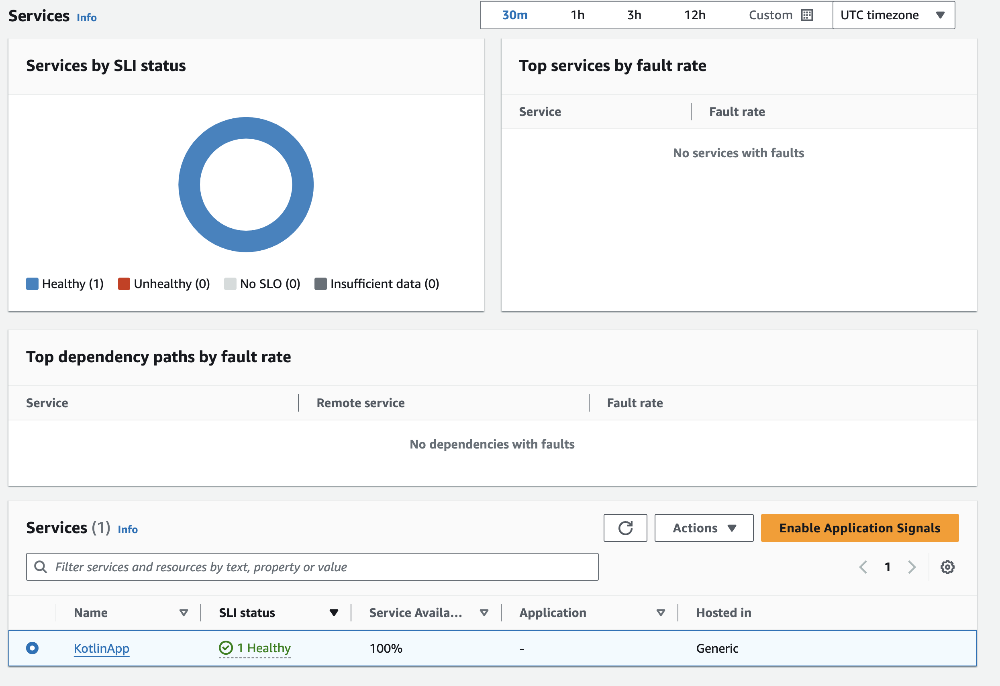
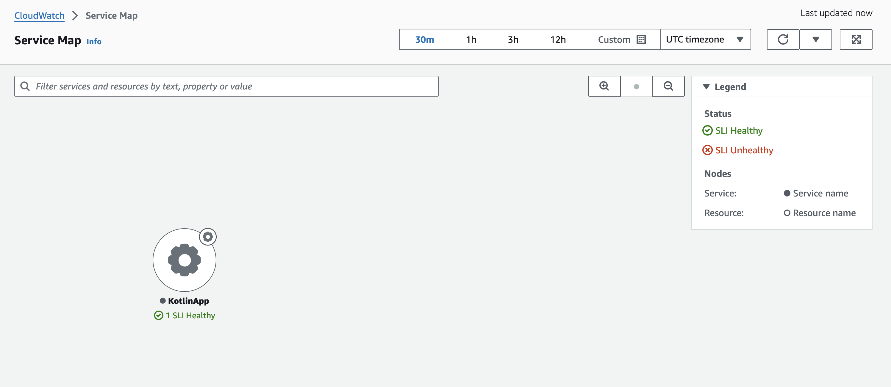

# Kotlin サービスのアプリケーションシグナル


## はじめに

Kotlin Web アプリケーションのパフォーマンスと健全性の監視は、コンポーネント間の複雑な相互作用のため、課題となることがあります。
[Kotlin](https://kotlinlang.org/) Web サービスは通常、Java アーカイブ (jar) ファイルにビルドされ、Java が動作する任意のプラットフォームにデプロイできます。
これらのアプリケーションは、データベース、外部 API、キャッシュレイヤーなど、複数の相互接続されたコンポーネントを含む分散環境で動作することが多く、この複雑さにより平均解決時間 (MTTR) が大幅に増加する可能性があります。

このガイドでは、Linux EC2 サーバー上で実行されている Kotlin Web サービスを自動計測する方法を説明します。
[CloudWatch Application Signals](https://docs.aws.amazon.com/ja_jp/AmazonCloudWatch/latest/monitoring/CloudWatch-Application-Monitoring-Sections.html) を有効にすることで、[AWS Distro for OpenTelemetry](https://aws-otel.github.io/docs/introduction) (ADOT) Java 自動計測エージェントを使用して、コードを変更することなくアプリケーションからテレメトリを収集できます。
呼び出し量、可用性、レイテンシー、障害、エラーなどの主要なメトリクスを活用することで、アプリケーションサービスの現在の運用状態を迅速に確認してトリアージを行い、長期的なパフォーマンスとビジネス目標を達成しているかどうかを検証できます。


## 前提条件

- CloudWatch Application Signals と連携するための適切な [IAM アクセス許可](https://docs.aws.amazon.com/ja_jp/AmazonCloudWatch/latest/monitoring/Application_Signals_Permissions.html) を持つ Linux EC2 インスタンス。このガイドでは [Amazon Linux](https://aws.amazon.com/jp/linux/amazon-linux-2023/) インスタンスを使用しているため、他のものを使用している場合はコマンドが若干異なる可能性があります。
- インスタンスに [SSH](https://docs.aws.amazon.com/ja_jp/AWSEC2/latest/UserGuide/connect-linux-inst-ssh.html) で接続できること。


## ソリューションの概要

大まかな手順は以下の通りです。

- CloudWatch Application Signals を有効化します。
- [ktor web service](https://ktor.io/) を fat jar としてデプロイします。
- Web サービスから Application Signals を受信するように設定された CloudWatch エージェントをインストールします。
- [ADOT](https://aws-otel.github.io/docs/getting-started/java-sdk/auto-instr#introduction) 自動計装エージェントをダウンロードします。
- サービスを自動計装するために、kotlin サービス jar を java エージェントと一緒に実行します。
- テレメトリを生成するためにテストを実行します。


### アーキテクチャ図


### CloudWatch Application Signals の有効化

アカウントで手順 1: [Application Signals の有効化](https://docs.aws.amazon.com/ja_jp/AmazonCloudWatch/latest/monitoring/CloudWatch-Application-Signals-Enable-EC2.html) に従ってください。


### Ktor Web サービスのデプロイ
[Ktor](https://ktor.io/) は、Web サービスを作成するための人気のある Kotlin フレームワークです。
非同期サーバーサイドアプリケーションを素早く開始することができます。

作業ディレクトリを作成します
```
mkdir kotlin-signals && cd kotlin-signals
```

Ktor のサンプルリポジトリをクローンします
```
git clone https://github.com/ktorio/ktor-samples.git && cd ktor-samples/structured-logging
```

アプリケーションをビルドします
```
./gradlew build && cd build/libs
```

アプリケーションが実行できることをテストします
```
java -jar structured-logging-all.jar
```

サービスが正しくビルドされ実行された場合、`ctrl + c` で停止できます


### CloudWatch エージェントの設定
Amazon Linux インスタンスには、デフォルトで CloudWatch エージェントがインストールされています。インスタンスにインストールされていない場合は、[インストール](https://docs.aws.amazon.com/ja_jp/AmazonCloudWatch/latest/monitoring/install-CloudWatch-Agent-on-EC2-Instance.html)する必要があります。

インストールが完了したら、設定ファイルを作成します。
```
sudo nano /opt/aws/amazon-cloudwatch-agent/bin/app-signals-config.json
```

以下の設定をファイルにコピー＆ペーストします。
```
{
    "traces": {
        "traces_collected": {
            "app_signals": {}
        }
    },
    "logs": {
        "metrics_collected": {
            "app_signals": {}
        }
    }
}
```

ファイルを保存し、作成した設定で CloudWatch エージェントを起動します。
```
sudo /opt/aws/amazon-cloudwatch-agent/bin/amazon-cloudwatch-agent-ctl -a fetch-config -m ec2 -s -c file:/opt/aws/amazon-cloudwatch-agent/bin/app-signals-config.json
```


### ADOT 自動計装エージェントのダウンロード

jar ファイルが格納されているディレクトリに移動します。このデモでは作業を簡単にするために、エージェントをここに配置します。実際のシナリオでは、おそらく独自のフォルダに配置することになります。

```
cd kotlin-signals/ktor-samples/structured-logging/build/libs
```

自動計装エージェントをダウンロードします。
```
wget https://github.com/aws-observability/aws-otel-java-instrumentation/releases/latest/download/aws-opentelemetry-agent.jar
```


### ADOT エージェントを使用して Ktor サービスを実行する
```
OTEL_RESOURCE_ATTRIBUTES=service.name=KotlinApp,service.namespace=MyKotlinService,aws.hostedin.environment=EC2 \
OTEL_AWS_APPLICATION_SIGNALS_ENABLED=true \
OTEL_AWS_APPLICATION_SIGNALS_EXPORTER_ENDPOINT=http://localhost:4316/v1/metrics \
OTEL_EXPORTER_OTLP_PROTOCOL=http/protobuf \
OTEL_EXPORTER_OTLP_TRACES_ENDPOINT=http://localhost:4316/v1/traces \
OTEL_METRICS_EXPORTER=none \
OTEL_LOGS_EXPORT=none \
java -javaagent:aws-opentelemetry-agent.jar -jar structured-logging-all.jar
```


### サービスにトラフィックを生成してテレメトリを作成する
```
for i in {1..1800}; do curl http://localhost:8080 && sleep 2; done
```


## テレメトリーの確認

CloudWatch の「Services」セクションに Kotlin サービスが表示されているはずです。



また、「Service Map」でもサービスを確認できます。



この計装により、レイテンシーなどの重要なメトリクスが提供されます：


### 次のステップ

ここからの次のステップは、サービスの [SLO](https://docs.aws.amazon.com/ja_jp/AmazonCloudWatch/latest/monitoring/CloudWatch-ServiceLevelObjectives.html) の作成を含む [Application Signals Experience](https://docs.aws.amazon.com/ja_jp/AmazonCloudWatch/latest/monitoring/CloudWatch-Application-Monitoring-Sections.html) をさらに探索することです。
もう 1 つの良い次のステップは、Ktor でより多くの Kotlin マイクロサービスを作成し、より複雑なバックエンドを構築することです。
分散された複雑な環境こそ、Application Signals のようなツールの恩恵を最も受けることができます。


### クリーンアップ

EC2 インスタンスを終了し、`/aws/appsignals/generic` ロググループを削除します。
