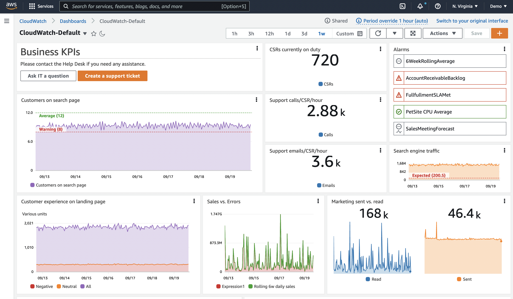

# ダッシュボード

ダッシュボードは、オブザーバビリティソリューションの重要な部分です。データの整理された可視化を実現します。
データの履歴を確認し、関連する他のデータと並べて表示することができます。
また、コンテキストを提供することもできます。
全体像を理解するのに役立ちます。

多くの場合、データを収集してアラームを作成した後、そこで終わってしまいます。
しかし、アラームは特定の時点のデータ、通常は単一のメトリクスまたは少量のデータセットしか表示しません。
ダッシュボードは、時間の経過に伴う動作を確認するのに役立ちます。




## 実践的な例：高 CPU に対するアラームを考える
マシンが望ましい値よりも高い CPU で動作していることがわかりました。対応が必要でしょうか？また、どのくらい早く対応する必要があるでしょうか？判断の助けとなる要素を見てみましょう。

* このインスタンス/アプリケーションの通常の CPU 使用率はどのくらいですか？
* これは一時的なスパイクですか？それとも CPU が増加傾向にありますか？
* パフォーマンスに影響が出ていますか？影響が出ていない場合、影響が出るまでどのくらいの時間がありますか？
* これは定期的に発生する事象ですか？また、通常は自然に回復しますか？


### データの履歴を確認する

CPU の履歴を示す時系列グラフがあるダッシュボードを考えてみましょう。
このメトリクスだけでも、一時的なスパイクなのか、上昇傾向なのかを確認できます。
また、上昇傾向の速さも確認でき、対応の優先順位を判断することができます。


### ワークフローへの影響を確認する

しかし、このマシンは何をしているのでしょうか？全体的な文脈の中でどの程度重要なのでしょうか？ここで、レスポンスタイム、スループット、エラー、その他の指標など、ワークフローのパフォーマンスの可視化を追加することを考えてみましょう。
これにより、高い CPU 使用率がこのインスタンスがサポートしているワークフローやユーザーにどのような影響を与えているかを確認できます。


### アラームの履歴を確認する

アラームが過去 1 ヶ月間にどのくらいの頻度で発生したかを示す可視化を追加し、さらに過去に遡って定期的に発生しているかどうかを確認することを検討してください。
たとえば、バックアップジョブがスパイクを引き起こしているのでしょうか？
再発のパターンを知ることで、根本的な問題を理解し、アラームの再発を完全に防ぐための長期的な判断を行うことができます。


### コンテキストを追加する

最後に、ダッシュボードにコンテキストを追加します。このダッシュボードが存在する理由、関連するワークフロー、問題が発生した場合の対処方法、ドキュメントへのリンク、連絡先などの簡単な説明を含めます。

:::info
    これで、ダッシュボードのユーザーが何が起きているのかを把握し、影響を理解し、適切なアクションとその緊急性についてデータに基づいた判断を下すのに役立つ *ストーリー* が完成しました。
:::


### すべてを一度に可視化しようとしない

アラーム疲れについてよく話題に上がります。
優先順位や対応方法が不明確な多数のアラームは、チームに過負荷をかけ、非効率を招く可能性があります。
アラームは、重要で対応可能な事項に対してのみ設定すべきです。

ダッシュボードはこの点でより柔軟です。
アラームのように即座の注意を要求しないため、まだ重要性が確実でない事項や、探索をサポートする情報を可視化する自由度が高くなります。
ただし、やりすぎは禁物です！良いものでも、やりすぎは逆効果になります。

ダッシュボードは、あなたにとって重要な事項の全体像を提供すべきです。
データの取り込みを決定する場合と同様に、ダッシュボードで何が重要かを考える必要があります。
ダッシュボードについて、以下の点を考慮してください：

* 誰が閲覧するのか？
    * 閲覧者のバックグラウンドと知識は？
    * どの程度のコンテキストが必要か？
* どのような質問に答えようとしているのか？
* このデータを見て、どのようなアクションを取ることになるのか？

:::tip
    ダッシュボードのストーリーや含めるべき内容を決めるのが難しい場合があります。
    ダッシュボードの設計をどこから始めればよいでしょうか？
    *KPI 駆動型* または *インシデント駆動型* の 2 つのアプローチを見てみましょう。
:::


#### ダッシュボードの設計：KPI 主導型

これを理解する 1 つの方法は、KPI から逆算することです。これは通常、非常にユーザー主導型のアプローチです。
[レイアウト](#layout) については、通常、上から下へと作業を進め、ダッシュボードを下に移動するか、より下位レベルのダッシュボードに移動するにつれて、より詳細な情報を得ることができます。

まず、**KPI を理解する** 必要があります。その意味を理解することで、どのように可視化したいかを決定するのに役立ちます。
多くの KPI は単一の数値として表示されます。例えば、特定のワークフローを正常に完了する顧客の割合は何パーセントで、どのくらいの時間がかかっているでしょうか？しかし、どの期間で測定するのでしょうか？1 週間の平均では KPI を満たしていても、その中の短い期間で基準を超えてしまうことがあるかもしれません。これらの違反は重要ですか？顧客体験に影響を与えますか？もしそうなら、異なる期間と時系列グラフで KPI を確認することを検討するかもしれません。また、すべての人が詳細を見る必要はないかもしれないので、KPI の内訳を別のダッシュボードに移動して、別のオーディエンス向けにすることも考えられます。

次に、**それらの KPI に何が寄与しているか** を考えます。それらのアクションを実行するために、どのようなワークフローが実行される必要がありますか？これらを測定できますか？

主要なコンポーネントを特定し、それらのパフォーマンスの可視化を追加します。KPI が違反した場合、ワークフロー内のどこに主な影響があるのかを素早く確認できるようにする必要があります。

さらに掘り下げることもできます - それらのワークフローのパフォーマンスに何が影響を与えているのでしょうか？深さのレベルを決定する際は、オーディエンスを意識してください。

注文数を KPI とする e コマースシステムの例を考えてみましょう。
注文を行うためには、ユーザーは以下のアクションを実行できる必要があります：商品の検索、カートへの追加、配送先の詳細の追加、注文の支払いです。
これらの各ワークフローについて、主要なコンポーネントが機能しているかどうかを確認することを検討するかもしれません。例えば、RUM や Synthetics を使用してアクションの成功に関するデータを取得し、ユーザーが問題の影響を受けているかどうかを確認します。スループット、レイテンシー、アクション失敗率の測定を検討して、各アクションのパフォーマンスが期待通りかどうかを確認するかもしれません。基盤となるインフラストラクチャの測定を検討して、パフォーマンスに何が影響を与えているかを確認するかもしれません。

ただし、すべての情報を同じダッシュボードに配置しないでください。ここでも、ユーザーのオーディエンスを考慮してください。

:::info
    ドリルダウンを可能にし、適切なユーザーに適切なコンテキストを提供するダッシュボードの層を作成します。
:::


#### ダッシュボードの設計：インシデント駆動型

多くの人にとって、インシデント解決はオブザーバビリティの重要な目的です。
ユーザーやオブザーバビリティのアラームによってインシデントが通知された場合、迅速に修正を見つけ、問題の根本原因を特定する必要があります。

:::info
    最近のインシデントを振り返ってみましょう。共通のパターンはありますか？会社にとってどのインシデントが最も影響が大きかったですか？どのインシデントが繰り返し発生していますか？
:::
ここでは、インシデントの深刻度を理解し、根本原因を特定して修正しようとする人のためのダッシュボードを設計します。

具体的なインシデントを振り返ってみましょう。

* 報告されたインシデントをどのように確認しましたか？
    * 何を確認しましたか？エンドポイント？エラー？
* インシデントの影響とそれに基づく優先度をどのように理解しましたか？
* 問題の原因を調査する際に何を確認しましたか？

Application Performance Monitoring (APM) は、エンドポイントとワークフローの定期的なベースラインとテストのための [Synthetics](../tools/synthetics/) と、実際の顧客体験のための [RUM](../tools/rum/) で役立ちます。
このデータを使用して、影響を受けているワークフローとその程度を素早く可視化できます。

時系列でのエラー数や上位のエラーを表示する可視化は、適切な領域に焦点を当て、エラーの具体的な詳細を示すのに役立ちます。
ここでは、ログデータとエラーコードや理由の動的な可視化を使用することが多いです。

できるだけ早く詳細にアクセスできるように、フィルタリングやドリルダウンの機能を持たせることが非常に有用です。
オーバーヘッドを抑えながらこれを実装する方法を考えてください。
例えば、フィルタリングで詳細にアクセスできる単一のダッシュボードを用意する方法があります。


### レイアウト

ダッシュボードのレイアウトも重要です。

:::info
    通常、ユーザーにとって最も重要な可視化は、左上または自然なページナビゲーションの _開始点_ に合わせて配置します。
:::

レイアウトを使用してストーリーを伝えることができます。たとえば、上から下へのレイアウトを使用して、下にスクロールするほど詳細な情報が表示されるようにすることができます。または、左側に上位レベルのサービスを配置し、右に移動するにつれてその依存関係を表示する左右のレイアウトも有用かもしれません。


### 動的なコンテンツの作成

多くのワークロードは、需要に応じて拡大または縮小するように設計されており、ダッシュボードはこれを考慮する必要があります。
たとえば、インスタンスを Auto Scaling グループに配置し、特定の負荷に達すると追加のインスタンスが追加される場合があります。

:::info
特定の ID で指定されたインスタンスからのデータを表示するダッシュボードでは、新しいインスタンスからのデータを表示することができません。
リソースとデータにメタデータを追加することで、特定のメタデータ値を持つすべてのインスタンスを取得する可視化を作成できます。
これにより、実際の状態を反映することができます。
:::

動的な可視化の別の例として、現在発生している上位 10 個のエラーと、それらが最近どのように推移しているかを確認できることが挙げられます。
どのようなエラーが発生するかを事前に知ることなく、テーブルやチャートを表示できるようにする必要があります。


### 原因よりも症状を最初に考える

症状を観察するということは、ユーザーやシステムへの影響を考慮することです。
同じ症状でも、その根本的な原因は複数存在する可能性があります。
これにより、未知の問題を含む、より多くの問題を捉えることができます。
原因を理解するにつれて、下位レベルのダッシュボードはより具体的になり、問題の診断と修正を迅速に行うのに役立ちます。

:::tip 
    先週ユーザーに影響を与えた特定の JavaScript エラーを捉えるのではなく、中断されたワークフローへの _影響_ を捉え、最近の履歴における JavaScript エラーの発生数の上位、または最近急激に増加したエラーを表示します。
:::


### 上位/下位 N を使用する

通常、運用メトリクスを *すべて* 同時に可視化する必要はありません。
EC2 インスタンスの大規模なフリートはその良い例です。数百台のサーバーすべてのディスク IOPS や CPU 使用率を同時に表示する必要性や価値はありません。
これは、最も良い（または悪い）パフォーマンスのリソースを確認するよりも、メトリクスを掘り下げることに多くの時間を費やすというアンチパターンを生み出します。

:::info
    ダッシュボードでは、各メトリクスの上位 10 個または 20 個を表示し、それが明らかにする[症状](#think-about-symptoms-first-over-causes)に焦点を当ててください。
:::

[CloudWatch metrics](../tools/metrics/) では、任意の時系列データの上位 N を検索できます。
例えば、以下のクエリは CPU 使用率が最も高い上位 20 個の EC2 インスタンスを返します：

```
SORT(SEARCH('{AWS/EC2,InstanceId} MetricName="CPUUtilization"', 'Average', 300), SUM, DESC, 10)
```

このアプローチ、または [CloudWatch Metric Insights](https://docs.aws.amazon.com/ja_jp/AmazonCloudWatch/latest/monitoring/query_with_cloudwatch-metrics-insights.html) を使用して、ダッシュボードで最高または最低のパフォーマンスを示すメトリクスを特定してください。


### しきい値を使用して KPI を視覚的に表示する

KPI には警告またはエラーのしきい値を設定する必要があり、ダッシュボードでは水平アノテーションを使用してこれを表示できます。
これはウィジェット上に高水位線として表示されます。
これを視覚的に表示することで、ビジネスの成果やインフラストラクチャが危険な状態にある場合に、オペレーターに事前に警告を与えることができます。


:::info
    水平アノテーションは、十分に開発されたダッシュボードの重要な要素です。
:::


### コンテキストの重要性

人はデータを誤って解釈しやすいものです。
個人の背景や現在のコンテキストによって、データの見方が変わってきます。

そのため、ダッシュボードには必ず *テキスト* を含めるようにしてください。
このデータは何のためのものか、誰のためのものか、何を意味しているのか、アプリケーションのドキュメント、サポート担当者、トラブルシューティングドキュメントへのリンクを含めてください。
テキスト表示を使用してダッシュボードの表示を分割することもできます。
左側に配置して左右のコンテキストを設定したり、水平方向に全幅で配置してダッシュボードを垂直に分割したりすることができます。

:::info
    IT サポート、オンコール運用担当者、ビジネスオーナーへのリンクを用意することで、問題が発生した際に支援を受けられる担当者に素早く連絡することができます。
:::
:::tip
    チケットシステムへのハイパーリンクもダッシュボードに追加すると非常に便利です。
:::
