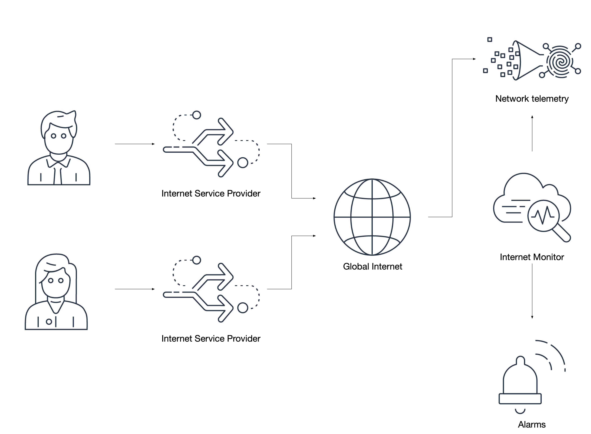

# Internet Monitor

:::warning
	この記事の執筆時点では、[Internet Monitor](https://aws.amazon.com/jp/blogs/news/cloudwatch-internet-monitor-end-to-end-visibility-into-internet-performance-for-your-applications/) は CloudWatch コンソールで **プレビュー** 版として利用可能です。一般提供時の機能の範囲は、現在体験できるものから変更される可能性があります。
:::

[ワークロードのすべての層からテレメトリを収集する](../guides/#collect-telemetry-from-all-tiers-of-your-workload) ことはベストプラクティスですが、これは課題となる場合があります。しかし、ワークロードの層とは何でしょうか？ある人にとっては、Web サーバー、アプリケーションサーバー、データベースサーバーかもしれません。他の人は、フロントエンドとバックエンドとしてワークロードを捉えるかもしれません。また、Web アプリケーションを運用している人は、[Real User Monitoring](../tools/rum)（RUM）を使用して、エンドユーザーが体験するアプリケーションの健全性を観察できます。

しかし、クライアントとデータセンターやクラウドサービスプロバイダー間のトラフィックについてはどうでしょうか？また、Web ページとして提供されず、したがって RUM を使用できないアプリケーションについてはどうでしょうか？



Internet Monitor はネットワークレベルで動作し、観測されたトラフィックの健全性を評価し、[AWS の既存の知識](https://docs.aws.amazon.com/ja_jp/AmazonCloudWatch/latest/monitoring/CloudWatch-IM-inside-internet-monitor.html) と既知のインターネットの問題を相関させます。簡単に言えば、インターネットサービスプロバイダー（ISP）にパフォーマンスや可用性の問題があり、**かつ** あなたのアプリケーションがクライアント/サーバー通信にこの ISP を使用するトラフィックがある場合、Internet Monitor はこのワークロードへの影響について事前に通知することができます。さらに、選択したホスティングリージョンと [CloudFront](https://aws.amazon.com/jp/cloudfront/) をコンテンツデリバリーネットワークとして使用することに基づいて、推奨事項を提供することができます[^1]。

:::tip
	Internet Monitor は、ワークロードが通過するネットワークからのトラフィックのみを評価します。例えば、他の国の ISP が影響を受けていても、ユーザーがそのキャリアを使用していない場合、その問題の可視性は得られません。
:::


## インターネットを経由するアプリケーションのモニターを作成する

Internet Monitor の動作原理は、影響を受けている ISP から CloudFront ディストリビューションまたは VPC に到達するトラフィックを監視することです。これにより、アプリケーションの動作、ルーティング、またはユーザー通知に関する決定を行うことができ、制御外のネットワーク問題によって生じるビジネス上の問題を軽減するのに役立ちます。


:::info
	インターネットを経由するトラフィックを監視するモニターのみを作成してください。プライベートネットワーク内の 2 つのホスト間のプライベートトラフィック（[RFC1918](https://www.arin.net/reference/research/statistics/address_filters/)）は、Internet Monitor を使用して監視することはできません。
:::
:::info
	該当する場合は、モバイルアプリケーションからのトラフィックを優先してください。プロバイダー間をローミングしている顧客や、遠隔地にいる顧客は、異なる予期せぬ体験をする可能性があり、それを把握しておく必要があります。
:::


## EventBridge と CloudWatch を通じてアクションを有効化する

観測された問題は、[EventBridge](https://aws.amazon.com/jp/eventbridge/) を通じて、ソースが `aws.internetmonitor` として識別される [スキーマ](https://docs.aws.amazon.com/ja_jp/AmazonCloudWatch/latest/monitoring/CloudWatch-IM-EventBridge-integration.html) を使用して公開されます。EventBridge を使用して、チケット管理システムに自動的に問題を作成したり、サポートチームに連絡したり、さらには一部のシナリオを緩和するためにワークロードを変更する自動化をトリガーしたりすることができます。

```json
{
  "source": ["aws.internetmonitor"]
}
```

同様に、観測された都市、国、メトロ、および地域の詳細なトラフィック情報が [CloudWatch Logs](../tools/logs) で利用可能です。これにより、影響を受けるお客様に対して、ローカルな問題について事前に通知する、非常にターゲットを絞ったアクションを作成することができます。以下は、単一のプロバイダーに関する国レベルの観測の例です：

```json
{
    "version": 1,
    "timestamp": 1669659900,
    "clientLocation": {
        "latitude": 0,
        "longitude": 0,
        "country": "United States",
        "subdivision": "",
        "metro": "",
        "city": "",
        "countryCode": "US",
        "subdivisionCode": "",
        "asn": 00000,
        "networkName": "MY-AWESOME-ASN"
    },
    "serviceLocation": "us-east-1",
    "percentageOfTotalTraffic": 0.36,
    "bytesIn": 23,
    "bytesOut": 0,
    "clientConnectionCount": 0,
    "internetHealth": {
        "availability": {
            "experienceScore": 100,
            "percentageOfTotalTrafficImpacted": 0,
            "percentageOfClientLocationImpacted": 0
        },
        "performance": {
            "experienceScore": 100,
            "percentageOfTotalTrafficImpacted": 0,
            "percentageOfClientLocationImpacted": 0,
            "roundTripTime": {
                "p50": 71,
                "p90": 72,
                "p95": 73
            }
        }
    },
    "trafficInsights": {
        "timeToFirstByte": {
            "currentExperience": {
                "serviceName": "VPC",
                "serviceLocation": "us-east-1",
                "value": 48
            },
            "ec2": {
                "serviceName": "EC2",
                "serviceLocation": "us-east-1",
                "value": 48
            }
        }
    }
}
```

:::info
	`percentageOfTotalTraffic` のような値は、お客様がどこからワークロードにアクセスしているかについて強力な洞察を明らかにし、高度な分析に使用することができます。
:::

:::warning
	Internet Monitor によって作成されたロググループは、デフォルトの保持期間が *無期限* に設定されることに注意してください。AWS はお客様の同意なしにデータを削除しませんので、必要に応じて適切な保持期間を設定してください。
:::
:::info
	各モニターは少なくとも 10 の個別の CloudWatch メトリクスを作成します。これらは、他の運用メトリクスと同様に、[アラーム](../tools/alarms) を作成するために使用する必要があります。
:::


## トラフィック最適化の提案を活用する

Internet Monitor には、最高の顧客体験を得るためにワークロードを最適に配置する場所をアドバイスするトラフィック最適化の推奨機能があります。グローバルなワークロードや、グローバルな顧客を持つワークロードにとって、この機能は特に価値があります。


:::info
トラフィック最適化の提案ビューにある現在の、予測される、そして最低の初回バイト到達時間（TTFB）の値に注目してください。これらの値は、通常では観察が難しいエンドユーザーの潜在的な不良な体験を示す可能性があります。
:::

[^1]: この新機能についての発表ブログは [https://aws.amazon.com/jp/blogs/news/cloudwatch-internet-monitor-end-to-end-visibility-into-internet-performance-for-your-applications/](https://aws.amazon.com/jp/blogs/news/cloudwatch-internet-monitor-end-to-end-visibility-into-internet-performance-for-your-applications/) をご覧ください。
