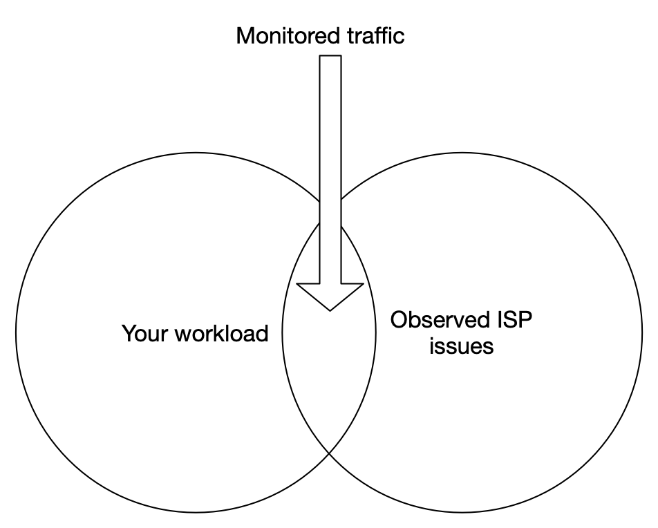
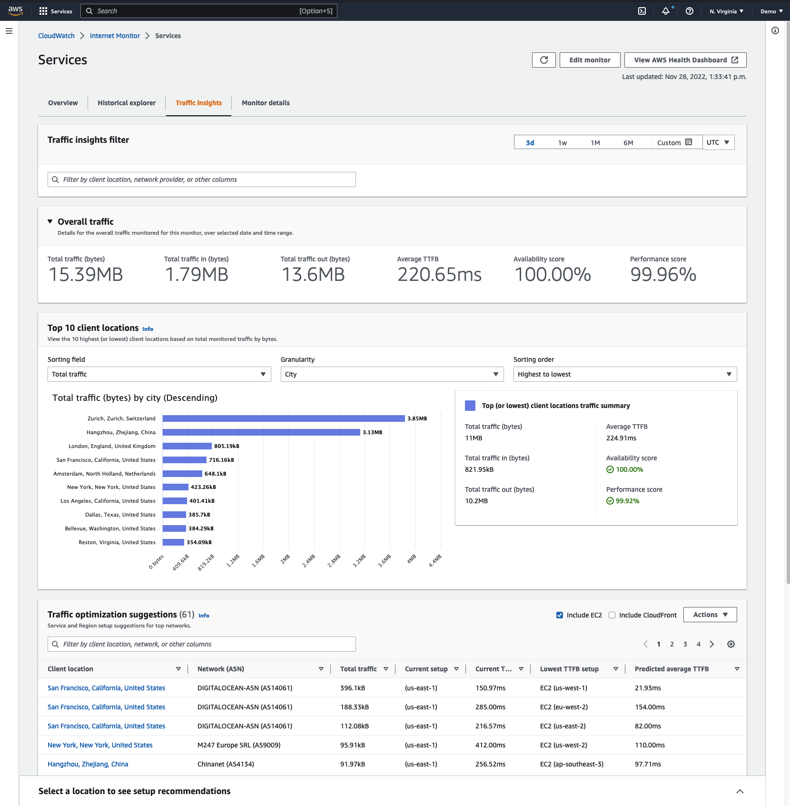

# Internet Monitor

:::warning
	この記事の執筆時点では、[Internet Monitor](https://aws.amazon.com/blogs/aws/cloudwatch-internet-monitor-end-to-end-visibility-into-internet-performance-for-your-applications/) は CloudWatch コンソールで**プレビュー**として利用可能です。一般提供時の機能の範囲は、現在お使いいただいている内容から変更される場合があります。
:::
[ワークロードのすべての層からテレメトリを収集すること](../guides/index.md#collect-telemetry-from-all-tiers-of-your-workload)はベストプラクティスですが、課題となる場合もあります。しかし、ワークロードの「層」とは何でしょうか？ウェブサーバー、アプリケーションサーバー、データベースサーバーと捉える人もいれば、フロントエンドとバックエンドとして見る人もいます。また、ウェブアプリケーションを運用している場合は、[リアルユーザーモニタリング](./rum.md)（RUM）を使用して、エンドユーザーが体験するアプリの健全性を観察できます。

クライアントとデータセンターまたはクラウドサービスプロバイダー間のトラフィックについてはどうでしょうか？また、Web ページとして提供されないため RUM を使用できないアプリケーションについてはどうでしょうか？


Internet Monitor はネットワークレベルで動作し、既知のインターネット問題に関する [AWS の既存の知識](https://docs.aws.amazon.com/AmazonCloudWatch/latest/monitoring/CloudWatch-IM-inside-internet-monitor.html)と照合しながら、観測されたトラフィックの健全性を評価します。簡単に言うと、パフォーマンスや可用性の問題を抱えたインターネットサービスプロバイダー (ISP) が存在し、**かつ**アプリケーションのトラフィックがクライアント/サーバー通信にその ISP を使用している場合、Internet Monitor はワークロードへの影響をプロアクティブに通知することができます。さらに、選択したホスティングリージョンおよびコンテンツデリバリーネットワークとしての [CloudFront](https://aws.amazon.com/cloudfront/) の使用状況に基づいて、推奨事項を提示することもできます[^1]。

:::tip
	Internet Monitor は、ワークロードが通過するネットワークからのトラフィックのみを評価します。たとえば、別の国の ISP が影響を受けていても、ユーザーがそのキャリアを使用していない場合は、その問題を把握することはできません。
:::

## インターネットを経由するアプリケーションのモニターを作成する

Internet Monitor の動作方法は、CloudFront ディストリビューションへの受信トラフィック、または影響を受けた ISP から VPC へのトラフィックを監視することです。これにより、アプリケーションの動作、ルーティング、またはユーザー通知に関する意思決定を行うことができ、制御の及ばないネットワーク問題によって生じるビジネス上の問題を軽減するのに役立ちます。



:::info
	インターネットを経由するトラフィックを監視するモニターのみを作成してください。プライベートネットワーク内の 2 つのホスト間のトラフィックなど ([RFC1918](https://www.arin.net/reference/research/statistics/address_filters/))、プライベートトラフィックは Internet Monitor を使用して監視することができません。
:::
:::info
	該当する場合は、モバイルアプリケーションからのトラフィックを優先してください。プロバイダー間をローミングしているお客様や、遠隔地にいるお客様は、異なるまたは予期しないエクスペリエンスを持つ可能性があることを認識しておく必要があります。
:::
## EventBridge と CloudWatch を通じてアクションを有効にする

観測された問題は、ソースが次のように識別されるスキーマを含む[スキーマ](https://docs.aws.amazon.com/AmazonCloudWatch/latest/monitoring/CloudWatch-IM-EventBridge-integration.html)を使用して、[EventBridge](https://aws.amazon.com/eventbridge/)を通じて公開されます。 `aws.internetmonitor`EventBridge を使用すると、チケット管理システムへの課題の自動作成、サポートチームへの通知、またはワークロードを変更して一部のシナリオを軽減するオートメーションのトリガーなどを自動的に行うことができます。

```json
{
  "source": ["aws.internetmonitor"]
}
```

同様に、観測された都市、国、メトロ、およびサブディビジョンに関するトラフィックの詳細情報が [CloudWatch Logs](./logs/index.md) で確認できます。これにより、影響を受けた顧客に対して、ローカルな問題について事前に通知するような高度にターゲットを絞ったアクションを作成できます。以下は、単一プロバイダーに関する国レベルの観測例です。

```json
{
    "version": 1,
    "timestamp": 1669659900,
    "clientLocation": {
        "latitude": 0,
        "longitude": 0,
        "country": "United States",
        "subdivision": "",
        "metro": "",
        "city": "",
        "countryCode": "US",
        "subdivisionCode": "",
        "asn": 00000,
        "networkName": "MY-AWESOME-ASN"
    },
    "serviceLocation": "us-east-1",
    "percentageOfTotalTraffic": 0.36,
    "bytesIn": 23,
    "bytesOut": 0,
    "clientConnectionCount": 0,
    "internetHealth": {
        "availability": {
            "experienceScore": 100,
            "percentageOfTotalTrafficImpacted": 0,
            "percentageOfClientLocationImpacted": 0
        },
        "performance": {
            "experienceScore": 100,
            "percentageOfTotalTrafficImpacted": 0,
            "percentageOfClientLocationImpacted": 0,
            "roundTripTime": {
                "p50": 71,
                "p90": 72,
                "p95": 73
            }
        }
    },
    "trafficInsights": {
        "timeToFirstByte": {
            "currentExperience": {
                "serviceName": "VPC",
                "serviceLocation": "us-east-1",
                "value": 48
            },
            "ec2": {
                "serviceName": "EC2",
                "serviceLocation": "us-east-1",
                "value": 48
            }
        }
    }
}
```

:::info
	次のような値 `percentageOfTotalTraffic` お客様がワークロードにアクセスする場所に関する強力なインサイトを明らかにし、高度な分析に活用できます。
:::

:::warning
	Internet Monitor によって作成されたロググループには、デフォルトの保持期間として*無期限*が設定されることに注意してください。AWS はお客様の同意なしにデータを削除しませんので、ニーズに合った保持期間を必ず設定してください。
:::
:::info
	各モニターは少なくとも 10 個の個別の CloudWatch メトリクスを作成します。これらは、他の運用メトリクスと同様に[アラーム](./alarms.md)を作成するために使用してください。
:::
## トラフィック最適化の提案を活用する

Internet Monitor には、最適なカスタマーエクスペリエンスを実現するためにワークロードを最適な場所に配置する方法をアドバイスするトラフィック最適化の推奨機能があります。グローバルなワークロード、またはグローバルな顧客を持つワークロードにとって、この機能は特に価値があります。 



:::info
	トラフィック最適化の提案ビューに表示される現在の TTFB (time-to-first-byte)、予測 TTFB、および最小 TTFB の値に細心の注意を払ってください。これらの値は、他の方法では観察が困難な、エンドユーザーエクスペリエンスの潜在的な低下を示している可能性があります。
:::
[^1]: See [https://aws.amazon.com/blogs/aws/cloudwatch-internet-monitor-end-to-end-visibility-into-internet-performance-for-your-applications/](https://aws.amazon.com/blogs/aws/cloudwatch-internet-monitor-end-to-end-visibility-into-internet-performance-for-your-applications/) for our launch blog about this new feature.
