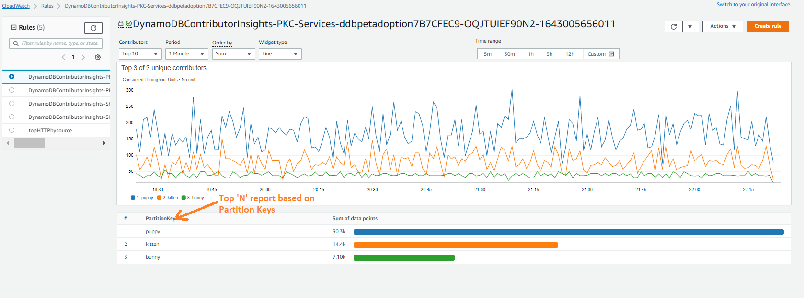

# CloudWatch Contributor Insights


## 概要
Amazon CloudWatch Contributor Insights は、メトリクスに影響を与えている主要な要因を特定するためにログデータを分析するのに役立ちます。
リアルタイムのランキングと統計を作成することで、システムの動作とパフォーマンスにどのエンティティが影響を与えているかを理解できます。


## 機能
- ログデータのリアルタイム分析
- AWS の一般的なサービス向けの組み込みルール
- カスタムルールの作成機能
- 自動データ処理とランキング
- CloudWatch ダッシュボードとアラームとの統合


## 実装


### 組み込みルール
CloudWatch Contributor Insights には、一般的な AWS サービス向けの事前構築されたルールが用意されています：
- VPC Flow Logs の分析
- Application Load Balancer のログ
- Amazon API Gateway のログ
- AWS Lambda のログ


### カスタムルール
以下を定義してカスタムルールを作成します:
1. ソースドキュメントのロググループ。分析する Contributor フィールド
3. メトリクスと集計
4. 時間枠とサンプリングレート

カスタムルールの例:
```yaml
{
	"AggregateOn": "Count",
	"Contribution": {
		"Filters": [],
		"Keys": [
			"$.pettype"
		]
	},c
	"LogFormat": "JSON",
	"Schema": {
		"Name": "CloudWatchLogRule",
		"Version": 1
	},
	"LogGroupARNs": [
		"arn:aws:logs:[region]:[account]:log-group:[API Gateway Log Group Name]"
	]
}
```




## ベストプラクティス


### ルールの設定
- わかりやすいルール名を使用する
- 可能な場合は組み込みルールから始める
- 対象を絞ったログフィルタリングを実装する
- 適切な時間枠を設定する


### パフォーマンスの最適化
- アクティブなルール数を制限する
- 最適なサンプリングレートを設定する
- 適切な集計期間を使用する
- 必要なロググループに対してのみルールを有効にする


### コスト管理
- ルールの使用状況を定期的に監視する
- 未使用のルールを削除する
- ログフィルタリングを実装する
- サンプリングレートを定期的に見直す


### セキュリティ
- 最小権限の原則に従う
- 機密データの暗号化
- 定期的なルール監査
- パターン変更の監視


## 一般的な問題と解決策


### ルールがログと一致しない場合
**問題**: ルールが期待されるログを処理していない
**解決策**:
- ログ形式がルール設定と一致することを確認する
- フィールド名が正しいことを確認する
- JSON 構造を検証する


### 欠損データ
**問題**: コントリビューターデータのギャップ
**解決策**:
- サンプリングレートの設定を確認する
- ログの配信を検証する
- 時間枠の設定を確認する


### パフォーマンスの問題
**問題**: ルール処理の遅延
**解決策**:
- アクティブなルールの数を最適化
- サンプリングレートを調整
- 寄与度のしきい値を見直し


## 統合


### CloudWatch Dashboards
トップコントリビューターの可視化を作成します:
```yaml
{
  "widgets": [
    {
      "type": "metric",
      "properties": {
        "view": "bar",
        "region": "us-east-1",
        "title": "Top Contributors",
        "period": 300
      }
    }
  ]
}
```


### CloudWatch Alarms
コントリビューターパターンのアラートを設定します:
```yaml
{
  "AlarmName": "HighContributorCount",
  "MetricName": "UniqueContributors",
  "Threshold": 100,
  "Period": 300,
  "EvaluationPeriods": 2
}
```


## ツールとリソース


### AWS CLI コマンド
```bash


# ルールを作成する
aws cloudwatch put-insight-rule --rule-name MyRule --rule-definition file://rule.json


# ルールの削除
aws cloudwatch delete-insight-rule --rule-name MyRule
```


### 関連サービス
- Amazon CloudWatch
- CloudWatch Logs
- CloudWatch Alarms
- Amazon EventBridge


### 追加リソース
- [公式ドキュメント](https://docs.aws.amazon.com/ja_jp/AmazonCloudWatch/latest/monitoring/ContributorInsights.html)
- [ルール構文リファレンス](https://docs.aws.amazon.com/ja_jp/AmazonCloudWatch/latest/monitoring/ContributorInsights-RuleSyntax.html)
- [AWS CLI リファレンス](https://docs.aws.amazon.com/ja_jp/cli/latest/reference/cloudwatch/put-insight-rule.html)
