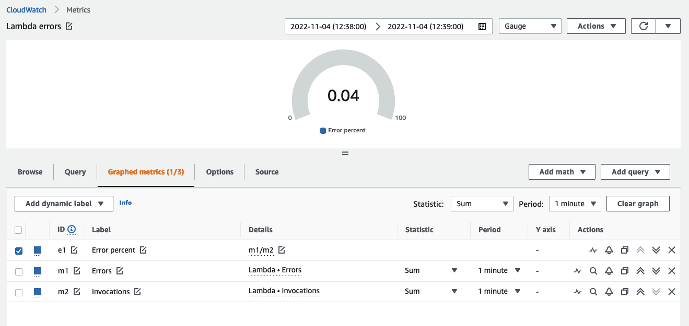

# メトリクス

メトリクスは、システムのパフォーマンスに関するデータです。システムやリソースに関連するすべてのメトリクスを一元化された場所で管理することで、メトリクスの比較、パフォーマンスの分析、リソースのスケールアップやスケールインといった戦略的な意思決定をより適切に行うことができます。また、メトリクスはリソースの健全性を把握し、予防的な対策を講じるうえでも重要です。

メトリクスデータは基盤となるものであり、[アラーム](../signals/alarms.md)、異常検出、[イベント](../signals/events.md)、[ダッシュボード](./dashboards.md)などを駆動するために使用されます。

## ベンダーメトリクス {#vended-metrics}

[CloudWatch メトリクス](https://docs.aws.amazon.com/AmazonCloudWatch/latest/monitoring/working_with_metrics.html)は、システムのパフォーマンスに関するデータを収集します。デフォルトでは、ほとんどの AWS サービスがリソースの無料メトリクスを提供しています。これには、[Amazon EC2](https://aws.amazon.com/ec2/) インスタンス、[Amazon RDS](https://aws.amazon.com/rds/)、[Amazon S3](https://aws.amazon.com/s3/?p=pm&c=s3&z=4) バケットなど、多くのサービスが含まれます。

これらのメトリクスを*ベンダーメトリクス*と呼びます。AWS アカウントでのベンダーメトリクスの収集には料金はかかりません。

:::info
	CloudWatch にメトリクスを送信する AWS サービスの完全なリストについては、[このページ](https://docs.aws.amazon.com/AmazonCloudWatch/latest/monitoring/aws-services-cloudwatch-metrics.html)を参照してください。
:::
## メトリクスのクエリ

CloudWatch の[メトリクス数式](https://docs.aws.amazon.com/AmazonCloudWatch/latest/monitoring/using-metric-math.html)機能を使用して、複数のメトリクスをクエリし、数式を使ってより詳細なメトリクス分析を行うことができます。たとえば、次のようなメトリクス数式を記述して、クエリごとの Lambda エラーレートを求めることができます。

	Errors/Requests

CloudWatch コンソールでの表示例を以下に示します。



:::info
	メトリクス数式を使用して、データから最大限の価値を引き出し、個別のデータソースのパフォーマンスから値を導き出します。
:::
CloudWatch は条件文もサポートしています。たとえば、レイテンシーが特定のしきい値を超える各タイムシリーズに対して値 `1` を返し、その他のすべてのデータポイントに対して `0` を返すには、クエリは次のようになります。

	IF(latency>threshold, 1, 0)

CloudWatch コンソールでは、このロジックを使用してブール値を作成し、それを[CloudWatch アラーム](./alarms.md)やその他のアクションのトリガーにすることができます。これにより、派生データポイントからの自動アクションが可能になります。CloudWatch コンソールの例を以下に示します。


:::info
	派生値のパフォーマンスがしきい値を超えた場合にアラームと通知をトリガーするには、条件文を使用します。 
:::
`SEARCH` 関数を使用して、任意のメトリクスの上位 `n` 件を表示することもできます。多数の時系列（例：数千台のサーバー）にわたって最もパフォーマンスが高い、または低いメトリクスを可視化する場合、このアプローチにより最も重要なデータのみを確認できます。以下は、過去 5 分間の平均で CPU 消費量が上位 2 位の EC2 インスタンスを返す検索の例です。
```
	SLICE(SORT(SEARCH('{AWS/EC2,InstanceId} MetricName="CPUUtilization"', 'Average', 300), MAX, DESC),0, 2)
```
CloudWatch コンソールでの同じ表示：


:::info
	`SEARCH` アプローチを使用して、環境内で価値のある、またはパフォーマンスが最も低いリソースを迅速に表示し、それらを[ダッシュボード](./dashboards.md)に表示します。
:::
## メトリクスの収集

EC2 インスタンスのメモリやディスク使用率などの追加メトリクスが必要な場合は、[CloudWatch エージェント](./cloudwatch_agent.md)を使用して、このデータを代わりに CloudWatch にプッシュできます。または、グラフィカルな方法で可視化する必要があるカスタム処理データがあり、そのデータを CloudWatch メトリクスとして表示したい場合は、[`PutMetricData` API](https://docs.aws.amazon.com/AmazonCloudWatch/latest/APIReference/API_PutMetricData.html) を使用して、カスタムメトリクスを CloudWatch に発行します。

:::info
	ベアな API ではなく、[AWS SDK](https://aws.amazon.com/developer/tools/) のいずれかを使用して、メトリクスデータを CloudWatch にプッシュしてください。
:::
`PutMetricData` API コールはクエリ数に基づいて課金されます。`PutMetricData` API を最適に使用することがベストプラクティスです。この API の Values and Counts メソッドを使用すると、1 回の `PutMetricData` リクエストで 1 つのメトリクスにつき最大 150 個の値を発行でき、このデータのパーセンタイル統計の取得もサポートされます。そのため、各データポイントに対して個別の API 呼び出しを行う代わりに、すべてのデータポイントをまとめてグループ化し、1 回の `PutMetricData` API コールで CloudWatch にプッシュする必要があります。このアプローチはユーザーに 2 つの利点をもたらします。

1. CloudWatch の料金
1. `PutMetricData` API スロットリングを防ぐことができます

:::info
	`PutMetricData` を使用する場合、可能な限りデータをまとめて単一の `PUT` 操作にバッチ処理することがベストプラクティスです。
:::
:::info
	大量のメトリクスが CloudWatch に送信される場合は、代替アプローチとして [Embedded Metric Format](https://docs.aws.amazon.com/AmazonCloudWatch/latest/monitoring/CloudWatch_Embedded_Metric_Format_Manual.html) の使用を検討してください。Embedded Metric Format は `PutMetricData` を使用せず、その使用に対して課金されることもありませんが、[CloudWatch Logs](./logs/index.md) の使用による課金は発生します。
:::
## 異常検出

CloudWatch には、記録されたメトリクスに基づいて*正常*な状態を学習することで、オブザーバビリティ戦略を強化する[異常検出](https://docs.aws.amazon.com/AmazonCloudWatch/latest/monitoring/CloudWatch_Anomaly_Detection.html)機能があります。異常検出の使用は、あらゆるメトリクスシグナル収集システムにおける[ベストプラクティス](../signals/metrics.md#異常検出アルゴリズムを使用する)です。

異常検出は、2 週間の期間にわたってモデルを構築します。 

:::warning
	異常検出は、作成時点以降のデータのみからモデルを構築します。過去に遡って以前の外れ値を検出することはありません。
:::

:::warning
	異常検出は、メトリクスにとって何が*良い*かを知っているわけではなく、標準偏差に基づいて何が*正常*かのみを把握しています。
:::

:::info
	異常検出モデルは、通常の動作が期待される時間帯のみを分析するようにトレーニングするのがベストプラクティスです。トレーニングから除外する時間帯（夜間、週末、祝日など）を定義できます。 
:::
異常検出バンドの例をここで確認できます。バンドはグレーで表示されています。


異常検出の除外ウィンドウの設定は、CloudWatch コンソール、[CloudFormation](https://docs.aws.amazon.com/AWSCloudFormation/latest/UserGuide/aws-properties-cloudwatch-anomalydetector-configuration.html)、またはいずれかの AWS SDK を使用して行うことができます。
