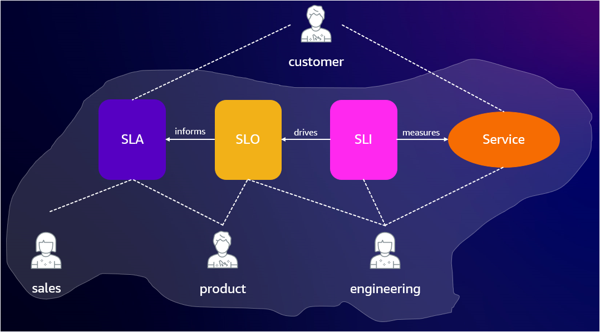

# サービスレベル目標 (SLO)

高可用性と耐障害性のあるアプリケーションは、あなたの会社にとってアクティブなビジネスドライバーですか？
答えが「**はい**」の場合は、読み進めてください。

障害は避けられず、時間が経てばすべてのものは最終的に故障します！これは、スケールする必要のあるアプリケーションを構築する際に、さらに重要な教訓となります。ここで SLO の重要性が出てきます。

SLO は、重要なエンドユーザージャーニーに基づいて、サービスの可用性に関して合意された目標を測定します。その合意された目標は、顧客やエンドユーザーにとって重要なことを中心に設定されるべきです。このような耐障害性のあるエコシステムを構築するには、パフォーマンスを客観的に測定し、意味のある、現実的で、実行可能な SLO を使用して信頼性を正確に報告する必要があります。では、主要なサービスレベルの用語に慣れていきましょう。

## サービスレベルの用語

- SLI は Service Level Indicator（サービスレベル指標）：提供されるサービスレベルの特定の側面を慎重に定義した定量的な測定値です。

- SLO は Service Level Objective（サービスレベル目標）：SLI によって測定される、一定期間にわたるサービスレベルの目標値または値の範囲です。

- SLA は Service Level Agreement（サービスレベル合意）：含まれる SLO を満たせなかった場合の結果を含む、顧客との合意です。

以下の図は、SLA が「約束/合意」、SLO が「目標/目標値」、SLI が「サービスがどのように機能したか」の測定であることを示しています。

### これらすべてを監視する AWS ツールはありますか？

答えは「**はい**」です！

[Amazon CloudWatch Application Signals](https://docs.aws.amazon.com/ja_jp/AmazonCloudWatch/latest/monitoring/CloudWatch-Application-Monitoring-Sections.html) は、AWS 上のアプリケーションを自動的に計測し、運用することを容易にする新しい機能です。Application Signals は AWS 上のアプリケーションを計測し、アプリケーションの健全性を監視し、ビジネス目標に対するパフォーマンスを追跡できるようにします。Application Signals は、アプリケーション、サービス、依存関係の統合されたアプリケーション中心のビューを提供し、アプリケーションの健全性の監視とトリアージを支援します。Application Signals は Amazon EKS、Amazon ECS、Amazon EC2 でサポートされ、テストされています。この記事を書いている時点では、Java アプリケーションのみをサポートしています！

Application Signals は、主要なパフォーマンスメトリクスに対する SLO の設定を支援します。重要なビジネス運用のサービスに対して SLO を作成するために Application Signals を使用できます。これらのサービスに SLO を作成することで、SLO ダッシュボードで追跡でき、最も重要な運用の一目でわかるビューを得ることができます。根本原因の特定を迅速化するために、Application Signals はアプリケーションパフォーマンスの包括的なビューを提供し、重要な API とユーザーインタラクションを監視する CloudWatch Synthetics や、実際のユーザーパフォーマンスを監視する CloudWatch RUM からの追加のパフォーマンスシグナルを統合します。

Application Signals は、発見したすべてのサービスと操作のレイテンシーと可用性メトリクスを自動的に収集し、これらのメトリクスは SLI として使用するのに理想的です。同時に、Application Signals は任意の CloudWatch メトリクスまたはメトリクス式を SLI として使用する柔軟性を提供します！

Application Signals は、アプリケーションパフォーマンスのベストプラクティスに基づいてアプリケーションを自動的に計測し、Amazon EKS 上で実行されるアプリケーションのメトリクス、トレース、ログ、リアルユーザーモニタリング、合成モニタリングにわたってテレメトリを相関付けます。詳細については、この[ブログ](https://aws.amazon.com/jp/blogs/news/amazon-cloudwatch-application-signals-for-automatic-instrumentation-of-your-applications-preview/)をお読みください。

CloudWatch Application Signals で SLO を設定してサービスの信頼性を監視する方法については、この[ブログ](https://aws.amazon.com/blogs/mt/how-to-monitor-application-health-using-slos-with-amazon-cloudwatch-application-signals/)をご覧ください。

オブザーバビリティは、信頼性の高いサービスを確立するための基本要素であり、組織が効果的に規模を拡大して運用するための道を開きます。[Amazon CloudWatch Application Signals](https://docs.aws.amazon.com/ja_jp/AmazonCloudWatch/latest/monitoring/CloudWatch-Application-Monitoring-Sections.html) は、その目標を達成するための素晴らしいツールになると私たちは信じています。
