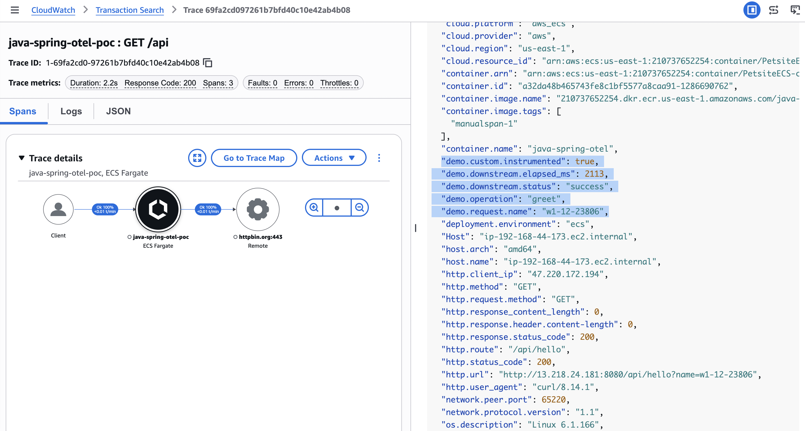

# Java Spring + OTLP + CloudWatch (실습 가이드)

이 가이드는 Java Spring Boot 서비스에 OpenTelemetry를 적용하고, 텔레메트리를 AWS로 내보내며, ECS/Fargate에 배포한 후 트레이스/로그/Application Signals 동작을 확인하는 전체 실습을 문서화한 것입니다.

구현 예제 형식으로 작성되었으며, 런북 또는 워크숍 핸드아웃으로 사용할 수 있습니다.

## 1) 이 실습에서 다루는 내용

- Java 앱에서의 엔드투엔드 텔레메트리:
  - **Traces** (X-Ray / Transaction Search)
  - **Logs** (CloudWatch Logs OTLP 엔드포인트 또는 ECS의 `awslogs`)
  - **Metrics/Application Signals** (CloudWatch Agent sidecar 경로)
- 다음의 차이점:
  - **Micrometer tracing bridge** (`micrometer-tracing-bridge-otel`): 트레이싱 API 브릿징용
  - **Micrometer registries** (`micrometer-registry-cloudwatch2`, `micrometer-registry-otlp`): 메트릭 전용 싱크
- `OTEL_*` 환경 변수를 통한 OTLP 엔드포인트 설정 (Java 상수로 하드코딩하지 않음)

## 2) 아키텍처

```
+----------------------------------------------------------------------------------+
|                               Developer / Runtime Host                           |
|                                                                                  |
|  loadgen.sh ---> Spring Boot app (:8080)                                         |
|                    |                                                             |
|                    +--> @Observed method (DemoService.greet)                     |
|                    |      +--> custom span attrs/events                          |
|                    |      +--> downstream call to httpbin.org                    |
|                    |                                                             |
|                    +--> ADOT Java agent (-javaagent)                             |
|                           |                                                      |
|                           +--> OTLP traces ----> xray.<region>.amazonaws.com     |
|                           +--> OTLP logs ------> logs.<region>.amazonaws.com     |
|                           +--> AppSignals -----> monitoring.<region>.amazonaws.. |
|                                                                                  |
+----------------------------------------------------------------------------------+
```

## 3) 배포 토폴로지

```
                 +-----------------------------------------------+
                 |                  Amazon ECS                   |
                 |            Cluster: PetsiteECS-cluster        |
                 +-----------------------------------------------+
                                   |
                                   v
                    +-------------------------------------+
                    | Fargate Task (awsvpc network mode) |
                    |-------------------------------------|
                    | container: java-spring-otel        |
                    |  - app.jar + ADOT javaagent        |
                    |  - OTEL_EXPORTER_OTLP_TRACES_*=    |
                    |      http://localhost:4316/v1/traces|
                    |  - OTEL_AWS_APPLICATION_SIGNALS_*=  |
                    |      http://localhost:4316/v1/metrics|
                    |-------------------------------------|
                    | container: ecs-cwagent (sidecar)   |
                    |  - receives OTLP on localhost:4316 |
                    |  - forwards to CloudWatch/X-Ray    |
                    +-------------------------------------+
                                   |
               +-------------------+-------------------+
               |                   |                   |
               v                   v                   v
         CloudWatch Logs      X-Ray / Traces      Application Signals
```

## 4) OTLP 엔드포인트 매핑

| 시그널 | 엔드포인트 패턴 | 일반적인 환경 변수 |
|--------|----------------|-------------------|
| Traces | `https://xray.<region>.amazonaws.com/v1/traces` | `OTEL_EXPORTER_OTLP_TRACES_ENDPOINT`, `OTEL_EXPORTER_OTLP_TRACES_PROTOCOL=http/protobuf` |
| Metrics | `https://monitoring.<region>.amazonaws.com/v1/metrics` | `OTEL_EXPORTER_OTLP_METRICS_ENDPOINT` (또는 sidecar를 통한 App Signals 경로) |
| Logs | `https://logs.<region>.amazonaws.com/v1/logs` | `OTEL_EXPORTER_OTLP_LOGS_ENDPOINT`, `OTEL_EXPORTER_OTLP_LOGS_HEADERS` |

ECS sidecar 모드에서는 앱 컨테이너가 트레이스/메트릭을 `http://localhost:4316/...`으로 전송하고, CloudWatch Agent가 포워딩을 처리합니다.

## 5) 이 저장소에서 사용한 계측 모델

### 5.1 의존성

- `micrometer-tracing-bridge-otel`이 `pom.xml`에 포함되어 있습니다.
- 트레이싱을 위해 `micrometer-registry-cloudwatch2` 또는 `micrometer-registry-otlp`에 대한 의존성은 없습니다.

### 5.2 자동 + 수동 트레이싱

- ADOT Java 에이전트의 자동 계측이 프레임워크/클라이언트 스팬을 캡처합니다.
- `DemoService.greet()` 내부에 수동 강화가 추가되어 있습니다:
  - 속성: `demo.operation`, `demo.request.name`, `demo.downstream.status`, `demo.downstream.elapsed_ms`, `demo.custom.instrumented`
  - 이벤트: `demo.greet.start`, `demo.httpbin.success`, `demo.httpbin.failure`
  - `recordException(...)` 및 `setStatus(ERROR, ...)`를 사용한 에러 기록

## 6) 스크린샷 (트레이스 상세)

워크숍/데모 문서에 아래 제공된 스크린샷을 사용하세요:



## 7) AWS 콘솔에서 텔레메트리 확인 위치

### Traces (기본)

1. **X-Ray** → **Traces**
2. 리전: `us-east-1`
3. 시간 범위: 최근 15–60분
4. 서비스: `java-spring-otel-poc`

사용자 정의 필드 확인:

- 트레이스 열기 → 세그먼트 `java-spring-otel-poc` → **Metadata**
- 다음 키를 확인합니다:
  - `demo.operation`
  - `demo.request.name`
  - `demo.downstream.status`
  - `demo.downstream.elapsed_ms`
  - `demo.custom.instrumented`

### Logs

- ECS 앱 로그: `/ecs/java-spring-otel`
- CW Agent sidecar 로그: `/ecs/ecs-cwagent-java-spring-otel`
- 로컬 OTLP 로그 그룹 (로컬 실행 시): `/aws/otel/java-spring-otel-poc`

### Application Signals

- **CloudWatch** → **Application Signals** → **Services**
- sidecar 경로를 통한 지속적인 트래픽과 성공적인 메트릭 포워딩 후 `java-spring-otel-poc`를 확인합니다.

## 8) 핵심 요약

OpenTelemetry 자동 계측으로 스팬을 생성할 수 있지만, 성공적인 AWS Observability 결과는 여전히 다음에 달려 있습니다:

1. 올바른 OTLP 엔드포인트 설정
2. 올바른 인증/포워딩 경로 (메트릭/App Signals의 경우 sidecar/collector를 통하는 경우가 많음)
3. 트레이싱 브릿지와 메트릭 레지스트리의 올바른 구분
4. 지속적인 트래픽과 올바른 콘솔 뷰 (트레이스는 X-Ray에서 확인)
