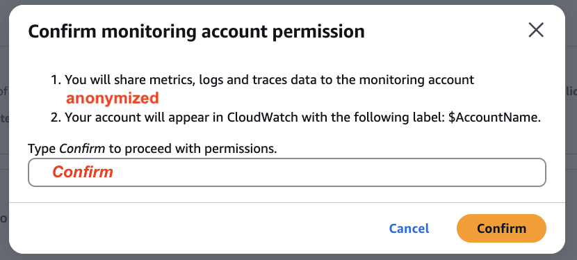
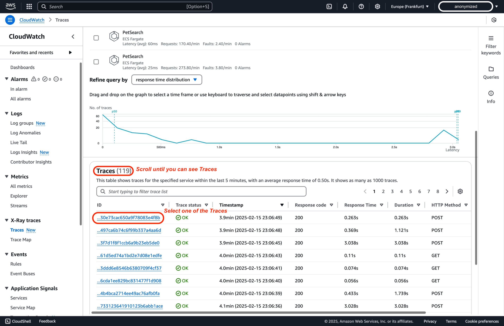

# CloudWatch 크로스 계정 Observability

단일 AWS 리전 내 여러 AWS 계정에 배포된 애플리케이션을 모니터링하는 것은 어려울 수 있습니다. [Amazon CloudWatch의 크로스 계정 Observability](https://aws.amazon.com/blogs/aws/new-amazon-cloudwatch-cross-account-observability/)[^1]는 [**AWS 리전**](https://docs.aws.amazon.com/AmazonCloudWatch/latest/monitoring/CloudWatch-Unified-Cross-Account.html)[^2] 내 여러 계정에 걸친 애플리케이션의 원활한 모니터링과 문제 해결을 가능하게 하여 이 과정을 단순화합니다. 이 튜토리얼은 두 AWS 계정 간의 크로스 계정 Observability를 구성하는 방법을 스크린샷과 함께 단계별로 안내합니다. 또한 더 넓은 확장성을 위해 AWS Organizations를 통한 배포도 가능하다는 점을 참고하세요.

## 용어

Amazon CloudWatch를 사용한 효과적인 크로스 계정 Observability를 위해 다음 핵심 용어를 이해해야 합니다:

| **용어** | **설명** |
|------|----------------|
| **모니터링 계정** | 여러 소스 계정에서 생성된 Observability 데이터를 보고 상호작용할 수 있는 중앙 AWS 계정 |
| **소스 계정** | 해당 계정에 있는 리소스에 대한 Observability 데이터를 생성하는 개별 AWS 계정 |
| **싱크(Sink)** | 소스 계정이 연결하여 Observability 데이터를 공유할 수 있는 연결 지점 역할을 하는 모니터링 계정의 리소스. 각 계정은 [AWS 리전](https://docs.aws.amazon.com/AmazonCloudWatch/latest/monitoring/CloudWatch-Unified-Cross-Account.html)[^2]당 하나의 **싱크**를 가질 수 있음 |
| **Observability 링크** | 소스 계정과 모니터링 계정 간에 설정된 연결을 나타내는 리소스로, Observability 데이터의 공유를 용이하게 합니다. 링크는 소스 계정에서 관리합니다. |

Amazon CloudWatch에서 크로스 계정 Observability를 성공적으로 구성하고 관리하려면 이러한 정의를 이해하세요.

## 고려 사항
1. 계정 제한: 단일 모니터링 계정에 최대 100,000개의 소스 계정을 연결할 수 있어, 가장 큰 규모의 엔터프라이즈 설정도 수용할 수 있습니다.
2. 크로스 리전: 이 기능에는 크로스 리전 기능이 자동으로 내장되어 있습니다. 동일한 그래프나 대시보드에 다른 리전의 메트릭을 표시하기 위해 추가 단계를 수행할 필요가 없습니다.
3. 데이터 보존: 모든 데이터 보존은 소스 계정 수준에서 처리됩니다. 모니터링 계정은 데이터를 저장하거나 복제하지 않습니다. 모니터링 계정은 소스 계정의 데이터에 대해 읽기 전용 접근 권한을 가집니다. 실제 데이터 전송이나 동기화는 포함되지 않습니다.
4. 비용 영향: 놀랍게도, 크로스 계정 Observability와 관련된 추가 비용은 없습니다. 데이터가 소스 계정에 유지되고 모니터링 계정에서만 읽기 때문에 추가 데이터 전송이나 스토리지 비용이 발생하지 않습니다.
5. 크로스 계정 Observability를 사용하여 소스 계정(X)에서 모니터링 계정(Y)으로 트레이스를 공유하면, 트레이스가 모니터링 계정(Y)에 복제되어 저장됩니다. 이 과정은 소스 계정(X)에 추가 비용을 발생시키지 않으므로, 원래 과금에 영향을 주지 않고 계정 간 모니터링 역량을 확장할 수 있습니다.
6. CloudWatch 서비스 할당량에 따르면, 각 대시보드에는 최대 500개의 위젯을 가질 수 있습니다. 고유 위젯은 최대 500개의 메트릭을 가질 수 있고, 고유 대시보드는 모든 위젯에 걸쳐 최대 2,500개의 메트릭을 가질 수 있습니다. 이 할당량에는 그래프에 표시되지 않더라도 메트릭 수학 함수에 사용하기 위해 검색된 모든 메트릭이 포함됩니다. 이 할당량은 하드 할당량이며 변경할 수 없습니다.
7. Amazon CloudWatch Logs Insights에서 개별적으로 지정하는 경우 쿼리당 최대 50개의 로그 그룹을 조회할 수 있습니다. 이 제한은 고정되어 있으며 증가시킬 수 없습니다. 그러나 이름 접두사를 기반으로 로그 그룹을 선택하거나 "모든 로그 그룹"을 조회하는 등의 로그 그룹 기준을 사용하면, 단일 쿼리에 최대 10,000개의 로그 그룹을 포함할 수 있어 여러 그룹에 걸친 더 광범위한 로그 분석이 가능합니다.
8. CloudWatch 크로스 계정 Observability에서 Logs와 Metrics를 작업할 때, 모든 네임스페이스의 메트릭을 모니터링 계정과 공유하거나, 네임스페이스의 하위 집합으로 필터링할 수 있습니다.
9. 크로스 계정 시나리오에서 경보(Alarms)를 작업할 때의 일부 고려 사항:
   1. CloudWatch Metrics Insights는 크로스 계정 Observability 시나리오에서 여러 계정의 수백 개 메트릭을 대규모로 조회할 수 있는 강력한 고성능 SQL 쿼리 엔진입니다.
    2. 경보를 설정할 때, 단일 시계열을 반환하는 쿼리에서만 가능하며, 이는 SELECT 표현식으로 달성할 수 있습니다. 단, SUM, MIN, MAX, COUNT, AVG 통계만 사용할 수 있습니다.
    3. 또한 "group by" 절을 사용하여 실시간으로 특정 차원 값별로 메트릭을 별도의 시계열로 그룹화할 수 있습니다. "order by" 기능을 사용하여 "Top N" 유형의 쿼리도 가능합니다.
    4. 자연어를 사용하여 쿼리를 생성할 수 있습니다. 이를 위해 원하는 데이터에 대해 질문하거나 설명합니다. 이 AI 지원 기능은 프롬프트를 기반으로 쿼리를 생성하고 쿼리 작동 방식에 대한 라인별 설명을 제공합니다.
    5. SEARCH 표현식을 기반으로 경보를 생성할 수 없습니다. 검색 표현식은 여러 시계열을 반환하고, 수학 표현식 기반 경보는 하나의 시계열만 감시할 수 있기 때문입니다. 또한 SEARCH 함수를 포함하는 수학 표현식(예: "MAX")에 대해 경보를 설정할 수 없습니다. 이 시나리오는 CloudWatch Custom Data Sources로 해결할 수 있습니다.
    6. 경보에 대해 크로스 리전 기능은 지원되지 않으므로, 한 리전에서 다른 리전의 메트릭을 감시하는 경보를 생성할 수 없습니다.

10. 데이터 보호 정책: 소스 계정에서 데이터 보호 정책이 활성화된 경우, 명시적 권한이 부여되지 않으면 모니터링 계정이 데이터에 접근할 수 없습니다.


## AWS 콘솔을 통한 단계별 튜토리얼

### 사전 요구 사항

1. 이 튜토리얼을 완료하려면 세 개의 AWS 계정이 필요합니다: 하나의 모니터링 계정과 두 개의 소스 계정.

2. 모니터링 계정과 소스 계정 간의 크로스 계정 링크를 생성하려면 사용자 또는 역할에 [AWS CloudWatch 크로스 계정 설정 가이드](https://docs.aws.amazon.com/AmazonCloudWatch/latest/monitoring/CloudWatch-Unified-Cross-Account-Setup.html#CloudWatch-Unified-Cross-Account-Setup-permissions)[^3]에 문서화된 최소 권한이 있어야 합니다.

<div style={{ textAlign: 'center' }}>

</div>

### 1단계: 모니터링 계정 설정

#### 모니터링 계정

모니터링 계정을 설정하려면 다음 단계를 따르세요:

1. [https://console.aws.amazon.com/cloudwatch](https://console.aws.amazon.com/cloudwatch)에서 CloudWatch 콘솔을 열고 크로스 계정 모니터링 계정을 구성할 AWS 리전을 선택합니다. 이 데모에서는 Europe (Frankfurt) 리전 (eu-central-1)을 사용합니다.


2. 탐색 패널에서 **설정**을 선택합니다.


3. 이 데모에서는 기본 계정 전역 설정을 사용하고, **모니터링 계정 구성** 섹션 내의 **구성**을 선택합니다.


4. 모니터링 계정과 공유할 데이터 유형을 선택한 후, "소스 계정 나열" 상자에 소스 계정 ID를 붙여넣습니다. 이 데모에서는 WorkloadAcc1과 WorkloadAcc2의 ID를 사용합니다. Metrics, Logs, Traces가 선택됩니다. Metrics와 Logs만 필터링이 가능하며, 나머지는 항상 전체가 공유됩니다. ServiceLens 및 X-Ray의 경우 metrics, logs, traces를 모두 활성화해야 합니다. Application Insights의 경우 Application Insights 애플리케이션도 활성화합니다. Internet Monitor의 경우 metrics, logs, Internet Monitor – Monitors를 활성화합니다.


:::info
CloudWatch 크로스 계정 Observability에서 텔레메트리 유형을 구성할 때, 종속성을 이해하는 것이 중요합니다. Metrics, Logs, Traces는 독립적으로 구성할 수 있지만, 다른 CloudWatch 기능에는 특정 요구사항이 있습니다. ServiceLens 및 X-Ray 기능에는 Metrics, Logs, Traces 세 가지가 모두 필요합니다. 더 고급 모니터링의 경우, Application Insights에는 Metrics, Logs, Traces, Application Insights 애플리케이션 활성화가 필요합니다. 마찬가지로, Internet Monitor에는 Metrics, Logs, Internet Monitor - Monitors 활성화가 필요합니다. 다음 표에서 이러한 종속성을 자세히 설명합니다:
:::
    | 텔레메트리 유형 | 설명 | CloudWatch 크로스 계정 Observability 종속성 |
    |----------------|-------------|-----------------------------------------------------|
    | Amazon CloudWatch의 Metrics | 모든 메트릭 네임스페이스 공유 또는 하위 집합으로 필터링 | 없음 |
    | Amazon CloudWatch Logs의 로그 그룹 | 모든 로그 그룹 공유 또는 하위 집합으로 필터링 | 없음 |
    | ServiceLens 및 X-Ray | 모든 트레이스 공유 (필터링 불가) | ServiceLens 및 X-Ray를 위해 Metrics, Logs, Traces 활성화 필요 |
    | Amazon CloudWatch Application Insights의 애플리케이션 | 모든 애플리케이션 공유 (필터링 불가) | Metrics, Logs, Traces, Application Insights 애플리케이션 활성화 필요 |
    | CloudWatch Internet Monitor의 모니터 | 모든 모니터 공유 (필터링 불가) | Metrics, Logs, Internet Monitor - Monitors 활성화 필요 |

5. 모니터링 계정의 AWS 콘솔에서 다음과 같은 그림이 표시되어 모니터링 계정이 성공적으로 구성되었음을 확인할 수 있습니다.


:::tip
	모니터링 계정을 성공적으로 구성한 후에는 소스 계정을 연결해야 합니다. 소스 계정을 연결하는 두 가지 주요 방법이 있습니다: AWS Organizations를 사용하는 방법과 개별 계정을 연결하는 방법입니다. 2단계에서는 개별 계정을 구성하는 과정을 진행합니다. 그러나 소스 계정에 로그인하여 변경하기 전에, 방금 구성한 모니터링 계정에서 모니터링 계정 싱크 ARN 같은 정보를 수집해야 합니다.
:::

6. 이전에 모니터링 계정에서 멈춘 AWS 콘솔에서 **계정 연결을 위한 리소스**를 선택합니다.


7. AWS 콘솔에서 '구성 세부 정보' 섹션을 확장합니다. 여기에서 2단계에서 소스 계정을 연결할 때 필요한 모니터링 계정 싱크 ARN을 찾아 복사하고 저장해야 합니다.


#### 요약

이전 단계에서, 독립 실행형이든 조직의 일부이든 관계없이 소스 계정과 연결할 수 있도록 모니터링 계정 싱크를 구성했습니다. 본질적으로 위의 단계들은 소스 계정이 통합될 수 있도록 모니터링 계정 싱크에 구성 정책을 생성했습니다. AWS 콘솔 구성을 통해 생성된 샘플 정책은 아래에서 확인할 수 있습니다:

```
{
    "Version": "2012-10-17",
    "Statement": [
        {
            "Effect": "Allow",
            "Principal": {
                "AWS": [
                    "${WorkloadAcc1}", // Workload Account
                    "${WorkloadAcc2}"  // Workload Account
                ]
            },
            "Action": [
                "oam:CreateLink",
                "oam:UpdateLink"
            ],
            "Resource": "*",
            "Condition": {
                "ForAllValues:StringEquals": {
                    "oam:ResourceTypes": [
                        "AWS::Logs::LogGroup",
                        "AWS::CloudWatch::Metric",
                        "AWS::XRay::Trace"
                    ]
                }
            }
        }
    ]
}
```

AWS Organizations를 사용하여 구성하는 경우, PrincipalOrgID 조건을 기반으로 AWS 조직 내의 모든 AWS 계정이 링크를 생성하거나 업데이트할 수 있도록 신뢰하므로 추가 수정이 필요 없는 구성 정책이 모니터링 계정 싱크에 적용됩니다. 이러한 샘플 정책은 아래에서 확인할 수 있습니다:

```
{
    "Version": "2012-10-17",
    "Statement": [
        {
            "Effect": "Allow",
            "Principal": "*",
            "Action": ["oam:CreateLink", "oam:UpdateLink"],
            "Resource": "*",
            "Condition": {
                "ForAllValues:StringEquals": {
                    "oam:ResourceTypes": [
                        "AWS::Logs::LogGroup",
                        "AWS::CloudWatch::Metric",
                        "AWS::XRay::Trace",
                        "AWS::ApplicationInsights::Application",
                        "AWS::InternetMonitor::Monitor"
                    ]
                },
                "ForAnyValue:StringEquals": {
                    "aws:PrincipalOrgID": "${OrganizationId}" // AWS Organization as Condition
                }
            }
        }
    ]
}
```


### 2단계: 소스 계정 연결

#### 개별 계정 연결

1단계에서 모니터링 계정을 구성한 후, 이제 개별 AWS 소스 계정을 구성합니다. 이 접근 방식은 조직 외부의 계정으로 작업하거나 특정 독립 계정에 대한 모니터링을 설정해야 할 때 특히 유용합니다. AWS Organizations는 여러 계정을 관리하기 위한 확장 가능한 솔루션을 제공하지만, 개별 계정 설정은 더 세분화된 제어와 유연성을 제공합니다.

소스 계정 구성을 진행하기 전에, 연결을 설정하는 데 필요한 1단계에서 얻은 모니터링 계정 싱크 ARN을 복사했는지 확인하세요.

개별 소스 계정을 연결하려면 다음 단계를 따르세요:

1. [https://console.aws.amazon.com/cloudwatch](https://console.aws.amazon.com/cloudwatch)에서 CloudWatch 콘솔을 열고 크로스 계정 모니터링 계정을 구성할 AWS 리전을 선택합니다. 이 데모에서는 Europe (Frankfurt) 리전 (eu-central-1)을 사용합니다.
 

2. 탐색 패널에서 **설정**을 선택합니다.


3. 이 데모에서는 계정 전역 설정의 기본 구성을 유지하고, **소스 계정 구성** 섹션 내의 **구성**을 선택합니다.


4. AWS 콘솔에서 데이터 유형으로 Logs, Metrics, Traces를 선택합니다. 기본적으로 모두 공유되지만, 모니터링 계정과 공유할 Logs와 Metrics를 필터링하여 더 세분화할 수 있습니다. 연결하기 전 다음 단계로, 이전에 모니터링 계정을 구성할 때 복사한 모니터링 계정 싱크 ARN을 입력해야 합니다.


5. 소스 계정 구성을 완료하기 전 마지막 단계는 소스 계정의 데이터가 모니터링 계정과 공유됨을 확인하는 것입니다. 팝업 상자에 'Confirm'을 입력하여 이 작업을 확인합니다.


6. AWS 콘솔의 '소스 계정 구성' 섹션 아래에 계정이 '연결됨'을 나타내는 녹색 상태가 표시되어야 합니다.


:::tip
    WorkloadAcc2에 대해 2단계를 반복하여 두 Workload 계정의 Observability 텔레메트리가 모니터링 계정과 공유되도록 합니다.
:::

### 3단계: 구성 검증

:::tip
    모니터링 계정에 로그인되어 있는지 확인하세요.
:::

1. [https://console.aws.amazon.com/cloudwatch](https://console.aws.amazon.com/cloudwatch)에서 CloudWatch 콘솔을 열고 1단계에서 크로스 계정 모니터링을 구성한 AWS 리전을 선택합니다. 이 데모에서는 Europe (Frankfurt) 리전 (eu-central-1)을 사용합니다.
 

2. 탐색 패널에서 **설정**을 선택합니다.


3. **모니터링 계정 구성** 섹션 내의 **모니터링 계정 관리**를 선택합니다.
 

4. 모니터링 계정 구성 페이지 내의 연결된 소스 계정 패널에서 두 개의 워크로드 계정이 **소스 계정**으로 연결된 것을 확인할 수 있습니다.


#### 대안: AWS Organizations 통합

AWS CloudWatch 크로스 계정 Observability는 리전 내 여러 AWS 계정에 걸친 애플리케이션의 중앙 집중식 모니터링 및 문제 해결을 가능하게 합니다. AWS Organizations를 통합하면 설정을 간소화하고 모든 계정에 걸쳐 구성을 자동화할 수 있습니다. 이 접근 방식은 조직 내 많은 수의 계정에 걸친 모니터링을 효율적으로 처리합니다.

##### 사전 요구 사항:

- AWS Organizations가 활성화되어 있고, 멤버 계정이 적절히 포함되어 있어야 합니다[^4].
- 자식 계정에 AWS CloudFormation StackSets를 배포할 수 있는 권한, 링크를 생성하기 위해 적절한 CloudFormation 작업이 허용된 IAM 역할 포함[^3].
- 조직(또는 특정 OU) 내의 소스 계정이 Observability 링크를 생성하고 업데이트할 수 있도록 허용하는 구성이 된 모니터링 계정의 싱크[^6].

AWS CloudFormation StackSets는 모든 멤버 계정에서 필요한 서비스 연결 역할과 Observability 구성의 배포를 자동화합니다. 자동 배포가 활성화되면, 새로 생성된 AWS 계정은 자동으로 필요한 Observability 설정을 상속받아, AWS 환경 전체에서 균일한 모니터링 관행을 유지하면서 관리 오버헤드를 줄입니다.

IAM 권한, 샘플 StackSet 템플릿, 모니터링 정책을 포함한 단계별 구현 가이드는 공식 AWS 문서를 참조하세요[^7].

## 비디오 튜토리얼

크로스 계정 Observability 설정에 대한 자세한 안내는 공식 AWS YouTube 가이드인 "Enable Cross-Account Observability in Amazon CloudWatch | Amazon Web Services"도 시청할 수 있습니다. 이 튜토리얼은 중앙 집중식 모니터링 계정을 구성하고, 여러 소스 계정을 연결하며, CloudWatch 콘솔에서 공유된 Observability 데이터를 탐색하는 방법을 시각적으로 보여줍니다.

<!-- blank line -->
<figure class="video_container">
  <iframe width="560" height="315" src="https://www.youtube.com/embed/lUaDO9dqISc?si=mPewnqzWBqBZKmyg" title="YouTube video player" frameborder="0" allow="accelerometer; autoplay; clipboard-write; encrypted-media; gyroscope; picture-in-picture; web-share" referrerpolicy="strict-origin-when-cross-origin" allowfullscreen></iframe>
</figure>
<!-- blank line -->

## 크로스 계정 텔레메트리 데이터 조회

:::tip
    모니터링 계정에 로그인되어 있는지 확인하세요.
:::

:::info
    [Observability One Workshop](https://catalog.workshops.aws/observability/en-US/architecture)[^8]의 Pet Adoption 애플리케이션을 재사용하고 있습니다. 이 데모에서는 크로스 계정 Observability를 설명하기 위해 두 워크로드 계정 모두에 배포되어 있습니다.
:::

### Metrics

여러 계정의 메트릭을 중앙 위치에서 모니터링하려면:

1. 모니터링 계정의 CloudWatch 콘솔에서 왼쪽 탐색 패널의 "모든 메트릭"으로 이동하면, 연결된 모든 소스 계정의 메트릭을 볼 수 있습니다.


2. 계정 ID 필터 `:aws.AccountId=`를 사용하여 특정 계정의 메트릭을 필터링하거나, 네임스페이스와 차원을 선택하여 드릴다운할 수 있습니다. 이 데모에서는 [View Metrics in Observability One Workshop](https://catalog.workshops.aws/observability/en-US/aws-native/metrics/viewmetrics)[^8]의 가이드를 따릅니다. ContainerInsights 네임스페이스를 선택하고 ClusterName, Namespace, PodName 차원을 선택합니다. 그런 다음 메트릭 이름 pod_cpu_utilization으로 필터링합니다. 보시다시피, 그래프로 표시할 수 있는 두 워크로드 계정의 메트릭이 있습니다.


#### 경보(Alarms)

[Amazon CloudWatch 크로스 계정 경보](https://aws.amazon.com/about-aws/whats-new/2021/08/announcing-amazon-cloudwatch-cross-account-alarms/)[^9]를 사용하면 중앙 모니터링 계정에서 여러 AWS 계정의 메트릭을 모니터링할 수 있습니다. 단일 메트릭 또는 수학 표현식의 출력을 감시하는 메트릭 경보와, 여러 경보(다른 복합 경보 포함)의 상태를 평가하는 복합 경보를 생성할 수 있습니다. 예를 들어, 모든 프로덕션 계정에서 CPU 사용률이 80%를 초과할 때 경보를 트리거하도록 설정할 수 있습니다. 트리거되면 경보는 Amazon SNS 알림 전송이나 AWS Lambda 함수 호출 같은 작업을 수행하여, 적시에 알림을 받고 사전에 대응할 수 있도록 합니다. 모니터링 계정에서 경보 생성을 중앙화함으로써 알림을 간소화하고 워크로드에 대한 통합 운영 뷰를 확보합니다.

[Metrics](#metrics)의 이전 단계에서 계속하여, "그래프 메트릭"을 선택한 다음 "경보 생성"을 선택하여 특정 메트릭에 대한 경보를 생성할 수 있습니다.


### Logs

Logs Insights를 사용하여 단일 인터페이스에서 여러 계정의 로그를 조회하고 분석하거나, 실시간으로 로그를 라이브 테일링할 수 있습니다. 계정 간 Logs Insights를 사용하여 로그를 조회하는 방법은 다음과 같습니다:

1. CloudWatch 콘솔에서 "Logs Insights"로 이동하고 로그 그룹 선택기를 사용하여 다른 계정의 로그 그룹을 선택합니다.


2. 다음 단계는 CloudWatch Logs Insights 쿼리를 작성하는 것입니다. 이 데모에서는 [One Observability Workshop](https://catalog.workshops.aws/observability/en-US/aws-native/logs/logsinsights/fields#step-4:-aggregate-on-our-chosen-fields)[^8]의 AWS 네이티브 Observability 하위 섹션 Logs insight에서 쿼리를 가져와 약간 수정합니다. 지난 시간 동안 얼마나 많은 다른 반려동물이 입양되었고 Workload 계정별로 얼마나 되는지 확인하고자 합니다.
    
    ```
    filter @message like /POST/ and @message like /completeadoption/
    | parse @message "* * * *:* *" as method, request, protocol, ip, port, status
    | parse request "*?petId=*&petType=*" as requestURL, id, type
    | parse @log "*:*" as accountId, logGroupName // Modified to parse accountId from @log information
    | stats count() by type,accountId // Modified to group by previously parsed accountId
    ```
    
    

계정 간 Live Tail 로그를 사용하는 방법은 다음과 같습니다:

1. CloudWatch 콘솔에서 **Live Tail**로 이동하고 필터 패널에서 로그 그룹 선택기를 사용하여 다른 계정의 **로그 그룹을 선택**한 다음, 시작을 선택합니다.


### Traces

1. 모니터링 계정의 CloudWatch 콘솔에서, 탐색 패널의 X-Ray traces 아래에서 Trace map을 선택합니다. 트레이스 맵은 연결된 모든 소스 계정의 데이터를 표시합니다. 필요한 경우 계정 필터를 사용합니다.


2. 트레이스 맵에서 각 노드는 어떤 AWS 계정에 속하는지 표시합니다. 특정 span에 대한 더 깊은 분석을 위해 View traces를 선택합니다.


3. 개별 세그먼트에 대한 더 상세한 인사이트를 위해 특정 트레이스를 선택합니다.


4. 각 추적 경로의 구성 요소에 대해 알아보기 위해 엔드투엔드 트레이스 span을 더 깊이 살펴봅니다.


## 결론

Amazon CloudWatch에서 크로스 계정 Observability를 구성하면, 여러 AWS 계정에 걸친 애플리케이션 성능과 상태를 중앙 집중식으로 볼 수 있습니다. 이를 통해 애플리케이션이 어떤 계정에 있든 관계없이 모니터링, 문제 해결, 분석이 간소화됩니다. 이 튜토리얼에 설명된 단계를 따르면, 모니터링 계정을 효과적으로 설정하고, AWS Organizations 또는 개별 계정 연결을 사용하여 소스 계정을 연결하며, 구성을 검증할 수 있습니다. 이제 CloudWatch 콘솔을 활용하여 여러 계정에 걸친 애플리케이션을 모니터링하고 문제를 해결할 수 있습니다.

크로스 계정 모니터링 역량을 더욱 향상시키려면, 대시보드, 경보, 로그 등 다양한 CloudWatch 기능을 살펴보세요. 이러한 기능은 애플리케이션 성능과 상태에 대한 더 깊은 인사이트를 제공하여, 잠재적 문제를 사전에 식별하고 해결할 수 있도록 합니다.

## 리소스

[^1]: [AWS 블로그 - Amazon CloudWatch 크로스 계정 Observability](https://aws.amazon.com/blogs/aws/new-amazon-cloudwatch-cross-account-observability/)

[^2]: [CloudWatch 크로스 계정 Observability](https://docs.aws.amazon.com/AmazonCloudWatch/latest/monitoring/CloudWatch-Unified-Cross-Account.html)

[^3]: [링크 생성에 필요한 권한](https://docs.aws.amazon.com/AmazonCloudWatch/latest/monitoring/CloudWatch-Unified-Cross-Account-Setup.html#CloudWatch-Unified-Cross-Account-Setup-permissions)

[^4]: [AWS Organizations란?](https://docs.aws.amazon.com/organizations/latest/userguide/orgs_introduction.html)

[^5]: [AWS CloudFormation StackSets 및 AWS Organizations](https://docs.aws.amazon.com/organizations/latest/userguide/services-that-can-integrate-cloudformation.html)  

[^6]: [모니터링 계정 설정](https://docs.aws.amazon.com/AmazonCloudWatch/latest/monitoring/CloudWatch-Unified-Cross-Account-Setup.html#Unified-Cross-Account-Setup-ConfigureMonitoringAccount)

[^7]: [AWS CloudFormation 템플릿을 사용하여 조직 또는 조직 단위의 모든 계정을 소스 계정으로 설정](https://docs.aws.amazon.com/AmazonCloudWatch/latest/monitoring/CloudWatch-Unified-Cross-Account-Setup.html#Unified-Cross-Account-SetupSource-OrgTemplate)

[^8]: [One Observability Workshop](https://catalog.workshops.aws/observability/en-US/intro)

[^9]: [Amazon CloudWatch 크로스 계정 경보](https://aws.amazon.com/about-aws/whats-new/2021/08/announcing-amazon-cloudwatch-cross-account-alarms/)
