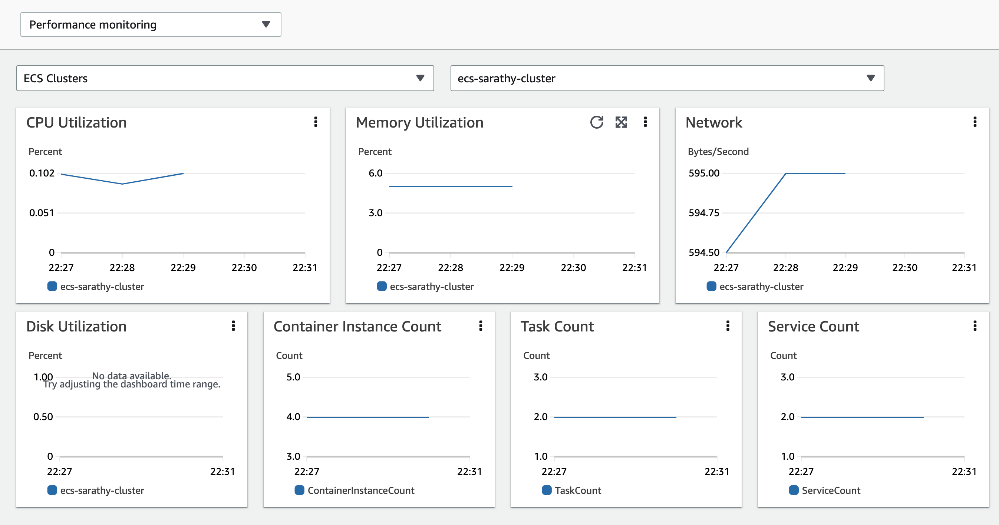

# Container Insights를 사용한 시스템 메트릭 수집
시스템 메트릭(metrics)은 CPU, 메모리, 디스크, 네트워크 인터페이스 등 서버의 물리적 구성 요소를 포함하는 저수준 리소스와 관련된 지표입니다.
[CloudWatch Container Insights](https://docs.aws.amazon.com/AmazonCloudWatch/latest/monitoring/ContainerInsights.html)를 사용하면 Amazon ECS에 배포된 컨테이너화된 애플리케이션에서 시스템 메트릭을 수집, 집계 및 요약할 수 있습니다. Container Insights는 컨테이너 재시작 실패와 같은 진단 정보도 제공하여 문제를 빠르게 격리하고 해결하는 데 도움을 줍니다. EC2와 Fargate에 배포된 Amazon ECS 클러스터에서 사용할 수 있습니다.

Container Insights는 [임베디드 메트릭 형식](https://docs.aws.amazon.com/AmazonCloudWatch/latest/monitoring/CloudWatch_Embedded_Metric_Format.html)을 사용하여 성능 로그 이벤트로 데이터를 수집합니다. 이러한 성능 로그 이벤트는 구조화된 JSON 스키마를 사용하는 항목으로, 높은 카디널리티 데이터를 대규모로 수집하고 저장할 수 있게 합니다. 이 데이터를 기반으로 CloudWatch는 클러스터, 노드, 서비스, 태스크 수준에서 집계된 메트릭을 CloudWatch 메트릭으로 생성합니다.

:::note
	Container Insights 메트릭이 CloudWatch에 표시되려면 Amazon ECS 클러스터에서 Container Insights를 활성화해야 합니다. 이는 계정 수준 또는 개별 클러스터 수준에서 수행할 수 있습니다. 계정 수준에서 활성화하려면 다음 AWS CLI 명령을 사용하세요:

    ```
    aws ecs put-account-setting --name "containerInsights" --value "enabled
    ```

    개별 클러스터 수준에서 활성화하려면 다음 AWS CLI 명령을 사용하세요:

    ```
    aws ecs update-cluster-settings --cluster $CLUSTER_NAME --settings name=containerInsights,value=enabled
    ```
:::

## 클러스터 수준 및 서비스 수준 메트릭 수집
기본적으로 CloudWatch Container Insights는 태스크, 서비스, 클러스터 수준에서 메트릭을 수집합니다. Amazon ECS 에이전트는 EC2 컨테이너 인스턴스의 각 태스크(ECS on EC2와 ECS on Fargate 모두)에서 이러한 메트릭을 수집하여 성능 로그 이벤트로 CloudWatch에 전송합니다. 클러스터에 별도의 에이전트를 배포할 필요가 없습니다. 메트릭이 추출되는 이러한 로그 이벤트는 */aws/ecs/containerinsights/$CLUSTER_NAME/performance*라는 CloudWatch 로그 그룹에 수집됩니다. 이러한 이벤트에서 추출되는 전체 메트릭 목록은 [여기에 문서화](https://docs.aws.amazon.com/AmazonCloudWatch/latest/monitoring/Container-Insights-metrics-ECS.html)되어 있습니다. Container Insights가 수집하는 메트릭은 CloudWatch 콘솔에서 탐색 페이지에서 *Container Insights*를 선택한 다음 드롭다운 목록에서 *performance monitoring*을 선택하여 사전 구축된 대시보드에서 쉽게 확인할 수 있습니다. CloudWatch 콘솔의 *Metrics* 섹션에서도 확인할 수 있습니다.



:::note
    Amazon EC2 인스턴스에서 Amazon ECS를 사용하면서 Container Insights에서 네트워크 및 스토리지 메트릭을 수집하려면 Amazon ECS 에이전트 버전 1.29 이상이 포함된 AMI를 사용하여 해당 인스턴스를 시작하세요.
:::

:::warning
    Container Insights에서 수집하는 메트릭은 사용자 지정 메트릭으로 요금이 부과됩니다. CloudWatch 요금에 대한 자세한 내용은 [Amazon CloudWatch 요금](https://aws.amazon.com/cloudwatch/pricing/)을 참조하세요.
:::

## 인스턴스 수준 메트릭 수집
EC2에서 호스팅되는 Amazon ECS 클러스터에 CloudWatch 에이전트를 배포하면 클러스터에서 인스턴스 수준 메트릭을 수집할 수 있습니다. 에이전트는 데몬 서비스로 배포되며 클러스터의 각 EC2 컨테이너 인스턴스에서 인스턴스 수준 메트릭을 성능 로그 이벤트로 전송합니다. 이러한 이벤트에서 추출되는 인스턴스 수준 메트릭의 전체 목록은 [여기에 문서화](https://docs.aws.amazon.com/AmazonCloudWatch/latest/monitoring/Container-Insights-metrics-ECS.html)되어 있습니다.

:::info
    인스턴스 수준 메트릭을 수집하기 위해 Amazon ECS 클러스터에 CloudWatch 에이전트를 배포하는 단계는 [Amazon CloudWatch 사용자 가이드](https://docs.aws.amazon.com/AmazonCloudWatch/latest/monitoring/deploy-container-insights-ECS-instancelevel.html)에 문서화되어 있습니다. 이 옵션은 Fargate에서 호스팅되는 Amazon ECS 클러스터에서는 사용할 수 없습니다.
:::
    
## Logs Insights를 사용한 성능 로그 이벤트 분석
Container Insights는 임베디드 메트릭 형식의 성능 로그 이벤트를 통해 메트릭을 수집합니다. 각 로그 이벤트에는 CPU, 메모리 등의 시스템 리소스나 태스크, 서비스 등의 ECS 리소스에서 관찰된 성능 데이터가 포함될 수 있습니다. Container Insights가 Amazon ECS에서 클러스터, 서비스, 태스크, 컨테이너 수준으로 수집하는 성능 로그 이벤트의 예시는 [여기에 나열](https://docs.aws.amazon.com/AmazonCloudWatch/latest/monitoring/Container-Insights-reference-performance-logs-ECS.html)되어 있습니다. CloudWatch는 이러한 로그 이벤트의 일부 성능 데이터만을 기반으로 메트릭을 생성합니다. 하지만 CloudWatch Logs Insights 쿼리를 사용하여 이러한 로그 이벤트로 성능 데이터에 대한 심층 분석을 수행할 수 있습니다.

Logs Insights 쿼리를 실행하는 사용자 인터페이스는 CloudWatch 콘솔의 탐색 페이지에서 *Logs Insights*를 선택하면 사용할 수 있습니다. 로그 그룹을 선택하면 CloudWatch Logs Insights가 로그 그룹의 성능 로그 이벤트에서 자동으로 필드를 감지하고 오른쪽 창의 *Discovered* 필드에 표시합니다. 쿼리 실행 결과는 시간에 따른 로그 그룹의 로그 이벤트 막대 그래프로 표시됩니다. 이 막대 그래프는 쿼리와 시간 범위에 일치하는 로그 그룹의 이벤트 분포를 보여줍니다.


:::info
    다음은 컨테이너 수준의 CPU 및 메모리 사용량 메트릭을 표시하는 Logs Insights 쿼리 예시입니다.
    
    ```
    stats avg(CpuUtilized) as CPU, avg(MemoryUtilized) as Mem by TaskId, ContainerName | sort Mem, CPU desc
    ```
:::
