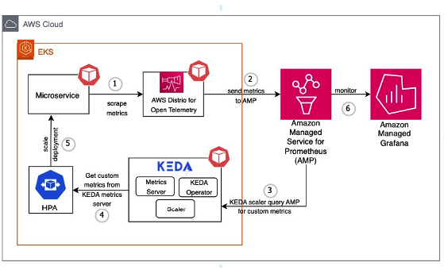
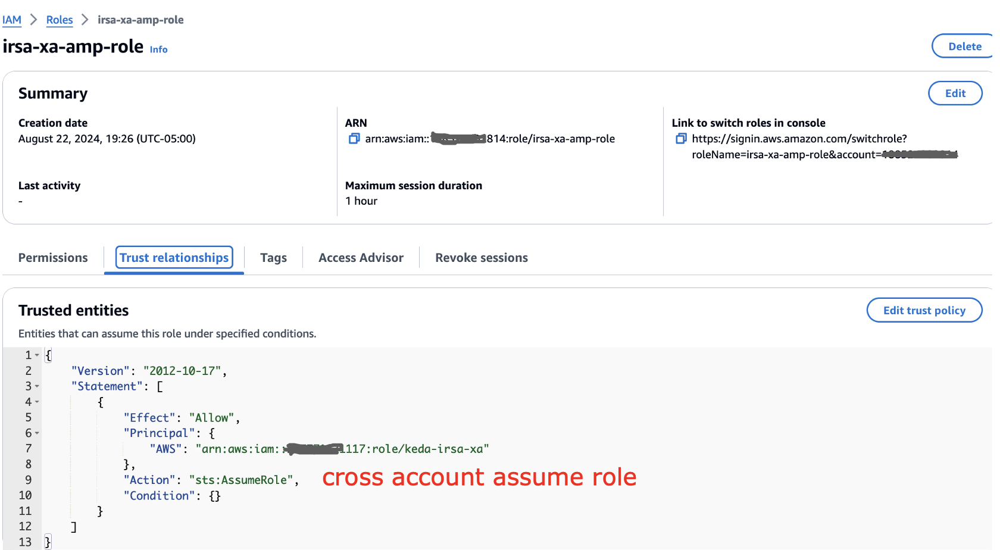

# AMP와 EKS에서 KEDA를 사용한 애플리케이션 오토스케일링

# 현재 환경

Amazon EKS 애플리케이션에서 증가하는 트래픽을 처리하는 것은 어렵습니다. 수동 스케일링은 비효율적이고 오류가 발생하기 쉽습니다. 오토스케일링은 리소스 할당을 위한 더 나은 솔루션을 제공합니다. KEDA는 다양한 메트릭과 이벤트를 기반으로 Kubernetes 오토스케일링을 가능하게 하며, Amazon Managed Service for Prometheus는 EKS 클러스터에 대한 안전한 메트릭 모니터링을 제공합니다. 이 솔루션은 KEDA와 Amazon Managed Service for Prometheus를 결합하여 초당 요청 수(RPS) 메트릭을 기반으로 한 오토스케일링을 시연합니다. 이 접근 방식은 워크로드 요구에 맞춤화된 자동 스케일링을 제공하며, 사용자는 이를 자체 EKS 워크로드에 적용할 수 있습니다. Amazon Managed Grafana는 스케일링 패턴을 모니터링하고 시각화하는 데 사용되어 오토스케일링 동작에 대한 인사이트를 얻고 비즈니스 이벤트와 상관관계를 분석할 수 있습니다.

# AMP 메트릭을 사용한 KEDA 기반 애플리케이션 오토스케일링

이 솔루션은 AWS와 오픈 소스 소프트웨어의 통합을 통해 자동화된 스케일링 파이프라인을 구현합니다. 관리형 Kubernetes를 위한 Amazon EKS, 메트릭 수집을 위한 AWS Distro for Open Telemetry(ADOT), 이벤트 기반 오토스케일링을 위한 KEDA, 메트릭 저장을 위한 Amazon Managed Service for Prometheus, 시각화를 위한 Amazon Managed Grafana를 결합합니다. 아키텍처는 EKS에 KEDA를 배포하고, ADOT가 메트릭을 스크래핑하도록 구성하고, KEDA ScaledObject로 오토스케일링 규칙을 정의하고, Grafana 대시보드로 스케일링을 모니터링하는 것을 포함합니다. 오토스케일링 프로세스는 마이크로서비스에 대한 사용자 요청으로 시작되며, ADOT가 메트릭을 수집하고 Prometheus로 전송합니다. KEDA는 정기적인 간격으로 이러한 메트릭을 쿼리하고, 스케일링 필요성을 결정하며, Horizontal Pod Autoscaler(HPA)와 상호작용하여 파드 레플리카를 조정합니다. 이 설정은 Kubernetes 마이크로서비스에 대한 메트릭 기반 오토스케일링을 가능하게 하며, 다양한 활용 지표를 기반으로 스케일링할 수 있는 유연한 클라우드 네이티브 아키텍처를 제공합니다.

# KEDA를 사용한 AMP 메트릭 기반 크로스 계정 EKS 애플리케이션 스케일링
이 경우, KEDA EKS가 ID가 117로 끝나는 AWS 계정에서 실행되고 중앙 AMP 계정 ID가 814로 끝난다고 가정하겠습니다. KEDA EKS 계정에서 아래와 같이 크로스 계정 IAM 역할을 설정합니다:

또한 신뢰 관계를 아래와 같이 업데이트해야 합니다:

EKS 클러스터에서 여기서는 IRSA를 사용하므로 Pod identity를 사용하지 않는 것을 볼 수 있습니다.

중앙 AMP 계정에서는 아래와 같이 AMP 접근을 설정합니다.

신뢰 관계에도 접근 권한이 있습니다.

아래와 같이 작업 공간 ID를 기록해 두세요.

## KEDA 구성
설정이 완료되면 아래와 같이 keda가 실행 중인지 확인합니다. 설정 지침은 아래 공유된 블로그 링크를 참조하세요.

구성에서 위에서 정의한 중앙 AMP 역할을 사용해야 합니다.

KEDA 스케일러 구성에서 아래와 같이 중앙 AMP 계정을 가리킵니다.

이제 파드가 적절하게 스케일링되는 것을 확인할 수 있습니다.

## 블로그

[https://aws.amazon.com/blogs/mt/autoscaling-kubernetes-workloads-with-keda-using-amazon-managed-service-for-prometheus-metrics/](https://aws.amazon.com/blogs/mt/autoscaling-kubernetes-workloads-with-keda-using-amazon-managed-service-for-prometheus-metrics/)
