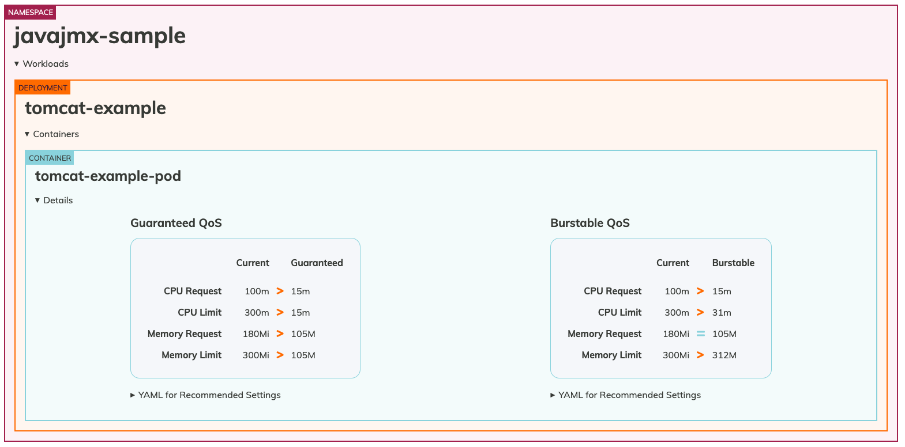

# Kubernetes 워크로드를 위한 리소스 최적화 모범 사례
Kubernetes 도입이 계속 가속화되면서 많은 조직이 마이크로서비스 기반 아키텍처로 전환하고 있습니다. 초기 관심의 대부분은 애플리케이션을 지원하기 위한 새로운 클라우드 네이티브 아키텍처를 설계하고 구축하는 데 집중되었습니다. 환경이 성장함에 따라 고객의 리소스 할당 최적화에 대한 관심이 커지고 있습니다. 리소스 최적화는 보안 다음으로 운영 팀이 가장 많이 묻는 질문입니다.
Kubernetes 환경에서 리소스 할당을 최적화하고 애플리케이션을 적절한 크기로 조정하는 방법에 대한 지침을 살펴보겠습니다. 여기에는 관리형 노드 그룹, 자체 관리형 노드 그룹, AWS Fargate로 배포된 Amazon EKS에서 실행되는 애플리케이션이 포함됩니다.

## Kubernetes에서 애플리케이션 적정 크기 조정의 이유
Kubernetes에서 리소스 적정 크기 조정은 애플리케이션에 리소스 사양을 설정하는 것으로 수행됩니다. 이러한 설정은 다음에 직접적인 영향을 미칩니다:

* 성능 — 적절한 리소스 사양 없이는 Kubernetes 애플리케이션이 리소스를 임의로 경쟁하게 됩니다. 이는 애플리케이션 성능에 부정적인 영향을 미칠 수 있습니다.
* 비용 최적화 — 과도한 리소스 사양으로 배포된 애플리케이션은 비용 증가와 인프라 활용도 저하를 초래합니다.
* 오토스케일링 — Kubernetes Cluster Autoscaler와 Horizontal Pod Autoscaling은 작동하기 위해 리소스 사양이 필요합니다.

Kubernetes에서 가장 일반적인 리소스 사양은 [CPU 및 메모리 requests와 limits](https://kubernetes.io/docs/concepts/configuration/manage-resources-containers/#requests-and-limits)입니다.

## Requests와 Limits

컨테이너화된 애플리케이션은 Kubernetes에서 Pod로 배포됩니다. CPU 및 메모리 requests와 limits는 Pod 정의의 선택적 부분입니다. CPU는 [Kubernetes CPU](https://kubernetes.io/docs/concepts/configuration/manage-resources-containers/#meaning-of-cpu) 단위로 지정되며 메모리는 바이트 단위로 지정되고, 보통 [메비바이트(Mi)](https://simple.wikipedia.org/wiki/Mebibyte)를 사용합니다.

Request와 limits는 Kubernetes에서 각각 다른 기능을 수행하며 스케줄링과 리소스 적용에 다르게 영향을 미칩니다.

## 권장 사항
애플리케이션 소유자는 CPU 및 메모리 리소스 requests에 대한 "올바른" 값을 선택해야 합니다. 이상적인 방법은 개발 환경에서 애플리케이션을 부하 테스트하고 Observability 도구를 사용하여 리소스 사용량을 측정하는 것입니다. 이는 조직의 가장 중요한 애플리케이션에는 적합할 수 있지만, 클러스터에 배포된 모든 컨테이너화된 애플리케이션에 대해서는 실행 가능하지 않을 수 있습니다. 워크로드를 최적화하고 적정 크기로 조정하는 데 도움이 되는 도구에 대해 알아보겠습니다:

### Vertical Pod Autoscaler (VPA)
[VPA](https://github.com/kubernetes/autoscaler/tree/master/vertical-pod-autoscaler)는 Autoscaling 특별 관심 그룹(SIG)이 소유한 Kubernetes 하위 프로젝트입니다. 관찰된 애플리케이션 성능을 기반으로 Pod requests를 자동으로 설정하도록 설계되었습니다. VPA는 기본적으로 [Kubernetes Metric Server](https://github.com/kubernetes-sigs/metrics-server)를 사용하여 리소스 사용량을 수집하지만, 선택적으로 Prometheus를 데이터 소스로 사용하도록 구성할 수 있습니다.
VPA에는 애플리케이션 성능을 측정하고 크기 조정 권장 사항을 만드는 추천 엔진이 있습니다. VPA 추천 엔진은 단독으로 배포할 수 있어 VPA가 오토스케일링 작업을 수행하지 않도록 할 수 있습니다. 각 애플리케이션에 대해 VerticalPodAutoscaler 커스텀 리소스를 생성하여 구성하며, VPA는 오브젝트의 상태 필드에 리소스 크기 조정 권장 사항을 업데이트합니다.
클러스터의 모든 애플리케이션에 대해 VerticalPodAutoscaler 오브젝트를 생성하고 JSON 결과를 읽고 해석하려는 것은 대규모에서 어렵습니다. [Goldilocks](https://github.com/FairwindsOps/goldilocks)는 이를 쉽게 만들어주는 오픈 소스 프로젝트입니다.

### Goldilocks
Goldilocks는 조직이 Kubernetes 애플리케이션 리소스 requests를 "딱 적당하게" 설정할 수 있도록 설계된 Fairwinds의 오픈 소스 프로젝트입니다. Goldilocks의 기본 구성은 옵트인 모델입니다. goldilocks.fairwinds.com/enabled: true 레이블을 네임스페이스에 추가하여 모니터링할 워크로드를 선택합니다.


Metrics Server는 워커 노드에서 실행되는 Kubelet에서 리소스 메트릭을 수집하고 Metrics API를 통해 Vertical Pod Autoscaler가 사용할 수 있도록 노출합니다. Goldilocks 컨트롤러는 goldilocks.fairwinds.com/enabled: true 레이블이 있는 네임스페이스를 감시하고 해당 네임스페이스의 각 워크로드에 대해 VerticalPodAutoscaler 오브젝트를 생성합니다.

리소스 권장 사항을 위해 네임스페이스를 활성화하려면 아래 명령을 실행합니다:

```
kubectl create ns javajmx-sample
kubectl label ns javajmx-sample goldilocks.fairwinds.com/enabled=true
```

Amazon EKS 클러스터에 goldilocks를 배포하려면 아래 명령을 실행합니다:

```
helm repo add fairwinds-stable https://charts.fairwinds.com/stable
helm upgrade --install goldilocks fairwinds-stable/goldilocks --namespace goldilocks --create-namespace --set vpa.enabled=true
```

Goldilocks-dashboard는 포트 8080에서 대시보드를 노출하며 리소스 권장 사항을 얻기 위해 접근할 수 있습니다. 대시보드에 접근하려면 아래 명령을 실행합니다:

```
kubectl -n goldilocks port-forward svc/goldilocks-dashboard 8080:80
```
그런 다음 브라우저에서 http://localhost:8080 을 엽니다.


샘플 네임스페이스를 분석하여 Goldilocks가 제공하는 권장 사항을 확인해 보겠습니다. 배포에 대한 권장 사항을 확인할 수 있습니다.


javajmx-sample 워크로드에 대한 request 및 limit 권장 사항을 볼 수 있습니다. 각 Quality of Service(QoS) 아래의 Current 열은 현재 구성된 CPU 및 메모리 request와 limits를 나타냅니다. Guaranteed 및 Burstable 열은 해당 QoS에 대한 권장 CPU 및 메모리 request limits를 나타냅니다.

리소스를 과다 프로비저닝한 것을 명확히 알 수 있으며, goldilocks가 CPU 및 메모리 request를 최적화하기 위한 권장 사항을 제공했습니다. Guaranteed QoS의 경우 CPU request 및 limits가 100m과 300m에서 15m과 15m으로 권장되었으며, 메모리 request 및 limits는 180Mi와 300Mi에서 105M과 105M으로 권장되었습니다.
관심 있는 QoS 클래스에 대한 해당 매니페스트 파일을 간단히 복사하고 적정 크기로 최적화된 워크로드를 배포할 수 있습니다.

### cAdvisor 메트릭을 사용한 스로틀링 이해 및 적절한 리소스 구성
limits를 구성할 때, 특정 컨테이너화된 애플리케이션이 특정 기간 동안 얼마나 오래 실행될 수 있는지 Linux 노드에 알려주는 것입니다. 이는 잘못된 프로세스 세트가 불합리한 양의 CPU 사이클을 차지하지 않도록 노드의 나머지 워크로드를 보호하기 위해 수행합니다. 마더보드에 있는 여러 물리적 "코어"를 정의하는 것이 아니라, 다른 애플리케이션에 과부하를 주지 않도록 일시적으로 컨테이너를 일시 중지하기 전에 단일 컨테이너의 프로세스 또는 스레드 그룹이 실행될 수 있는 시간을 구성하는 것입니다.

`container_cpu_cfs_throttled_seconds_total`이라는 유용한 cAdvisor 메트릭이 있는데, 모든 스로틀된 5ms 슬라이스를 합산하여 프로세스가 쿼터를 얼마나 초과했는지에 대한 아이디어를 제공합니다. 이 메트릭은 초 단위이므로 값을 10으로 나누어 컨테이너와 연관된 실제 기간인 100ms를 얻습니다.

100ms 시간에 대한 상위 3개 파드 CPU 사용량을 이해하기 위한 PromQL 쿼리입니다.
```
topk(3, max by (pod, container)(rate(container_cpu_usage_seconds_total{image!="", instance="$instance"}[$__rate_interval]))) / 10
```
400ms의 vCPU 사용량이 관찰됩니다.


PromQL은 초당 스로틀링을 제공하며, 초당 10개의 기간이 있습니다. 기간당 스로틀링을 얻으려면 10으로 나눕니다. limits 설정을 얼마나 증가시켜야 하는지 알고 싶다면 10을 곱할 수 있습니다(예: 400ms * 10 = 4000m).

위의 도구는 리소스 최적화 기회를 식별하는 방법을 제공하지만, 애플리케이션 팀은 주어진 애플리케이션이 CPU/메모리 집약적인지 식별하고 스로틀링/과다 프로비저닝을 방지하기 위해 리소스를 할당하는 데 시간을 투자해야 합니다.

