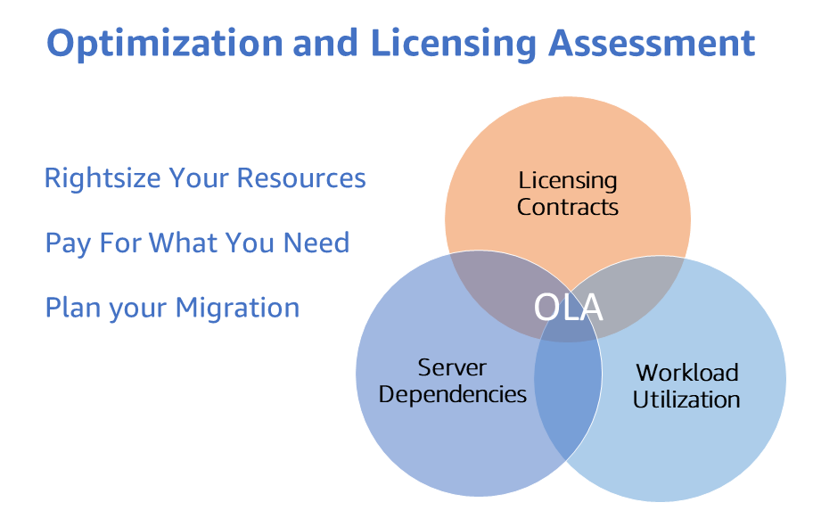

# 기존 EC2 워크로드를 위한 OLA

## AWS OLA 프로그램

[AWS Optimization and Licensing Assessment (AWS OLA)](https://aws.amazon.com/optimization-and-licensing-assessment/)는 워크로드를 클라우드로 마이그레이션하고 리소스를 비용 최적화하기 위한 최적의 접근 방식을 고객에게 제공합니다. 이 무상 프로그램은 고객이 신규 및 기존 워크로드를 분석하고, 온프레미스 및 클라우드 환경을 평가하여 리소스 할당, 서드파티 라이선싱, 애플리케이션 종속성을 최적화하며, 리소스 효율성을 향상시키고 잠재적으로 컴퓨팅 지출을 절감하도록 돕기 위한 것입니다.

이 프로세스에서 수집된 데이터를 통해 AWS OLA 프로그램은 고객이 클라우드 여정과 마이그레이션에 대해 정보에 기반한 결정을 내릴 수 있는 포괄적인 보고서를 제공합니다. 이 보고서는 실제 리소스 사용량, 기존 라이선싱 자격 및 유연한 라이선싱 옵션을 통한 잠재적 비용 절감을 기반으로 배포 옵션을 모델링합니다.

AWS OLA 프로그램의 이점은 다음과 같습니다:

- 도구 기반 검색 접근 방식으로 워크로드에 대한 **리소스 할당 적정화**. 이를 통해 컴퓨팅 리소스에 대한 인사이트를 제공하고 각 워크로드에 가장 적합한 Amazon Elastic Compute Cloud (Amazon EC2), Amazon Relational Database Service (Amazon RDS) 또는 VMware Cloud on AWS 인스턴스 크기와 유형을 식별하는 데 도움을 줍니다.
- 클라우드 인프라 최적화를 통한 **비용 절감**은 핵심 측면 중 하나입니다.
- 라이선스 포함 또는 BYOL 인스턴스를 포함한 라이선싱 시나리오를 모델링하여 계절적 워크로드 관리와 민첩한 실험을 위한 유연성을 제공하고 **최적화된 라이선싱 옵션을 탐색**하여 불필요한 라이선싱 비용을 제거합니다.



## 기존 EC2 워크로드를 위한 AWS OLA

AWS OLA (Optimization and Licensing Assessment)는 '**AWS OLA for EEC2**'라고 불리는 기존 EC2 워크로드의 비용 최적화에 초점을 맞추고 있습니다 - **기존 EC2 워크로드(Existing EC2 Workloads)**에 대한 AWS OLA 평가입니다.

AWS OLA for EEC2는 [AWS Enterprise Support](https://aws.amazon.com/premiumsupport/plans/enterprise/) 플랜에 등록된 고객에게 Amazon EC2 적정 크기 조정 권장 사항을 제공하기 위해 [AWS Compute Optimizer](https://aws.amazon.com/compute-optimizer/)를 활용합니다. OLA for EEC2는 간소화된 프로세스를 통한 셀프 서비스 참여로, AWS OLA 팀이 평가 보고서로 권장 사항을 준비하고 해당 AWS 계정 팀이 Amazon EC2 적정 크기 조정 및 비용 최적화를 위해 해당 결과를 고객에게 제시합니다. Amazon EC2 적정 크기 조정 권장 사항 외에도, AWS OLA는 BYOL(Bring Your Own License) 및 License Included Microsoft SQL Server 인스턴스에 대한 Microsoft SQL Server 최적화 전략도 제공합니다. OLA for EEC2는 1) 더 낮은 CPU 권장 사항으로 Microsoft SQL Server on EC2 인스턴스의 CPU 구성 최적화, 2) 라이선스 가능한 SQL 에디션(Enterprise/Standard)을 실행하는 비프로덕션 서버를 무료 SQL Developer 에디션으로 다운그레이드하여 Microsoft SQL Server 지출을 줄이는 보충 전략을 제공합니다.

평가를 수행하기 위해 AWS OLA for EEC2 프로세스는 메모리 및 CPU 사용률(Amazon CloudWatch 및 CloudWatch 에이전트를 통해)과 같은 메트릭을 포함하여 고객의 AWS 계정에서 환경 파라미터를 수집합니다. 필요한 파라미터가 수집되면, AWS OLA 팀이 집계된 데이터를 사용하여 권장 사항을 준비하고 나중에 고객에게 제시할 수 있는 PPT 데크와 Excel 보고서를 AWS TAM 및 계정 팀에 제시합니다. 보고서에서 제공하는 인사이트는 고객이 기존 Amazon EC2 지출을 최적화하고 워크로드에 대한 라이선싱 최적화 전략을 탐색하는 데 도움이 됩니다.

## AWS OLA for EEC2 평가

Enterprise Support를 보유한 모든 AWS 고객은 무상 Optimization and Licensing Assessment (OLA) for Existing EC2 Workloads를 통해 기존 Amazon EC2 인스턴스(Linux 및 Windows) 비용을 최적화할 수 있습니다. 비용 없이 AWS OLA for EEC2 평가를 받으려면 AWS 계정 팀에 문의하세요.

## 정확한 적정 크기 조정을 위한 Amazon CloudWatch 메모리 메트릭

AWS OLA for EEC2는 Amazon EC2 적정 크기 조정을 위한 평가 보고서를 제공하지만, [Amazon CloudWatch](https://aws.amazon.com/cloudwatch/)가 제공하는 인사이트는 고객에게 더 정확한 리소스 적정 크기 조정을 위해 메모리 사용률 메트릭을 통합하는 가치를 이해하게 합니다. 따라서 AWS OLA for EEC2 프로그램과 함께 Amazon CloudWatch 메모리 메트릭 모니터링을 장려하고 촉진함으로써, 고객은 AWS 환경에 대한 더 효과적인 리소스 최적화 권장 사항을 받고 워크로드 리소스 소비에 대한 더 넓은 관점을 얻을 수 있습니다. 이를 통해 워크로드의 비용을 절감하고 성능을 향상시킬 수 있습니다.

Amazon EC2 인스턴스는 기본적으로 Amazon CloudWatch에 여러 메트릭을 전송합니다. 그러나 메모리 메트릭은 Amazon EC2가 제공하는 기본 메트릭에 포함되지 않습니다. Amazon EC2의 메모리 메트릭을 알면 EC2 인스턴스의 현재 메모리 사용률을 이해하여 인스턴스가 과소 프로비저닝되거나 과다 프로비저닝되지 않도록 할 수 있습니다. Amazon EC2 인스턴스의 과소 프로비저닝은 일반적으로 시스템 또는 애플리케이션의 성능을 저하시키며, 과다 프로비저닝은 불필요한 지출을 초래합니다. 빅데이터 분석, 인메모리 데이터베이스, 실시간 스트리밍과 같은 메모리 집약적 애플리케이션은 운영 가시성을 위해 인스턴스의 메모리 사용률을 모니터링해야 합니다.


### Amazon EC2 인스턴스에서 메모리 메트릭 수집

[Amazon EC2 인스턴스](https://aws.amazon.com/ec2/)에서 메모리 메트릭을 수집하기 위한 대략적인 단계는 다음과 같습니다.

- 다음 권한을 가진 AWS Identity and Access Management (IAM) 역할 생성:
  - Amazon EC2 인스턴스가 Systems Manager에 의해 관리되는 경우 필요한 [Amazon Systems Manager](https://aws.amazon.com/systems-manager/)로 Amazon EC2 인스턴스를 관리하기 위한 권한. [AWS Systems Manager Agent (SSM Agent)](https://docs.aws.amazon.com/systems-manager/latest/userguide/ssm-agent.html)는 인스턴스가 AWS Systems Manager와 통신하고 원격 명령과 스크립트를 실행할 수 있도록 Amazon EC2 인스턴스에 필요합니다. AWS Systems Manager Agent (SSM Agent)는 Amazon EC2 인스턴스에 설치되어 실행되는 Amazon 소프트웨어로, Amazon Systems Manager 서비스가 EC2 인스턴스를 관리형 인스턴스로 업데이트, 관리, 구성할 수 있게 합니다. SSM 에이전트는 Systems Manager 서비스로부터 요청을 수신하고 처리하며 상태 및 실행 정보를 다시 전송합니다. AWS Systems Manager Agent (SSM Agent)는 기본적으로 AWS가 제공하는 [일부 Amazon Machine Images (AMI)에 사전 설치](https://docs.aws.amazon.com/systems-manager/latest/userguide/ami-preinstalled-agent.html)되어 있습니다.
  - CloudWatch 에이전트 마법사를 사용하여 CloudWatch 에이전트 구성 파일을 생성하는 경우, 선택적으로 Systems Manager Parameter Store를 구성 파일을 저장하기 위한 안전한 공통 위치로 사용할 수 있습니다. 이 경우 CloudWatch Agent는 구성 파일을 쓰기 위한 [Systems Manager Parameter Store](https://aws.amazon.com/systems-manager/features/#Parameter_Store) 쓰기 접근 및 읽기 접근이 필요합니다.
  - [CloudWatch 에이전트](https://docs.aws.amazon.com/AmazonCloudWatch/latest/monitoring/Install-CloudWatch-Agent.html)가 Amazon CloudWatch에 데이터(메트릭 및 로그)를 쓰기 위한 권한
- Amazon EC2 인스턴스를 시작하고 이전 단계에서 생성한 IAM 역할을 할당합니다. 이 IAM 역할에 대해서는 아래 부록 [1]의 Trust Policy와 부록 [2]의 Amazon 관리형 정책 - AmazonSSMManagedInstanceCore, CloudWatchAgentAdminPolicy 및 CloudWatchAgentServerPolicy(JSON 형식의 권한 포함)를 참조하세요.
- 필요한 EC2 인스턴스(Windows 또는 Linux)에 [수동으로](https://docs.aws.amazon.com/AmazonCloudWatch/latest/monitoring/installing-cloudwatch-agent-commandline.html) 또는 [Systems Manager Run Command](https://docs.aws.amazon.com/AmazonCloudWatch/latest/monitoring/installing-cloudwatch-agent-ssm.html)를 사용하여 CloudWatch 에이전트를 설치합니다.
- 메모리 메트릭을 수집하여 Amazon CloudWatch에 쓰도록 CloudWatch 에이전트를 구성합니다.


- CloudWatch 콘솔에서 수집된 [메트릭](https://docs.aws.amazon.com/AmazonCloudWatch/latest/monitoring/viewing_metrics_with_cloudwatch.html)과 [로그](https://docs.aws.amazon.com/AmazonCloudWatch/latest/logs/AnalyzingLogData.html)를 확인합니다.
- CloudWatch Logs Insights를 사용하여 로그 데이터를 분석합니다


### Amazon EC2 인스턴스에서 대규모 메모리 메트릭 수집

다음 단계를 따라 하나 이상의 Amazon EC2 인스턴스에 CloudWatch 에이전트를 설치하고 Amazon CloudWatch로의 시그널 수집(메트릭 및 로그)을 구성할 수 있습니다.

- Remote Desktop 또는 SSH를 사용하여 Amazon EC2 인스턴스(Windows 또는 Linux)에 연결합니다(CloudWatch 에이전트 구성 파일 준비를 위해 한 번 필요).
- CloudWatch Agent Configuration Wizard를 실행하여 메트릭 및 로그 수집을 설정합니다
  - CPU, 메모리, 디스크 등 호스트 메트릭 구성
  - 선택적으로 모니터링할 사용자 지정 로그 파일 추가(예: IIS 로그, Apache 로그)
  - 선택적으로 Windows Event 로그 모니터링
  - 동일한 구성을 더 많은 Amazon EC2 인스턴스에 적용할 수 있는 경우 Systems Manager Parameter Store에 구성을 저장
- Systems Manager Run Command를 사용하여 다른 EC2 인스턴스에 CloudWatch Agent 구성을 적용합니다. [AmazonCloudWatch-ManageAgent](https://docs.aws.amazon.com/prescriptive-guidance/latest/implementing-logging-monitoring-cloudwatch/create-store-cloudwatch-configurations.html#store-cloudwatch-configuration-s3) Systems Manager Command 문서를 사용하여 여러 EC2 인스턴스에서 단일 실행으로 CloudWatch 구성을 업데이트할 수 있습니다.

### Amazon EC2 인스턴스에서 메모리 메트릭 수집 자동화

다음 단계를 따라 Amazon CloudWatch로의 시그널 수집(메트릭 및 로그)을 대규모로 자동화, 조율 및 관리할 수 있습니다. [AWS CloudFormation](https://aws.amazon.com/cloudformation/) 템플릿을 사용하여 다음 작업을 수행할 수 있습니다:

- Systems Manager 자동화가 사용자를 대신하여 Amazon EC2 인스턴스에서 런북을 실행할 수 있도록 하는 IAM 실행 역할 생성
- CloudWatch 에이전트가 Amazon CloudWatch에 데이터(메트릭 및 로그)를 쓸 수 있는 권한이 있는 IAM 역할 설정
- Amazon EC2 인스턴스에 CloudWatch 에이전트를 설치하고 구성하기 위한 [사용자 지정 런북](https://docs.aws.amazon.com/systems-manager/latest/userguide/automation-documents.html)을 빌드합니다. 아래 부록 [3]을 참조하세요. CloudWatch Agent를 설치하고 기본 메트릭 또는 Amazon Systems Manager Parameter Store의 파라미터로 CloudWatch Agent를 구성하는 데 사용할 수 있는 사용자 지정 런북 문서의 예입니다.
- Systems Manager Parameter Store에 CloudWatch 에이전트 구성 파일을 업로드합니다.

### 참고 자료

- [Collect Metrics and Logs from Amazon EC2 instances with the CloudWatch Agent](https://www.youtube.com/watch?v=vAnIhIwE5hY)
- [Setup memory metrics for Amazon EC2 instances using AWS Systems Manager](https://aws.amazon.com/blogs/mt/setup-memory-metrics-for-amazon-ec2-instances-using-aws-systems-manager/)

### 부록

[1] Amazon EC2가 역할을 맡기 위한 **Trust Policy**

```json
{
  "Version": "2012-10-17",
  "Statement": [
    {
      "Effect": "Allow",
      "Action": ["sts:AssumeRole"],
      "Principal": {
        "Service": ["ec2.amazonaws.com"]
      }
    }
  ]
}
```

[2] [AmazonSSMManagedInstanceCore](https://docs.aws.amazon.com/aws-managed-policy/latest/reference/AmazonSSMManagedInstanceCore.html) - AWS Systems Manager 서비스 핵심 기능을 활성화하기 위한 Amazon EC2 역할용 AWS 관리형 정책.

```json
{
  "Version": "2012-10-17",
  "Statement": [
    {
      "Effect": "Allow",
      "Action": [
        "ssm:DescribeAssociation",
        "ssm:GetDeployablePatchSnapshotForInstance",
        "ssm:GetDocument",
        "ssm:DescribeDocument",
        "ssm:GetManifest",
        "ssm:GetParameter",
        "ssm:GetParameters",
        "ssm:ListAssociations",
        "ssm:ListInstanceAssociations",
        "ssm:PutInventory",
        "ssm:PutComplianceItems",
        "ssm:PutConfigurePackageResult",
        "ssm:UpdateAssociationStatus",
        "ssm:UpdateInstanceAssociationStatus",
        "ssm:UpdateInstanceInformation"
      ],
      "Resource": "*"
    },
    {
      "Effect": "Allow",
      "Action": [
        "ssmmessages:CreateControlChannel",
        "ssmmessages:CreateDataChannel",
        "ssmmessages:OpenControlChannel",
        "ssmmessages:OpenDataChannel"
      ],
      "Resource": "*"
    },
    {
      "Effect": "Allow",
      "Action": [
        "ec2messages:AcknowledgeMessage",
        "ec2messages:DeleteMessage",
        "ec2messages:FailMessage",
        "ec2messages:GetEndpoint",
        "ec2messages:GetMessages",
        "ec2messages:SendReply"
      ],
      "Resource": "*"
    }
  ]
}
```

[CloudWatchAgentAdminPolicy](https://docs.aws.amazon.com/aws-managed-policy/latest/reference/CloudWatchAgentAdminPolicy.html) - AmazonCloudWatchAgent를 사용하는 데 필요한 전체 권한이 포함된 Amazon 관리형 정책

```json
{
  "Version": "2012-10-17",
  "Statement": [
    {
      "Sid": "CWACloudWatchPermissions",
      "Effect": "Allow",
      "Action": [
        "cloudwatch:PutMetricData",
        "ec2:DescribeTags",
        "logs:PutLogEvents",
        "logs:PutRetentionPolicy",
        "logs:DescribeLogStreams",
        "logs:DescribeLogGroups",
        "logs:CreateLogStream",
        "logs:CreateLogGroup",
        "xray:PutTraceSegments",
        "xray:PutTelemetryRecords",
        "xray:GetSamplingRules",
        "xray:GetSamplingTargets",
        "xray:GetSamplingStatisticSummaries"
      ],
      "Resource": "*"
    },
    {
      "Sid": "CWASSMPermissions",
      "Effect": "Allow",
      "Action": ["ssm:GetParameter", "ssm:PutParameter"],
      "Resource": "arn:aws:ssm:*:*:parameter/AmazonCloudWatch-*"
    }
  ]
}
```

[CloudWatchAgentServerPolicy](https://docs.aws.amazon.com/aws-managed-policy/latest/reference/CloudWatchAgentServerPolicy.html) - 서버에서 AmazonCloudWatchAgent를 사용하는 데 필요한 전체 권한이 포함된 Amazon 관리형 정책

```json
{
  "Version": "2012-10-17",
  "Statement": [
    {
      "Sid": "CWACloudWatchServerPermissions",
      "Effect": "Allow",
      "Action": [
        "cloudwatch:PutMetricData",
        "ec2:DescribeVolumes",
        "ec2:DescribeTags",
        "logs:PutLogEvents",
        "logs:PutRetentionPolicy",
        "logs:DescribeLogStreams",
        "logs:DescribeLogGroups",
        "logs:CreateLogStream",
        "logs:CreateLogGroup",
        "xray:PutTraceSegments",
        "xray:PutTelemetryRecords",
        "xray:GetSamplingRules",
        "xray:GetSamplingTargets",
        "xray:GetSamplingStatisticSummaries"
      ],
      "Resource": "*"
    },
    {
      "Sid": "CWASSMServerPermissions",
      "Effect": "Allow",
      "Action": ["ssm:GetParameter"],
      "Resource": "arn:aws:ssm:*:*:parameter/AmazonCloudWatch-*"
    }
  ]
}
```

[3] CloudWatch Agent를 설치하고 기본 메트릭 또는 Amazon Systems Manager Parameter Store의 파라미터로 CloudWatch Agent를 구성하는 데 사용할 수 있는 사용자 지정 런북 문서 예시

```
#-------------------------------------------------
# CloudWatch 에이전트를 설치하고 구성하기 위한 복합 문서 및 State Manager 연결
#-------------------------------------------------
InstallAndConfigureCloudWatchAgent:
Type: AWS::SSM::Document
Properties:
    Content:
    schemaVersion: '2.2'
    description: The InstallAndManageCloudWatch command document installs the Amazon CloudWatch agent and manages the configuration of the agent for Amazon EC2 instances.
    parameters:
        action:
        description: The action CloudWatch Agent should take.
        type: String
        default: configure
        allowedValues:
        - configure
        - configure (append)
        - configure (remove)
        - start
        - status
        - stop
        mode:
        description: Controls platform-specific default behavior such as whether to include
            EC2 Metadata in metrics.
        type: String
        default: ec2
        allowedValues:
        - ec2
        - onPremise
        - auto
        optionalConfigurationSource:
        description: Only for 'configure' related actions. Use 'ssm' to apply a ssm parameter
            as config. Use 'default' to apply default config for amazon-cloudwatch-agent.
            Use 'all' with 'configure (remove)' to clean all configs for amazon-cloudwatch-agent.
        type: String
        allowedValues:
        - ssm
        - default
        - all
        default: ssm
        optionalConfigurationLocation:
        description: Only for 'configure' related actions. Only needed when Optional Configuration
            Source is set to 'ssm'. The value should be a ssm parameter name.
        type: String
        default: ''
        allowedPattern: '[a-zA-Z0-9-"~:_@./^(*)!<>?=+]*$'
        optionalRestart:
        description: Only for 'configure' related actions. If 'yes', restarts the agent
            to use the new configuration. Otherwise the new config will only apply on the
            next agent restart.
        type: String
        default: 'yes'
        allowedValues:
        - 'yes'
        - 'no'
    mainSteps:
    - inputs:
        documentParameters:
            name: AmazonCloudWatchAgent
            action: Install
        documentType: SSMDocument
        documentPath: AWS-ConfigureAWSPackage
        name: installCWAgent
        action: aws:runDocument
    - inputs:
        documentParameters:
            mode: '{{mode}}'
            optionalRestart: '{{optionalRestart}}'
            optionalConfigurationSource: '{{optionalConfigurationSource}}'
            optionalConfigurationLocation: '{{optionalConfigurationLocation}}'
            action: '{{action}}'
        documentType: SSMDocument
        documentPath: AmazonCloudWatch-ManageAgent
        name: manageCWAgent
        action: aws:runDocument
    DocumentFormat: YAML
    DocumentType: Command
    TargetType: /AWS::EC2::Instance

CloudWatchAgentAssociation:
Type: AWS::SSM::Association
Properties:
    AssociationName: InstallCloudWatchAgent
    Name: !Ref InstallAndConfigureCloudWatchAgent
    ScheduleExpression: rate(7 days)
    Targets:
    - Key: tag:Platform
    Values:
    - Linux
    WaitForSuccessTimeoutSeconds: 300
```
