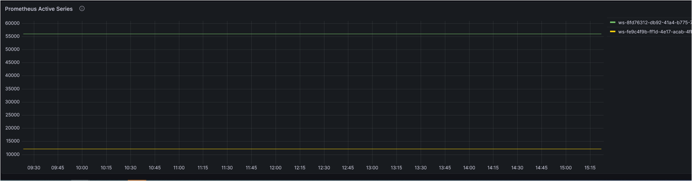

# 실시간 비용 모니터링

Amazon Managed Service for Prometheus는 컨테이너 메트릭을 위한 서버리스, Prometheus 호환 모니터링 서비스로, 컨테이너 환경을 대규모로 안전하게 모니터링하는 것을 더 쉽게 만듭니다. Amazon Managed Service for Prometheus의 요금 모델은 수집된 Metric 샘플, 처리된 Query 샘플, 저장된 Metrics를 기반으로 합니다. 최신 요금 정보는 [여기][pricing]에서 확인할 수 있습니다.

관리형 서비스인 Amazon Managed Service for Prometheus는 워크로드가 확장/축소됨에 따라 운영 메트릭의 수집, 저장, 쿼리를 자동으로 확장합니다. 일부 고객으로부터 `metric 샘플 수집률`과 실시간 비용을 추적하는 방법에 대한 가이드를 요청받았습니다. 이를 어떻게 달성할 수 있는지 살펴보겠습니다.

### 솔루션
Amazon Managed Service for Prometheus는 Amazon CloudWatch에 [사용량 메트릭을 제공(vend)][vendedmetrics]합니다. 이러한 메트릭을 사용하면 Amazon Managed Service for Prometheus workspace에 대한 가시성을 향상시킬 수 있습니다. 제공되는 메트릭은 CloudWatch의 `AWS/Usage` 및 `AWS/Prometheus` 네임스페이스에서 찾을 수 있으며, 이러한 [메트릭][AMPMetrics]은 추가 비용 없이 CloudWatch에서 사용할 수 있습니다. CloudWatch 대시보드를 생성하여 이러한 메트릭을 추가로 탐색하고 시각화할 수 있습니다.

오늘은 Amazon CloudWatch를 Amazon Managed Grafana의 데이터 소스로 사용하고 Grafana에서 대시보드를 구축하여 이러한 메트릭을 시각화합니다. 아키텍처 다이어그램은 다음을 설명합니다.  

- Amazon Managed Service for Prometheus가 Amazon CloudWatch에 제공 메트릭을 게시  

- Amazon CloudWatch가 Amazon Managed Grafana의 데이터 소스로 사용  

- 사용자가 Amazon Managed Grafana에서 생성된 대시보드에 접근

### Amazon Managed Grafana 대시보드

Amazon Managed Grafana에서 생성된 대시보드를 통해 다음을 시각화할 수 있습니다:  

1. workspace별 Prometheus 수집률  
  

2. workspace별 Prometheus 수집률 및 실시간 비용  
   실시간 비용 추적을 위해 공식 [AWS 요금 문서][pricing]에 명시된 `처음 20억 샘플`에 대한 `Metrics Ingested Tier` 요금을 기반으로 `math expression`을 사용합니다. Math operations은 숫자와 시계열을 입력으로 받아 다른 숫자와 시계열로 변환하며, 비즈니스 요구사항에 맞게 추가 사용자 지정하려면 이 [문서][mathexpression]를 참조하세요.  
  

3. workspace별 Prometheus 활성 시계열  

Grafana의 대시보드는 대시보드의 메타데이터를 저장하는 JSON 객체로 표현됩니다. 대시보드 메타데이터에는 대시보드 속성, 패널의 메타데이터, 템플릿 변수, 패널 쿼리 등이 포함됩니다.  

위 대시보드의 **JSON 템플릿**은 <mark>[여기](AmazonPrometheusMetrics.json)에서</mark> 접근할 수 있습니다.

위 대시보드를 통해 workspace별 수집률을 식별하고 Amazon Managed Service for Prometheus의 메트릭 수집률 기반으로 workspace별 실시간 비용을 모니터링할 수 있습니다. 다른 Grafana [대시보드 패널][panels]을 사용하여 요구사항에 맞는 시각적 요소를 구축할 수 있습니다.

[pricing]: https://aws.amazon.com/prometheus/pricing/
[AMPMetrics]: https://docs.aws.amazon.com/prometheus/latest/userguide/AMP-CW-usage-metrics.html
[vendedmetrics]: https://aws.amazon.com/blogs/mt/introducing-vended-metrics-for-amazon-managed-service-for-prometheus/
[mathexpression]: https://grafana.com/docs/grafana/latest/panels-visualizations/query-transform-data/expression-queries/#math
[panels]: https://docs.aws.amazon.com/grafana/latest/userguide/Grafana-panels.html
