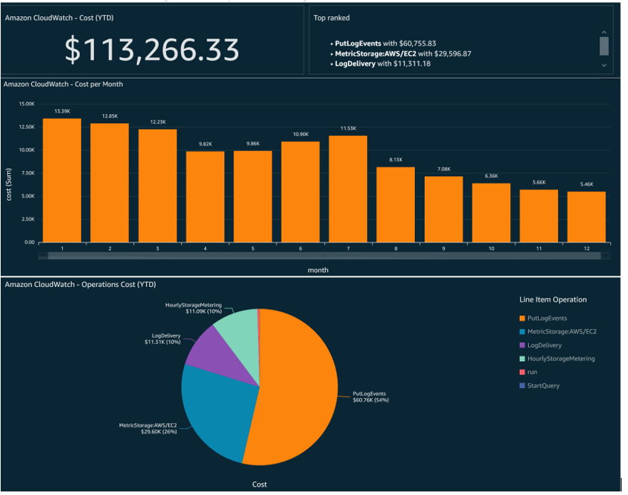

# Amazon CloudWatch

Amazon CloudWatch 비용 및 사용량 시각화를 통해 개별 AWS 계정, AWS 리전, 그리고 GetMetricData, PutLogEvents, GetMetricStream, ListMetrics, MetricStorage, HourlyStorageMetering, ListMetrics 등 모든 CloudWatch 작업의 비용에 대한 인사이트를 얻을 수 있습니다!  
  
CloudWatch 비용 및 사용량 데이터를 시각화하고 분석하려면 사용자 지정 Athena 뷰를 생성해야 합니다. Amazon Athena [뷰][view]는 논리적 테이블로, 원본 CUR 테이블에서 열의 하위 집합을 생성하여 데이터 쿼리를 간소화합니다.

1.	진행하기 전에 [구현 개요][cid-implement]에 언급된 CUR(1단계) 생성과 AWS CloudFormation 템플릿 배포(2단계)를 완료했는지 확인하세요.

2.	다음 쿼리를 사용하여 새 Amazon Athena [뷰][view]를 생성합니다. 이 쿼리는 Organization의 모든 AWS 계정에 걸친 Amazon CloudWatch의 비용과 사용량을 가져옵니다.

        CREATE OR REPLACE VIEW "cloudwatch_cost" AS 
        SELECT
        line_item_usage_type
        , line_item_resource_id
        , line_item_operation
        , line_item_usage_account_id
        , month
        , year
        , "sum"(line_item_usage_amount) "Usage"
        , "sum"(line_item_unblended_cost) cost
        FROM
        database.tablename #replace database.tablename with your database and table name
        WHERE ("line_item_product_code" = 'AmazonCloudWatch')
        GROUP BY 1, 2, 3, 4, 5, 6

### Amazon QuickSight 대시보드 생성

이제 Amazon CloudWatch의 비용과 사용량을 시각화하기 위한 QuickSight 대시보드를 생성해 보겠습니다.  

1.	AWS Management Console에서 QuickSight 서비스로 이동한 다음 오른쪽 상단에서 AWS 리전을 선택합니다. QuickSight Dataset은 Amazon Athena 테이블과 동일한 AWS 리전에 있어야 합니다.
2.	QuickSight가 Amazon S3 및 AWS Athena에 [접근][access]할 수 있는지 확인합니다.
3.	이전에 생성한 Amazon Athena 뷰를 데이터 소스로 선택하여 [QuickSight Dataset을 생성][create-dataset]합니다. 이 절차를 사용하여 매일 Dataset을 [새로 고침 예약][schedule-refresh]합니다.
4.	QuickSight [분석][analysis]을 생성합니다.
5.	필요에 맞는 QuickSight [시각적 요소][visuals]를 생성합니다. 
6.	필요에 맞게 시각적 요소를 [포맷][format]합니다. 
7.	이제 분석에서 대시보드를 [게시][publish]할 수 있습니다.
8.	개인 또는 그룹에게 일회성 또는 일정에 따라 [보고서][report] 형식으로 대시보드를 전송할 수 있습니다.

다음 **QuickSight 대시보드**는 AWS Organizations의 모든 AWS 계정에 걸친 Amazon CloudWatch 비용과 사용량을 GetMetricData, PutLogEvents, GetMetricStream, ListMetrics, MetricStorage, HourlyStorageMetering, ListMetrics 등의 CloudWatch 작업과 함께 보여줍니다.

위 대시보드를 통해 Organization 전체의 AWS 계정에서 Amazon CloudWatch의 비용을 식별할 수 있습니다. 다른 QuickSight [시각적 유형][types]을 사용하여 요구사항에 맞는 다양한 대시보드를 구축할 수 있습니다.

[view]: https://athena-in-action.workshop.aws/30-basics/303-create-view.html
[access]: https://docs.aws.amazon.com/quicksight/latest/user/accessing-data-sources.html
[create-dataset]: https://docs.aws.amazon.com/quicksight/latest/user/create-a-data-set-athena.html
[schedule-refresh]: https://docs.aws.amazon.com/quicksight/latest/user/refreshing-imported-data.html
[analysis]: https://docs.aws.amazon.com/quicksight/latest/user/creating-an-analysis.html
[visuals]: https://docs.aws.amazon.com/quicksight/latest/user/creating-a-visual.html
[format]: https://docs.aws.amazon.com/quicksight/latest/user/formatting-a-visual.html
[publish]: https://docs.aws.amazon.com/quicksight/latest/user/creating-a-dashboard.html
[report]: https://docs.aws.amazon.com/quicksight/latest/user/sending-reports.html
[types]: https://docs.aws.amazon.com/quicksight/latest/user/working-with-visual-types.html
[cid-implement]: ../../../guides/cost/cost-visualization/cost.md#implementation
