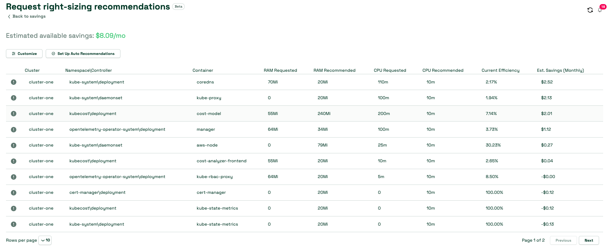

# Kubecost 사용하기
Kubecost는 Kubernetes 환경에서 지출 및 리소스 효율성에 대한 가시성을 고객에게 제공합니다. 대략적으로, Amazon EKS 비용 모니터링은 오픈소스 모니터링 시스템이자 시계열 데이터베이스인 Prometheus를 포함하는 Kubecost로 배포됩니다. Kubecost는 Prometheus에서 메트릭을 읽은 다음 비용 할당 계산을 수행하고 메트릭을 다시 Prometheus에 씁니다. 마지막으로, Kubecost 프론트엔드가 Prometheus에서 메트릭을 읽어 Kubecost 사용자 인터페이스(UI)에 표시합니다. 아키텍처는 다음 다이어그램으로 설명됩니다:


## Kubecost를 사용하는 이유
고객이 애플리케이션을 현대화하고 Amazon EKS를 사용하여 워크로드를 배포하면서, 애플리케이션 실행에 필요한 컴퓨팅 리소스를 통합하여 효율성을 얻습니다. 그러나 이러한 사용률 효율성은 애플리케이션 비용 측정이 어려워지는 대가를 수반합니다. 현재 다음 방법 중 하나를 사용하여 테넌트별로 비용을 분배할 수 있습니다:

* 하드 멀티 테넌시 — 전용 AWS 계정에서 별도의 EKS 클러스터를 실행합니다.
* 소프트 멀티 테넌시 — 공유 EKS 클러스터에서 여러 노드 그룹을 실행합니다.
* 소비 기반 과금 — 공유 EKS 클러스터에서 리소스 소비를 사용하여 발생한 비용을 계산합니다.

하드 멀티 테넌시를 사용하면 워크로드가 별도의 EKS 클러스터에 배포되어 각 테넌트의 지출을 결정하기 위한 보고서를 실행할 필요 없이 클러스터와 종속성에 대해 발생한 비용을 식별할 수 있습니다.
소프트 멀티 테넌시를 사용하면 [Node Selectors](https://kubernetes.io/docs/concepts/scheduling-eviction/assign-pod-node/#nodeselector) 및 [Node Affinity](https://kubernetes.io/docs/concepts/scheduling-eviction/assign-pod-node/#affinity-and-anti-affinity)와 같은 Kubernetes 기능을 사용하여 Kubernetes 스케줄러가 전용 노드 그룹에서 테넌트의 워크로드를 실행하도록 지시할 수 있습니다. 노드 그룹의 EC2 인스턴스에 식별자(제품 이름 또는 팀 이름 등)로 태그를 지정하고 [태그](https://docs.aws.amazon.com/awsaccountbilling/latest/aboutv2/cost-alloc-tags.html)를 사용하여 비용을 분배할 수 있습니다.
위 두 접근 방식의 단점은 미사용 용량이 발생할 수 있으며 밀도 높은 클러스터를 실행할 때 오는 비용 절감을 완전히 활용하지 못할 수 있다는 것입니다. Elastic Load Balancing, 네트워크 전송 비용과 같은 공유 리소스의 비용을 할당하는 방법이 여전히 필요합니다.

멀티 테넌트 Kubernetes 클러스터에서 비용을 추적하는 가장 효율적인 방법은 워크로드가 소비한 리소스 양을 기반으로 발생한 비용을 분배하는 것입니다. 이 패턴을 사용하면 다른 워크로드가 노드를 공유할 수 있어 EC2 인스턴스의 사용률을 최대화하고 노드의 pod 밀도를 높일 수 있습니다. 그러나 워크로드 또는 네임스페이스별 비용 계산은 어려운 작업입니다. 워크로드의 비용 책임을 이해하려면 시간 범위 동안 소비되거나 예약된 모든 리소스를 집계하고 리소스 비용과 사용 기간을 기반으로 요금을 평가해야 합니다. 이것이 바로 Kubecost가 해결하고자 하는 정확한 과제입니다.

:::tip
    [One Observability Workshop](https://catalog.workshops.aws/observability/en-US/aws-managed-oss/amp/ingest-kubecost-metrics)에서 Kubecost에 대한 실습 경험을 해보세요.
:::

## 권장 사항
### 비용 할당
Kubecost Cost Allocation 대시보드를 사용하면 네임스페이스, k8s 레이블, 서비스 등 모든 기본 Kubernetes 개념에 걸쳐 할당된 지출과 최적화 기회를 빠르게 확인할 수 있습니다. 또한 팀, 제품/프로젝트, 부서, 환경과 같은 조직 개념에 비용을 할당할 수도 있습니다. 날짜 범위, 필터를 수정하여 특정 워크로드에 대한 인사이트를 도출하고 보고서를 저장할 수 있습니다. Kubernetes 비용을 최적화하려면 효율성과 클러스터 유휴 비용에 주의를 기울여야 합니다.


### 효율성

Pod 리소스 효율성은 주어진 시간 창에서 리소스 사용률 대 리소스 요청의 비율로 정의됩니다. 비용 가중치가 적용되며 다음과 같이 표현할 수 있습니다:
```
(((CPU Usage / CPU Requested) * CPU Cost) + ((RAM Usage / RAM Requested) * RAM Cost)) / (RAM Cost + CPU Cost)
```
여기서 CPU Usage = rate(container_cpu_usage_seconds_total) (시간 창에 걸쳐), RAM Usage = avg(container_memory_working_set_bytes) (시간 창에 걸쳐)

AWS가 명시적인 RAM, CPU 또는 GPU 가격을 제공하지 않으므로, Kubecost 모델은 제공된 기본 CPU, GPU 및 RAM 가격 입력의 비율로 대체합니다. 이러한 파라미터의 기본값은 클라우드 공급자의 한계 리소스 요율을 기반으로 하지만 Kubecost 내에서 사용자 지정할 수 있습니다. 이러한 기본 리소스(RAM/CPU/GPU) 가격은 각 구성 요소의 합계가 공급자의 과금 요율을 기반으로 프로비저닝된 노드의 총 가격과 동일하도록 정규화됩니다.

각 서비스 팀은 최대 효율성을 향해 나아가고 목표를 달성하기 위해 워크로드를 미세 조정할 책임이 있습니다.

### 유휴 비용
클러스터 유휴 비용은 할당된 리소스의 비용과 해당 리소스가 실행되는 하드웨어 비용 간의 차이로 정의됩니다. 할당은 사용량과 요청의 최대값으로 정의됩니다. 다음과 같이 표현할 수도 있습니다:
```
idle_cost = sum(node_cost) - (cpu_allocation_cost + ram_allocation_cost + gpu_allocation_cost)
```
여기서 allocation = max(request, usage)

따라서 유휴 비용은 Kubernetes 스케줄러가 기존 워크로드를 방해하지 않고 pod를 예약할 수 있지만 현재 예약되지 않은 공간의 비용으로 생각할 수도 있습니다. 구성 방법에 따라 워크로드, 클러스터 또는 노드별로 분배할 수 있습니다.


### 네트워크 비용

Kubecost는 네트워크 전송 비용을 해당 비용을 발생시키는 워크로드에 할당하기 위해 최선을 다합니다. 네트워크 비용을 정확하게 결정하는 방법은 [AWS Cloud Integration](https://www.ibm.com/docs/en/kubecost/self-hosted/3.x?topic=integration-aws-cloud-using-irsaeks-pod-identities)과 [Network costs daemonset](https://docs.kubecost.com/install-and-configure/advanced-configuration/network-costs-configuration)을 조합하여 사용하는 것입니다.

효율성 점수와 유휴 비용을 고려하여 클러스터를 완전한 잠재력으로 활용하도록 워크로드를 미세 조정해야 합니다. 이것이 다음 주제인 클러스터 적정 크기 조정으로 이어집니다.

### 워크로드 적정 크기 조정

Kubecost는 Kubernetes 네이티브 메트릭을 기반으로 워크로드에 대한 적정 크기 조정 권장 사항을 제공합니다. Kubecost UI의 savings 패널이 시작하기에 좋은 곳입니다.




Kubecost는 다음에 대한 권장 사항을 제공할 수 있습니다:

* 과다 프로비저닝 및 과소 프로비저닝된 컨테이너 요청을 확인하여 컨테이너 요청 적정 크기 조정
* 미사용 용량에 대한 과다 지출을 중지하기 위해 클러스터 노드의 수와 크기 조정
* 의미 있는 트래픽 비율을 송수신하지 않는 pod의 축소, 삭제/크기 조정
* 스팟 노드에 적합한 워크로드 식별
* pod가 사용하지 않는 볼륨 식별


Kubecost에는 Cluster Controller 구성 요소가 활성화된 경우 컨테이너 리소스 요청에 대한 권장 사항을 자동으로 구현할 수 있는 프리릴리스 기능도 있습니다. 자동 요청 적정 크기 조정을 사용하면 과도한 YAML을 테스트하거나 복잡한 kubectl 명령 없이 전체 클러스터에 걸쳐 리소스 할당을 즉시 최적화할 수 있습니다. 클러스터에서 리소스 과다 할당을 쉽게 제거할 수 있으며, 이는 클러스터 적정 크기 조정 및 기타 최적화를 통한 대폭적인 절감의 길을 열어줍니다.

### Kubecost를 Amazon Managed Service for Prometheus와 통합

Kubecost는 시계열 데이터베이스로 오픈소스 Prometheus 프로젝트를 활용하고 Prometheus의 데이터를 후처리하여 비용 할당 계산을 수행합니다. 클러스터 크기와 워크로드 규모에 따라 Prometheus 서버가 메트릭을 스크레이프하고 저장하는 것이 부담될 수 있습니다. 이 경우 관리형 Prometheus 호환 모니터링 서비스인 Amazon Managed Service for Prometheus를 사용하여 메트릭을 안정적으로 저장하고 대규모로 Kubernetes 비용을 쉽게 모니터링할 수 있습니다.

[Kubecost 서비스 계정을 위한 IAM 역할](https://docs.aws.amazon.com/eks/latest/userguide/iam-roles-for-service-accounts.html)을 설정해야 합니다. 클러스터의 OIDC 공급자를 사용하여 클러스터의 서비스 계정에 IAM 권한을 부여합니다. kubecost-cost-analyzer 및 kubecost-prometheus-server 서비스 계정에 적절한 권한을 부여해야 합니다. 이러한 권한은 workspace에서 메트릭을 보내고 검색하는 데 사용됩니다. 명령줄에서 다음 명령을 실행하세요:

```
eksctl create iamserviceaccount \ 
--name kubecost-cost-analyzer \ 
--namespace kubecost \ 
--cluster <CLUSTER_NAME> \
--region <REGION> \ 
--attach-policy-arn arn:aws:iam::aws:policy/AmazonPrometheusQueryAccess \ 
--attach-policy-arn arn:aws:iam::aws:policy/AmazonPrometheusRemoteWriteAccess \ 
--override-existing-serviceaccounts \ 
--approve 

eksctl create iamserviceaccount \ 
--name kubecost-prometheus-server \ 
--namespace kubecost \ 
--cluster <CLUSTER_NAME> --region <REGION> \ 
--attach-policy-arn arn:aws:iam::aws:policy/AmazonPrometheusQueryAccess \ 
--attach-policy-arn arn:aws:iam::aws:policy/AmazonPrometheusRemoteWriteAccess \ 
--override-existing-serviceaccounts \ 
--approve

```
`CLUSTER_NAME`은 Kubecost를 설치하려는 Amazon EKS 클러스터의 이름이며, "REGION"은 Amazon EKS 클러스터의 리전입니다.

완료되면 아래와 같이 Kubecost helm 차트를 업그레이드해야 합니다:
```
helm upgrade -i kubecost \
oci://public.ecr.aws/kubecost/cost-analyzer --version <$VERSION> \
--namespace kubecost --create-namespace \
-f https://tinyurl.com/kubecost-amazon-eks \
-f https://tinyurl.com/kubecost-amp \
--set global.amp.prometheusServerEndpoint=${QUERYURL} \
--set global.amp.remoteWriteService=${REMOTEWRITEURL}
```
### Kubecost UI 접근

Kubecost는 kubectl port-forward, 인그레스 또는 로드 밸런서를 통해 접근할 수 있는 웹 대시보드를 제공합니다. Kubecost 엔터프라이즈 버전은 [SSO/SAML](https://www.ibm.com/docs/en/kubecost/self-hosted/3.x?topic=configuration-user-management-oidc)을 사용한 대시보드 접근 제한과 다양한 수준의 접근 제공도 지원합니다. 예를 들어, 팀의 보기를 자신이 담당하는 제품으로만 제한할 수 있습니다.

AWS 환경에서는 [AWS Load Balancer Controller](https://docs.aws.amazon.com/eks/latest/userguide/aws-load-balancer-controller.html)를 사용하여 Kubecost를 노출하고 인증, 인가, 사용자 관리를 위해 [Amazon Cognito](https://aws.amazon.com/cognito/)를 사용하는 것을 고려하세요. 자세한 내용은 [How to use Application Load Balancer and Amazon Cognito to authenticate users for your Kubernetes web apps](https://aws.amazon.com/blogs/containers/how-to-use-application-load-balancer-and-amazon-cognito-to-authenticate-users-for-your-kubernetes-web-apps/)에서 확인할 수 있습니다.


### 멀티 클러스터 뷰

FinOps 팀은 비즈니스 소유자와 권장 사항을 공유하기 위해 EKS 클러스터를 검토하고 싶어 합니다. 대규모로 운영할 때 각 클러스터에 로그인하여 권장 사항을 확인하는 것은 팀에게 어려움이 됩니다. 멀티 클러스터를 사용하면 전 세계의 모든 집계된 클러스터 비용을 단일 창으로 확인할 수 있습니다. Kubecost는 여러 클러스터가 있는 환경을 위해 세 가지 옵션을 지원합니다: Kubecost Free, Kubecost Business, Kubecost Enterprise. 무료 및 비즈니스 모드에서는 클라우드 과금 조정이 각 클러스터 수준에서 수행됩니다. 엔터프라이즈 모드에서는 클라우드 과금 조정이 Kubecost UI를 제공하고 메트릭이 저장된 공유 버킷을 사용하는 프라이머리 클러스터에서 수행됩니다.
엔터프라이즈 모드를 사용할 때만 메트릭 보존이 무제한이라는 점이 중요합니다.

### 참고 자료
* [Hands-On Kubecost experience on One Observability Workshop](https://catalog.workshops.aws/observability/en-US/aws-managed-oss/amp/ingest-kubecost-metrics)
* [Blog - Integrating Kubecost with Amazon Managed Service for Prometheus](https://aws.amazon.com/blogs/mt/integrating-kubecost-with-amazon-managed-service-for-prometheus/)
