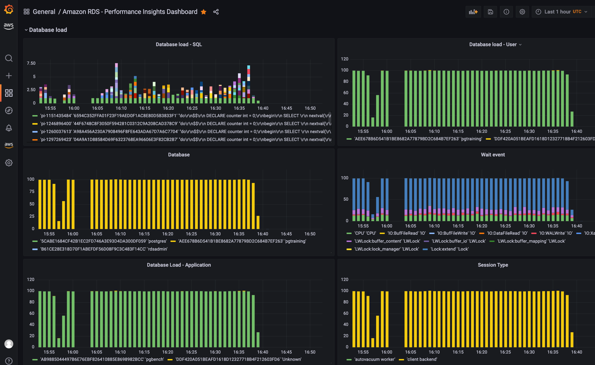

# Amazon RDS 및 Aurora 데이터베이스 모니터링

Amazon RDS 및 Aurora 데이터베이스 클러스터의 안정성, 가용성 및 성능을 유지하는 데 모니터링은 매우 중요한 부분입니다. AWS는 Amazon RDS 및 Aurora 데이터베이스 리소스의 상태를 모니터링하고, 문제가 심각해지기 전에 감지하며, 일관된 사용자 경험을 위해 성능을 최적화하기 위한 여러 도구를 제공합니다. 이 가이드는 데이터베이스가 원활하게 실행되도록 보장하기 위한 Observability 모범 사례를 제공합니다. 

## 성능 가이드라인

모범 사례로서, 워크로드에 대한 기준 성능을 설정하는 것부터 시작하는 것이 좋습니다. DB 인스턴스를 설정하고 일반적인 워크로드로 실행할 때, 모든 성능 메트릭의 평균, 최대, 최소값을 기록하세요. 다양한 시간 간격(예: 1시간, 24시간, 1주, 2주)으로 측정하는 것이 좋습니다. 이를 통해 정상 범위가 어느 정도인지 파악할 수 있습니다. 피크 시간과 비피크 시간의 비교 데이터를 확보하면 더욱 도움이 됩니다. 이후 이 정보를 활용하여 성능이 기준 수준 이하로 떨어지는 시점을 파악할 수 있습니다.
 
## 모니터링 옵션

### Amazon CloudWatch 메트릭

[Amazon CloudWatch](https://docs.aws.amazon.com/AmazonRDS/latest/UserGuide/monitoring-cloudwatch.html)는 [RDS](https://aws.amazon.com/rds/) 및 [Aurora](https://aws.amazon.com/rds/aurora/) 데이터베이스를 모니터링하고 관리하는 데 핵심적인 도구입니다. 데이터베이스 성능에 대한 유용한 인사이트를 제공하며, 문제를 빠르게 식별하고 해결하는 데 도움을 줍니다. Amazon RDS와 Aurora 데이터베이스는 각 활성 데이터베이스 인스턴스에 대해 1분 단위로 CloudWatch에 메트릭을 전송합니다. 모니터링은 기본적으로 활성화되어 있으며, 메트릭은 15일간 보관됩니다. RDS와 Aurora는 **AWS/RDS** 네임스페이스로 인스턴스 수준 메트릭을 Amazon CloudWatch에 게시합니다.

CloudWatch 메트릭을 사용하면 데이터베이스 성능의 추세나 패턴을 파악할 수 있으며, 이 정보를 활용하여 구성을 최적화하고 애플리케이션 성능을 개선할 수 있습니다. 모니터링해야 할 주요 메트릭은 다음과 같습니다:

* **CPU Utilization** - 컴퓨터 처리 용량의 사용 비율입니다.
* **DB Connections** - DB 인스턴스에 연결된 클라이언트 세션 수입니다. 인스턴스 성능 및 응답 시간 저하와 함께 높은 사용자 연결 수가 관찰되면, 데이터베이스 연결 수를 제한하는 것을 고려하세요. DB 인스턴스에 최적인 사용자 연결 수는 인스턴스 클래스와 수행 중인 작업의 복잡도에 따라 달라집니다. 데이터베이스 연결 수를 확인하려면 DB 인스턴스를 파라미터 그룹과 연결하세요.
* **Freeable Memory** - DB 인스턴스에서 사용 가능한 RAM 용량(MB 단위)입니다. 모니터링 탭 메트릭의 빨간 선은 CPU, 메모리, 스토리지 메트릭에 대해 75%로 표시됩니다. 인스턴스 메모리 소비가 이 선을 자주 넘는다면, 워크로드를 점검하거나 인스턴스를 업그레이드해야 합니다.
* **Network throughput** - DB 인스턴스로의 네트워크 트래픽 속도(바이트/초)입니다.
* **Read/Write Latency** - 읽기 또는 쓰기 작업의 평균 소요 시간(밀리초)입니다.
* **Read/Write IOPS** - 초당 평균 디스크 읽기 또는 쓰기 작업 수입니다.
* **Free Storage Space** - DB 인스턴스에서 현재 사용되지 않는 디스크 공간(MB 단위)입니다. 사용된 공간이 전체 디스크 공간의 85% 이상을 지속적으로 유지한다면 디스크 공간 소비를 조사해야 합니다. 인스턴스에서 데이터를 삭제하거나 다른 시스템으로 아카이빙하여 공간을 확보할 수 있는지 검토하세요.


성능 관련 문제를 해결하려면, 먼저 가장 자주 사용되고 비용이 높은 쿼리를 튜닝하는 것이 우선입니다. 이를 통해 시스템 리소스에 대한 부하가 줄어드는지 확인하세요. 자세한 내용은 [쿼리 튜닝](https://docs.aws.amazon.com/AmazonRDS/latest/UserGuide/CHAP_BestPractices.html#CHAP_BestPractices.TuningQueries)을 참조하세요.

쿼리가 튜닝되었음에도 문제가 계속된다면, 데이터베이스 인스턴스 클래스를 업그레이드하는 것을 고려하세요. 더 많은 리소스(CPU, RAM, 디스크 공간, 네트워크 대역폭, I/O 용량)를 갖춘 인스턴스로 업그레이드할 수 있습니다.

그런 다음, 이러한 메트릭이 임계값에 도달하면 알림을 받을 수 있도록 경보를 설정하고, 문제를 가능한 한 빨리 해결하기 위한 조치를 취할 수 있습니다.

CloudWatch 메트릭에 대한 자세한 내용은 [Amazon RDS용 Amazon CloudWatch 메트릭](https://docs.aws.amazon.com/AmazonRDS/latest/UserGuide/rds-metrics.html) 및 [CloudWatch 콘솔 및 AWS CLI에서 DB 인스턴스 메트릭 보기](https://docs.aws.amazon.com/AmazonRDS/latest/UserGuide/metrics_dimensions.html)를 참조하세요.

#### CloudWatch Logs Insights

[CloudWatch Logs Insights](https://docs.aws.amazon.com/AmazonCloudWatch/latest/logs/AnalyzingLogData.html)를 사용하면 Amazon CloudWatch Logs에서 로그 데이터를 대화형으로 검색하고 분석할 수 있습니다. 쿼리를 수행하여 운영 문제에 보다 효율적이고 효과적으로 대응할 수 있습니다. 문제가 발생하면 CloudWatch Logs Insights를 사용하여 잠재적 원인을 식별하고 배포된 수정 사항을 검증할 수 있습니다.

RDS 또는 Aurora 데이터베이스 클러스터의 로그를 CloudWatch에 게시하는 방법은 [Amazon RDS 또는 Aurora for MySQL 인스턴스의 로그를 CloudWatch에 게시](https://repost.aws/knowledge-center/rds-aurora-mysql-logs-cloudwatch)를 참조하세요.

CloudWatch를 사용한 RDS 또는 Aurora 로그 모니터링에 대한 자세한 내용은 [Amazon RDS 로그 파일 모니터링](https://docs.aws.amazon.com/AmazonRDS/latest/UserGuide/USER_LogAccess.html)을 참조하세요.

#### CloudWatch Alarms

데이터베이스 클러스터의 성능 저하를 파악하려면, 주요 성능 메트릭을 정기적으로 모니터링하고 경보를 설정해야 합니다. [Amazon CloudWatch 경보](https://docs.aws.amazon.com/AmazonCloudWatch/latest/monitoring/AlarmThatSendsEmail.html)를 사용하면 지정한 기간 동안 단일 메트릭을 감시할 수 있습니다. 메트릭이 지정된 임계값을 초과하면 Amazon SNS 주제 또는 AWS Auto Scaling 정책으로 알림이 전송됩니다. CloudWatch 경보는 특정 상태에 있다는 이유만으로 작업을 호출하지 않습니다. 상태가 변경되고 지정된 기간 동안 유지되어야 합니다. 경보는 상태 변경이 발생할 때만 작업을 호출합니다. 단순히 경보 상태에 있는 것만으로는 충분하지 않습니다.

CloudWatch 경보를 설정하려면 -

* AWS Management Console로 이동하여 [https://console.aws.amazon.com/rds/](https://console.aws.amazon.com/rds/)에서 Amazon RDS 콘솔을 엽니다.
* 탐색 창에서 Databases를 선택한 다음, DB 인스턴스를 선택합니다.
* Logs & events를 선택합니다.

CloudWatch alarms 섹션에서 Create alarm을 선택합니다.


* Send notifications에서 Yes를 선택하고, Send notifications to에서 New email or SMS topic을 선택합니다.
* Topic name에 알림 이름을 입력하고, With these recipients에 쉼표로 구분된 이메일 주소 및 전화번호 목록을 입력합니다.
* Metric에서 경보 통계 및 설정할 메트릭을 선택합니다.
* Threshold에서 메트릭이 임계값보다 크거나, 작거나, 같아야 하는지를 지정하고 임계값을 입력합니다.
* Evaluation period에서 경보의 평가 기간을 선택합니다. consecutive period(s) of에서 경보가 트리거되기 위해 임계값이 도달해야 하는 기간을 선택합니다.
* Name of alarm에 경보 이름을 입력합니다.
* Create Alarm을 선택합니다.

경보가 CloudWatch alarms 섹션에 표시됩니다.

Multi-AZ DB 클러스터 복제 지연에 대한 Amazon CloudWatch 경보를 생성하는 [예제](https://docs.aws.amazon.com/AmazonRDS/latest/UserGuide/multi-az-db-cluster-cloudwatch-alarm.html)를 참조하세요.

#### 데이터베이스 감사 로그

데이터베이스 감사 로그는 RDS 및 Aurora 데이터베이스에서 수행된 모든 작업에 대한 상세한 기록을 제공하며, 비인가 접근, 데이터 변경 및 기타 잠재적으로 유해한 활동을 모니터링할 수 있습니다. 데이터베이스 감사 로그를 활용하기 위한 모범 사례는 다음과 같습니다:

* 모든 RDS 및 Aurora 인스턴스에 대해 데이터베이스 감사 로그를 활성화하고, 관련 데이터를 모두 캡처하도록 구성합니다.
* Amazon CloudWatch Logs 또는 Amazon Kinesis Data Streams와 같은 중앙 집중식 로그 관리 솔루션을 사용하여 데이터베이스 감사 로그를 수집하고 분석합니다.
* 데이터베이스 감사 로그를 정기적으로 모니터링하여 의심스러운 활동을 확인하고, 문제를 조사하여 가능한 한 빨리 해결합니다.

데이터베이스 감사 로그 구성 방법에 대한 자세한 내용은 [Amazon RDS 및 Aurora의 데이터베이스 활동을 캡처하기 위한 감사 로그 구성](https://aws.amazon.com/blogs/database/configuring-an-audit-log-to-capture-database-activities-for-amazon-rds-for-mysql-and-amazon-aurora-with-mysql-compatibility/)을 참조하세요.

#### 데이터베이스 슬로우 쿼리 및 오류 로그

슬로우 쿼리 로그는 데이터베이스에서 느리게 실행되는 쿼리를 찾는 데 도움을 주며, 느린 원인을 조사하고 필요에 따라 쿼리를 튜닝할 수 있게 해줍니다. 오류 로그는 쿼리 오류를 확인하는 데 도움을 주어, 해당 오류로 인한 애플리케이션의 변경 사항을 파악할 수 있습니다.

Amazon CloudWatch Logs Insights(Amazon CloudWatch Logs에서 로그 데이터를 대화형으로 검색하고 분석할 수 있는 기능)를 사용하여 CloudWatch 대시보드를 생성함으로써 슬로우 쿼리 로그와 오류 로그를 모니터링할 수 있습니다.

Amazon RDS의 오류 로그, 슬로우 쿼리 로그, 일반 로그를 활성화하고 모니터링하는 방법은 [RDS MySQL의 슬로우 쿼리 로그 및 일반 로그 관리](https://repost.aws/knowledge-center/rds-mysql-logs)를 참조하세요. Aurora PostgreSQL의 슬로우 쿼리 로그를 활성화하는 방법은 [PostgreSQL의 슬로우 쿼리 로그 활성화](https://catalog.us-east-1.prod.workshops.aws/workshops/31babd91-aa9a-4415-8ebf-ce0a6556a216/en-US/postgresql-logs/enable-slow-query-log)를 참조하세요.

## Performance Insights 및 운영 체제 메트릭

#### Enhanced Monitoring

[Enhanced Monitoring](https://docs.aws.amazon.com/AmazonRDS/latest/UserGuide/USER_Monitoring.OS.html)을 사용하면 DB 인스턴스가 실행되는 운영 체제(OS)에 대한 세분화된 메트릭을 실시간으로 얻을 수 있습니다.

RDS는 Enhanced Monitoring의 메트릭을 Amazon CloudWatch Logs 계정으로 전달합니다. 기본적으로 이 메트릭은 30일간 저장되며, Amazon CloudWatch의 **RDSOSMetrics** 로그 그룹에 저장됩니다. 1초에서 60초 사이의 세분도를 선택할 수 있습니다. CloudWatch Logs에서 사용자 정의 메트릭 필터를 생성하고 CloudWatch 대시보드에 그래프를 표시할 수 있습니다.


Enhanced Monitoring에는 OS 수준의 프로세스 목록도 포함됩니다. 현재 Enhanced Monitoring은 다음 데이터베이스 엔진에서 사용할 수 있습니다:

* MariaDB
* Microsoft SQL Server
* MySQL
* Oracle
* PostgreSQL

**CloudWatch와 Enhanced Monitoring의 차이점**
CloudWatch는 DB 인스턴스에 대해 하이퍼바이저로부터 CPU 사용률 메트릭을 수집합니다. 반면에 Enhanced Monitoring은 DB 인스턴스의 에이전트로부터 메트릭을 수집합니다. 하이퍼바이저는 가상 머신(VM)을 생성하고 실행합니다. 하이퍼바이저를 사용하면 인스턴스가 메모리와 CPU를 가상으로 공유하여 여러 게스트 VM을 지원할 수 있습니다. 하이퍼바이저 계층이 소량의 작업을 수행하기 때문에 CloudWatch와 Enhanced Monitoring 측정값 사이에 차이가 있을 수 있습니다. DB 인스턴스가 작은 인스턴스 클래스를 사용하는 경우 이 차이가 더 클 수 있습니다. 이 시나리오에서는 단일 물리 인스턴스의 하이퍼바이저 계층에서 더 많은 가상 머신(VM)이 관리될 수 있기 때문입니다.


Enhanced Monitoring에서 사용 가능한 모든 메트릭에 대한 자세한 내용은 [Enhanced Monitoring의 OS 메트릭](https://docs.aws.amazon.com/AmazonRDS/latest/UserGuide/USER_Monitoring-Available-OS-Metrics.html)을 참조하세요.


#### Performance Insights 

[Amazon RDS Performance Insights](https://aws.amazon.com/rds/performance-insights/)는 데이터베이스 성능 튜닝 및 모니터링 기능으로, 데이터베이스의 부하를 빠르게 평가하고 언제 어디서 조치를 취해야 하는지 판단하는 데 도움을 줍니다. Performance Insights 대시보드에서는 DB 클러스터의 데이터베이스 부하를 시각화하고, 대기 이벤트, SQL 문, 호스트 또는 사용자별로 부하를 필터링할 수 있습니다. 증상을 추적하는 대신 근본 원인을 정확히 파악할 수 있습니다. Performance Insights는 애플리케이션 성능에 영향을 주지 않는 경량 데이터 수집 방식을 사용하며, 어떤 SQL 문이 부하를 유발하는지와 그 이유를 쉽게 파악할 수 있습니다.

Performance Insights는 7일간의 무료 성능 이력 보존을 제공하며, 유료로 최대 2년까지 연장할 수 있습니다. RDS 관리 콘솔 또는 AWS CLI에서 Performance Insights를 활성화할 수 있습니다. Performance Insights는 공개 API도 제공하여 고객 및 서드파티가 자체 커스텀 도구에 Performance Insights를 통합할 수 있습니다.

:::note
	현재 RDS Performance Insights는 Aurora(PostgreSQL 호환 및 MySQL 호환 에디션), Amazon RDS for PostgreSQL, MySQL, MariaDB, SQL Server, Oracle에서만 사용할 수 있습니다.
:::

**DBLoad**는 데이터베이스 활성 세션의 평균 수를 나타내는 핵심 메트릭입니다. Performance Insights에서 이 데이터는 **db.load.avg** 메트릭으로 조회됩니다.


Aurora에서 Performance Insights를 사용하는 방법에 대한 자세한 내용은 [Amazon Aurora에서 Performance Insights로 DB 부하 모니터링](https://docs.aws.amazon.com/AmazonRDS/latest/AuroraUserGuide/USER_PerfInsights.html)을 참조하세요.


## 오픈소스 Observability 도구

#### Amazon Managed Grafana
[Amazon Managed Grafana](https://aws.amazon.com/grafana/)는 RDS 및 Aurora 데이터베이스의 데이터를 쉽게 시각화하고 분석할 수 있는 완전 관리형 서비스입니다.

Amazon CloudWatch의 **AWS/RDS 네임스페이스**에는 Amazon RDS 및 Amazon Aurora에서 실행되는 데이터베이스 엔티티에 적용되는 주요 메트릭이 포함되어 있습니다. Amazon Managed Grafana에서 RDS/Aurora 데이터베이스의 상태와 잠재적 성능 문제를 시각화하고 추적하기 위해 CloudWatch 데이터 소스를 활용할 수 있습니다.


현재로서는 CloudWatch에서 기본적인 Performance Insights 메트릭만 사용할 수 있어, 데이터베이스 성능을 분석하고 병목 현상을 식별하기에는 충분하지 않습니다. Amazon Managed Grafana에서 RDS Performance Insight 메트릭을 시각화하고 단일 화면에서 통합 가시성을 확보하기 위해, 고객은 커스텀 Lambda 함수를 사용하여 모든 RDS Performance Insights 메트릭을 수집하고 사용자 정의 CloudWatch 메트릭 네임스페이스에 게시할 수 있습니다. 이러한 메트릭이 Amazon CloudWatch에서 사용 가능해지면, Amazon Managed Grafana에서 시각화할 수 있습니다.

RDS Performance Insights 메트릭을 수집하기 위한 커스텀 Lambda 함수를 배포하려면, 다음 GitHub 리포지토리를 클론하고 install.sh 스크립트를 실행하세요.

```
$ git clone https://github.com/aws-observability/observability-best-practices.git
$ cd sandbox/monitor-aurora-with-grafana

$ chmod +x install.sh
$ ./install.sh
```

위 스크립트는 AWS CloudFormation을 사용하여 커스텀 Lambda 함수와 IAM 역할을 배포합니다. Lambda 함수는 10분마다 자동으로 트리거되어 RDS Performance Insights API를 호출하고, Amazon CloudWatch의 /AuroraMonitoringGrafana/PerformanceInsights 커스텀 네임스페이스에 사용자 정의 메트릭을 게시합니다.



커스텀 Lambda 함수 배포 및 Grafana 대시보드에 대한 자세한 단계별 정보는 [Amazon Managed Grafana에서의 Performance Insights](https://aws.amazon.com/blogs/mt/monitoring-amazon-rds-and-amazon-aurora-using-amazon-managed-grafana/)를 참조하세요.

데이터베이스의 의도하지 않은 변경 사항을 신속하게 식별하고 경보를 통해 알림을 받으면, 중단을 최소화하기 위한 조치를 취할 수 있습니다. Amazon Managed Grafana는 SNS, Slack, PagerDuty 등 다양한 알림 채널을 지원하여 경보 알림을 전송할 수 있습니다. [Grafana Alerting](https://docs.aws.amazon.com/grafana/latest/userguide/alerts-overview.html)에서 Amazon Managed Grafana에서 경보를 설정하는 방법에 대한 자세한 내용을 확인할 수 있습니다.

<!-- blank line -->
<figure class="video_container">
  <iframe width="560" height="315" src="https://www.youtube.com/embed/Uj9UJ1mXwEA" title="YouTube video player" frameborder="0" allow="accelerometer; autoplay; clipboard-write; encrypted-media; gyroscope; picture-in-picture; web-share" allowfullscreen></iframe>
</figure>
<!-- blank line -->

## AIOps - 머신 러닝 기반 성능 병목 감지

#### Amazon DevOps Guru for RDS

[Amazon DevOps Guru for RDS](https://aws.amazon.com/devops-guru/features/devops-guru-for-rds/)를 사용하면 데이터베이스의 성능 병목 현상과 운영 문제를 모니터링할 수 있습니다. Performance Insights 메트릭을 활용하여 머신 러닝(ML)으로 분석하고, 데이터베이스에 특화된 성능 문제 분석과 수정 조치를 권장합니다. DevOps Guru for RDS는 호스트 리소스의 과도한 사용, 데이터베이스 병목 현상, SQL 쿼리의 비정상적 동작 등 다양한 성능 관련 데이터베이스 문제를 식별하고 분석할 수 있습니다. 문제 또는 비정상적인 동작이 감지되면, DevOps Guru for RDS는 DevOps Guru 콘솔에 결과를 표시하고 [Amazon EventBridge](https://aws.amazon.com/pm/eventbridge) 또는 [Amazon Simple Notification Service (SNS)](https://aws.amazon.com/pm/sns)를 통해 알림을 전송합니다. 이를 통해 DevOps 또는 SRE 팀이 고객에게 영향을 미치는 장애가 되기 전에 성능 및 운영 문제에 대해 실시간으로 조치를 취할 수 있습니다.

DevOps Guru for RDS는 데이터베이스 메트릭에 대한 기준선을 설정합니다. 기준선 설정은 일정 기간 동안 데이터베이스 성능 메트릭을 분석하여 정상 동작을 파악하는 과정입니다. 이후 Amazon DevOps Guru for RDS는 ML을 사용하여 설정된 기준선 대비 이상 현상을 감지합니다. 워크로드 패턴이 변경되면, DevOps Guru for RDS는 새로운 기준선을 설정하고 이를 기반으로 새로운 정상 범위에 대한 이상 현상을 감지합니다.

:::note
	새로운 데이터베이스 인스턴스의 경우, Amazon DevOps Guru for RDS가 초기 기준선을 설정하는 데 최대 2일이 소요됩니다. 데이터베이스 사용 패턴을 분석하고 정상 동작으로 간주되는 기준을 설정해야 하기 때문입니다.
:::


시작하는 방법에 대한 자세한 내용은 [ML을 사용하여 Amazon Aurora 관련 문제를 감지, 진단, 해결하는 Amazon DevOps Guru for RDS](https://aws.amazon.com/blogs/aws/new-amazon-devops-guru-for-rds-to-detect-diagnose-and-resolve-amazon-aurora-related-issues-using-ml/)를 참조하세요.

<!-- blank line -->
<figure class="video_container">
  <iframe width="560" height="315" src="https://www.youtube.com/embed/N3NNYgzYUDA" title="YouTube video player" frameborder="0" allow="accelerometer; autoplay; clipboard-write; encrypted-media; gyroscope; picture-in-picture; web-share" allowfullscreen></iframe>
</figure>
<!-- blank line -->

## 감사 및 거버넌스

#### AWS CloudTrail Logs

[AWS CloudTrail](https://docs.aws.amazon.com/awscloudtrail/latest/userguide/cloudtrail-user-guide.html)은 RDS에서 사용자, 역할 또는 AWS 서비스가 수행한 작업에 대한 기록을 제공합니다. CloudTrail은 콘솔 호출 및 RDS API 작업에 대한 코드 호출을 포함하여 RDS에 대한 모든 API 호출을 이벤트로 캡처합니다. CloudTrail이 수집한 정보를 사용하여 RDS에 대한 요청, 요청이 이루어진 IP 주소, 요청한 사람, 요청 시점 및 추가 세부 정보를 확인할 수 있습니다. 자세한 내용은 [AWS CloudTrail에서 Amazon RDS API 호출 모니터링](https://docs.aws.amazon.com/AmazonRDS/latest/UserGuide/logging-using-cloudtrail.html)을 참조하세요.

자세한 내용은 [AWS CloudTrail에서 Amazon RDS API 호출 모니터링](https://docs.aws.amazon.com/AmazonRDS/latest/UserGuide/logging-using-cloudtrail.html)을 참조하세요.

## 추가 참고 자료

[블로그 - Amazon Managed Grafana로 RDS 및 Aurora 데이터베이스 모니터링](https://aws.amazon.com/blogs/mt/monitoring-amazon-rds-and-amazon-aurora-using-amazon-managed-grafana/)

[동영상 - Amazon Managed Grafana로 RDS 및 Aurora 데이터베이스 모니터링](https://www.youtube.com/watch?v=Uj9UJ1mXwEA)

[블로그 - Amazon CloudWatch로 RDS 및 Aurora 데이터베이스 모니터링](https://aws.amazon.com/blogs/database/creating-an-amazon-cloudwatch-dashboard-to-monitor-amazon-rds-and-amazon-aurora-mysql/)

[블로그 - Amazon CloudWatch Logs, AWS Lambda, Amazon SNS를 활용한 Amazon RDS 능동적 데이터베이스 모니터링 구축](https://aws.amazon.com/blogs/database/build-proactive-database-monitoring-for-amazon-rds-with-amazon-cloudwatch-logs-aws-lambda-and-amazon-sns/)

[공식 문서 - Amazon Aurora 모니터링 가이드](https://docs.aws.amazon.com/AmazonRDS/latest/AuroraUserGuide/MonitoringOverview.html)

[실습 워크숍 - Amazon Aurora에서 SQL 성능 문제 관찰 및 식별](https://catalog.workshops.aws/awsauroramysql/en-US/provisioned/perfobserve)


