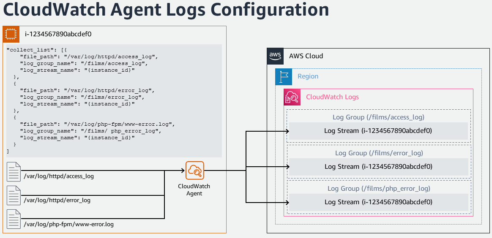
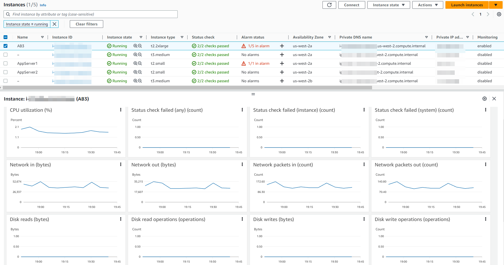

# EC2 모니터링 및 Observability

## 소개

지속적인 모니터링과 Observability는 민첩성을 높이고, 고객 경험을 개선하며, 클라우드 환경의 위험을 줄여줍니다. Wikipedia에 따르면, [Observability](https://en.wikipedia.org/wiki/Observability)는 시스템의 외부 출력에 대한 지식으로부터 내부 상태를 얼마나 잘 추론할 수 있는지를 측정하는 것입니다. Observability라는 용어 자체는 제어 이론 분야에서 유래했으며, 기본적으로 시스템이 생성하는 외부 신호/출력을 학습함으로써 구성 요소의 내부 상태를 추론할 수 있다는 것을 의미합니다.

모니터링과 Observability의 차이점은 다음과 같습니다. 모니터링은 시스템이 작동하는지 여부를 알려주는 반면, Observability는 시스템이 왜 작동하지 않는지를 알려줍니다. 모니터링은 일반적으로 사후 대응적 조치인 반면, Observability의 목표는 핵심 성과 지표를 사전에 개선할 수 있도록 하는 것입니다. 시스템은 관측되지 않으면 제어하거나 최적화할 수 없습니다. metrics, logs, traces 수집을 통한 워크로드 계측과 적절한 모니터링 및 Observability 도구를 사용하여 의미 있는 인사이트와 상세한 컨텍스트를 얻으면 고객이 환경을 제어하고 최적화하는 데 도움이 됩니다.

AWS는 고객이 모니터링에서 Observability로 전환하여 완전한 엔드투엔드 서비스 가시성을 확보할 수 있도록 지원합니다. 이 문서에서는 Amazon Elastic Compute Cloud(Amazon EC2)에 초점을 맞추고, AWS 네이티브 및 오픈소스 도구를 통해 AWS 클라우드 환경에서 서비스의 모니터링 및 Observability를 개선하기 위한 모범 사례를 다룹니다.

## Amazon EC2

[Amazon Elastic Compute Cloud](https://aws.amazon.com/ec2/)(Amazon EC2)는 Amazon Web Services(AWS) 클라우드의 고도로 확장 가능한 컴퓨팅 플랫폼입니다. Amazon EC2는 초기 하드웨어 투자의 필요성을 없애, 고객이 사용한 만큼만 비용을 지불하면서 애플리케이션을 더 빠르게 개발하고 배포할 수 있도록 합니다. EC2가 제공하는 주요 기능으로는 인스턴스(Instances)라 불리는 가상 컴퓨팅 환경, Amazon Machine Images라 불리는 사전 구성된 인스턴스 템플릿, 인스턴스 유형으로 제공되는 CPU, 메모리, 스토리지, 네트워킹 용량의 다양한 구성이 있습니다.

## AWS 네이티브 도구를 사용한 모니터링 및 Observability

### Amazon CloudWatch

[Amazon CloudWatch](https://aws.amazon.com/cloudwatch/)는 AWS, 하이브리드, 온프레미스 애플리케이션 및 인프라 리소스에 대한 데이터와 실행 가능한 인사이트를 제공하는 모니터링 및 관리 서비스입니다. CloudWatch는 logs, metrics, events 형태로 모니터링 및 운영 데이터를 수집합니다. 또한 AWS 리소스, 애플리케이션, AWS 및 온프레미스 서버에서 실행되는 서비스에 대한 통합 뷰를 제공합니다. CloudWatch는 리소스 사용률, 애플리케이션 성능, 운영 상태에 대한 시스템 전반의 가시성을 확보하는 데 도움을 줍니다.

### 통합 CloudWatch 에이전트

통합 CloudWatch 에이전트는 MIT 라이선스의 오픈소스 소프트웨어로, x86-64 및 ARM64 아키텍처를 활용하는 대부분의 운영체제를 지원합니다. CloudWatch 에이전트는 Amazon EC2 인스턴스 및 하이브리드 환경의 온프레미스 서버에서 시스템 수준 메트릭을 수집하고, 애플리케이션 또는 서비스에서 커스텀 메트릭을 검색하며, Amazon EC2 인스턴스와 온프레미스 서버에서 로그를 수집하는 데 도움을 줍니다.

### Amazon EC2 인스턴스에 CloudWatch 에이전트 설치

#### 커맨드 라인 설치

CloudWatch 에이전트는 [커맨드 라인](https://docs.aws.amazon.com/AmazonCloudWatch/latest/monitoring/installing-cloudwatch-agent-commandline.html)을 통해 설치할 수 있습니다. 다양한 아키텍처와 운영체제에 필요한 패키지는 [다운로드](https://docs.aws.amazon.com/AmazonCloudWatch/latest/monitoring/download-cloudwatch-agent-commandline.html) 가능합니다. CloudWatch 에이전트가 Amazon EC2 인스턴스에서 정보를 읽고 CloudWatch에 쓸 수 있는 권한을 제공하는 필요한 [IAM 역할](https://docs.aws.amazon.com/AmazonCloudWatch/latest/monitoring/create-iam-roles-for-cloudwatch-agent-commandline.html)을 생성합니다. 필요한 IAM 역할이 생성되면, 해당 Amazon EC2 인스턴스에 CloudWatch 에이전트를 [설치하고 실행](https://docs.aws.amazon.com/AmazonCloudWatch/latest/monitoring/install-CloudWatch-Agent-commandline-fleet.html)할 수 있습니다.

:::info
    문서: [커맨드 라인을 사용하여 CloudWatch 에이전트 설치](https://docs.aws.amazon.com/AmazonCloudWatch/latest/monitoring/installing-cloudwatch-agent-commandline.html)

    AWS Observability Workshop: [CloudWatch 에이전트 설정 및 설치](https://catalog.workshops.aws/observability/en-US/aws-native/ec2-monitoring/install-ec2)
:::

#### AWS Systems Manager를 통한 설치

CloudWatch 에이전트는 [AWS Systems Manager](https://docs.aws.amazon.com/AmazonCloudWatch/latest/monitoring/installing-cloudwatch-agent-ssm.html)를 통해서도 설치할 수 있습니다. CloudWatch 에이전트가 Amazon EC2 인스턴스에서 정보를 읽고 CloudWatch에 쓸 수 있으며 AWS Systems Manager와 통신할 수 있는 권한을 제공하는 필요한 IAM 역할을 생성합니다. EC2 인스턴스에 CloudWatch 에이전트를 설치하기 전에, 해당 EC2 인스턴스에 SSM 에이전트를 [설치하거나 업데이트](https://docs.aws.amazon.com/AmazonCloudWatch/latest/monitoring/download-CloudWatch-Agent-on-EC2-Instance-SSM-first.html#update-SSM-Agent-EC2instance-first)합니다. CloudWatch 에이전트는 AWS Systems Manager를 통해 다운로드할 수 있습니다. 수집할 메트릭(커스텀 메트릭 포함)과 로그를 지정하는 JSON 구성 파일을 생성할 수 있습니다. 필요한 IAM 역할과 구성 파일이 생성되면, 해당 Amazon EC2 인스턴스에 CloudWatch 에이전트를 설치하고 실행할 수 있습니다.

:::info
    문서: [AWS Systems Manager를 사용하여 CloudWatch 에이전트 설치](https://docs.aws.amazon.com/AmazonCloudWatch/latest/monitoring/installing-cloudwatch-agent-ssm.html)

    AWS Observability Workshop: [AWS Systems Manager Quick Setup을 사용하여 CloudWatch 에이전트 설치](https://catalog.workshops.aws/observability/en-US/aws-native/ec2-monitoring/install-ec2/ssm-quicksetup)

    관련 블로그 글: [Amazon CloudWatch Agent with AWS Systems Manager Integration – Unified Metrics & Log Collection for Linux & Windows](https://aws.amazon.com/blogs/aws/new-amazon-cloudwatch-agent-with-aws-systems-manager-integration-unified-metrics-log-collection-for-linux-windows/)

    YouTube 동영상: [Collect Metrics and Logs from Amazon EC2 instances with the CloudWatch Agent](https://www.youtube.com/watch?v=vAnIhIwE5hY)
:::

#### 하이브리드 환경의 온프레미스 서버에 CloudWatch 에이전트 설치

온프레미스 서버와 클라우드를 함께 사용하는 하이브리드 고객 환경에서도, Amazon CloudWatch에서 통합 Observability를 달성하기 위해 유사한 접근 방식을 취할 수 있습니다. CloudWatch 에이전트는 Amazon S3에서 직접 다운로드하거나 AWS Systems Manager를 통해 다운로드할 수 있습니다. 온프레미스 서버가 Amazon CloudWatch로 데이터를 전송할 수 있도록 IAM 사용자를 생성합니다. 온프레미스 서버에 에이전트를 설치하고 시작합니다.

:::note
    문서: [온프레미스 서버에 CloudWatch 에이전트 설치](https://docs.aws.amazon.com/AmazonCloudWatch/latest/monitoring/install-CloudWatch-Agent-on-premise.html)
:::

### Amazon CloudWatch를 사용한 Amazon EC2 인스턴스 모니터링

Amazon EC2 인스턴스와 애플리케이션의 안정성, 가용성, 성능을 유지하기 위한 핵심 요소는 [지속적인 모니터링](https://catalog.workshops.aws/observability/en-US/aws-native/ec2-monitoring)입니다. 필요한 Amazon EC2 인스턴스에 CloudWatch 에이전트가 설치되면, 안정적인 환경을 유지하기 위해 인스턴스의 상태와 성능을 모니터링해야 합니다. 기준선으로, CPU 사용률, 네트워크 사용률, 디스크 성능, 디스크 읽기/쓰기, 메모리 사용률, 디스크 스왑 사용률, 디스크 공간 사용률, 페이지 파일 사용률, EC2 인스턴스의 로그 수집 등의 항목을 모니터링하는 것이 권장됩니다.

#### 기본 모니터링과 세부 모니터링

Amazon CloudWatch는 Amazon EC2의 원시 데이터를 수집하고 처리하여 읽기 가능한 거의 실시간 메트릭으로 변환합니다. 기본적으로 Amazon EC2는 기본 모니터링으로 5분 주기로 CloudWatch에 메트릭 데이터를 전송합니다. 인스턴스에 대해 1분 주기로 메트릭 데이터를 CloudWatch에 전송하려면, 인스턴스에서 [세부 모니터링](https://docs.aws.amazon.com/AWSEC2/latest/UserGuide/using-cloudwatch-new.html)을 활성화할 수 있습니다.

#### 자동화 및 수동 모니터링 도구

AWS는 고객이 Amazon EC2를 모니터링하고 문제 발생 시 보고하는 데 도움이 되는 자동화 도구와 수동 도구 두 가지 유형의 도구를 제공합니다. 이 도구들 중 일부는 약간의 설정이 필요하고, 일부는 수동 개입이 필요합니다.
[자동화 모니터링 도구](https://docs.aws.amazon.com/AWSEC2/latest/UserGuide/monitoring_automated_manual.html#monitoring_automated_tools)에는 AWS 시스템 상태 검사, 인스턴스 상태 검사, Amazon CloudWatch 경보, Amazon EventBridge, Amazon CloudWatch Logs, CloudWatch 에이전트, Microsoft System Center Operations Manager용 AWS Management Pack이 포함됩니다. [수동 모니터링](https://docs.aws.amazon.com/AWSEC2/latest/UserGuide/monitoring_automated_manual.html#monitoring_manual_tools) 도구에는 이 문서의 별도 섹션에서 자세히 살펴볼 대시보드가 포함됩니다.

:::note
    문서: [자동화 및 수동 모니터링](https://docs.aws.amazon.com/AWSEC2/latest/UserGuide/monitoring_automated_manual.html)
:::
### CloudWatch 에이전트를 사용한 Amazon EC2 인스턴스의 Metrics

Metrics(메트릭)는 CloudWatch의 기본 개념입니다. 메트릭은 CloudWatch에 게시되는 시간순 데이터 포인트 집합을 나타냅니다. 메트릭을 시간에 따른 변수 값을 나타내는 데이터 포인트와 함께 모니터링할 변수로 생각하세요. 예를 들어, 특정 EC2 인스턴스의 CPU 사용량은 Amazon EC2가 제공하는 하나의 메트릭입니다.

#### CloudWatch 에이전트를 사용한 기본 메트릭

Amazon CloudWatch는 Amazon EC2 인스턴스에서 메트릭을 수집하며, AWS Management Console, AWS CLI 또는 API를 통해 조회할 수 있습니다. 사용 가능한 메트릭은 기본 모니터링의 경우 5분 간격, 세부 모니터링(활성화된 경우)의 경우 1분 간격의 데이터 포인트입니다.

#### CloudWatch 에이전트를 사용한 커스텀 메트릭

고객은 API 또는 CLI를 사용하여 1분 단위의 표준 해상도 또는 1초 간격까지의 고해상도로 자체 커스텀 메트릭을 CloudWatch에 게시할 수도 있습니다. 통합 CloudWatch 에이전트는 [StatsD](https://docs.aws.amazon.com/AmazonCloudWatch/latest/monitoring/CloudWatch-Agent-custom-metrics-statsd.html)와 [collectd](https://docs.aws.amazon.com/AmazonCloudWatch/latest/monitoring/CloudWatch-Agent-custom-metrics-collectd.html)를 통한 커스텀 메트릭 검색을 지원합니다.

CloudWatch 에이전트에서 StatsD 프로토콜을 사용하여 애플리케이션 또는 서비스의 커스텀 메트릭을 검색할 수 있습니다. StatsD는 다양한 애플리케이션에서 메트릭을 수집할 수 있는 인기 있는 오픈소스 솔루션입니다. StatsD는 특히 자체 메트릭을 계측하는 데 유용하며, Linux 및 Windows 기반 서버를 모두 지원합니다.

collectd 프로토콜을 사용하는 CloudWatch 에이전트로도 애플리케이션 또는 서비스의 커스텀 메트릭을 검색할 수 있습니다. collectd는 다양한 애플리케이션에 대한 시스템 통계를 수집할 수 있는 플러그인을 갖춘 Linux 서버에서만 지원되는 인기 있는 오픈소스 솔루션입니다. CloudWatch 에이전트가 이미 수집할 수 있는 시스템 메트릭에 collectd의 추가 메트릭을 결합하면, 시스템과 애플리케이션을 더 잘 모니터링, 분석, 문제 해결할 수 있습니다.

#### CloudWatch 에이전트를 사용한 추가 커스텀 메트릭

CloudWatch 에이전트는 EC2 인스턴스에서 커스텀 메트릭 수집을 지원합니다. 몇 가지 인기 있는 예시는 다음과 같습니다:

- Elastic Network Adapter(ENA)를 사용하는 Linux에서 실행되는 EC2 인스턴스의 네트워크 성능 메트릭.
- Linux 서버의 Nvidia GPU 메트릭.
- Linux 및 Windows 서버의 개별 프로세스에서 procstat 플러그인을 사용한 프로세스 메트릭.

### CloudWatch 에이전트를 사용한 Amazon EC2 인스턴스의 Logs

Amazon CloudWatch Logs는 기존 시스템, 애플리케이션, 커스텀 로그 파일을 사용하여 시스템과 애플리케이션을 거의 실시간으로 모니터링하고 문제를 해결하는 데 도움을 줍니다. Amazon EC2 인스턴스와 온프레미스 서버에서 CloudWatch로 로그를 수집하려면, 통합 CloudWatch 에이전트를 설치해야 합니다. 최신 통합 CloudWatch 에이전트가 권장되며, 로그와 고급 메트릭을 모두 수집할 수 있습니다. 또한 다양한 운영체제를 지원합니다. 인스턴스가 Instance Metadata Service Version 2(IMDSv2)를 사용하는 경우 통합 에이전트가 필수입니다.

통합 CloudWatch 에이전트가 수집한 로그는 Amazon CloudWatch Logs에서 처리되고 저장됩니다. Windows 또는 Linux 서버, Amazon EC2와 온프레미스 서버 모두에서 로그를 수집할 수 있습니다. CloudWatch 에이전트 구성 마법사를 사용하여 CloudWatch 에이전트의 설정을 정의하는 구성 JSON 파일을 설정할 수 있습니다.

:::note
    AWS Observability Workshop: [Logs](https://catalog.workshops.aws/observability/en-US/aws-native/logs)
:::

### Amazon EC2 인스턴스 이벤트

이벤트는 AWS 환경의 변경을 나타냅니다. AWS 리소스와 애플리케이션은 상태가 변경될 때 이벤트를 생성할 수 있습니다. CloudWatch Events는 AWS 리소스와 애플리케이션의 변경을 설명하는 거의 실시간의 시스템 이벤트 스트림을 제공합니다. 예를 들어, Amazon EC2는 EC2 인스턴스의 상태가 pending에서 running으로 변경될 때 이벤트를 생성합니다. 고객은 자체 애플리케이션 수준의 커스텀 이벤트를 생성하여 CloudWatch Events에 게시할 수도 있습니다.

고객은 상태 검사와 예약된 이벤트를 확인하여 [Amazon EC2 인스턴스의 상태를 모니터링](https://docs.aws.amazon.com/AWSEC2/latest/UserGuide/monitoring-instances-status-check.html)할 수 있습니다. 상태 검사는 Amazon EC2가 수행하는 자동 검사의 결과를 제공합니다. 이 자동 검사는 인스턴스에 영향을 미치는 특정 문제를 감지합니다. Amazon CloudWatch가 제공하는 데이터와 함께 상태 검사 정보는 각 인스턴스에 대한 상세한 운영 가시성을 제공합니다.

#### Amazon EC2 인스턴스 이벤트를 위한 Amazon EventBridge 규칙

Amazon CloudWatch Events는 리소스 변경이나 문제 같은 작업에 자동으로 대응하기 위해 Amazon EventBridge를 사용하여 시스템 이벤트를 자동화할 수 있습니다. Amazon EC2를 포함한 AWS 서비스의 이벤트는 거의 실시간으로 CloudWatch Events에 전달되며, 고객은 이벤트가 규칙과 일치할 때 적절한 조치를 취하기 위한 EventBridge 규칙을 생성할 수 있습니다.
가능한 조치로는 AWS Lambda 함수 호출, Amazon EC2 Run Command 호출, Amazon Kinesis Data Streams로 이벤트 릴레이, AWS Step Functions 상태 머신 활성화, Amazon SNS 주제 알림, Amazon SQS 큐 알림, 내부 또는 외부 인시던트 대응 애플리케이션이나 SIEM 도구로 전달 등이 있습니다.

:::note
    AWS Observability Workshop: [인시던트 대응 - EventBridge 규칙](https://catalog.workshops.aws/observability/en-US/aws-native/ec2-monitoring/incident-response/create-eventbridge-rule)
:::

#### Amazon EC2 인스턴스를 위한 Amazon CloudWatch 경보

Amazon [CloudWatch 경보](https://docs.aws.amazon.com/AmazonCloudWatch/latest/monitoring/AlarmThatSendsEmail.html)는 지정한 기간 동안 메트릭을 감시하고, 여러 기간에 걸쳐 지정된 임계값에 대한 메트릭 값을 기반으로 하나 이상의 작업을 수행할 수 있습니다. 경보는 상태가 변경될 때만 작업을 호출합니다. 작업은 Amazon Simple Notification Service(Amazon SNS) 주제로 전송되는 알림, Amazon EC2 Auto Scaling 또는 [EC2 인스턴스를 중지, 종료, 재부팅 또는 복구](https://docs.aws.amazon.com/AmazonCloudWatch/latest/monitoring/UsingAlarmActions.html)하는 것과 같은 다른 적절한 조치가 될 수 있습니다.

경보가 트리거되면, 작업으로서 SNS 주제로 이메일 알림이 전송됩니다.

#### Auto Scaling 인스턴스 모니터링

Amazon EC2 Auto Scaling은 고객이 애플리케이션의 부하를 처리하기 위해 적절한 수의 Amazon EC2 인스턴스를 사용할 수 있도록 도와줍니다. [Amazon EC2 Auto Scaling 메트릭](https://docs.aws.amazon.com/autoscaling/ec2/userguide/ec2-auto-scaling-cloudwatch-monitoring.html)은 Auto Scaling 그룹에 대한 정보를 수집하며 AWS/AutoScaling 네임스페이스에 있습니다. Auto Scaling 인스턴스의 CPU 및 기타 사용량 데이터를 나타내는 Amazon EC2 인스턴스 메트릭은 AWS/EC2 네임스페이스에 있습니다.

### CloudWatch에서의 대시보드

AWS 계정의 리소스 인벤토리 세부 정보, 리소스 성능, 상태 검사를 파악하는 것은 안정적인 리소스 관리에 중요합니다. [Amazon CloudWatch 대시보드](https://docs.aws.amazon.com/AmazonCloudWatch/latest/monitoring/CloudWatch_Dashboards.html)는 CloudWatch 콘솔에서 사용자 정의 가능한 홈 페이지로, 여러 리전에 분산된 리소스를 포함하여 단일 뷰에서 리소스를 모니터링하는 데 사용할 수 있습니다. 사용 가능한 Amazon EC2 인스턴스의 개요와 세부 정보를 확인할 수 있는 여러 방법이 있습니다.

#### CloudWatch의 자동 대시보드

자동 대시보드는 모든 AWS 퍼블릭 리전에서 사용 가능하며, CloudWatch 아래의 Amazon EC2 인스턴스를 포함한 모든 AWS 리소스의 상태와 성능에 대한 집계 뷰를 제공합니다. 이를 통해 고객이 모니터링을 빠르게 시작하고, 메트릭과 경보의 리소스 기반 뷰를 확인하며, 성능 문제의 근본 원인을 쉽게 파악할 수 있습니다. 자동 대시보드는 AWS 서비스 권장 [모범 사례](https://docs.aws.amazon.com/prescriptive-guidance/latest/implementing-logging-monitoring-cloudwatch/cloudwatch-dashboards-visualizations.html)로 사전 구축되며, 리소스를 인식하고 중요한 성능 메트릭의 최신 상태를 반영하도록 동적으로 업데이트됩니다.

#### CloudWatch의 커스텀 대시보드

[커스텀 대시보드](https://docs.aws.amazon.com/AmazonCloudWatch/latest/monitoring/create_dashboard.html)를 사용하면 고객은 다양한 위젯으로 원하는 만큼 추가 대시보드를 생성하고 그에 맞게 사용자 정의할 수 있습니다. 대시보드는 크로스 리전 및 크로스 계정 뷰로 구성할 수 있으며, 즐겨찾기 목록에 추가할 수 있습니다.

#### CloudWatch의 리소스 상태 대시보드

CloudWatch ServiceLens의 Resource Health는 고객이 애플리케이션 전체에 걸쳐 [Amazon EC2 호스트의 상태와 성능](https://aws.amazon.com/blogs/mt/introducing-cloudwatch-resource-health-monitor-ec2-hosts/)을 자동으로 검색, 관리, 시각화하는 데 사용할 수 있는 완전 관리형 솔루션입니다. 고객은 CPU나 메모리 같은 성능 차원별로 호스트의 상태를 시각화하고, 인스턴스 유형, 인스턴스 상태, 보안 그룹 같은 필터를 사용하여 단일 뷰에서 수백 대의 호스트를 슬라이스 앤 다이스할 수 있습니다. EC2 호스트 그룹의 나란히 비교를 가능하게 하며, 개별 호스트에 대한 세부적인 인사이트를 제공합니다.

## 오픈소스 도구를 사용한 모니터링 및 Observability

### AWS Distro for OpenTelemetry를 사용한 Amazon EC2 인스턴스 모니터링

[AWS Distro for OpenTelemetry(ADOT)](https://aws.amazon.com/otel)는 OpenTelemetry 프로젝트의 안전하고, 프로덕션에 바로 사용 가능하며, AWS가 지원하는 배포판입니다. Cloud Native Computing Foundation의 일부인 OpenTelemetry는 애플리케이션 모니터링을 위한 분산 트레이스와 메트릭을 수집하기 위한 오픈소스 API, 라이브러리, 에이전트를 제공합니다. AWS Distro for OpenTelemetry를 사용하면, 고객은 애플리케이션을 한 번만 계측하여 상호 연관된 메트릭과 트레이스를 여러 AWS 및 파트너 모니터링 솔루션으로 전송할 수 있습니다.

AWS Distro for OpenTelemetry(ADOT)는 애플리케이션 성능과 상태를 모니터링하기 위해 데이터를 쉽게 상호 연관시킬 수 있는 분산 모니터링 프레임워크를 제공하며, 이는 더 나은 서비스 가시성과 유지보수에 매우 중요합니다.

ADOT의 핵심 구성 요소는 SDK, 자동 계측 에이전트, 컬렉터, 백엔드 서비스로 데이터를 전송하는 익스포터입니다.

[OpenTelemetry SDK](https://github.com/aws-observability): AWS 리소스별 메타데이터 수집을 가능하게 하기 위해, X-Ray 트레이스 형식과 컨텍스트에 대한 OpenTelemetry SDK 지원이 추가되었습니다. OpenTelemetry SDK는 이제 AWS X-Ray와 CloudWatch에서 수집된 트레이스와 메트릭 데이터를 상호 연관시킵니다.

[자동 계측 에이전트](https://aws-otel.github.io/docs/getting-started/java-sdk/auto-instr): AWS SDK 및 AWS X-Ray 트레이스 데이터를 위한 OpenTelemetry Java 자동 계측 에이전트 지원이 추가되었습니다.

[OpenTelemetry Collector](https://github.com/open-telemetry/opentelemetry-collector): 배포판의 컬렉터는 업스트림 OpenTelemetry 컬렉터를 사용하여 빌드됩니다. AWS X-Ray, Amazon CloudWatch, Amazon Managed Service for Prometheus를 포함한 AWS 서비스로 데이터를 전송하기 위해 업스트림 컬렉터에 AWS 전용 익스포터가 추가되었습니다.

#### ADOT Collector 및 Amazon CloudWatch를 통한 Metrics 및 Traces

AWS Distro for OpenTelemetry(ADOT) Collector는 CloudWatch 에이전트와 함께 Amazon EC2 인스턴스에 나란히 설치할 수 있으며, OpenTelemetry SDK를 사용하여 Amazon EC2 인스턴스에서 실행되는 워크로드의 애플리케이션 트레이스 및 메트릭을 수집할 수 있습니다.

Amazon CloudWatch에서 OpenTelemetry 메트릭을 지원하기 위해, [AWS EMF Exporter for OpenTelemetry Collector](https://github.com/open-telemetry/opentelemetry-collector-contrib/tree/main/exporter/awsemfexporter)는 OpenTelemetry 형식 메트릭을 CloudWatch Embedded Metric Format(EMF)으로 변환하여, OpenTelemetry 메트릭이 통합된 애플리케이션이 CloudWatch로 높은 카디널리티의 애플리케이션 메트릭을 전송할 수 있도록 합니다. [X-Ray 익스포터](https://aws-otel.github.io/docs/getting-started/x-ray#configuring-the-aws-x-ray-exporter)는 OTLP 형식으로 수집된 트레이스를 [AWS X-Ray](https://aws.amazon.com/xray/)로 내보낼 수 있게 합니다.

Amazon EC2의 ADOT Collector는 AWS CloudFormation을 통해 또는 [AWS Systems Manager Distributor](https://catalog.workshops.aws/observability/en-US/aws-managed-oss/ec2-monitoring/configure-adot-collector)를 사용하여 애플리케이션 메트릭을 수집하도록 설치할 수 있습니다.

### Prometheus를 사용한 Amazon EC2 인스턴스 모니터링

[Prometheus](https://prometheus.io/)는 시스템 모니터링 및 경보를 위해 독립적으로 유지 관리되는 독립형 오픈소스 프로젝트입니다. Prometheus는 메트릭을 시계열 데이터로 수집하고 저장합니다. 즉, 메트릭 정보는 레이블이라고 불리는 선택적 키-값 쌍과 함께 기록된 타임스탬프와 함께 저장됩니다.

Prometheus는 커맨드 라인 플래그를 통해 구성되며, 모든 구성 세부 정보는 prometheus.yaml 파일에서 관리됩니다. 구성 파일 내의 'scrape_config' 섹션은 대상과 스크래핑 방법을 지정하는 매개변수를 명시합니다. [Prometheus Service Discovery](https://github.com/prometheus/prometheus/tree/main/discovery)(SD)는 메트릭을 스크래핑할 엔드포인트를 찾는 방법론입니다. Amazon EC2 서비스 디스커버리 구성은 AWS EC2 인스턴스에서 스크래핑 대상을 검색할 수 있게 하며 `ec2_sd_config`에서 구성됩니다.

#### Prometheus 및 Amazon CloudWatch를 통한 Metrics

EC2 인스턴스의 CloudWatch 에이전트를 Prometheus와 함께 설치 및 구성하여 CloudWatch에서 모니터링하기 위한 메트릭을 스크래핑할 수 있습니다. 이는 EC2에서 컨테이너 워크로드를 선호하며 오픈소스 Prometheus 모니터링과 호환되는 커스텀 메트릭이 필요한 고객에게 도움이 됩니다. CloudWatch 에이전트 설치는 위의 이전 섹션에서 설명한 단계를 따라 수행할 수 있습니다. Prometheus 모니터링이 포함된 CloudWatch 에이전트는 Prometheus 메트릭을 스크래핑하기 위해 두 가지 구성이 필요합니다. 하나는 Prometheus 문서의 'scrape_config'에 설명된 표준 Prometheus 구성이고, 다른 하나는 [CloudWatch 에이전트 구성](https://docs.aws.amazon.com/AmazonCloudWatch/latest/monitoring/CloudWatch-Agent-PrometheusEC2.html#CloudWatch-Agent-PrometheusEC2-configure)입니다.

#### Prometheus 및 ADOT Collector를 통한 Metrics

고객은 Observability 요구사항에 맞는 완전한 오픈소스 설정을 선택할 수 있습니다. 이를 위해 AWS Distro for OpenTelemetry(ADOT) Collector를 Prometheus로 계측된 애플리케이션에서 스크래핑하고 메트릭을 Prometheus 서버로 전송하도록 구성할 수 있습니다. 이 흐름에는 세 가지 OpenTelemetry 구성 요소가 관여합니다: Prometheus Receiver, Prometheus Remote Write Exporter, Sigv4 Authentication Extension입니다. Prometheus Receiver는 Prometheus 형식의 메트릭 데이터를 수신합니다. Prometheus Exporter는 Prometheus 형식으로 데이터를 내보냅니다. Sigv4 Authenticator 확장은 AWS 서비스에 대한 요청을 위한 Sigv4 인증을 제공합니다.

#### Prometheus Node Exporter

[Prometheus Node Exporter](https://github.com/prometheus/node_exporter)는 클라우드 환경을 위한 오픈소스 시계열 모니터링 및 경보 시스템입니다. Amazon EC2 인스턴스를 Node Exporter로 계측하여 노드 수준 메트릭을 타임스탬프와 함께 시계열 데이터로 수집하고 저장할 수 있습니다. Node Exporter는 URL http://localhost:9100/metrics를 통해 다양한 호스트 메트릭을 노출할 수 있는 Prometheus 익스포터입니다.

 메트릭이 생성되면, [Amazon Managed Prometheus](https://aws.amazon.com/prometheus/)로 전송할 수 있습니다.

### Fluent Bit 플러그인을 사용한 Amazon EC2 인스턴스의 로그 스트리밍

[Fluent Bit](https://fluentbit.io/)는 대규모 데이터 수집 처리를 위한 오픈소스 멀티플랫폼 로그 프로세서 도구로, 다양한 정보 소스, 다양한 데이터 형식, 데이터 안정성, 보안, 유연한 라우팅, 다중 목적지를 다룹니다.

Fluent Bit는 Amazon EC2에서 로그 보존 및 분석을 위한 Amazon CloudWatch를 포함한 AWS 서비스로 로그를 스트리밍하기 위한 쉬운 확장 포인트를 만드는 데 도움을 줍니다. 새로 출시된 [Fluent Bit 플러그인](https://github.com/aws/amazon-cloudwatch-logs-for-fluent-bit#new-higher-performance-core-fluent-bit-plugin)은 Amazon CloudWatch로 로그를 라우팅할 수 있습니다.

### Amazon Managed Grafana를 사용한 대시보드

[Amazon Managed Grafana](https://aws.amazon.com/grafana/)는 오픈소스 Grafana 프로젝트를 기반으로 하는 완전 관리형 서비스로, 풍부하고 인터랙티브하며 안전한 데이터 시각화를 통해 고객이 여러 데이터 소스에 걸쳐 metrics, logs, traces를 즉시 조회, 상관분석, 분석, 모니터링, 경보할 수 있도록 합니다. 고객은 인터랙티브 대시보드를 생성하고 자동으로 확장되는 고가용성의 엔터프라이즈 보안 서비스를 통해 조직의 누구와도 공유할 수 있습니다. Amazon Managed Grafana를 사용하면, 고객은 AWS 계정, AWS 리전, 데이터 소스 전반에 걸쳐 대시보드에 대한 사용자 및 팀 접근을 관리할 수 있습니다.

Amazon Managed Grafana에는 Grafana 워크스페이스 콘솔의 AWS 데이터 소스 구성 옵션을 사용하여 Amazon CloudWatch를 데이터 소스로 추가할 수 있습니다. 이 기능은 기존 CloudWatch 계정을 검색하고 CloudWatch에 접근하는 데 필요한 인증 자격 증명 구성을 관리하여 CloudWatch를 데이터 소스로 쉽게 추가할 수 있게 합니다. Amazon Managed Grafana는 [Prometheus 데이터 소스](https://docs.aws.amazon.com/grafana/latest/userguide/prometheus-data-source.html)도 지원합니다. 즉, 자체 관리형 Prometheus 서버와 Amazon Managed Service for Prometheus 워크스페이스를 데이터 소스로 사용할 수 있습니다.

Amazon Managed Grafana는 다양한 패널과 함께 제공되어, 올바른 쿼리를 구성하고 표시 속성을 사용자 정의하여 필요한 대시보드를 쉽게 생성할 수 있습니다.

## 결론

모니터링은 시스템이 제대로 작동하는지 여부를 알려줍니다. Observability는 시스템이 왜 제대로 작동하지 않는지를 이해할 수 있게 합니다. 좋은 Observability는 알아야 할 필요가 있는지조차 몰랐던 질문에 답할 수 있게 해줍니다. 모니터링과 Observability는 시스템의 출력으로부터 내부 상태를 추론할 수 있는 방법을 제시합니다.

클라우드에서 마이크로서비스, 서버리스, 비동기 아키텍처로 실행되는 현대 애플리케이션은 metrics, logs, traces, events 형태로 대량의 데이터를 생성합니다. Amazon CloudWatch와 Amazon Distro for OpenTelemetry, Amazon Managed Prometheus, Amazon Managed Grafana 같은 오픈소스 도구를 함께 사용하면, 고객이 이 데이터를 통합 플랫폼에서 수집, 접근, 상관분석할 수 있습니다. 데이터 사일로를 제거하여 시스템 전반의 가시성을 쉽게 확보하고 문제를 신속하게 해결할 수 있도록 도와줍니다.
