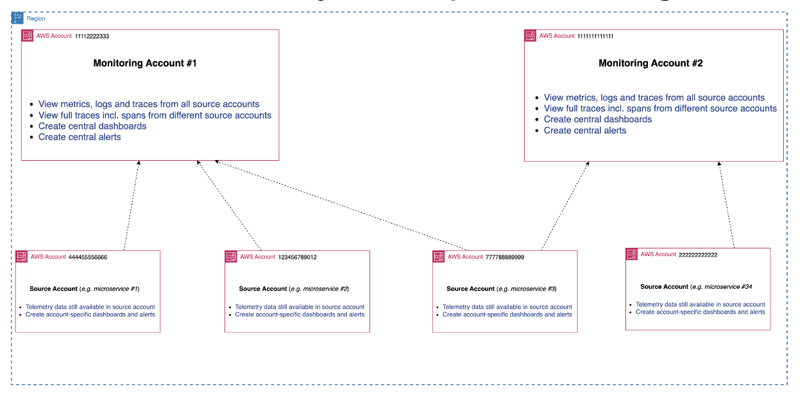

# 모니터링 및 소스 계정 설정

대부분의 경우 고객은 서비스가 여러 계정에 걸쳐 실행되고 때로는 여러 리전에서도 실행되기 때문에 여러 AWS 계정의 텔레메트리 데이터를 시각화하고 상관 관계를 파악해야 합니다.

단일 계정에서만 Observability와 서비스를 실행할 계획이라면 이 단계를 건너뛸 수 있습니다.

첫 번째 단계는 모니터링 및 소스 계정을 설정하고 공유하려는 텔레메트리를 정확히 지정하는 것입니다. 이를 위해 교차 계정 Observability를 활용합니다. 이는 리전별로 작동한다는 점에 유의하세요.

교차 계정 Observability 설정에 대한 자세한 지침은 [CloudWatch 교차 계정 Observability](../cloudwatch_cross_account_observability.md) 가이드를 참조하세요.

## 모니터링 계정

텔레메트리 데이터를 중앙 집중식으로 보려는 모니터링 계정을 지정합니다.

그런 다음 어떤 계정이 모니터링 계정과 데이터를 공유할지 정의합니다. AWS 조직의 모든 계정을 선택하거나 개별 소스 계정을 선택할 수 있습니다. 모니터링 계정과 공유할 텔레메트리 데이터(예: logs, metrics, traces, Application Signals 등)도 지정합니다.

그런 다음 [소스 계정을 연결](../cloudwatch_cross_account_observability.md#step-2-link-the-source-accounts)하여 설정을 완료합니다.

일반적인 모니터링 계정 구조는 다음과 유사합니다:

CloudWatch 설정에서 리전별로 이를 [구성](../cloudwatch_cross_account_observability.md#step-1-set-up-a-monitoring-account)합니다.

:::info
교차 계정 Observability를 사용하면 logs와 metrics는 소스 계정에서 복사되지 않지만, trace 데이터는 모니터링 계정으로 복사됩니다(첫 번째 모니터링 계정으로의 trace 복사는 추가 비용 없이 포함됩니다). 단순히 logs, metrics, traces 및 기타 텔레메트리를 중앙에서 확인하는 것입니다.
:::

## 다중 모니터링 계정

각 모니터링 계정은 최대 100,000개의 소스 계정과 연결할 수 있습니다.

그러나 여러 모니터링 계정이 필요한 운영 상황이 있을 수 있습니다. 자체 요구 사항에 따라 여러 모니터링 계정을 가질 수 있습니다. 이 설정은 다음과 같이 보일 수 있습니다:

:::info
단일 소스 계정에서 여러 모니터링 계정으로 데이터를 공유해야 하는 경우, 각 소스 계정이 최대 5개의 모니터링 계정과 데이터를 공유할 수 있으므로 구성이 가능합니다.
:::

## 텔레메트리 제어

metric 및 로그 필터를 지정하여 추가적인 세분성을 제공하는 공유 텔레메트리 데이터에 대한 제어 기능도 있습니다.

이제 단일 모니터링 계정(리전별)에서 여러 계정의 [교차 계정 데이터를 시각화하고 쿼리](../cloudwatch_cross_account_observability.md#querying-cross-account-telemetry-data)할 수 있습니다.

## 요약

요약하면:
1. 모니터링 계정 지정 및 구성
2. 소스 계정 구성
3. 공유하려는 텔레메트리 미세 조정
4. 모니터링 계정에서 모든 소스 계정 데이터를 시각화하고 쿼리
