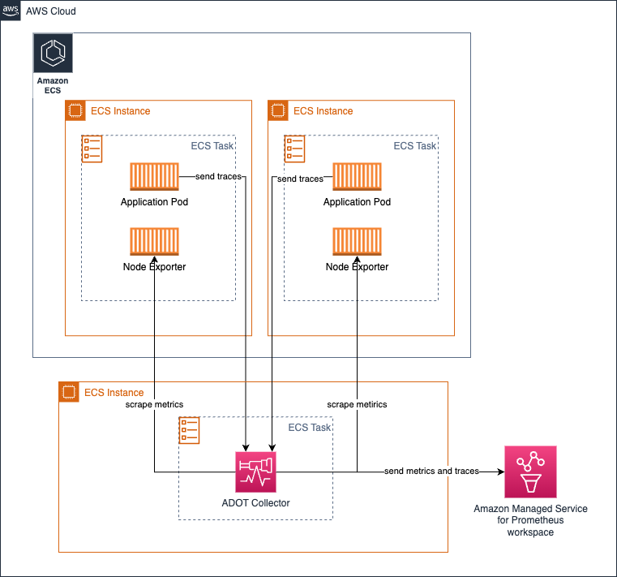
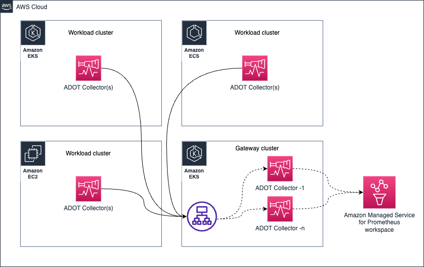

# AWS Distro for OpenTelemetry (ADOT) Collector 운영

[ADOT collector](https://aws-otel.github.io/)는 [CNCF](https://www.cncf.io/)의 오픈소스 [OpenTelemetry Collector](https://opentelemetry.io/docs/collector/)의 다운스트림 배포판입니다.

고객은 ADOT Collector를 사용하여 온프레미스, AWS 및 기타 클라우드 제공자를 포함한 다양한 환경에서 metrics와 traces 같은 신호를 수집할 수 있습니다.

실제 환경에서 대규모로 ADOT Collector를 운영하려면 운영자가 collector의 상태를 모니터링하고 필요에 따라 확장해야 합니다. 이 가이드에서는 프로덕션 환경에서 ADOT Collector를 운영하기 위해 취할 수 있는 조치에 대해 알아봅니다.

## 배포 아키텍처

요구 사항에 따라 고려할 수 있는 몇 가지 배포 옵션이 있습니다.

* No Collector
* Agent
* Gateway


:::tip
    이러한 개념에 대한 추가 정보는 [OpenTelemetry 문서](https://opentelemetry.io/docs/collector/deployment/)를 확인하세요.
:::

### No Collector
이 옵션은 기본적으로 collector를 완전히 건너뜁니다. 알고 계시겠지만, OTEL SDK에서 직접 대상 서비스에 API 호출을 하여 신호를 보낼 수 있습니다. ADOT Collector와 같은 프로세스 외부 에이전트로 spans를 보내는 대신 애플리케이션 프로세스에서 직접 AWS X-Ray의 [PutTraceSegments](https://docs.aws.amazon.com/xray/latest/api/API_PutTraceSegments.html) API를 호출하는 것을 생각해 보세요.

이 접근 방식에 대한 지침을 변경하는 AWS 특정 측면이 없으므로, 업스트림 문서의 [해당 섹션](https://opentelemetry.io/docs/collector/deployment/no-collector/)을 참조하시기를 강력히 권장합니다.


### Agent
이 접근 방식에서는 collector를 분산 방식으로 실행하고 대상으로 신호를 수집합니다. `No Collector` 옵션과 달리, 여기서는 관심사를 분리하고 애플리케이션이 원격 API 호출을 위해 자원을 사용할 필요 없이 로컬로 접근 가능한 에이전트와 통신하도록 분리합니다.

Amazon EKS 환경에서 **collector를 Kubernetes 사이드카로 실행**하면 기본적으로 다음과 같습니다:


이 아키텍처에서는 collector가 애플리케이션 컨테이너와 동일한 pod에서 실행되므로 `localhost`에서 대상을 스크래핑하기 때문에 서비스 디스커버리 메커니즘을 사용할 필요가 없습니다.

동일한 아키텍처가 traces 수집에도 적용됩니다. [여기에 표시된 것처럼](https://aws-otel.github.io/docs/getting-started/x-ray#sample-collector-configuration-putting-it-together) OTEL 파이프라인을 생성하기만 하면 됩니다.

##### 장단점
* 이 설계를 지지하는 한 가지 주장은 대상이 localhost 소스로 제한되므로 Collector가 작업을 수행하기 위해 비정상적인 양의 리소스(CPU, 메모리)를 할당할 필요가 없다는 것입니다.

* 이 접근 방식의 단점은 collector pod 구성에 대한 다양한 구성의 수가 클러스터에서 실행 중인 애플리케이션의 수에 직접 비례한다는 것입니다. 이는 Pod에 예상되는 워크로드에 따라 각 Pod의 CPU, 메모리 및 기타 리소스 할당을 개별적으로 관리해야 함을 의미합니다. 이를 주의하지 않으면 Collector Pod에 리소스를 과다 또는 과소 할당하여 성능 저하가 발생하거나 노드의 다른 Pod에서 사용할 수 있는 CPU 사이클과 메모리를 잠그게 될 수 있습니다.

필요에 따라 Deployments, Daemonset, Statefulset 등의 다른 모델로도 collector를 배포할 수 있습니다.

#### Amazon EKS에서 Daemonset으로 collector 실행

EKS 노드 전체에 collector의 부하(스크래핑 및 Amazon Managed Service for Prometheus workspace로 metrics 전송)를 균등하게 분배하려면 collector를 [Daemonset](https://kubernetes.io/docs/concepts/workloads/controllers/daemonset/)으로 실행할 수 있습니다.


collector가 자체 호스트/노드의 대상만 스크래핑하도록 하는 `keep` 액션이 있는지 확인하세요.

참고용 샘플은 아래와 같습니다. 추가 구성 세부 사항은 [여기](https://aws-otel.github.io/docs/getting-started/adot-eks-add-on/config-advanced#daemonset-collector-configuration)에서 확인할 수 있습니다.

```yaml
scrape_configs:
    - job_name: kubernetes-apiservers
    bearer_token_file: /var/run/secrets/kubernetes.io/serviceaccount/token
    kubernetes_sd_configs:
    - role: endpoints
    relabel_configs:
    - action: keep
        regex: $K8S_NODE_NAME
        source_labels: [__meta_kubernetes_endpoint_node_name]
    scheme: https
    tls_config:
        ca_file: /var/run/secrets/kubernetes.io/serviceaccount/ca.crt
        insecure_skip_verify: true
```

동일한 아키텍처를 traces 수집에도 사용할 수 있습니다. 이 경우 Collector가 엔드포인트에 접근하여 Prometheus metrics를 스크래핑하는 대신, 애플리케이션 pods가 trace spans를 Collector로 보냅니다.

##### 장단점
**장점**

* 확장에 대한 우려가 최소화됨
* 고가용성 구성이 어려움
* 너무 많은 Collector 복사본 사용
* 로그 지원에 유리할 수 있음

**단점**

* 리소스 활용 측면에서 최적이 아님
* 불균형한 리소스 할당


#### Amazon EC2에서 collector 실행
EC2에서는 사이드카 접근 방식이 없으므로, EC2 인스턴스에서 에이전트로 collector를 실행합니다. 인스턴스에서 스크래핑할 대상을 검색하기 위해 아래와 같은 정적 스크래핑 구성을 설정할 수 있습니다.

아래 구성은 localhost의 포트 `9090`과 `8081`에서 엔드포인트를 스크래핑합니다.

이 주제에 대한 실습 경험은 [One Observability Workshop의 EC2 중심 모듈](https://catalog.workshops.aws/observability/en-US/aws-managed-oss/ec2-monitoring)을 참조하세요.

```yaml
global:
  scrape_interval: 15s # 기본적으로 15초마다 대상을 스크래핑합니다.

scrape_configs:
- job_name: 'prometheus'
  static_configs:
  - targets: ['localhost:9090', 'localhost:8081']
```

#### Amazon EKS에서 Deployment로 collector 실행

Deployment로 collector를 실행하는 것은 collector에 고가용성을 제공하려는 경우에 특히 유용합니다. 대상 수, 스크래핑 가능한 metrics 등에 따라 Collector의 리소스를 조정하여 collector가 부족하여 신호 수집에 문제가 발생하지 않도록 해야 합니다.

[이 주제에 대한 가이드를 여기서 읽어보세요.](https://aws-observability.github.io/observability-best-practices/guides/containers/oss/eks/best-practices-metrics-collection)

다음 아키텍처는 워크로드 노드 외부의 별도 노드에 collector가 배포되어 metrics와 traces를 수집하는 방법을 보여줍니다.


metrics 수집을 위한 고가용성 설정에 대해서는 [자세한 설명을 제공하는 문서를 읽어보세요](https://docs.aws.amazon.com/prometheus/latest/userguide/Send-high-availability-prom-community.html).

#### Amazon ECS에서 중앙 task로 collector를 실행하여 metrics 수집

[ECS Observer extension](https://github.com/open-telemetry/opentelemetry-collector-contrib/tree/main/extension/observer/ecsobserver)을 사용하여 ECS 클러스터 또는 여러 클러스터의 다른 tasks에서 Prometheus metrics를 수집할 수 있습니다.



extension을 위한 샘플 collector 구성:

```yaml
extensions:
  ecs_observer:
    refresh_interval: 60s # 형식은 https://golang.org/pkg/time/#ParseDuration
    cluster_name: 'Cluster-1' # 클러스터 이름은 수동 설정 필요
    cluster_region: 'us-west-2' # 리전은 직접 설정하거나 AWS_REGION 환경 변수 사용 가능
    result_file: '/etc/ecs_sd_targets.yaml' # 파일의 디렉토리가 이미 존재해야 합니다
    services:
      - name_pattern: '^retail-.*$'
    docker_labels:
      - port_label: 'ECS_PROMETHEUS_EXPORTER_PORT'
    task_definitions:
      - job_name: 'task_def_1'
        metrics_path: '/metrics'
        metrics_ports:
          - 9113
          - 9090
        arn_pattern: '.*:task-definition/nginx:[0-9]+'
```


##### 장단점
* 이 모델의 장점은 직접 관리해야 할 collector와 구성이 적다는 것입니다.
* 클러스터가 상당히 크고 스크래핑할 대상이 수천 개인 경우, collector 간에 부하가 분산되도록 아키텍처를 신중하게 설계해야 합니다. HA를 위해 동일한 collector의 거의 동일한 복제본을 실행해야 하는 것도 운영 문제를 피하기 위해 주의 깊게 수행해야 합니다.

### Gateway




## Collector 상태 관리
OTEL Collector는 상태와 성능을 추적할 수 있는 여러 신호를 노출합니다. 다음과 같은 교정 조치를 취하기 위해 collector의 상태를 면밀히 모니터링하는 것이 필수적입니다:

* collector를 수평으로 확장
* collector가 원하는 대로 작동할 수 있도록 추가 리소스 프로비저닝


### Collector에서 상태 metrics 수집

OTEL Collector는 `service` 파이프라인에 `telemetry` 섹션을 추가하기만 하면 Prometheus Exposition Format으로 metrics를 노출하도록 구성할 수 있습니다. collector는 또한 자체 로그를 stdout으로 노출할 수 있습니다.

텔레메트리 구성에 대한 자세한 내용은 [OpenTelemetry 문서](https://opentelemetry.io/docs/collector/configuration/#service)에서 확인할 수 있습니다.

collector를 위한 샘플 텔레메트리 구성.

```yaml
service:
  telemetry:
    logs:
      level: debug
    metrics:
      level: detailed
      address: 0.0.0.0:8888
```
구성 후 collector는 `http://localhost:8888/metrics`에서 다음과 같은 metrics를 내보내기 시작합니다.

```bash
# HELP otelcol_exporter_enqueue_failed_spans Number of spans failed to be added to the sending queue.
# TYPE otelcol_exporter_enqueue_failed_spans counter
otelcol_exporter_enqueue_failed_spans{exporter="awsxray",service_instance_id="523a2182-539d-47f6-ba3c-13867b60092a",service_name="aws-otel-collector",service_version="v0.25.0"} 0

# HELP otelcol_process_runtime_total_sys_memory_bytes Total bytes of memory obtained from the OS (see 'go doc runtime.MemStats.Sys')
# TYPE otelcol_process_runtime_total_sys_memory_bytes gauge
otelcol_process_runtime_total_sys_memory_bytes{service_instance_id="523a2182-539d-47f6-ba3c-13867b60092a",service_name="aws-otel-collector",service_version="v0.25.0"} 2.4462344e+07

# HELP otelcol_process_memory_rss Total physical memory (resident set size)
# TYPE otelcol_process_memory_rss gauge
otelcol_process_memory_rss{service_instance_id="523a2182-539d-47f6-ba3c-13867b60092a",service_name="aws-otel-collector",service_version="v0.25.0"} 6.5675264e+07

# HELP otelcol_exporter_enqueue_failed_metric_points Number of metric points failed to be added to the sending queue.
# TYPE otelcol_exporter_enqueue_failed_metric_points counter
otelcol_exporter_enqueue_failed_metric_points{exporter="awsxray",service_instance_id="d234b769-dc8a-4b20-8b2b-9c4f342466fe",service_name="aws-otel-collector",service_version="v0.25.0"} 0
otelcol_exporter_enqueue_failed_metric_points{exporter="logging",service_instance_id="d234b769-dc8a-4b20-8b2b-9c4f342466fe",service_name="aws-otel-collector",service_version="v0.25.0"} 0
```

위 샘플 출력에서 collector가 전송 큐에 추가하지 못한 spans 수를 보여주는 `otelcol_exporter_enqueue_failed_spans`라는 metric을 노출하고 있음을 확인할 수 있습니다. 이 metric은 collector가 구성된 대상으로 trace 데이터를 전송하는 데 문제가 있는지 이해하기 위해 주시해야 하는 지표입니다. 이 경우 사용 중인 trace 대상을 나타내는 값이 `awsxray`인 `exporter` 레이블을 볼 수 있습니다.

다른 metric인 `otelcol_process_runtime_total_sys_memory_bytes`는 collector가 사용하는 메모리 양을 이해하기 위한 지표입니다. 이 메모리가 `otelcol_process_memory_rss` metric의 값에 너무 가까워지면, Collector가 프로세스에 할당된 메모리를 거의 소진하고 있다는 표시이며, 문제를 방지하기 위해 collector에 더 많은 메모리를 할당하는 등의 조치를 취해야 할 때일 수 있습니다.

마찬가지로, 원격 대상으로 전송에 실패한 metrics 수를 나타내는 `otelcol_exporter_enqueue_failed_metric_points`라는 또 다른 카운터 metric이 있음을 확인할 수 있습니다.

#### Collector 상태 확인
collector가 활성 상태인지 확인하기 위해 노출하는 liveness probe가 있습니다. 해당 엔드포인트를 사용하여 주기적으로 collector의 가용성을 확인하는 것이 권장됩니다.

[`healthcheck`](https://github.com/open-telemetry/opentelemetry-collector-contrib/tree/main/extension/healthcheckextension) extension을 사용하여 collector가 엔드포인트를 노출하도록 할 수 있습니다. 아래 샘플 구성을 참조하세요:

```yaml
extensions:
  health_check:
    endpoint: 0.0.0.0:13133
```

전체 구성 옵션은 [GitHub 저장소](https://github.com/open-telemetry/opentelemetry-collector-contrib/tree/main/extension/healthcheckextension)를 참조하세요.

```bash
❯ curl -v http://localhost:13133
*   Trying 127.0.0.1:13133...
* Connected to localhost (127.0.0.1) port 13133 (#0)
> GET / HTTP/1.1
> Host: localhost:13133
> User-Agent: curl/7.79.1
> Accept: */*
>
* Mark bundle as not supporting multiuse
< HTTP/1.1 200 OK
< Date: Fri, 24 Feb 2023 19:09:22 GMT
< Content-Length: 0
<
* Connection #0 to host localhost left intact
```

#### 치명적 장애를 방지하기 위한 제한 설정
리소스(CPU, 메모리)는 어떤 환경에서든 유한하므로, 예기치 않은 상황으로 인한 장애를 방지하기 위해 collector 구성 요소에 제한을 설정해야 합니다.

이는 ADOT Collector를 사용하여 Prometheus metrics를 수집할 때 특히 중요합니다. 다음 시나리오를 생각해 보세요 - DevOps 팀에 있으며 Amazon EKS 클러스터에서 ADOT Collector를 배포하고 운영하는 책임이 있습니다. 애플리케이션 팀은 하루 중 언제든지 자유롭게 애플리케이션 Pod를 배포할 수 있으며, pod에서 노출되는 metrics가 Amazon Managed Service for Prometheus workspace에 수집되기를 기대합니다.

이 파이프라인이 문제없이 작동하도록 보장하는 것은 여러분의 책임입니다. 높은 수준에서 이 문제를 해결하는 두 가지 방법이 있습니다:

* 이 요구 사항을 지원하기 위해 collector를 무한히 확장(따라서 필요한 경우 클러스터에 노드 추가)
* metrics 수집에 제한을 설정하고 애플리케이션 팀에 상한 임계값을 공지

두 접근 방식 모두 장단점이 있습니다. 비용이나 발생할 수 있는 오버헤드를 고려하지 않고 끊임없이 성장하는 비즈니스 요구 사항을 완전히 지원하겠다는 옵션 1을 선택할 수 있습니다. 무한 확장성을 지원하는 것이 `클라우드는 무한 확장을 위한 것`이라는 관점처럼 들릴 수 있지만, 이는 많은 운영 오버헤드를 가져올 수 있으며 무한한 시간과 인력 자원이 주어지지 않는 한 훨씬 더 치명적인 상황으로 이어질 수 있습니다. 대부분의 경우 이는 실용적이지 않습니다.

훨씬 더 실용적이고 절약적인 접근 방식은 옵션 2를 선택하는 것입니다. 주어진 시간에 운영 경계가 명확하도록 상한을 설정하고(필요에 따라 점진적으로 증가시킬 수 있음) 하는 것입니다.

다음은 ADOT Collector에서 Prometheus receiver를 사용하여 이를 수행하는 방법의 예입니다.

Prometheus [scrape_config](https://prometheus.io/docs/prometheus/latest/configuration/configuration/#relabel_config)에서 특정 스크래핑 작업에 대해 여러 제한을 설정할 수 있습니다. 다음에 제한을 둘 수 있습니다:

* 스크래핑의 총 본문 크기
* 수용할 레이블 수 제한(이 제한을 초과하면 스크래핑이 폐기되며 Collector 로그에서 확인 가능)
* 스크래핑할 대상 수 제한
* ...기타

사용 가능한 모든 옵션은 [Prometheus 문서](https://prometheus.io/docs/prometheus/latest/configuration/configuration/#relabel_config)에서 확인할 수 있습니다.

##### 메모리 사용량 제한
Collector 파이프라인은 [`memorylimiterprocessor`](https://github.com/open-telemetry/opentelemetry-collector/tree/main/processor/memorylimiterprocessor)를 사용하여 프로세서 구성 요소가 사용하는 메모리 양을 제한하도록 구성할 수 있습니다. 고객이 Collector에서 메모리와 CPU를 많이 사용하는 복잡한 작업을 수행하려는 것은 일반적입니다.

[`redactionprocessor`](https://github.com/open-telemetry/opentelemetry-collector-contrib/tree/main/processor/redactionprocessor), [`filterprocessor`](https://github.com/open-telemetry/opentelemetry-collector-contrib/tree/main/processor/filterprocessor), [`spanprocessor`](https://github.com/open-telemetry/opentelemetry-collector-contrib/tree/main/processor/spanprocessor)와 같은 프로세서를 사용하는 것은 흥미롭고 매우 유용하지만, 프로세서는 일반적으로 데이터 변환 작업을 처리하며 작업을 완료하기 위해 데이터를 메모리에 유지해야 한다는 것을 기억해야 합니다. 이로 인해 특정 프로세서가 Collector 전체를 중단시키고 Collector가 자체 상태 metrics를 노출할 충분한 메모리가 없게 될 수 있습니다.

[`memorylimiterprocessor`](https://github.com/open-telemetry/opentelemetry-collector/tree/main/processor/memorylimiterprocessor)를 사용하여 Collector가 사용할 수 있는 메모리 양을 제한함으로써 이를 방지할 수 있습니다. 이에 대한 권장 사항은 상태 metrics 노출 및 기타 작업을 위해 Collector가 사용할 버퍼 메모리를 제공하여 프로세서가 할당된 모든 메모리를 차지하지 않도록 하는 것입니다.

예를 들어, EKS Pod의 메모리 제한이 `10Gi`인 경우, `memorylimitprocessor`를 `10Gi` 미만(예: `9Gi`)으로 설정하여 `1Gi`의 버퍼가 상태 metrics 노출, receiver 및 exporter 작업 등 다른 작업을 수행하는 데 사용될 수 있도록 합니다.

#### 백프레셔 관리

아래와 같은 일부 아키텍처 패턴(Gateway 패턴)은 규정 준수 요구 사항을 유지하기 위해 신호 데이터에서 민감한 데이터를 필터링하는 것과 같은 일부 운영 작업을 중앙 집중화하는 데 사용할 수 있습니다.


그러나 너무 많은 _처리_ 작업으로 Gateway Collector를 압도하여 문제를 일으킬 수 있습니다. 권장되는 접근 방식은 개별 collector와 게이트웨이 간에 프로세스/메모리 집약적 작업을 분배하여 워크로드를 공유하는 것입니다.

예를 들어, [`resourceprocessor`](https://github.com/open-telemetry/opentelemetry-collector-contrib/tree/main/processor/resourceprocessor)를 사용하여 리소스 속성을 처리하고, [`transformprocessor`](https://github.com/open-telemetry/opentelemetry-collector-contrib/tree/main/processor/transformprocessor)를 사용하여 신호 수집이 발생하는 즉시 개별 Collector 내에서 신호 데이터를 변환할 수 있습니다.

그런 다음 [`filterprocessor`](https://github.com/open-telemetry/opentelemetry-collector-contrib/tree/main/processor/filterprocessor)를 사용하여 신호 데이터의 특정 부분을 필터링하고, [`redactionprocessor`](https://github.com/open-telemetry/opentelemetry-collector-contrib/tree/main/processor/redactionprocessor)를 사용하여 신용 카드 번호 등과 같은 민감한 정보를 수정할 수 있습니다.

고수준 아키텍처 다이어그램은 다음과 같습니다:


이미 관찰하셨겠지만, Gateway Collector는 곧 단일 장애 지점이 될 수 있습니다. 한 가지 분명한 선택은 아래와 같이 [AWS Application Load Balancer (ALB)](https://aws.amazon.com/elasticloadbalancing/application-load-balancer/)와 같은 로드 밸런서를 통해 요청을 프록시하는 둘 이상의 Gateway Collector를 가동하는 것입니다.


##### Prometheus metric 수집에서 순서가 어긋난 샘플 처리

아래 아키텍처에서 다음 시나리오를 고려해 보세요:


1. Amazon EKS 클러스터의 **ADOT Collector-1**에서 metrics가 Gateway 클러스터로 전송되어 **Gateway ADOT Collector-1**로 전달된다고 가정합니다.
1. 잠시 후, 동일한 **ADOT Collector-1**(동일한 대상을 수집하므로 동일한 metric 샘플을 처리)에서의 metrics가 **Gateway ADOT Collector-2**로 전송됩니다.
1. 이제 **Gateway ADOT Collector-2**가 먼저 metrics를 Amazon Managed Service for Prometheus workspace에 전달하고, 그 뒤에 동일한 metrics 시리즈에 대한 오래된 샘플을 포함하는 **Gateway ADOT Collector-1**이 뒤따르면, Amazon Managed Service for Prometheus에서 `out of order sample` 오류가 발생합니다.

아래 오류 예시를 참조하세요:

```bash
Error message:
 2023-03-02T21:18:54.447Z        error   exporterhelper/queued_retry.go:394      Exporting failed. The error is not retryable. Dropping data.    {"kind": "exporter", "data_type": "metrics", "name": "prometheusremotewrite", "error": "Permanent error: Permanent error: remote write returned HTTP status 400 Bad Request; err = %!w(<nil>): user=820326043460_ws-5f42c3b6-3268-4737-b215-1371b55a9ef2: err: out of order sample. timestamp=2023-03-02T21:17:59.782Z, series={__name__=\"otelcol_exporter_send_failed_metric_points\", exporter=\"logging\", http_scheme=\"http\", instance=\"10.195.158.91:28888\", ", "dropped_items": 6474}
```

###### 순서가 어긋난 샘플 오류 해결

이 특정 설정에서 순서가 어긋난 샘플 오류를 몇 가지 방법으로 해결할 수 있습니다:

* IP 주소 기반으로 특정 소스의 요청이 동일한 대상으로 전달되도록 sticky 로드 밸런서를 사용합니다.

  추가 세부 사항은 [여기 링크](https://aws.amazon.com/premiumsupport/knowledge-center/elb-route-requests-with-source-ip-alb/)를 참조하세요.


* 대안으로, Gateway Collector에 외부 레이블을 추가하여 metric 시리즈를 구분함으로써 Amazon Managed Service for Prometheus가 이러한 metrics를 동일한 것이 아닌 개별 metric 시리즈로 간주하도록 할 수 있습니다.

:::warning
        이 솔루션을 사용하면 설정의 Gateway Collector에 비례하여 metric 시리즈가 배가될 수 있습니다. 이는 [`Active time series limits`](https://docs.aws.amazon.com/prometheus/latest/userguide/AMP_quotas.html)와 같은 일부 제한을 초과할 수 있음을 의미합니다.
:::

* **ADOT Collector를 Daemonset으로 배포하는 경우**: 각 ADOT Collector pod가 실행 중인 동일한 노드의 샘플만 유지하도록 `relabel_configs`를 사용하고 있는지 확인하세요. 자세한 내용은 아래 링크를 참조하세요.
    - [Amazon Managed Prometheus를 위한 고급 Collector 구성](https://aws-otel.github.io/docs/getting-started/adot-eks-add-on/config-advanced) - *Click to View* 섹션을 펼치고, 다음과 유사한 항목을 찾으세요:
        ```yaml
            relabel_configs:
            - action: keep
              regex: $K8S_NODE_NAME
        ```
    - [ADOT Add-On 고급 구성](https://aws-otel.github.io/docs/getting-started/adot-eks-add-on/add-on-configuration) - EKS 고급 구성을 위한 ADOT Add-On을 사용하여 ADOT Collector를 배포하는 방법을 알아보세요.
    - [ADOT Collector 배포 전략](https://aws-otel.github.io/docs/getting-started/adot-eks-add-on/installation#deploy-the-adot-collector) - ADOT Collector를 대규모로 배포하는 다양한 대안과 각 접근 방식의 장점에 대해 자세히 알아보세요.


#### Open Agent Management Protocol (OpAMP)

OpAMP는 HTTP와 WebSockets를 통한 통신을 지원하는 클라이언트/서버 프로토콜입니다. OpAMP는 OTel Collector에 구현되어 있으므로 OTel Collector를 제어 플레인의 일부로 서버로 사용하여 OTel Collector 자체와 같이 OpAMP를 지원하는 다른 에이전트를 관리할 수 있습니다. 여기서 "관리" 부분에는 collector의 구성을 업데이트하거나, 상태를 모니터링하거나, Collector를 업그레이드하는 것이 포함됩니다.

이 프로토콜에 대한 자세한 내용은 [업스트림 OpenTelemetry 웹사이트에 잘 문서화되어 있습니다.](https://opentelemetry.io/docs/collector/management/)

### 수평 확장
워크로드에 따라 ADOT Collector를 수평으로 확장해야 할 수 있습니다. 수평 확장의 필요성은 사용 사례, Collector 구성 및 텔레메트리 처리량에 전적으로 의존합니다.

플랫폼별 수평 확장 기술은 상태 유지(stateful), 상태 비저장(stateless) 및 스크래퍼(scraper) Collector 구성 요소를 인식하면서 다른 애플리케이션과 마찬가지로 Collector에 적용할 수 있습니다.

대부분의 collector 구성 요소는 `stateless`입니다. 즉, 메모리에 상태를 유지하지 않거나, 유지하더라도 확장 목적과 관련이 없습니다. stateless Collector의 추가 복제본은 애플리케이션 로드 밸런서 뒤에서 확장할 수 있습니다.

`Stateful` Collector 구성 요소는 해당 구성 요소의 작동에 중요한 정보를 메모리에 보유하는 collector 구성 요소입니다.

ADOT Collector에서 stateful 구성 요소의 예는 다음을 포함하지만 이에 국한되지 않습니다:

* [Tail Sampling Processor](https://github.com/open-telemetry/opentelemetry-collector-contrib/tree/main/processor/tailsamplingprocessor) - 정확한 샘플링 결정을 내리기 위해 trace의 모든 spans가 필요합니다. 고급 샘플링 확장 기술은 [ADOT 개발자 포털에 문서화되어 있습니다](https://aws-otel.github.io/docs/getting-started/advanced-sampling).
* [AWS EMF Exporter](https://github.com/open-telemetry/opentelemetry-collector-contrib/tree/main/exporter/awsemfexporter) - 일부 metric 유형에 대해 누적-델타 변환을 수행합니다. 이 변환에는 이전 metric 값을 메모리에 저장해야 합니다.
* [Cumulative to Delta Processor](https://github.com/open-telemetry/opentelemetry-collector-contrib/tree/main/processor/cumulativetodeltaprocessor#cumulative-to-delta-processor) - 누적-델타 변환에는 이전 metric 값을 메모리에 저장해야 합니다.

`scrapers`인 Collector 구성 요소는 수동으로 수신하는 대신 능동적으로 텔레메트리 데이터를 획득합니다. 현재 [Prometheus receiver](https://github.com/open-telemetry/opentelemetry-collector-contrib/tree/main/receiver/prometheusreceiver)가 ADOT Collector의 유일한 스크래퍼 유형 구성 요소입니다. prometheus receiver를 포함하는 collector 구성을 수평으로 확장하려면 두 Collector가 동일한 엔드포인트를 스크래핑하지 않도록 collector별로 스크래핑 작업을 분할해야 합니다. 이를 수행하지 않으면 Prometheus 순서가 어긋난 샘플 오류가 발생할 수 있습니다.

collector를 확장하는 프로세스와 기술은 [업스트림 OpenTelemetry 웹사이트에 더 자세히 문서화되어 있습니다](https://opentelemetry.io/docs/collector/scaling/).


