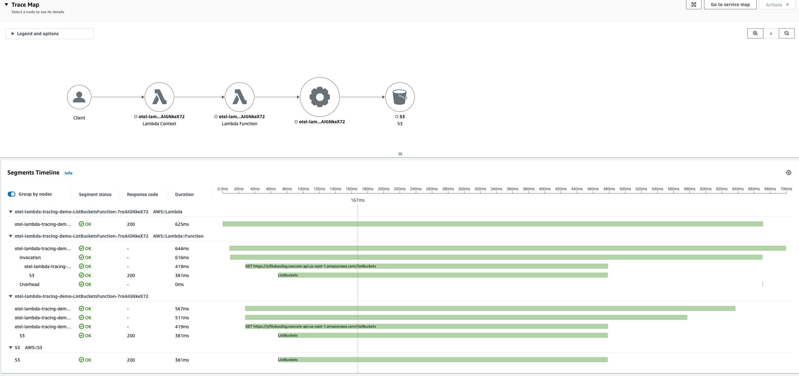

# OpenTelemetry를 활용한 AWS Lambda 기반 서버리스 Observability

이 가이드에서는 관리형 오픈소스 도구와 기술을 AWS X-Ray, Amazon CloudWatch 같은 네이티브 AWS 모니터링 서비스와 함께 사용하여 Lambda 기반 서버리스 애플리케이션의 Observability를 구성하는 모범 사례를 다룹니다. [AWS Distro for OpenTelemetry (ADOT)](https://aws-otel.github.io/docs/introduction), [AWS X-Ray](https://aws.amazon.com/xray), [Amazon Managed Service for Prometheus (AMP)](https://aws.amazon.com/prometheus/) 같은 도구와 이를 활용하여 서버리스 애플리케이션에 대한 실행 가능한 인사이트를 확보하고, 문제를 해결하며, 애플리케이션 성능을 최적화하는 방법을 설명합니다.

## **다루는 주요 주제**

이 Observability 모범 사례 가이드의 이번 섹션에서는 다음 주제를 심층적으로 다룹니다:

* AWS Distro for OpenTelemetry (ADOT) 및 ADOT Lambda Layer 소개
* ADOT Lambda Layer를 사용한 Lambda 함수 자동 계측
* ADOT Collector의 커스텀 구성 지원
* Amazon Managed Service for Prometheus (AMP)와의 통합
* ADOT Lambda Layer 사용의 장단점
* ADOT 사용 시 콜드 스타트 지연 관리


## **AWS Distro for OpenTelemetry (ADOT) 소개**

[AWS Distro for OpenTelemetry (ADOT)](https://aws-otel.github.io/docs/introduction)는 Cloud Native Computing Foundation (CNCF)의 [OpenTelemetry (OTel)](https://opentelemetry.io/) 프로젝트를 기반으로 한 안전하고 프로덕션에 사용 가능한 AWS 지원 배포판입니다. ADOT를 사용하면 애플리케이션을 한 번만 계측하여 상관된 메트릭과 트레이스를 여러 모니터링 솔루션으로 전송할 수 있습니다.

AWS의 관리형 [OpenTelemetry Lambda Layer](https://aws-otel.github.io/docs/getting-started/lambda)는 [OpenTelemetry Lambda Layer](https://github.com/open-telemetry/opentelemetry-lambda)를 활용하여 텔레메트리 데이터를 내보냅니다. AWS Lambda 함수를 래핑하고, 런타임별 OpenTelemetry SDK, 축소된 버전의 ADOT Collector, AWS Lambda 함수 자동 계측을 위한 기본 구성을 패키징하여 플러그 앤 플레이 사용자 경험을 제공합니다. ADOT Lambda Layer의 Collector 컴포넌트인 Receivers, Exporters, Extensions는 Amazon CloudWatch, Amazon OpenSearch Service, Amazon Managed Service for Prometheus, AWS X-Ray 등과의 통합을 지원합니다. 전체 목록은 [여기](https://github.com/aws-observability/aws-otel-lambda)에서 확인하세요. ADOT는 [파트너 솔루션](https://aws.amazon.com/otel/partners)과의 통합도 지원합니다.

ADOT Lambda Layer는 자동 계측(Python, NodeJS, Java 지원)과 특정 라이브러리 및 SDK에 대한 커스텀 계측을 모두 지원합니다. 자동 계측의 경우 기본적으로 Lambda Layer가 AWS X-Ray로 트레이스를 내보내도록 구성됩니다. 커스텀 계측의 경우에는 해당 [OpenTelemetry 런타임 계측 저장소](https://github.com/open-telemetry)에서 관련 라이브러리 계측을 포함하고, 함수에서 이를 초기화하도록 코드를 수정해야 합니다.

## **ADOT Lambda Layer를 사용한 AWS Lambda 자동 계측**

ADOT Lambda Layer를 사용하면 코드 변경 없이 Lambda 함수의 자동 계측을 쉽게 활성화할 수 있습니다. 기존 Java 기반 Lambda 함수에 ADOT Lambda Layer를 추가하고 CloudWatch에서 실행 로그와 트레이스를 확인하는 예제를 살펴보겠습니다.

1. [문서](https://aws-otel.github.io/docs/getting-started/lambda)에 따라 `runtime`, `region`, `arch type`을 기반으로 Lambda Layer의 ARN을 선택합니다. Lambda 함수와 동일한 리전의 Lambda Layer를 사용해야 합니다. 예를 들어, Java 자동 계측용 Lambda Layer는 `arn:aws:lambda:us-east-1:901920570463:layer:aws-otel-java-agent-x86_64-ver-1-28-1:1`입니다.
2. AWS 콘솔 또는 원하는 IaC를 통해 Lambda 함수에 Layer를 추가합니다.
    * AWS 콘솔을 사용하는 경우, [지침](https://docs.aws.amazon.com/lambda/latest/dg/adding-layers.html)에 따라 Lambda 함수에 Layer를 추가합니다. **Specify an ARN** 에서 위에서 선택한 Layer ARN을 붙여넣습니다.
    * IaC 옵션을 사용하는 경우, Lambda 함수의 SAM 템플릿은 다음과 같습니다:
    ```
    Layers:
    - !Sub arn:aws:lambda:${AWS::Region}:901920570463:layer:aws-otel-java-agent-arm64-ver-1-28-1:1
    ```
3. Lambda 함수에 환경 변수를 추가합니다. Node.js 또는 Java의 경우 `AWS_LAMBDA_EXEC_WRAPPER=/opt/otel-handler`, Python의 경우 `AWS_LAMBDA_EXEC_WRAPPER=/opt/otel-instrument`를 설정합니다.
4. Lambda 함수에서 Active Tracing을 활성화합니다. **`참고`**: 기본적으로 Layer는 AWS X-Ray로 트레이스를 내보내도록 구성됩니다. Lambda 함수의 실행 역할에 필요한 AWS X-Ray 권한이 있는지 확인하세요. AWS Lambda의 AWS X-Ray 권한에 대한 자세한 내용은 [AWS Lambda 문서](https://docs.aws.amazon.com/lambda/latest/dg/services-xray.html#services-xray-permissions)를 참고하세요.
    * `Tracing: Active`
5. Lambda Layer 구성, 환경 변수, X-Ray 트레이싱이 포함된 SAM 템플릿 예제는 다음과 같습니다:
```
Resources:
  ListBucketsFunction:
    Type: AWS::Serverless::Function
    Properties:
      Handler: com.example.App::handleRequest
      ...
      ProvisionedConcurrencyConfig:
        ProvisionedConcurrentExecutions: 1
      Policies:
        - AWSXrayWriteOnlyAccess
        - AmazonS3ReadOnlyAccess
      Environment:
        Variables:
          AWS_LAMBDA_EXEC_WRAPPER: /opt/otel-handler
      Tracing: Active
      Layers:
        - !Sub arn:aws:lambda:${AWS::Region}:901920570463:layer:aws-otel-java-agent-amd64-ver-1-28-1:1
      Events:
        HelloWorld:
          Type: Api
          Properties:
            Path: /listBuckets
            Method: get
```
6. AWS X-Ray에서 트레이스 테스트 및 시각화
Lambda 함수를 직접 또는 API를 통해(트리거로 API가 구성된 경우) 호출합니다. 예를 들어, API를 통해 Lambda 함수를 호출하면(`curl` 사용) 아래와 같은 로그가 생성됩니다:
```
curl -X GET https://XXXXXX.execute-api.us-east-1.amazonaws.com/Prod/listBuckets
```
Lambda 함수 로그:
<pre><code>
OpenJDK 64-Bit Server VM warning: Sharing is only supported for boot loader classes because bootstrap classpath has been appended
[otel.javaagent 2023-09-24 15:28:16:862 +0000] [main] INFO io.opentelemetry.javaagent.tooling.VersionLogger - opentelemetry-javaagent - version: 1.28.0-adot-lambda1-aws
EXTENSION Name: collector State: Ready Events: [INVOKE, SHUTDOWN]
START RequestId: ed8f8444-3c29-40fe-a4a1-aca7af8cd940 Version: 3
...
END RequestId: ed8f8444-3c29-40fe-a4a1-aca7af8cd940
REPORT RequestId: ed8f8444-3c29-40fe-a4a1-aca7af8cd940 Duration: 5144.38 ms Billed Duration: 5145 ms Memory Size: 1024 MB Max Memory Used: 345 MB Init Duration: 27769.64 ms
<b>XRAY TraceId: 1-65105691-384f7da75714148655fa631b SegmentId: 2c52a147021ebd20 Sampled: true</b>
</code></pre>

로그에서 볼 수 있듯이, OpenTelemetry Lambda 확장이 리스닝을 시작하고 opentelemetry-javaagent를 사용하여 Lambda 함수를 계측하며 AWS X-Ray에 트레이스를 생성합니다.

위 Lambda 함수 호출의 트레이스를 확인하려면 AWS X-Ray 콘솔로 이동하여 Traces에서 트레이스 ID를 선택합니다. 아래와 같이 Trace Map과 Segments Timeline을 확인할 수 있습니다:



## **ADOT Collector의 커스텀 구성 지원**

ADOT Lambda Layer는 OpenTelemetry SDK와 ADOT Collector 컴포넌트를 모두 결합합니다. ADOT Collector의 구성은 OpenTelemetry 표준을 따릅니다. 기본적으로 ADOT Lambda Layer는 텔레메트리 데이터를 AWS X-Ray로 내보내는 [config.yaml](https://github.com/aws-observability/aws-otel-lambda/blob/main/adot/collector/config.yaml)을 사용합니다. 그러나 ADOT Lambda Layer는 다른 Exporter도 지원하여 메트릭과 트레이스를 다른 대상으로 전송할 수 있습니다. 커스텀 구성에 지원되는 사용 가능한 컴포넌트의 전체 목록은 [여기](https://github.com/aws-observability/aws-otel-lambda/blob/main/README.md#adot-lambda-layer-available-components)에서 확인하세요.

## **Amazon Managed Service for Prometheus (AMP)와의 통합**

커스텀 Collector 구성을 사용하여 Lambda 함수에서 Amazon Managed Prometheus (AMP)로 메트릭을 내보낼 수 있습니다.

1. 위의 자동 계측 단계를 따라 Lambda Layer를 구성하고 환경 변수 `AWS_LAMBDA_EXEC_WRAPPER`를 설정합니다.
2. [지침](https://docs.aws.amazon.com/prometheus/latest/userguide/AMP-onboard-create-workspace.html)에 따라 Lambda 함수가 메트릭을 전송할 AWS 계정에 Amazon Managed Prometheus 워크스페이스를 생성합니다. AMP 워크스페이스의 `Endpoint - remote write URL`을 기록해 두세요. ADOT Collector 구성에 필요합니다.
3. Lambda 함수의 루트 디렉토리에 이전 단계의 AMP 엔드포인트 remote write URL을 포함한 커스텀 ADOT Collector 구성 파일(예: `collector.yaml`)을 생성합니다. S3 버킷에서 구성 파일을 로드할 수도 있습니다.
ADOT Collector 구성 파일 예제:
```
#collector.yaml in the root directory
#Set an environemnt variable 'OPENTELEMETRY_COLLECTOR_CONFIG_FILE' to '/var/task/collector.yaml'

extensions:
  sigv4auth:
    service: "aps"
    region: "<workspace_region>"

receivers:
  otlp:
    protocols:
      grpc:
      http:

exporters:
  logging:
  prometheusremotewrite:
    endpoint: "<workspace_remote_write_url>"
    namespace: test
    auth:
      authenticator: sigv4auth

service:
  extensions: [sigv4auth]
  pipelines:
    traces:
      receivers: [otlp]
      exporters: [awsxray]
    metrics:
      receivers: [otlp]
      exporters: [logging, prometheusremotewrite]
```
Prometheus Remote Write Exporter는 retry 및 timeout 설정으로도 구성할 수 있습니다. 자세한 내용은 [문서](https://github.com/open-telemetry/opentelemetry-collector-contrib/blob/main/exporter/prometheusremotewriteexporter/README.md)를 참고하세요. **`참고`**: `sigv4auth` 확장의 Service 값은 `aps`(Amazon Prometheus Service)여야 합니다. 또한 Lambda 함수의 실행 역할에 필요한 AMP 권한이 있는지 확인하세요. AWS Lambda에 대한 AMP 권한 및 정책에 대한 자세한 내용은 Amazon Managed Service for Prometheus [문서](https://docs.aws.amazon.com/prometheus/latest/userguide/AMP-and-IAM.html#AMP-IAM-policies-built-in)를 참고하세요.

4. 환경 변수 `OPENTELEMETRY_COLLECTOR_CONFIG_FILE`을 추가하고 구성 파일의 경로로 값을 설정합니다. 예: /var/task/`<구성 파일 경로>`.yaml. 이는 Lambda Layer 확장에 Collector 구성을 어디에서 찾을 수 있는지 알려줍니다.
```
Function:
    Type: AWS::Serverless::Function
    Properties:
      ...
      Environment:
        Variables:
          OPENTELEMETRY_COLLECTOR_CONFIG_FILE: /var/task/collector.yaml
```
5. OpenTelemetry Metrics API를 사용하여 메트릭을 추가하도록 Lambda 함수 코드를 업데이트합니다. 예제는 여기를 확인하세요.
```
// get meter
Meter meter = GlobalOpenTelemetry.getMeterProvider()
    .meterBuilder("aws-otel")
    .setInstrumentationVersion("1.0")
    .build();

// Build counter e.g. LongCounter
LongCounter counter = meter
    .counterBuilder("processed_jobs")
    .setDescription("Processed jobs")
    .setUnit("1")
    .build();

// It is recommended that the API user keep a reference to Attributes they will record against
Attributes attributes = Attributes.of(stringKey("Key"), "SomeWork");

// Record data
counter.add(123, attributes);
```

## **ADOT Lambda Layer 사용의 장단점**

Lambda 함수에서 AWS X-Ray로 트레이스를 전송하려면 [X-Ray SDK](https://docs.aws.amazon.com/xray/latest/devguide/xray-sdk-nodejs.html) 또는 [AWS Distro for OpenTelemetry (ADOT) Lambda Layer](https://aws-otel.github.io/docs/getting-started/lambda)를 사용할 수 있습니다. X-Ray SDK는 다양한 AWS 서비스의 간편한 계측을 지원하지만, X-Ray로만 트레이스를 전송할 수 있습니다. 반면 Lambda Layer의 일부로 포함된 ADOT Collector는 각 언어에 대해 많은 수의 라이브러리 계측을 지원합니다. 이를 사용하여 메트릭과 트레이스를 AWS X-Ray와 Amazon CloudWatch, Amazon OpenSearch Service, Amazon Managed Service for Prometheus, 기타 [파트너](https://aws-otel.github.io/docs/components/otlp-exporter#appdynamics) 솔루션 같은 여러 모니터링 솔루션으로 수집하고 전송할 수 있습니다.

그러나 ADOT가 제공하는 유연성으로 인해 Lambda 함수에 추가 메모리가 필요할 수 있으며, 콜드 스타트 지연에 상당한 영향을 미칠 수 있습니다. 따라서 Lambda 함수를 저지연으로 최적화하고 있고 OpenTelemetry의 고급 기능이 필요하지 않다면, ADOT보다 AWS X-Ray SDK를 사용하는 것이 더 적합할 수 있습니다. 올바른 트레이싱 도구를 선택하는 방법에 대한 자세한 비교와 안내는 [ADOT와 X-Ray SDK 선택하기](https://docs.aws.amazon.com/xray/latest/devguide/xray-instrumenting-your-app.html#xray-instrumenting-choosing)에 대한 AWS 문서를 참고하세요.


## **ADOT 사용 시 콜드 스타트 지연 관리**
Java용 ADOT Lambda Layer는 에이전트 기반이므로, 자동 계측을 활성화하면 Java Agent가 OTel에서 [지원하는](https://github.com/open-telemetry/opentelemetry-java-instrumentation/tree/main/instrumentation) 모든 라이브러리를 계측하려고 시도합니다. 이로 인해 Lambda 함수의 콜드 스타트 지연이 크게 증가합니다. 따라서 애플리케이션에서 사용하는 라이브러리/프레임워크에 대해서만 자동 계측을 활성화하는 것을 권장합니다.

특정 계측만 활성화하려면 다음 환경 변수를 사용할 수 있습니다:

* `OTEL_INSTRUMENTATION_COMMON_DEFAULT_ENABLED`: false로 설정하면 Layer의 자동 계측이 비활성화되며, 각 계측을 개별적으로 활성화해야 합니다.
* `OTEL_INSTRUMENTATION_<NAME>_ENABLED`: true로 설정하면 특정 라이브러리 또는 프레임워크에 대한 자동 계측이 활성화됩니다. "NAME"을 활성화하려는 계측으로 교체하세요. 사용 가능한 계측 목록은 특정 에이전트 계측 억제를 참고하세요.

예를 들어, Lambda와 AWS SDK에 대해서만 자동 계측을 활성화하려면 다음 환경 변수를 설정합니다:
```
OTEL_INSTRUMENTATION_COMMON_DEFAULT_ENABLED=false
OTEL_INSTRUMENTATION_AWS_LAMBDA_ENABLED=true
OTEL_INSTRUMENTATION_AWS_SDK_ENABLED=true
```

## **추가 리소스**

* [OpenTelemetry](https://opentelemetry.io)
* [AWS Distro for OpenTelemetry (ADOT)](https://aws-otel.github.io/docs/introduction)
* [ADOT Lambda Layer](https://aws-otel.github.io/docs/getting-started/lambda)

## **요약**

이 오픈소스 기술을 활용한 AWS Lambda 기반 서버리스 애플리케이션을 위한 Observability 모범 사례 가이드에서는 AWS Distro for OpenTelemetry (ADOT)와 Lambda Layer를 다루고, 이를 사용하여 AWS Lambda 함수를 계측하는 방법을 설명했습니다. 간단한 구성만으로 자동 계측을 쉽게 활성화하고 ADOT Collector를 커스터마이즈하여 Observability 신호를 여러 대상으로 전송하는 방법을 다뤘습니다. ADOT 사용의 장단점과 Lambda 함수의 콜드 스타트 지연에 미치는 영향을 강조하고, 콜드 스타트 시간을 관리하기 위한 모범 사례도 권장했습니다. 이러한 모범 사례를 채택하면 애플리케이션을 한 번만 계측하여 로그, 메트릭, 트레이스를 벤더에 종속되지 않는 방식으로 여러 모니터링 솔루션에 전송할 수 있습니다.

더 깊은 학습을 위해, [AWS One Observability Workshop](https://catalog.workshops.aws/observability/en-US)의 AWS 관리형 오픈소스 Observability 모듈을 직접 실습해 보시길 강력히 권장합니다.
