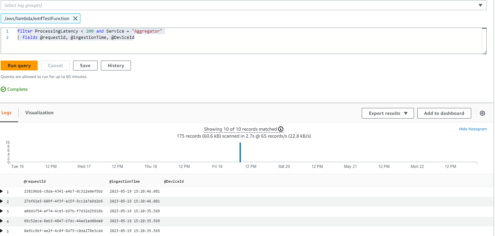

# CloudWatch Embedded Metric Format

## 소개

CloudWatch Embedded Metric Format(EMF)을 사용하면 복잡한 고카디널리티 애플리케이션 데이터를 로그 형태로 Amazon CloudWatch에 수집하고, 이를 기반으로 실행 가능한 metrics를 생성할 수 있습니다. Embedded Metric Format을 활용하면 복잡한 아키텍처에 의존하거나 서드파티 도구를 사용하지 않고도 환경에 대한 인사이트를 얻을 수 있습니다. 이 기능은 모든 환경에서 사용할 수 있지만, 특히 AWS Lambda 함수나 Amazon Elastic Container Service(Amazon ECS), Amazon Elastic Kubernetes Service(Amazon EKS), EC2 기반 Kubernetes의 컨테이너처럼 수명이 짧은 리소스를 사용하는 워크로드에 유용합니다. Embedded Metric Format을 사용하면 별도의 코드를 계측하거나 유지보수할 필요 없이 커스텀 metrics를 손쉽게 생성할 수 있으며, 동시에 로그 데이터에 대한 강력한 분석 기능을 활용할 수 있습니다.

## Embedded Metric Format (EMF) 로그의 작동 방식

Amazon EC2, 온프레미스 서버, Amazon Elastic Container Service(Amazon ECS), Amazon Elastic Kubernetes Service(Amazon EKS), EC2 기반 Kubernetes의 컨테이너와 같은 컴퓨팅 환경에서는 CloudWatch Agent를 통해 Embedded Metric Format(EMF) 로그를 생성하여 Amazon CloudWatch로 전송할 수 있습니다.

AWS Lambda에서는 별도의 커스텀 코드 없이도 손쉽게 커스텀 metrics를 생성할 수 있으며, 블로킹 네트워크 호출이나 서드파티 소프트웨어에 의존하지 않고 Embedded Metric Format(EMF) 로그를 Amazon CloudWatch에 수집할 수 있습니다.

[EMF 사양](https://docs.aws.amazon.com/AmazonCloudWatch/latest/monitoring/CloudWatch_Embedded_Metric_Format_Specification.html)에 맞는 구조화된 로그를 발행할 때 별도의 헤더 선언 없이도 상세한 로그 이벤트 데이터와 함께 커스텀 metrics를 비동기적으로 임베드할 수 있습니다. CloudWatch는 커스텀 metrics를 자동으로 추출하므로, 실시간 장애 감지를 위한 시각화 및 알람 설정이 가능합니다. 추출된 metrics와 연관된 상세 로그 이벤트 및 고카디널리티 컨텍스트는 CloudWatch Logs Insights를 사용하여 쿼리할 수 있어 운영 이벤트의 근본 원인에 대한 심층적인 인사이트를 제공합니다.

[Fluent Bit](https://docs.fluentbit.io/manual/pipeline/outputs/cloudwatch)용 Amazon CloudWatch 출력 플러그인을 사용하면 [Embedded Metric Format](https://github.com/aws/aws-for-fluent-bit)(EMF) 지원을 포함하여 metrics 및 로그 데이터를 Amazon CloudWatch 서비스로 수집할 수 있습니다.


## Embedded Metric Format (EMF) 로그를 사용해야 하는 경우

전통적으로 모니터링은 세 가지 범주로 구분되어 왔습니다. 첫 번째는 애플리케이션의 기본 상태 점검입니다. 두 번째는 'metrics'로, 카운터, 타이머, 게이지와 같은 모델을 사용하여 애플리케이션을 계측하는 것입니다. 세 번째는 '로그'로, 애플리케이션의 전반적인 Observability에 매우 중요한 역할을 합니다. 로그는 애플리케이션의 동작에 대한 지속적인 정보를 제공합니다. 이제 Embedded Metric Format(EMF) 로그를 통해 데이터의 세밀함이나 풍부함을 희생하지 않으면서도 애플리케이션의 모든 계측을 통합하고 단순화하여, 뛰어난 분석 역량과 함께 애플리케이션을 관찰하는 방식을 크게 개선할 수 있습니다.

[Embedded Metric Format(EMF) 로그](https://aws.amazon.com/blogs/mt/enhancing-workload-observability-using-amazon-cloudwatch-embedded-metric-format/)는 고카디널리티 애플리케이션 데이터를 생성하는 환경에 이상적입니다. metric 차원을 늘리지 않고도 해당 데이터를 EMF 로그에 포함할 수 있기 때문입니다. 이를 통해 모든 속성을 metric 차원으로 설정하지 않아도 CloudWatch Logs Insights와 CloudWatch Metrics Insights를 사용하여 EMF 로그를 쿼리하고 애플리케이션 데이터를 다양한 관점에서 분석할 수 있습니다.

[수백만 대의 통신 또는 IoT 디바이스로부터 텔레메트리 데이터를 집계](https://aws.amazon.com/blogs/mt/how-bt-uses-amazon-cloudwatch-to-monitor-millions-of-devices/)하는 고객은 디바이스 성능에 대한 인사이트와 디바이스가 보고하는 고유한 텔레메트리를 신속하게 심층 분석할 수 있는 능력이 필요합니다. 또한 양질의 서비스를 제공하기 위해 방대한 데이터를 일일이 살펴보지 않고도 문제를 더 쉽고 빠르게 해결해야 합니다. Embedded Metric Format(EMF) 로그를 사용하면 metrics와 로그를 하나의 엔티티로 결합하여 대규모 Observability를 달성하고, 비용 효율성과 향상된 성능으로 문제 해결을 개선할 수 있습니다.

## Embedded Metric Format (EMF) 로그 생성

다음 방법을 사용하여 Embedded Metric Format 로그를 생성할 수 있습니다.

1. 오픈소스 클라이언트 라이브러리를 사용하여 에이전트([CloudWatch](https://docs.aws.amazon.com/AmazonCloudWatch/latest/monitoring/CloudWatch_Embedded_Metric_Format_Generation_CloudWatch_Agent.html), Fluent-Bit, Firelens 등)를 통해 EMF 로그를 생성하고 전송합니다.

   - EMF 로그를 생성하는 데 사용할 수 있는 오픈소스 클라이언트 라이브러리는 다음 언어로 제공됩니다.
     - [Node.Js](https://github.com/awslabs/aws-embedded-metrics-node)
     - [Python](https://github.com/awslabs/aws-embedded-metrics-python)
     - [Java](https://github.com/awslabs/aws-embedded-metrics-java)
     - [C#](https://github.com/awslabs/aws-embedded-metrics-dotnet)
   - AWS Distro for OpenTelemetry(ADOT)를 사용하여 EMF 로그를 생성할 수도 있습니다. ADOT는 Cloud Native Computing Foundation(CNCF)의 OpenTelemetry 프로젝트를 기반으로 한 안전하고 프로덕션에 적합한 AWS 지원 배포판입니다. OpenTelemetry는 벤더 고유 형식 간의 경계와 제한을 제거하면서 애플리케이션 모니터링을 위한 분산 트레이스, 로그, metrics를 수집하는 API, 라이브러리, 에이전트를 제공하는 오픈소스 이니셔티브입니다. 이를 위해 OpenTelemetry 호환 데이터 소스와 [CloudWatch EMF](https://aws-otel.github.io/docs/getting-started/cloudwatch-metrics#cloudwatch-emf-exporter-awsemf) 로그용으로 활성화된 [ADOT Collector](https://github.com/open-telemetry/opentelemetry-collector-contrib/tree/main/exporter/awsemfexporter), 두 가지 구성 요소가 필요합니다.

2. [JSON 형식의 정의된 사양](https://docs.aws.amazon.com/AmazonCloudWatch/latest/monitoring/CloudWatch_Embedded_Metric_Format_Specification.html)에 맞게 수동으로 구성한 로그를 [CloudWatch agent](https://docs.aws.amazon.com/AmazonCloudWatch/latest/monitoring/CloudWatch_Embedded_Metric_Format_Generation_CloudWatch_Agent.html) 또는 [PutLogEvents API](https://docs.aws.amazon.com/AmazonCloudWatch/latest/monitoring/CloudWatch_Embedded_Metric_Format_Generation_PutLogEvents.html)를 통해 CloudWatch로 전송할 수 있습니다.

## CloudWatch 콘솔에서 Embedded Metric Format 로그 보기

Embedded Metric Format(EMF) 로그를 생성하여 metrics를 추출한 후, CloudWatch 콘솔의 Metrics 아래에서 [해당 metrics를 확인](https://docs.aws.amazon.com/AmazonCloudWatch/latest/monitoring/CloudWatch_Embedded_Metric_Format_View.html)할 수 있습니다. 임베디드 metrics는 로그 생성 시 지정된 차원을 가집니다. 클라이언트 라이브러리를 사용하여 생성된 임베디드 metrics는 ServiceType, ServiceName, LogGroup을 기본 차원으로 갖습니다.

- **ServiceName**: 서비스 이름을 재정의할 수 있습니다. 다만 이름을 추론할 수 없는 서비스(예: EC2에서 실행되는 Java 프로세스)의 경우 명시적으로 설정하지 않으면 기본값으로 Unknown이 사용됩니다.
- **ServiceType**: 서비스 유형을 재정의할 수 있습니다. 다만 유형을 추론할 수 없는 서비스(예: EC2에서 실행되는 Java 프로세스)의 경우 명시적으로 설정하지 않으면 기본값으로 Unknown이 사용됩니다.
- **LogGroupName**: 에이전트 기반 플랫폼의 경우, metrics가 전달될 대상 로그 그룹을 선택적으로 설정할 수 있습니다. 이 값은 라이브러리에서 Embedded Metric 페이로드를 통해 에이전트에 전달됩니다. LogGroup을 지정하지 않으면 기본값은 서비스 이름에서 파생됩니다: -metrics
- **LogStreamName**: 에이전트 기반 플랫폼의 경우, metrics가 전달될 대상 로그 스트림을 선택적으로 설정할 수 있습니다. 이 값은 라이브러리에서 Embedded Metric 페이로드를 통해 에이전트에 전달됩니다. LogStreamName을 지정하지 않으면 기본값은 에이전트에 의해 결정됩니다(일반적으로 호스트네임이 됩니다).
- **NameSpace**: CloudWatch namespace를 재정의합니다. 설정하지 않으면 기본값으로 aws-embedded-metrics가 사용됩니다.

CloudWatch 콘솔 로그에서 EMF 로그의 예시는 다음과 같습니다.

```json
2023-05-19T15:20:39.391Z 238196b6-c8da-4341-a4b7-0c322e0ef5bb INFO
{
    "LogGroup": "emfTestFunction",
    "ServiceName": "emfTestFunction",
    "ServiceType": "AWS::Lambda::Function",
    "Service": "Aggregator",
    "AccountId": "XXXXXXXXXXXX",
    "RequestId": "422b1569-16f6-4a03-b8f0-fe3fd9b100f8",
    "DeviceId": "61270781-c6ac-46f1-baf7-22c808af8162",
    "Payload": {
        "sampleTime": 123456789,
        "temperature": 273,
        "pressure": 101.3
    },
    "executionEnvironment": "AWS_Lambda_nodejs18.x",
    "memorySize": "256",
    "functionVersion": "$LATEST",
    "logStreamId": "2023/05/19/[$LATEST]f3377848231140c185570caa9f97abc8",
    "_aws": {
        "Timestamp": 1684509639390,
        "CloudWatchMetrics": [
            {
                "Dimensions": [
                    [
                        "LogGroup",
                        "ServiceName",
                        "ServiceType",
                        "Service"
                    ]
                ],
                "Metrics": [
                    {
                        "Name": "ProcessingLatency",
                        "Unit": "Milliseconds"
                    }
                ],
                "Namespace": "aws-embedded-metrics"
            }
        ]
    },
    "ProcessingLatency": 100
}
```

동일한 EMF 로그에서 추출된 metrics는 아래와 같으며, **CloudWatch Metrics**에서 쿼리할 수 있습니다.


**CloudWatch Logs Insights**를 사용하여 추출된 metrics와 연관된 상세 로그 이벤트를 쿼리하면 운영 이벤트의 근본 원인에 대한 심층적인 인사이트를 얻을 수 있습니다. EMF 로그에서 metrics를 추출하는 주요 이점 중 하나는 고유한 metric(metric 이름과 고유 차원 조합) 및 metric 값으로 로그를 필터링하여 집계된 metric 값에 기여한 이벤트의 컨텍스트를 파악할 수 있다는 것입니다.

위에서 설명한 동일한 EMF 로그에 대해, ProcessingLatency를 metric으로 하고 Service를 차원으로 사용하여 영향을 받은 request id 또는 device id를 조회하는 예시 쿼리가 아래에 CloudWatch Logs Insights 샘플 쿼리로 나와 있습니다.

```json
filter ProcessingLatency < 200 and Service = "Aggregator"
| fields @requestId, @ingestionTime, @DeviceId
```



## EMF 로그로 생성된 metrics에 대한 알람

[EMF로 생성된 metrics에 대한 알람 생성](https://docs.aws.amazon.com/AmazonCloudWatch/latest/monitoring/CloudWatch_Embedded_Metric_Format_Alarms.html)은 다른 일반 metrics에 알람을 생성하는 것과 동일한 패턴을 따릅니다. 여기서 주의할 점은 EMF metric 생성이 로그 발행 흐름에 의존한다는 것입니다. CloudWatch Logs가 EMF 로그를 처리하여 metrics로 변환하기 때문입니다. 따라서 알람이 평가되는 기간 내에 metric 데이터 포인트가 생성되도록 로그를 적시에 발행하는 것이 중요합니다.

위에서 설명한 동일한 EMF 로그에 대해, ProcessingLatency metric을 데이터 포인트로 사용하고 임계값을 설정하여 생성한 알람 예시가 아래에 나와 있습니다.


## EMF 로그의 최신 기능

[PutLogEvents API](https://docs.aws.amazon.com/AmazonCloudWatch/latest/monitoring/CloudWatch_Embedded_Metric_Format_Generation_PutLogEvents.html)를 사용하여 EMF 로그를 CloudWatch Logs로 전송할 때 HTTP 헤더 `x-amzn-logs-format: json/emf`를 선택적으로 포함하여 CloudWatch Logs에 metrics 추출을 지시할 수 있지만, 이제 이 헤더는 더 이상 필수가 아닙니다.

Amazon CloudWatch는 Embedded Metric Format(EMF)을 사용하여 구조화된 로그에서 최대 1초 단위의 [고해상도 metric 추출](https://aws.amazon.com/about-aws/whats-new/2023/02/amazon-cloudwatch-high-resolution-metric-extraction-structured-logs/)을 지원합니다. EMF 사양 로그 내에 선택적으로 [StorageResolution](https://docs.aws.amazon.com/AmazonCloudWatch/latest/monitoring/cloudwatch_concepts.html#Resolution_definition) 파라미터를 제공할 수 있으며, 값으로 1 또는 60(기본값)을 지정하여 원하는 metric 해상도(초 단위)를 나타냅니다. EMF를 통해 표준 해상도(60초)와 고해상도(1초) metrics를 모두 발행할 수 있어 애플리케이션의 상태와 성능에 대한 세밀한 가시성을 확보할 수 있습니다.

Amazon CloudWatch는 Embedded Metric Format(EMF)에서 두 가지 오류 metrics([EMFValidationErrors 및 EMFParsingErrors](https://docs.aws.amazon.com/AmazonCloudWatch/latest/logs/CloudWatch-Logs-Monitoring-CloudWatch-Metrics.html))를 통해 [오류에 대한 향상된 가시성](https://aws.amazon.com/about-aws/whats-new/2023/01/amazon-cloudwatch-enhanced-error-visibility-embedded-metric-format-emf/)을 제공합니다. 이 향상된 가시성을 통해 EMF 활용 시 오류를 신속하게 식별하고 수정할 수 있어 계측 프로세스가 간소화됩니다.

최신 애플리케이션의 관리가 점점 복잡해지면서 커스텀 metrics를 정의하고 분석할 때 더 많은 유연성이 필요해졌습니다. 이에 따라 metric 차원의 최대 개수가 10개에서 30개로 늘어났습니다. [최대 30개 차원의 EMF 로그](https://aws.amazon.com/about-aws/whats-new/2022/08/amazon-cloudwatch-metrics-increases-throughput/)를 사용하여 커스텀 metrics를 생성할 수 있습니다.

## 추가 참고 자료:

- NodeJS 라이브러리를 사용한 [AWS Lambda 함수에서의 Embedded Metric Format](https://catalog.workshops.aws/observability/en-US/aws-native/metrics/emf/clientlibrary) 샘플을 다루는 One Observability Workshop
- [Embedded Metrics Format을 사용한 비동기 metrics](https://serverless-observability.workshop.aws/en/030_cloudwatch/async_metrics_emf.html)(EMF)를 다루는 Serverless Observability Workshop
- EMF 로그를 CloudWatch Logs로 전송하기 위한 [PutLogEvents API를 사용한 Java 코드 샘플](https://catalog.workshops.aws/observability/en-US/aws-native/metrics/emf/putlogevents)
- 블로그 글: [Amazon CloudWatch embedded custom metrics로 비용을 절감하고 고객에 집중하기](https://aws.amazon.com/blogs/mt/lowering-costs-and-focusing-on-our-customers-with-amazon-cloudwatch-embedded-custom-metrics/)
