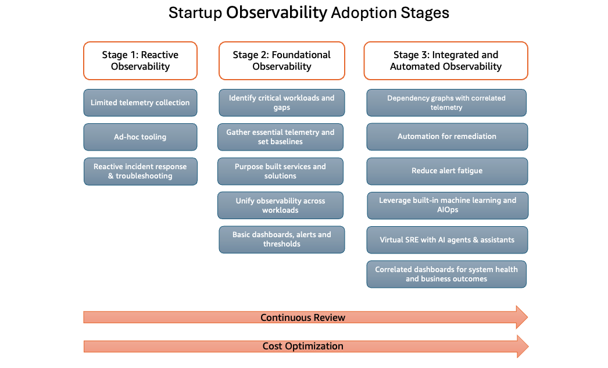

스타트업 Observability 도입 단계는 스타트업이 Observability 역량을 평가하고 발전시키기 위한 구조화된 프레임워크를 제공합니다. 이 프레임워크는 세 가지 뚜렷한 단계로 구성되며, 각 단계는 이전 단계를 기반으로 점점 더 높은 운영 가시성을 만들어냅니다.

모든 단계에 걸쳐 조직은 기본 원칙으로서 **지속적 검토**와 **비용 최적화**에 초점을 유지해야 합니다.

## 1단계: 반응적 Observability

대부분의 스타트업이 시작하는 단계로, Observability 관행이 대체로 반응적 성격을 띱니다. 이 단계의 조직은 일반적으로 제한된 리소스로 운영되며 주로 즉각적인 운영 요구에 초점을 맞춥니다.

### 주요 특징:

1. **제한된 텔레메트리 수집:** 기본적인 메트릭, 로그, 트레이스를 수집하지만, 시스템 전반에 걸쳐 커버리지가 불완전하고 종종 일관성이 없습니다. 데이터 수집이 간헐적이거나 가장 중요한 구성 요소에만 집중될 수 있습니다.
2. **임시방편적 도구 사용:** 모니터링 솔루션이 필요에 따라 구현되어 팀 간에 분절된 도구셋을 만들어냅니다. 팀은 표준화 없이 무료 등급 제공, 오픈소스 솔루션, 또는 제한적 통합이나 통합 없는 내장 클라우드 제공자 도구에 의존할 수 있습니다.
3. **반응적 인시던트 대응 및 문제 해결:** 문제는 일반적으로 사전 탐지가 아닌 고객 불만이나 시스템 장애를 통해 발견됩니다. 문제 해결은 수동적이고 시간 집약적이며 개별 팀원의 지식과 전문성에 의존합니다.

### 일반적인 과제:

1. 긴 평균 탐지 시간(MTTD) 및 해결 시간(MTTR)
2. 문제 재현 및 진단의 어려움
3. 추세 분석을 위한 제한된 히스토리 데이터
4. 엔지니어링 팀 내 지식 사일로

## 2단계: 기초적 Observability

이 단계는 반응적 접근 방식에서 의도적인 Observability 전략으로의 전환을 의미합니다. 스타트업은 모니터링에 대한 체계적인 접근 방식을 구현하고 확장 가능한 Observability 관행의 기반을 구축하기 시작합니다.

### 주요 특징:

1. **중요 워크로드 및 격차 식별:** 스타트업은 고객 경험, 매출, 핵심 운영에 가장 큰 영향을 미치는 시스템과 같은 중요 워크로드를 정의하고, 비즈니스 및 기술 이해관계자 간의 협업을 통해 기존 Observability 격차를 분석하는 것부터 시작해야 합니다. 체계적인 체크리스트 또는 템플릿을 구축하면 다음과 같습니다:
	- 중요 흐름(예: 전자상거래 스타트업의 회원가입, 결제, 결제 처리)을 정의하고 관련 서비스, 데이터 저장소, 종속성을 매핑하는 체계적 체크리스트를 구축합니다.
	- 책임을 위해 엔지니어링 및 비즈니스 소유자를 지정한 후, 각 워크로드에 대한 핵심 기술 신호(지연 시간, 오류, 사용률 메트릭)를 정의하고 메트릭, 로그 또는 트레이스가 누락되거나 사일로화된 부분을 표시합니다.
	- 주문 완료율이나 결제 이탈률과 같은 비즈니스 KPI를 각 워크로드에 매핑하여 기술적 및 비즈니스 관점 모두에서 완전한 Observability 커버리지를 보장합니다.

2. **필수 텔레메트리 수집 및 기준선 설정:** 메트릭, 로그, 트레이스를 수집하면 비즈니스 및 엔지니어링 팀에게 워크로드 성능에 대한 통합된 뷰를 제공하여 조기 이상 탐지와 더 빠른 근본 원인 분석이 가능합니다. 시간이 지남에 따라 이 상관 데이터는 정상 동작에 대한 이해를 구축하여 알림 임계값을 미세 조정하고 노이즈를 줄이는 것이 더 쉬워집니다. 스타트업은 세 가지 핵심 카테고리에 걸쳐 일관된 메트릭을 추적하기 시작해야 합니다:
	- **핵심 서비스 상태**: 리소스 사용률(예: CPU, 메모리, DB 연결), 지연 시간(예: p95/p99 응답 시간), 트래픽(예: 초당 요청 수), 오류율(예: 4xx/5xx)
	- **안정성 및 가용성**: 가동 시간 및 SLO, 인시던트 메트릭(예: MTTR, 알림 볼륨), 고객 영향 지표(예: 실패한 사용자 작업, 지원 티켓)
	- **제품 및 비즈니스 메트릭**: 매출 속도, 거래 성공률, 이탈 및 유지율, 활성 세션, 테넌트당 비용 등 스타트업의 특정 산업과 도메인에 맞춰 조정

3. **목적 구축형 서비스 및 솔루션:** 관리형 AWS Observability 플랫폼을 활용하면 운영 오버헤드가 크게 줄어들고 스타트업의 Observability 도입이 가속화됩니다. 메트릭과 로그를 위한 Amazon CloudWatch와 분산 트레이싱을 위한 AWS X-Ray의 조합은 최소한의 구성으로 깊고 실시간적인 가시성을 제공합니다. CloudWatch Container Insights, Lambda Insights, Database Insights와 같은 목적 구축형 기능은 특정 워크로드 유형에 대한 쉬운 모니터링 설정을 가능하게 합니다. 완전 관리형 서비스는 Collector, 스토리지, 시각화 도구의 프로비저닝, 스케일링, 보안을 처리하면서 내장된 알림, 대시보드, 분석을 제공하여 커스텀 파이프라인의 필요성을 제거합니다. 핵심 AWS 서비스와의 긴밀한 통합은 워크로드가 진화함에 따라 더 빠른 인사이트-행동 루프를 가능하게 합니다. 비용 측면에서 종량제 요금과 모니터링 인프라를 관리하지 않아도 되는 숨겨진 절감(프로비저닝, 스케일링, 보안, 업그레이드할 클러스터 없음)을 결합하면 SRE 및 DevOps 팀이 Observability 인프라가 아닌 제품 기능과 고객 경험에 집중할 수 있는 기회를 제공합니다.

4. **워크로드 전반에 걸친 Observability 통합:** Observability는 팀, 제품 또는 환경별로 분절되기보다 모든 워크로드에 걸쳐 통합된 역량으로 구현될 때 스타트업에 가장 효과적입니다. 사일로화된 도구, 일관성 없는 데이터 스키마, 서로 다른 텔레메트리 프로토콜은 사용자 대면 증상에서 기본 근본 원인까지 문제를 추적하기 어렵게 만듭니다. 이 분절화는 인시던트를 탐지하고 해결하는 평균 시간을 증가시킵니다. 공유 데이터 모델, 일관된 명명 규칙, OpenTelemetry와 같은 표준 프레임워크를 통해 텔레메트리를 표준화하면 서비스와 환경 전반에 걸쳐 메트릭, 로그, 트레이스를 안정적으로 상관 분석할 수 있습니다. Amazon CloudWatch와 같은 확장 가능한 Observability 플랫폼을 채택하면 단일 진실의 원천을 제공하고, 다중 도구 복잡성을 줄이며, 비즈니스가 확장됨에 따라 더 빠르고 안정적인 인시던트 탐지 및 해결을 지원합니다.

5. **기본 대시보드, 알림, 임계값:** 기본 대시보드, 알림, 임계값 정의는 스타트업을 위한 첫 번째 구조화된 운영 가시성 계층을 형성합니다. Amazon CloudWatch는 핵심 AWS 서비스에 대한 메트릭, 정의된 임계값에 대해 메트릭을 평가하는 알람, 리전과 계정 전반에 걸쳐 시스템 상태를 시각화하는 대시보드 등 필수 기능을 기본 제공합니다. 이 기반을 통해 팀은 고객 불만을 통해 문제를 발견하는 것에서 인프라와 애플리케이션 신호를 통해 탐지하는 것으로 전환할 수 있습니다. 핵심 메트릭, 알람 상태, 추세를 보여주는 공유 CloudWatch Dashboard는 엔지니어, 제품 관리자, 리더에게 시스템 상태에 대한 공통된 이해를 제공하며, Amazon SNS 또는 인시던트 도구와 통합된 CloudWatch Alarms는 임계값 위반 시 즉각적인 알림을 제공합니다. CloudWatch 추천 알람은 관리형 서비스에 대한 모범 사례 메트릭과 임계값을 식별하는 데 도움을 줍니다. 이러한 기본 요소에 초기에 투자함으로써 스타트업은 소수의 서비스부터 복잡한 아키텍처까지 모니터링 기반의 복잡한 리팩토링 없이 확장되는 일관된 운영 인터페이스를 만들 수 있습니다.

### 일반적인 성과:

- 인시던트 대응 시간 단축
- 팀 간 협업 및 지식 공유 개선
- 표준화된 운영 절차
- 데이터 기반 의사결정을 위한 기반

## 3단계: 통합 및 자동화된 Observability

통합 및 자동화된 Observability는 스타트업이 정교한 도구, 자동화, 머신 러닝을 활용하여 운영 우수성을 달성하는 성숙한 Observability 관행을 나타냅니다. Observability가 기술 운영과 비즈니스 전략 모두에 깊이 통합됩니다.

### 주요 특징:

- **상관 텔레메트리가 포함된 종속성 그래프:** Amazon CloudWatch Application Signals, Application Maps, AWS X-Ray 트레이스 맵과 같은 AWS Observability 서비스를 활용하여 서비스, 다운스트림 종속성, 크로스 어카운트 상호 작용을 자동으로 검색하고 시각화합니다. 이 종속성 그래프는 서비스, 데이터 저장소, 외부 API, 인프라 구성 요소를 연결하는 경량 지식 그래프 역할을 합니다. 이 기반 위에 SLO와 중요 경로를 결합함으로써 팀은 폭발 반경을 빠르게 평가하고, 변경, 배포, 인시던트 중 잠재적 영향을 이해하며, 문제가 고객에게 도달하기 전에 리스크를 완화하기 위한 사전 조치를 취할 수 있습니다.

- **자동화된 교정:** AWS Observability 서비스를 사용하여 반복되는 알림을 분석하고 자동화된 교정 워크플로를 구현하여 운영 오버헤드를 줄이고 일관된 인시던트 대응을 보장합니다. Amazon EventBridge, AWS Lambda, AWS Systems Manager를 포함한 AWS 서비스를 오케스트레이션하여 정의된 알림 조건에 따라 자동화된 교정 작업을 트리거하고 실행합니다. Amazon CloudWatch 대시보드와 Amazon SNS 및 채팅 플랫폼과 같은 통합 알림 채널을 통해 높은 신호 알림을 표면화하여 팀이 반복적으로 런북을 개선하고, 신호 대 노이즈 비율을 향상시키며, 일상적인 인시던트 처리에서 수동 개입을 최소화할 수 있도록 합니다.

- **알림 피로 감소:** 낮은 수준의 신호가 아닌 잘 정의된 비즈니스 및 안정성 목표를 중심으로 알림 전략을 설계합니다. 알림을 중요 서비스, SLO, 고객 영향 동작에 매핑하고, 지속적이거나 상당한 편차에 대해서만 트리거되도록 임계값을 조정합니다. 관련 조건을 상위 수준 알람으로 그룹화하고 상관시키며, 적절한 경우 동적 또는 이상 기반 임계값을 적용하고, 알려진 유지보수 기간 동안 알림을 억제하여 실제 인시던트에 알림을 집중시킵니다. 각 알림 클래스에 대한 심각도 등급, 소유권, 대응 기대치를 정의하여 거버넌스를 수립하고, 가용성, 성능, 비용에 실질적으로 영향을 미치는 이벤트에 운영 관심을 집중시킵니다.

- **내장 머신 러닝 및 AIOps 활용:** 스타트업은 AWS Observability 서비스 내의 내장 머신 러닝 기능을 활용하여 최소한의 설정으로 원시 텔레메트리를 실행 가능한 인사이트로 변환해야 합니다. AIOps 기능은 린 팀이 문제를 더 일찍 탐지하고, 더 빨리 문제를 해결하며, 커스텀 탐지 파이프라인을 유지하거나 복잡한 알림 규칙을 수동으로 만드는 대신 제품 개발에 엔지니어링 리소스를 집중할 수 있게 합니다. AWS Observability 서비스는 많은 내장 머신 러닝 기능을 제공합니다.
	1. **CloudWatch Anomaly Detection**은 정상 기준선을 자동으로 학습하고, 계절성을 고려하며, 정적 임계값 없이 비정상적인 동작을 표면화하여 성능 저하와 안정성 문제를 더 일찍 탐지할 수 있게 합니다.
	2. **CloudWatch Outlier Detection**은 시스템과 애플리케이션의 메트릭을 지속적으로 분석하고, 정상 기준선을 결정하며, 최소한의 사용자 개입으로 이상을 표면화합니다.
	3. **CloudWatch Log Anomaly Detection**은 로그의 패턴을 자동으로 인식하고 클러스터링하여 새로운, 예상치 못한, 빈번한 오류와 같은 이상을 식별합니다. 토큰 변화, 새로운 로그 패턴, 빈도 변화를 탐지할 수 있어 더 빠른 문제 진단에 도움을 줍니다.
	4. **CloudWatch Log Insights**는 자연어를 사용하여 CloudWatch Logs Insights 쿼리를 생성, 업데이트 또는 요약하여 특정 쿼리 구문을 알 필요 없이 질문할 수 있습니다.
	5. **X-Ray Insights**는 애플리케이션 성능의 이상을 자동으로 탐지하고, 분산 서비스 전반에 걸쳐 문제의 근본 원인을 식별하며, 수동 트레이스 분석 없이 장애 패턴과 응답 시간 저하를 강조합니다.
	6. **CloudWatch Investigations**는 시스템의 인시던트에 대응할 수 있도록 도와주는 생성형 AI 기반 어시스턴트를 제공합니다. 생성형 AI를 사용하여 시스템의 텔레메트리를 스캔하고 문제와 관련될 수 있는 텔레메트리 데이터와 제안을 빠르게 표면화합니다.
	7. **DevOps Guru**는 머신 러닝을 적용하여 비정상적인 동작을 탐지하고 추천 교정 작업과 함께 우선순위가 매겨진 운영 인사이트를 생성합니다.

- **AI 에이전트 및 어시스턴트를 활용한 Virtual SRE:** CloudWatch Application Signals MCP Server는 AI 에이전트가 Application Signals를 쿼리하여 AWS 서비스의 **Virtual SRE** 역할을 할 수 있게 합니다. 서비스 상태 감사, SLO 준수 추적, 작업 수준 성능 분석, 트레이스, 메트릭, 로그, 변경 이벤트를 사용한 문제 조사 도구를 자연어로 노출합니다. 이를 통해 스타트업 팀은 CloudWatch나 X-Ray 쿼리를 직접 작성하지 않고도 IDE나 AI 어시스턴트에서 직접 더 빠른 근본 원인 분석, 더 나은 SLO 모니터링, 풍부한 Observability 워크플로를 수행할 수 있습니다.

- **시스템 상태와 비즈니스 성과를 위한 상관 대시보드:** 시스템 상태를 비즈니스 성과에 연결하는 상관 대시보드는 Observability를 운영 도구에서 전략적 역량으로 변환합니다. 기술 신호와 고객 또는 매출 영향이라는 두 가지 렌즈를 통해 텔레메트리를 제시하여 지연 시간 급증이나 오류가 즉시 저하된 사용자 여정이나 감소된 거래 완료로 보이도록 합니다. 린 팀의 경우 이 대시보드는 메트릭, 로그, 트레이스, 실사용자 데이터를 단일 대시보드에 가져와 인프라 중심 모니터링과 제품 중심 의사결정을 연결합니다. SRE, 제품 관리자, 리더십이 인시던트와 리뷰 중에 동일한 진실에서 작업하여 마찰을 줄이고 학습을 가속화합니다. 스타트업이 성장함에 따라 이 상관된 뷰는 이상 탐지, AI 지원 진단, 자동화된 교정의 기반이 되어 팀이 자율적이고 영향 인식적인 Observability 시스템을 감독하는 것으로 전환할 수 있게 합니다.

### 일반적인 성과:

- 수동 운영 오버헤드의 상당한 감소
- 사전 문제 예방 및 예측
- 기술적 결정의 비즈니스 영향에 대한 명확한 가시성
- AI/ML 기반 기능을 통한 최적화된 리소스 할당 및 비용 효율성
- 향상된 안정성을 통한 개선된 고객 경험

## 공통 고려사항

### 지속적 검토

모든 도입 단계의 스타트업은 Observability 관행, 도구 효과, 진화하는 비즈니스 요구와의 정렬을 정기적으로 평가해야 합니다. 이 반복적 접근 방식을 통해 Observability 역량이 조직과 함께 성장할 수 있습니다.

### 비용 최적화

Observability 투자는 가치 전달과 균형을 이루어야 합니다. 여기에는 데이터 보존의 적정 규모 조정, 텔레메트리 수집 최적화, 적절한 요금 등급 활용, 중복 도구 제거가 포함되어 성숙도 여정 전반에 걸쳐 비용 효율성을 유지합니다.

## 진행 고려사항

스타트업은 텔레메트리와 분석 요구사항이 잘 특성화되기 전에 고비용 도구에 대한 큰 초기 투자를 피하면서 Observability를 반복적 역량으로 취급해야 합니다. 시스템 복잡성과 트래픽 패턴이 진화함에 따라 팀은 주기적으로 Observability 태세를 재평가하고, 샘플링 및 보존 정책을 조정하며, 가시성, 성능 오버헤드, 비용 사이의 적절한 균형을 유지하기 위해 점진적으로 도구 스택을 발전시킬 수 있습니다.

이러한 단계를 통한 발전은 엄격하게 선형적이지 않으며, 조직은 서로 다른 시스템이나 팀에 걸쳐 동시에 여러 단계의 특성을 보일 수 있습니다. 적절한 진행 속도는 다음과 같은 요소에 따라 달라집니다:

- 스타트업 성장 속도 및 확장 요구사항
- 가용한 엔지니어링 리소스 및 전문성
- 예산 제약 및 투자 우선순위
- 규제 및 규정 준수 의무

조직은 현재 상태를 평가하고, 비즈니스 영향에 기반하여 개선 사항의 우선순위를 정하며, 운영 요구와 전략적 목표에 맞춰 Observability 도입을 발전시키기 위해 점진적으로 투자해야 합니다.
