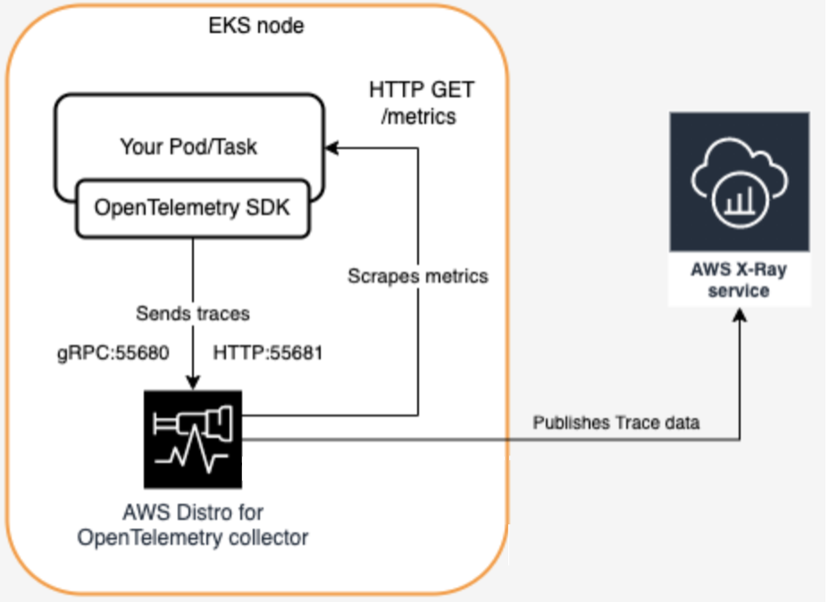

# AWS X-Ray를 활용한 EKS 트레이싱

현대 애플리케이션 개발에서 컨테이너화는 애플리케이션을 배포하고 관리하기 위한 사실상의 표준이 되었습니다. Amazon Elastic Kubernetes Service(EKS)는 Kubernetes를 사용하여 컨테이너화된 애플리케이션을 배포하고 관리하기 위한 견고하고 확장 가능한 플랫폼을 제공합니다. 그러나 애플리케이션이 더 분산되고 복잡해짐에 따라 이러한 애플리케이션의 안정성, 성능, 효율성을 보장하기 위해 Observability가 중요해집니다.

AWS X-Ray는 EKS에서 실행되는 컨테이너화된 애플리케이션의 Observability를 향상시키는 강력한 분산 트레이싱 서비스를 제공하여 이 과제를 해결합니다. AWS X-Ray를 EKS 워크로드와 통합하면 애플리케이션의 동작과 성능에 대한 더 깊은 인사이트를 얻을 수 있는 다양한 이점과 기능을 활용할 수 있습니다:

1. **엔드투엔드 가시성**: AWS X-Ray는 컨테이너화된 애플리케이션과 다른 AWS 서비스를 통과하는 요청을 추적하여 요청의 전체 수명 주기에 대한 엔드투엔드 뷰를 제공합니다. 이 가시성을 통해 다양한 마이크로서비스 간의 상호 작용을 이해하고 잠재적 병목 현상이나 문제를 더 효과적으로 식별할 수 있습니다.

2. **성능 분석**: X-Ray는 컨테이너화된 애플리케이션에 대한 요청 지연 시간, 오류율, 리소스 사용률 등 상세한 성능 메트릭을 수집합니다. 이 메트릭을 통해 애플리케이션의 성능을 분석하고, 성능 핫스팟을 식별하며, 리소스 할당을 최적화할 수 있습니다.

3. **분산 트레이싱**: 현대 마이크로서비스 아키텍처에서 요청은 종종 여러 컨테이너와 서비스를 통과합니다. AWS X-Ray는 이러한 분산 트레이스에 대한 통합 뷰를 제공하여 다양한 구성 요소 간의 상호 작용을 이해하고 전체 애플리케이션에 걸쳐 성능 데이터를 상관 분석할 수 있습니다.

4. **서비스 맵 시각화**: X-Ray는 애플리케이션의 구성 요소와 상호 작용을 시각적으로 표현하는 동적 서비스 맵을 생성합니다. 이 서비스 맵을 통해 마이크로서비스 아키텍처의 복잡성을 이해하고 최적화나 리팩토링이 필요한 잠재적 영역을 식별할 수 있습니다.

5. **AWS 서비스와의 통합**: AWS X-Ray는 AWS Lambda, API Gateway, Amazon EKS, Amazon ECS를 포함한 다양한 AWS 서비스와 원활하게 통합됩니다. 이 통합을 통해 여러 서비스에 걸쳐 요청을 추적하고 다른 AWS 서비스의 로그 및 메트릭과 성능 데이터를 상관 분석할 수 있습니다.

6. **커스텀 계측**: AWS X-Ray는 많은 AWS 서비스에 대해 즉시 사용 가능한 계측을 제공하지만, AWS X-Ray SDK를 사용하여 커스텀 애플리케이션과 서비스도 계측할 수 있습니다. 이 기능을 통해 컨테이너화된 애플리케이션 내 커스텀 코드의 성능을 추적하고 분석하여 애플리케이션의 동작에 대한 더 포괄적인 뷰를 제공할 수 있습니다.

*그림 1: EKS에서 X-Ray로 트레이스 전송*

EKS 워크로드의 Observability를 향상시키기 위해 AWS X-Ray를 활용하려면 다음 일반 단계를 따릅니다:

1. **커스텀 애플리케이션 계측**: AWS X-Ray SDK를 사용하여 컨테이너화된 애플리케이션을 계측하고 X-Ray에 트레이스 데이터를 전송합니다.

2. **계측된 애플리케이션 배포**: 계측된 컨테이너화된 애플리케이션을 Amazon EKS 클러스터에 배포합니다.

3. **트레이스 데이터 분석**: AWS X-Ray 콘솔이나 API를 사용하여 트레이스 데이터를 분석하고, 서비스 맵을 확인하며, 컨테이너화된 애플리케이션 내 성능 문제나 병목 현상을 조사합니다.

4. **알림 및 알림 설정**: X-Ray 메트릭을 기반으로 CloudWatch 알람과 알림을 구성하여 EKS 워크로드의 성능 저하나 이상에 대한 알림을 받습니다.

5. **다른 Observability 도구와 통합**: AWS X-Ray를 AWS CloudWatch Logs, Amazon CloudWatch Metrics, AWS Distro for OpenTelemetry 등 다른 Observability 도구와 결합하여 컨테이너화된 애플리케이션의 성능, 로그, 메트릭에 대한 포괄적인 뷰를 확보합니다.

AWS X-Ray가 EKS 워크로드에 대한 강력한 트레이싱 기능을 제공하지만, 트레이스 데이터 볼륨과 비용 관리와 같은 잠재적 과제를 고려하는 것이 중요합니다. 컨테이너화된 애플리케이션이 확장되고 더 많은 트레이스 데이터를 생성함에 따라 비용을 효과적으로 관리하기 위해 샘플링 전략을 구현하거나 트레이스 데이터 보존 정책을 조정해야 할 수 있습니다.

또한 트레이스 데이터에 대한 적절한 접근 제어와 데이터 보안을 보장하는 것이 중요합니다. AWS X-Ray는 저장 중 및 전송 중인 트레이스 데이터에 대한 암호화와 세분화된 접근 제어 메커니즘을 제공하여 트레이스 데이터의 기밀성과 무결성을 보호합니다.

결론적으로, Amazon EKS 워크로드에 AWS X-Ray를 통합하는 것은 컨테이너화된 애플리케이션의 Observability를 향상시키는 강력한 접근 방식입니다. 엔드투엔드로 요청을 추적하고 상세한 성능 메트릭을 제공함으로써 AWS X-Ray는 문제를 더 효과적으로 식별하고 해결하며, 리소스 활용을 최적화하고, 컨테이너화된 애플리케이션의 동작과 성능에 대한 더 깊은 인사이트를 얻을 수 있도록 합니다. AWS X-Ray와 다른 AWS Observability 서비스의 통합을 통해 클라우드에서 관측성이 높고 안정적이며 성능이 우수한 컨테이너화된 애플리케이션을 구축하고 유지할 수 있습니다.
