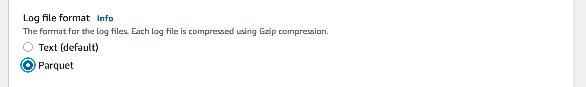
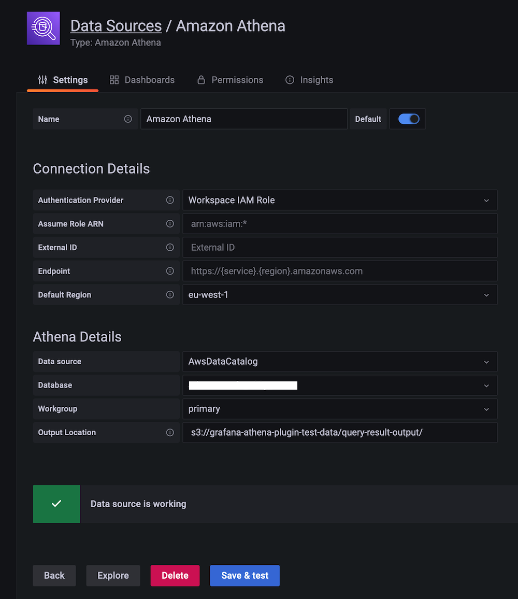

# Amazon Managed Grafana에서 Athena 사용하기

이 레시피에서는 [Amazon Athena][athena]—표준 SQL을 사용하여 Amazon S3의 데이터를 분석할 수 있는 서버리스 대화형 쿼리 서비스—를 [Amazon Managed Grafana][amg]에서 사용하는 방법을 보여줍니다. 이 통합은 [Athena data source for Grafana][athena-ds]로 가능하며, 이는 DIY Grafana 인스턴스에서도 사용할 수 있는 오픈소스 플러그인이자 Amazon Managed Grafana에 사전 설치되어 있습니다.

:::note
    이 가이드를 완료하는 데 약 20분이 소요됩니다.
:::

## 사전 요구사항

* [AWS CLI][aws-cli]가 로컬 환경에 설치되고 [구성][aws-cli-conf]되어 있어야 합니다.
* 계정에서 Amazon Athena에 접근할 수 있어야 합니다.

## 인프라

먼저 필요한 인프라를 설정하겠습니다.

### Amazon Athena 설정

Athena를 두 가지 시나리오에서 사용하는 방법을 살펴보겠습니다: 하나는 Geomap 플러그인과 함께 지리 데이터를 사용하는 시나리오이고, 다른 하나는 VPC 플로우 로그와 관련된 보안 시나리오입니다.

먼저 Athena가 설정되어 있고 데이터셋이 로드되어 있는지 확인합니다.

:::warning
    이러한 쿼리를 실행하려면 Amazon Athena 콘솔을 사용해야 합니다. Grafana는 일반적으로 데이터 소스에 대한 읽기 전용 접근만 가능하므로 데이터를 생성하거나 업데이트하는 데 사용할 수 없습니다.
:::

#### 지리 데이터 로드

첫 번째 사용 사례에서는 [Registry of Open Data on AWS][awsod]의 데이터셋을 사용합니다.
구체적으로, 지리 데이터 기반 사용 사례를 위해 Athena 플러그인 사용을 시연하기 위해 [OpenStreetMap][osm] (OSM)을 사용합니다.
이를 위해 먼저 OSM 데이터를 Athena로 가져와야 합니다.

먼저 Athena에서 새 데이터베이스를 생성합니다. [Athena 콘솔][athena-console]로 이동하여 다음 세 가지 SQL 쿼리를 사용하여 OSM 데이터를 데이터베이스로 가져옵니다.

쿼리 1:

```sql
CREATE EXTERNAL TABLE planet (
  id BIGINT,
  type STRING,
  tags MAP<STRING,STRING>,
  lat DECIMAL(9,7),
  lon DECIMAL(10,7),
  nds ARRAY<STRUCT<ref: BIGINT>>,
  members ARRAY<STRUCT<type: STRING, ref: BIGINT, role: STRING>>,
  changeset BIGINT,
  timestamp TIMESTAMP,
  uid BIGINT,
  user STRING,
  version BIGINT
)
STORED AS ORCFILE
LOCATION 's3://osm-pds/planet/';
```

쿼리 2:

```sql
CREATE EXTERNAL TABLE planet_history (
    id BIGINT,
    type STRING,
    tags MAP<STRING,STRING>,
    lat DECIMAL(9,7),
    lon DECIMAL(10,7),
    nds ARRAY<STRUCT<ref: BIGINT>>,
    members ARRAY<STRUCT<type: STRING, ref: BIGINT, role: STRING>>,
    changeset BIGINT,
    timestamp TIMESTAMP,
    uid BIGINT,
    user STRING,
    version BIGINT,
    visible BOOLEAN
)
STORED AS ORCFILE
LOCATION 's3://osm-pds/planet-history/';
```

쿼리 3:

```sql
CREATE EXTERNAL TABLE changesets (
    id BIGINT,
    tags MAP<STRING,STRING>,
    created_at TIMESTAMP,
    open BOOLEAN,
    closed_at TIMESTAMP,
    comments_count BIGINT,
    min_lat DECIMAL(9,7),
    max_lat DECIMAL(9,7),
    min_lon DECIMAL(10,7),
    max_lon DECIMAL(10,7),
    num_changes BIGINT,
    uid BIGINT,
    user STRING
)
STORED AS ORCFILE
LOCATION 's3://osm-pds/changesets/';
```

#### VPC 플로우 로그 데이터 로드

두 번째 사용 사례는 보안 관련 시나리오입니다: [VPC 플로우 로그][vpcflowlogs]를 사용한 네트워크 트래픽 분석.

먼저 EC2에 VPC 플로우 로그를 생성하도록 요청해야 합니다. 아직 수행하지 않았다면 지금 네트워크 인터페이스 수준, 서브넷 수준 또는 VPC 수준에서 [VPC 플로우 로그를 생성][createvpcfl]하세요.

:::note
    쿼리 성능을 향상시키고 저장 용량을 최소화하기 위해 VPC 플로우 로그를 중첩 데이터를 지원하는 열 기반 저장 형식인 [Parquet][parquet]로 저장합니다.
:::

설정에 어떤 옵션(네트워크 인터페이스, 서브넷 또는 VPC)을 선택하든 상관없습니다. 아래와 같이 Parquet 형식으로 S3 버킷에 게시하면 됩니다:



이제 [Athena 콘솔][athena-console]을 통해 OSM 데이터를 가져온 것과 동일한 데이터베이스에 VPC 플로우 로그 데이터용 테이블을 생성하거나, 원하시면 새 데이터베이스를 생성하세요.

다음 SQL 쿼리를 사용하되, `VPC_FLOW_LOGS_LOCATION_IN_S3`를 자신의 버킷/폴더로 교체해야 합니다:


```sql
CREATE EXTERNAL TABLE vpclogs (
  `version` int, 
  `account_id` string, 
  `interface_id` string, 
  `srcaddr` string, 
  `dstaddr` string, 
  `srcport` int, 
  `dstport` int, 
  `protocol` bigint, 
  `packets` bigint, 
  `bytes` bigint, 
  `start` bigint, 
  `end` bigint, 
  `action` string, 
  `log_status` string, 
  `vpc_id` string, 
  `subnet_id` string, 
  `instance_id` string, 
  `tcp_flags` int, 
  `type` string, 
  `pkt_srcaddr` string, 
  `pkt_dstaddr` string, 
  `region` string, 
  `az_id` string, 
  `sublocation_type` string, 
  `sublocation_id` string, 
  `pkt_src_aws_service` string, 
  `pkt_dst_aws_service` string, 
  `flow_direction` string, 
  `traffic_path` int
)
STORED AS PARQUET
LOCATION 'VPC_FLOW_LOGS_LOCATION_IN_S3'
```

예를 들어, `allmyflowlogs`라는 S3 버킷을 사용하는 경우 `VPC_FLOW_LOGS_LOCATION_IN_S3`는 다음과 같을 수 있습니다:

```
s3://allmyflowlogs/AWSLogs/12345678901/vpcflowlogs/eu-west-1/2021/
```

이제 Athena에서 데이터셋을 사용할 수 있으므로 Grafana로 이동하겠습니다.

### Grafana 설정

Grafana 인스턴스가 필요하므로 [시작하기][amg-getting-started] 가이드를 사용하여 새 [Amazon Managed Grafana 워크스페이스][amg-workspace]를 설정하거나 기존 워크스페이스를 사용하세요.

:::warning
    AWS 데이터 소스 구성을 사용하려면 먼저 Amazon Managed Grafana 콘솔로 이동하여 워크스페이스에 Athena 리소스를 읽는 데 필요한 IAM 정책을 부여하는 서비스 관리형 IAM 역할을 활성화해야 합니다.
    또한 다음 사항에 유의하세요:

	1. 사용하려는 Athena 워크그룹에는 서비스 관리형 권한이 워크그룹을 사용할 수 있도록 키 `GrafanaDataSource`와 값 `true`로 태그가 지정되어 있어야 합니다.
	1. 서비스 관리형 IAM 정책은 `grafana-athena-query-results-`로 시작하는 쿼리 결과 버킷에 대한 접근만 허용하므로, 다른 버킷에는 수동으로 권한을 추가해야 합니다.
	1. 쿼리하는 기본 데이터 소스에 대해 `s3:Get*` 및 `s3:List*` 권한을 수동으로 추가해야 합니다.
:::


Athena 데이터 소스를 설정하려면 왼쪽 도구 모음에서 하단 AWS 아이콘을 선택한 다음 "Athena"를 선택합니다. 플러그인이 사용할 Athena 데이터 소스를 검색할 기본 리전을 선택한 다음 원하는 계정을 선택하고 마지막으로 "Add data source"를 선택합니다.

또는 다음 단계에 따라 Athena 데이터 소스를 수동으로 추가하고 구성할 수 있습니다:

1. 왼쪽 도구 모음에서 "Configurations" 아이콘을 클릭한 다음 "Add data source"를 클릭합니다.
1. "Athena"를 검색합니다.
1. [선택 사항] 인증 공급자를 구성합니다(권장: 워크스페이스 IAM 역할).
1. 대상 Athena 데이터 소스, 데이터베이스 및 워크그룹을 선택합니다.
1. 워크그룹에 아직 출력 위치가 구성되어 있지 않은 경우, 쿼리 결과에 사용할 S3 버킷과 폴더를 지정합니다. 서비스 관리형 정책의 이점을 활용하려면 버킷이 `grafana-athena-query-results-`로 시작해야 합니다.
1. "Save & test"를 클릭합니다.

다음과 같은 화면이 표시됩니다:




## 사용법

이제 Grafana에서 Athena 데이터셋을 사용하는 방법을 살펴보겠습니다.

### 지리 데이터 사용

Athena의 [OpenStreetMap][osm] (OSM) 데이터는 "특정 편의시설이 어디에 있는가"와 같은 다양한 질문에 답할 수 있습니다. 실제로 동작하는 것을 살펴보겠습니다.

예를 들어, 라스베이거스 지역에서 음식을 제공하는 장소를 나열하는 OSM 데이터셋에 대한 SQL 쿼리는 다음과 같습니다:

```sql
SELECT 
tags['amenity'] AS amenity,
tags['name'] AS name,
tags['website'] AS website,
lat, lon
FROM planet
WHERE type = 'node'
  AND tags['amenity'] IN ('bar', 'pub', 'fast_food', 'restaurant')
  AND lon BETWEEN -115.5 AND -114.5
  AND lat BETWEEN 36.1 AND 36.3
LIMIT 500;
```

:::info
    위 쿼리에서 라스베이거스 지역은 위도 `36.1`에서 `36.3` 사이, 경도 `-115.5`에서 `-114.5` 사이로 정의됩니다.
	각 모서리에 대한 변수 세트로 변환하여 Geomap 플러그인을 다른 지역에도 적용할 수 있습니다.
:::
위 쿼리를 사용하여 OSM 데이터를 시각화하려면 다음과 같이 보이는 [osm-sample-dashboard.json](./amg-athena-plugin/osm-sample-dashboard.json)을 통해 예제 대시보드를 가져올 수 있습니다:


:::note
    위 스크린샷에서는 Geomap 시각화(왼쪽 패널)를 사용하여 데이터 포인트를 표시합니다.
:::
### VPC 플로우 로그 데이터 사용

VPC 플로우 로그 데이터를 분석하여 SSH 및 RDP 트래픽을 감지하려면 다음 SQL 쿼리를 사용합니다.

SSH/RDP 트래픽에 대한 테이블 형식 개요 얻기:

```sql
SELECT
srcaddr, dstaddr, account_id, action, protocol, bytes, log_status
FROM vpclogs
WHERE
srcport in (22, 3389)
OR
dstport IN (22, 3389)
ORDER BY start ASC;
```

수락 및 거부된 바이트에 대한 시계열 뷰 얻기:

```sql
SELECT
from_unixtime(start), sum(bytes), action
FROM vpclogs
WHERE
srcport in (22,3389)
OR
dstport IN (22, 3389)
GROUP BY start, action
ORDER BY start ASC;
```

:::tip
    Athena에서 쿼리되는 데이터 양을 제한하려면 `$__timeFilter` 매크로 사용을 고려하세요.
:::

VPC 플로우 로그 데이터를 시각화하려면 다음과 같이 보이는 [vpcfl-sample-dashboard.json](./amg-athena-plugin/vpcfl-sample-dashboard.json)을 통해 예제 대시보드를 가져올 수 있습니다:


여기에서 다음 가이드를 사용하여 Amazon Managed Grafana에서 자체 대시보드를 만들 수 있습니다:

* [사용자 가이드: 대시보드](https://docs.aws.amazon.com/grafana/latest/userguide/dashboard-overview.html)
* [대시보드 생성 모범 사례](https://grafana.com/docs/grafana/latest/best-practices/best-practices-for-creating-dashboards/)

이것으로 완료입니다. Grafana에서 Athena를 사용하는 방법을 배웠습니다!

## 정리

사용하던 Athena 데이터베이스에서 OSM 데이터를 제거한 다음 콘솔에서 Amazon Managed Grafana 워크스페이스를 제거합니다.

[athena]: https://aws.amazon.com/athena/
[amg]: https://aws.amazon.com/grafana/
[athena-ds]: https://grafana.com/grafana/plugins/grafana-athena-datasource/
[aws-cli]: https://docs.aws.amazon.com/cli/latest/userguide/cli-chap-install.html
[aws-cli-conf]: https://docs.aws.amazon.com/cli/latest/userguide/cli-chap-configure.html
[amg-getting-started]: https://aws.amazon.com/blogs/mt/amazon-managed-grafana-getting-started/
[awsod]: https://registry.opendata.aws/
[osm]: https://aws.amazon.com/blogs/big-data/querying-openstreetmap-with-amazon-athena/
[vpcflowlogs]: https://docs.aws.amazon.com/vpc/latest/userguide/flow-logs.html
[createvpcfl]: https://docs.aws.amazon.com/vpc/latest/userguide/flow-logs-s3.html#flow-logs-s3-create-flow-log
[athena-console]: https://console.aws.amazon.com/athena/
[amg-workspace]: https://console.aws.amazon.com/grafana/home#/workspaces
[parquet]: https://github.com/apache/parquet-format
