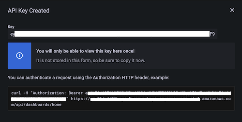

# Terraform을 사용한 Amazon Managed Grafana 자동화

이 레시피에서는 Terraform을 사용하여 Amazon Managed Grafana를 자동화하는 방법을 보여줍니다. 예를 들어 여러 워크스페이스에 일관되게 데이터 소스나 대시보드를 추가하는 작업에 활용할 수 있습니다.

:::note
    이 가이드를 완료하는 데 약 30분이 소요됩니다.
:::
## 사전 요구사항

* [AWS 명령줄][aws-cli]이 로컬 환경에 설치되고 [구성][aws-cli-conf]되어 있어야 합니다.
* 로컬 환경에 [Terraform][tf] 명령줄이 설치되어 있어야 합니다.
* 사용할 수 있는 Amazon Managed Service for Prometheus 워크스페이스가 있어야 합니다.
* 사용할 수 있는 Amazon Managed Grafana 워크스페이스가 있어야 합니다.

## Amazon Managed Grafana 설정

Terraform이 Grafana에 대해 [인증][grafana-authn]하려면 비밀번호 역할을 하는 API Key를 사용합니다.

:::info
    API key는 51자 길이의 영숫자 값으로 모든 요청에서 호출자를 인증하는 [RFC 6750][rfc6750] HTTP Bearer 토큰입니다.
:::

따라서 Terraform 매니페스트를 설정하기 전에 먼저 API key를 생성해야 합니다. 다음과 같이 Grafana UI를 통해 수행합니다.

먼저 왼쪽 메뉴의 `Configuration` 섹션에서 `API keys` 메뉴 항목을 선택합니다:


이제 새 API key를 생성하고, 작업에 적합한 이름을 지정하고, `Admin` 역할을 할당하고 유효 기간을 예를 들어 하루로 설정합니다:


:::note
    API key는 제한된 시간 동안만 유효하며, AMG에서는 최대 30일까지 설정할 수 있습니다.
:::
`Add` 버튼을 누르면 API key가 포함된 팝업 대화 상자가 표시됩니다:



:::warning
    API key를 볼 수 있는 유일한 기회이므로 여기에서 안전한 곳에 저장하세요. 나중에 Terraform 매니페스트에서 필요합니다.
:::
이것으로 Terraform을 사용한 자동화를 위해 Amazon Managed Grafana에서 필요한 모든 설정을 완료했으므로 다음 단계로 넘어가겠습니다.

## Terraform을 사용한 자동화

### Terraform 준비

Terraform이 Grafana와 상호 작용할 수 있도록 공식 [Grafana 프로바이더][tf-grafana-provider] 버전 1.13.3 이상을 사용합니다.

다음에서는 데이터 소스 생성을 자동화하려고 합니다. 구체적으로 Prometheus [데이터 소스][tf-ds], 정확히 말하면 AMP 워크스페이스를 추가하겠습니다.

먼저 다음 내용으로 `main.tf` 파일을 생성합니다:

```
terraform {
  required_providers {
    grafana = {
      source  = "grafana/grafana"
      version = ">= 1.13.3"
    }
  }
}

provider "grafana" {
  url  = "INSERT YOUR GRAFANA WORKSPACE URL HERE"
  auth = "INSERT YOUR API KEY HERE"
}

resource "grafana_data_source" "prometheus" {
  type          = "prometheus"
  name          = "amp"
  is_default    = true
  url           = "INSERT YOUR AMP WORKSPACE URL HERE "
  json_data {
	http_method     = "POST"
	sigv4_auth      = true
	sigv4_auth_type = "workspace-iam-role"
	sigv4_region    = "eu-west-1"
  }
}
```
위 파일에서 환경에 따라 세 가지 값을 입력해야 합니다.

Grafana 프로바이더 섹션에서:

* `url` … Grafana 워크스페이스 URL로 다음과 같은 형태입니다:
      `https://xxxxxxxx.grafana-workspace.eu-west-1.amazonaws.com`.
* `auth` … 이전 단계에서 생성한 API key.

Prometheus 리소스 섹션에서 `url`을 입력합니다. 이는 AMP 워크스페이스 URL로 `https://aps-workspaces.eu-west-1.amazonaws.com/workspaces/ws-xxxxxxxxx` 형태입니다.

:::note
    표시된 것과 다른 리전에서 Amazon Managed Grafana를 사용하는 경우, 위에 추가로 `sigv4_region`도 해당 리전으로 설정해야 합니다.
:::
준비 단계를 마무리하기 위해 Terraform을 초기화합니다:

```
$ terraform init
Initializing the backend...

Initializing provider plugins...
- Finding grafana/grafana versions matching ">= 1.13.3"...
- Installing grafana/grafana v1.13.3...
- Installed grafana/grafana v1.13.3 (signed by a HashiCorp partner, key ID 570AA42029AE241A)

Partner and community providers are signed by their developers.
If you'd like to know more about provider signing, you can read about it here:
https://www.terraform.io/docs/cli/plugins/signing.html

Terraform has created a lock file .terraform.lock.hcl to record the provider
selections it made above. Include this file in your version control repository
so that Terraform can guarantee to make the same selections by default when
you run "terraform init" in the future.

Terraform has been successfully initialized!

You may now begin working with Terraform. Try running "terraform plan" to see
any changes that are required for your infrastructure. All Terraform commands
should now work.

If you ever set or change modules or backend configuration for Terraform,
rerun this command to reinitialize your working directory. If you forget, other
commands will detect it and remind you to do so if necessary.
```

이것으로 모든 준비가 완료되었으며 다음에 설명하는 대로 Terraform을 사용하여 데이터 소스 생성을 자동화할 수 있습니다.

### Terraform 사용

일반적으로 먼저 Terraform의 계획을 확인합니다:

```
$ terraform plan

Terraform used the selected providers to generate the following execution plan. 
Resource actions are indicated with the following symbols:
  + create

Terraform will perform the following actions:

  # grafana_data_source.prometheus will be created
  + resource "grafana_data_source" "prometheus" {
      + access_mode        = "proxy"
      + basic_auth_enabled = false
      + id                 = (known after apply)
      + is_default         = true
      + name               = "amp"
      + type               = "prometheus"
      + url                = "https://aps-workspaces.eu-west-1.amazonaws.com/workspaces/ws-xxxxxx/"

      + json_data {
          + http_method     = "POST"
          + sigv4_auth      = true
          + sigv4_auth_type = "workspace-iam-role"
          + sigv4_region    = "eu-west-1"
        }
    }

Plan: 1 to add, 0 to change, 0 to destroy.

─────────────────────────────────────────────────────────────────────────────────────────────────────────────────────────────────────────────────────────────────────────────────

Note: You didn't use the -out option to save this plan, so Terraform can't guarantee to take exactly these actions if you run "terraform apply" now.

```

표시된 내용이 만족스러우면 계획을 적용합니다:

```
$ terraform apply

Terraform used the selected providers to generate the following execution plan. 
Resource actions are indicated with the following symbols:
  + create

Terraform will perform the following actions:

  # grafana_data_source.prometheus will be created
  + resource "grafana_data_source" "prometheus" {
      + access_mode        = "proxy"
      + basic_auth_enabled = false
      + id                 = (known after apply)
      + is_default         = true
      + name               = "amp"
      + type               = "prometheus"
      + url                = "https://aps-workspaces.eu-west-1.amazonaws.com/workspaces/ws-xxxxxxxxx/"

      + json_data {
          + http_method     = "POST"
          + sigv4_auth      = true
          + sigv4_auth_type = "workspace-iam-role"
          + sigv4_region    = "eu-west-1"
        }
    }

Plan: 1 to add, 0 to change, 0 to destroy.

Do you want to perform these actions?
  Terraform will perform the actions described above.
  Only 'yes' will be accepted to approve.

  Enter a value: yes

grafana_data_source.prometheus: Creating...
grafana_data_source.prometheus: Creation complete after 1s [id=10]

Apply complete! Resources: 1 added, 0 changed, 0 destroyed.

```

이제 Grafana의 데이터 소스 목록으로 이동하면 다음과 같은 화면이 표시됩니다:


새로 생성한 데이터 소스가 작동하는지 확인하려면 하단의 파란색 `Save & test` 버튼을 누르면 `Data source is working` 확인 메시지가 표시됩니다.

Terraform을 사용하여 다른 것도 자동화할 수 있습니다. 예를 들어 [Grafana 프로바이더][tf-grafana-provider]는 폴더 및 대시보드 관리를 지원합니다.

대시보드를 정리하기 위한 폴더를 생성하고 싶다면:

```
resource "grafana_folder" "examplefolder" {
  title = "devops"
}
```

또한 `example-dashboard.json`이라는 대시보드가 있고 위의 폴더에 생성하려면 다음 스니펫을 사용합니다:

```
resource "grafana_dashboard" "exampledashboard" {
  folder = grafana_folder.examplefolder.id
  config_json = file("example-dashboard.json")
}
```

Terraform은 자동화를 위한 강력한 도구이며 여기에 표시된 대로 Grafana 리소스를 관리하는 데 사용할 수 있습니다.

:::note
    그러나 [Terraform의 상태][tf-state]는 기본적으로 로컬에서 관리된다는 점에 유의하세요. 즉, Terraform으로 협업 작업을 계획하는 경우 팀 간에 상태를 공유할 수 있는 옵션 중 하나를 선택해야 합니다.
:::
## 정리

콘솔에서 Amazon Managed Grafana 워크스페이스를 제거합니다.

[aws-cli]: https://docs.aws.amazon.com/cli/latest/userguide/cli-chap-install.html
[aws-cli-conf]: https://docs.aws.amazon.com/cli/latest/userguide/cli-chap-configure.html
[tf]: https://www.terraform.io/downloads.html
[grafana-authn]: https://grafana.com/docs/grafana/latest/http_api/auth/
[rfc6750]: https://datatracker.ietf.org/doc/html/rfc6750
[tf-grafana-provider]: https://registry.terraform.io/providers/grafana/grafana/latest/docs
[tf-ds]: https://registry.terraform.io/providers/grafana/grafana/latest/docs/resources/data_source
[tf-state]: https://www.terraform.io/docs/language/state/remote.html
