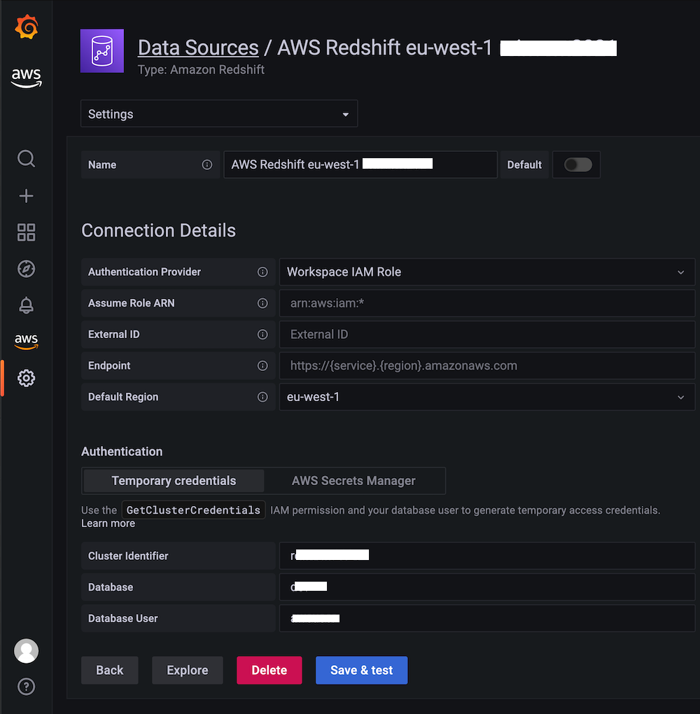

# Amazon Managed Grafana에서 Redshift 사용

이 레시피에서는 [Amazon Managed Grafana][amg]에서 표준 SQL을 사용하는 페타바이트 규모의 데이터 
웨어하우스 서비스인 [Amazon Redshift][redshift]를 사용하는 방법을 보여줍니다. 이 통합은
Grafana용 오픈소스 플러그인인 [Redshift 데이터 소스][redshift-ds]를 통해 가능하며,
자체 Grafana 인스턴스뿐만 아니라 Amazon Managed Grafana에도 사전 설치되어 있습니다.

:::note
    이 가이드를 완료하는 데 약 10분이 소요됩니다.
:::
## 사전 요구 사항

1. 계정에서 Amazon Redshift에 대한 관리자 액세스 권한이 있어야 합니다.
1. Amazon Redshift 클러스터에 `GrafanaDataSource: true` 태그를 지정합니다.
1. 서비스 관리형 정책의 이점을 활용하려면 다음 방법 중 하나로 데이터베이스
   자격 증명을 생성합니다:
    1. 기본 메커니즘인 임시 자격 증명 옵션을 사용하여 Redshift 데이터베이스에
    인증하려면 `redshift_data_api_user`라는 데이터베이스 사용자를 생성해야 합니다.
    1. Secrets Manager의 자격 증명을 사용하려면 해당 시크릿에
    `RedshiftQueryOwner: true` 태그를 지정해야 합니다.

:::tip
    서비스 관리형 또는 사용자 지정 정책 사용 방법에 대한 자세한 내용은
    [Amazon Managed Grafana 문서의 예제][svpolicies]를 참조하세요.
:::

## 인프라
Grafana 인스턴스가 필요하므로, [시작 가이드][amg-getting-started]를 사용하여
새 [Amazon Managed Grafana 워크스페이스][amg-workspace]를 설정하거나
기존 워크스페이스를 사용합니다.

:::note
    AWS 데이터 소스 구성을 사용하려면 먼저 Amazon Managed Grafana 콘솔로 이동하여
    워크스페이스에 Athena 리소스를 읽는 데 필요한 IAM 정책을 부여하는
    서비스 관리형 IAM 역할을 활성화해야 합니다.
:::

Athena 데이터 소스를 설정하려면 왼쪽 도구 모음에서 하단의 AWS 아이콘을 선택하고
"Redshift"를 선택합니다. 플러그인이 사용할 Redshift 데이터 소스를 검색할 기본 리전을 선택하고,
원하는 계정을 선택한 후 "Add data source"를 선택합니다.

또는 다음 단계에 따라 Redshift 데이터 소스를 수동으로 추가하고 구성할 수 있습니다:

1. 왼쪽 도구 모음에서 "Configurations" 아이콘을 클릭한 다음 "Add data source"를 클릭합니다.
1. "Redshift"를 검색합니다.
1. [선택 사항] 인증 공급자를 구성합니다(권장: workspace IAM role).
1. "Cluster Identifier", "Database", "Database User" 값을 입력합니다.
1. "Save & test"를 클릭합니다.

다음과 같은 화면이 표시됩니다:

## 사용법
[Redshift Advance Monitoring][redshift-mon] 설정을 사용합니다.
모든 것이 기본으로 제공되므로 이 시점에서 추가 구성할 사항은 없습니다.

Redshift 플러그인에 포함된 Redshift 모니터링 대시보드를 가져올 수 있습니다.
가져온 후 다음과 같은 화면이 표시됩니다:

여기서부터 다음 가이드를 사용하여 Amazon Managed Grafana에서 자체 대시보드를 생성할 수 있습니다:

* [사용자 가이드: 대시보드](https://docs.aws.amazon.com/grafana/latest/userguide/dashboard-overview.html)
* [대시보드 생성 모범 사례](https://grafana.com/docs/grafana/latest/best-practices/best-practices-for-creating-dashboards/)

이것으로 완료입니다. Grafana에서 Redshift를 사용하는 방법을 배웠습니다!

## 정리

사용했던 Redshift 데이터베이스를 제거한 후
콘솔에서 Amazon Managed Grafana 워크스페이스를 제거합니다.

[redshift]: https://aws.amazon.com/redshift/
[amg]: https://aws.amazon.com/grafana/
[svpolicies]: https://docs.aws.amazon.com/grafana/latest/userguide/security_iam_id-based-policy-examples.html
[redshift-ds]: https://grafana.com/grafana/plugins/grafana-redshift-datasource/
[aws-cli]: https://docs.aws.amazon.com/cli/latest/userguide/cli-chap-install.html
[aws-cli-conf]: https://docs.aws.amazon.com/cli/latest/userguide/cli-chap-configure.html
[amg-getting-started]: https://aws.amazon.com/blogs/mt/amazon-managed-grafana-getting-started/
[redshift-console]: https://console.aws.amazon.com/redshift/
[redshift-mon]: https://github.com/awslabs/amazon-redshift-monitoring
[amg-workspace]: https://console.aws.amazon.com/grafana/home#/workspaces
