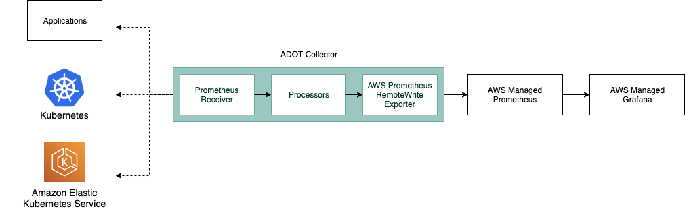

# Fargate 기반 EKS에서 AWS Distro for OpenTelemetry를 사용하여 Amazon Managed Service for Prometheus로 메트릭 전송

이 레시피에서는 [샘플 Go 애플리케이션](https://github.com/aws-observability/aws-otel-community/tree/master/sample-apps/prometheus-sample-app)을 계측하고
[AWS Distro for OpenTelemetry (ADOT)](https://aws.amazon.com/otel)를 사용하여
[Amazon Managed Service for Prometheus](https://aws.amazon.com/prometheus/)로 메트릭을 수집하는 방법을 보여줍니다.
그런 다음 [Amazon Managed Grafana](https://aws.amazon.com/grafana/)를 사용하여 메트릭을 시각화합니다.

완전한 시나리오를 시연하기 위해 [AWS Fargate](https://aws.amazon.com/fargate/) 기반
[Amazon Elastic Kubernetes Service (EKS)](https://aws.amazon.com/eks/) 클러스터와
[Amazon Elastic Container Registry (ECR)](https://aws.amazon.com/ecr/) 리포지토리를 설정합니다.

:::note
    이 가이드를 완료하는 데 약 1시간이 소요됩니다.
:::
## 인프라
다음 섹션에서는 이 레시피를 위한 인프라를 설정합니다.

### 아키텍처

ADOT 파이프라인을 사용하면 [ADOT Collector](https://github.com/aws-observability/aws-otel-collector)로
Prometheus 계측 애플리케이션을 스크레이핑하고, 수집한 메트릭을 Amazon Managed Service for Prometheus로 수집할 수 있습니다.



ADOT Collector에는 Prometheus에 특화된 두 가지 구성 요소가 포함됩니다:

* Prometheus Receiver
* AWS Prometheus Remote Write Exporter

:::info
    Prometheus Remote Write Exporter에 대한 자세한 내용은 다음을 확인하세요:
    [AMP용 Prometheus Remote Write Exporter 시작하기](https://aws-otel.github.io/docs/getting-started/prometheus-remote-write-exporter).
:::

### 사전 요구 사항

* AWS CLI가 환경에 [설치](https://docs.aws.amazon.com/cli/latest/userguide/cli-chap-install.html) 및 [구성](https://docs.aws.amazon.com/cli/latest/userguide/cli-chap-configure.html)되어 있어야 합니다.
* [eksctl](https://docs.aws.amazon.com/eks/latest/userguide/eksctl.html) 명령을 환경에 설치해야 합니다.
* [kubectl](https://docs.aws.amazon.com/eks/latest/userguide/install-kubectl.html)을 환경에 설치해야 합니다.
* [Docker](https://docs.docker.com/get-docker/)가 환경에 설치되어 있어야 합니다.

### Fargate 기반 EKS 클러스터 생성

데모 애플리케이션은 Fargate 기반 EKS 클러스터에서 실행할 Kubernetes 앱입니다.
먼저, 제공된 [cluster-config.yaml](./fargate-eks-metrics-go-adot-ampamg/cluster-config.yaml)
템플릿 파일에서 `<YOUR_REGION>`을
[AMP 지원 리전](https://docs.aws.amazon.com/prometheus/latest/userguide/what-is-Amazon-Managed-Service-Prometheus.html#AMP-supported-Regions) 중 하나로 변경하여 EKS 클러스터를 생성합니다.

셸 세션에서 `<YOUR_REGION>`을 설정합니다. 예를 들어 Bash에서:

```
export AWS_DEFAULT_REGION=<YOUR_REGION>
```

다음 명령으로 클러스터를 생성합니다:

```
eksctl create cluster -f cluster-config.yaml
```

### ECR 리포지토리 생성

EKS에 애플리케이션을 배포하려면 컨테이너 리포지토리가 필요합니다.
다음 명령을 사용하여 계정에 새 ECR 리포지토리를 생성할 수 있습니다.
`<YOUR_REGION>`도 설정해야 합니다.

```
aws ecr create-repository \
    --repository-name prometheus-sample-app \
    --image-scanning-configuration scanOnPush=true \
    --region <YOUR_REGION>
```

### AMP 설정

먼저, AWS CLI를 사용하여 Amazon Managed Service for Prometheus 워크스페이스를 생성합니다:

```
aws amp create-workspace --alias prometheus-sample-app
```

다음을 사용하여 워크스페이스가 생성되었는지 확인합니다:

```
aws amp list-workspaces
```

:::info
    자세한 내용은 [AMP 시작하기](https://docs.aws.amazon.com/prometheus/latest/userguide/AMP-getting-started.html) 가이드를 확인하세요.
:::

### ADOT Collector 설정

[adot-collector-fargate.yaml](./fargate-eks-metrics-go-adot-ampamg/adot-collector-fargate.yaml)을
다운로드하고 다음 단계에 설명된 파라미터로 이 YAML 문서를 편집합니다.

이 예제에서 ADOT Collector 구성은 어노테이션 `(scrape=true)`을 사용하여
어떤 대상 엔드포인트를 스크레이핑할지 지정합니다. 이를 통해 ADOT Collector가
클러스터의 `kube-system` 엔드포인트와 샘플 앱 엔드포인트를 구별할 수 있습니다.
다른 샘플 앱을 스크레이핑하려면 re-label 구성에서 이를 제거할 수 있습니다.

다운로드한 파일을 환경에 맞게 편집하려면 다음 단계를 따릅니다:

1\. `<YOUR_REGION>`을 현재 리전으로 교체합니다.

2\. `<YOUR_ENDPOINT>`를 워크스페이스의 remote write URL로 교체합니다.

다음 쿼리를 실행하여 AMP remote write URL 엔드포인트를 얻습니다.

먼저, 다음과 같이 워크스페이스 ID를 가져옵니다:

```
YOUR_WORKSPACE_ID=$(aws amp list-workspaces \
                    --alias prometheus-sample-app \
                    --query 'workspaces[0].workspaceId' --output text)
```

이제 다음을 사용하여 워크스페이스의 remote write URL 엔드포인트를 가져옵니다:

```
YOUR_ENDPOINT=$(aws amp describe-workspace \
                --workspace-id $YOUR_WORKSPACE_ID  \
                --query 'workspace.prometheusEndpoint' --output text)api/v1/remote_write
```

:::warning
    `YOUR_ENDPOINT`가 실제로 remote write URL인지 확인하세요. 즉,
    URL이 `/api/v1/remote_write`로 끝나야 합니다.
:::
배포 파일을 생성한 후 다음 명령으로 클러스터에 적용할 수 있습니다:

```
kubectl apply -f adot-collector-fargate.yaml
```

:::info
    자세한 내용은 [AWS Distro for OpenTelemetry (ADOT)
    Collector 설정](https://aws-otel.github.io/docs/getting-started/prometheus-remote-write-exporter/eks#aws-distro-for-opentelemetry-adot-collector-setup)을 확인하세요.
:::
### AMG 설정

[Amazon Managed Grafana – 시작하기](https://aws.amazon.com/blogs/mt/amazon-managed-grafana-getting-started/) 가이드를 사용하여 새 AMG 워크스페이스를 설정합니다.

생성 시 "Amazon Managed Service for Prometheus"를 데이터 소스로 추가해야 합니다.


## 애플리케이션

이 레시피에서는 AWS Observability 저장소의
[샘플 애플리케이션](https://github.com/aws-observability/aws-otel-community/tree/master/sample-apps/prometheus-sample-app)을 사용합니다.

이 Prometheus 샘플 앱은 네 가지 Prometheus 메트릭 유형
(counter, gauge, histogram, summary)을 모두 생성하고 `/metrics` 엔드포인트에서 노출합니다.

### 컨테이너 이미지 빌드

컨테이너 이미지를 빌드하려면 먼저 Git 저장소를 클론하고
다음과 같이 디렉토리로 이동합니다:

```
git clone https://github.com/aws-observability/aws-otel-community.git && \
cd ./aws-otel-community/sample-apps/prometheus
```

먼저 리전(위에서 아직 설정하지 않은 경우)과 계정 ID를 해당 환경에 맞게 설정합니다.
`<YOUR_REGION>`을 현재 리전으로 교체합니다. 예를 들어,
Bash 셸에서는 다음과 같습니다:

```
export AWS_DEFAULT_REGION=<YOUR_REGION>
export ACCOUNTID=`aws sts get-caller-identity --query Account --output text`
```

다음으로 컨테이너 이미지를 빌드합니다:

```
docker build . -t "$ACCOUNTID.dkr.ecr.$AWS_DEFAULT_REGION.amazonaws.com/prometheus-sample-app:latest"
```

:::note
    proxy.golang.org i/o 타임아웃으로 인해 환경에서 `go mod`가 실패하는 경우,
    Dockerfile을 편집하여 go mod proxy를 우회할 수 있습니다.

    Docker 파일에서 다음 줄을:
    ```
    RUN GO111MODULE=on go mod download
    ```
    다음으로 변경합니다:
    ```
    RUN GOPROXY=direct GO111MODULE=on go mod download
    ```
:::

이제 앞서 생성한 ECR 리포지토리에 컨테이너 이미지를 푸시할 수 있습니다.

먼저 기본 ECR 레지스트리에 로그인합니다:

```
aws ecr get-login-password --region $AWS_DEFAULT_REGION | \
    docker login --username AWS --password-stdin \
    "$ACCOUNTID.dkr.ecr.$AWS_DEFAULT_REGION.amazonaws.com"
```

마지막으로 생성한 ECR 리포지토리에 컨테이너 이미지를 푸시합니다:

```
docker push "$ACCOUNTID.dkr.ecr.$AWS_DEFAULT_REGION.amazonaws.com/prometheus-sample-app:latest"
```

### 샘플 앱 배포

[prometheus-sample-app.yaml](./fargate-eks-metrics-go-adot-ampamg/prometheus-sample-app.yaml)을 편집하여
ECR 이미지 경로를 포함시킵니다. 즉, 파일에서 `ACCOUNTID`와 `AWS_DEFAULT_REGION`을
자신의 값으로 교체합니다:

```
    # change the following to your container image:
    image: "ACCOUNTID.dkr.ecr.AWS_DEFAULT_REGION.amazonaws.com/prometheus-sample-app:latest"
```

이제 다음을 사용하여 클러스터에 샘플 앱을 배포할 수 있습니다:

```
kubectl apply -f prometheus-sample-app.yaml
```

## 엔드투엔드 검증

인프라와 애플리케이션이 준비되었으므로, EKS에서 실행되는 Go 앱에서
AMP로 메트릭을 전송하고 AMG에서 시각화하는 설정을 테스트합니다.

### 파이프라인 동작 확인

ADOT Collector가 샘플 앱의 Pod를 스크레이핑하고 AMP로 메트릭을 수집하는지
확인하려면 Collector 로그를 확인합니다.

다음 명령을 입력하여 ADOT Collector 로그를 확인합니다:

```
kubectl -n adot-col logs adot-collector -f
```

샘플 앱에서 스크레이핑된 메트릭의 로그 출력 예시는 다음과 같습니다:

```
...
Resource labels:
     -> service.name: STRING(kubernetes-service-endpoints)
     -> host.name: STRING(192.168.16.238)
     -> port: STRING(8080)
     -> scheme: STRING(http)
InstrumentationLibraryMetrics #0
Metric #0
Descriptor:
     -> Name: test_gauge0
     -> Description: This is my gauge
     -> Unit:
     -> DataType: DoubleGauge
DoubleDataPoints #0
StartTime: 0
Timestamp: 1606511460471000000
Value: 0.000000
...
```

:::tip
    AMP가 메트릭을 수신했는지 확인하려면 [awscurl](https://github.com/okigan/awscurl)을 사용할 수 있습니다.
    이 도구를 사용하면 AWS Sigv4 인증으로 명령줄에서 HTTP 요청을 보낼 수 있으므로,
    AMP에서 쿼리할 올바른 권한이 있는 AWS 자격 증명이 로컬에 설정되어 있어야 합니다.
    다음 명령에서 `$AMP_ENDPOINT`를 AMP 워크스페이스의 엔드포인트로 교체합니다:

    ```
    $ awscurl --service="aps" \
            --region="$AWS_DEFAULT_REGION" "https://$AMP_ENDPOINT/api/v1/query?query=adot_test_gauge0"
    {"status":"success","data":{"resultType":"vector","result":[{"metric":{"__name__":"adot_test_gauge0"},"value":[1606512592.493,"16.87214000011479"]}]}}
    ```
:::
### Grafana 대시보드 생성

다음과 같은 샘플 앱용 예제 대시보드를
[prometheus-sample-app-dashboard.json](./fargate-eks-metrics-go-adot-ampamg/prometheus-sample-app-dashboard.json)에서 가져올 수 있습니다:


또한 다음 가이드를 사용하여 Amazon Managed Grafana에서 자체 대시보드를 생성할 수 있습니다:

* [사용자 가이드: 대시보드](https://docs.aws.amazon.com/grafana/latest/userguide/dashboard-overview.html)
* [대시보드 생성 모범 사례](https://grafana.com/docs/grafana/latest/best-practices/best-practices-for-creating-dashboards/)

이것으로 완료입니다. Fargate 기반 EKS에서 ADOT을 사용하여 메트릭을 수집하는 방법을 배웠습니다.

## 정리

먼저 Kubernetes 리소스를 제거하고 EKS 클러스터를 삭제합니다:

```
kubectl delete all --all && \
eksctl delete cluster --name amp-eks-fargate
```

Amazon Managed Service for Prometheus 워크스페이스를 제거합니다:

```
aws amp delete-workspace --workspace-id \
    `aws amp list-workspaces --alias prometheus-sample-app --query 'workspaces[0].workspaceId' --output text`
```

IAM 역할을 제거합니다:

```
aws delete-role --role-name adot-collector-role
```

마지막으로 AWS 콘솔에서 Amazon Managed Grafana 워크스페이스를 제거합니다.
