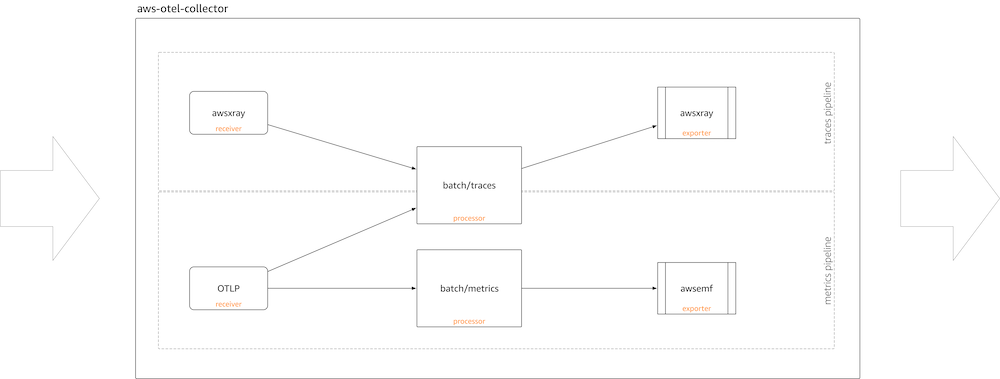
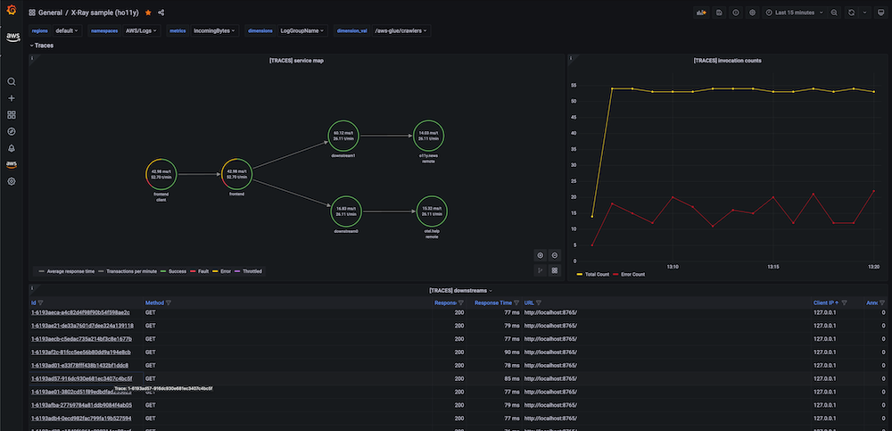

# Fargate 기반 EKS에서 AWS Distro for OpenTelemetry와 AWS X-Ray 사용

이 레시피에서는 샘플 Go 애플리케이션을 계측하고
[AWS Distro for OpenTelemetry (ADOT)](https://aws.amazon.com/otel)를 사용하여
[AWS X-Ray](https://aws.amazon.com/xray/)로 트레이스를 수집하고
[Amazon Managed Grafana](https://aws.amazon.com/grafana/)에서 트레이스를 시각화하는 방법을 보여줍니다.

완전한 시나리오를 시연하기 위해 [AWS Fargate](https://aws.amazon.com/fargate/) 기반
[Amazon Elastic Kubernetes Service (EKS)](https://aws.amazon.com/eks/) 클러스터와
[Amazon Elastic Container Registry (ECR)](https://aws.amazon.com/ecr/) 리포지토리를 설정합니다.

:::note
    이 가이드를 완료하는 데 약 1시간이 소요됩니다.
:::
## 인프라
다음 섹션에서는 이 레시피를 위한 인프라를 설정합니다.

### 아키텍처

ADOT 파이프라인을 사용하면 [ADOT Collector](https://github.com/aws-observability/aws-otel-collector)로
계측된 앱에서 트레이스를 수집하고 X-Ray로 수집할 수 있습니다:




### 사전 요구 사항

* AWS CLI가 환경에 [설치](https://docs.aws.amazon.com/cli/latest/userguide/cli-chap-install.html) 및 [구성](https://docs.aws.amazon.com/cli/latest/userguide/cli-chap-configure.html)되어 있어야 합니다.
* [eksctl](https://docs.aws.amazon.com/eks/latest/userguide/eksctl.html) 명령을 환경에 설치해야 합니다.
* [kubectl](https://docs.aws.amazon.com/eks/latest/userguide/install-kubectl.html)을 환경에 설치해야 합니다.
* [Docker](https://docs.docker.com/get-docker/)가 환경에 설치되어 있어야 합니다.
* [aws-observability/aws-o11y-recipes](https://github.com/aws-observability/aws-o11y-recipes/)
  저장소가 로컬 환경에 클론되어 있어야 합니다.

### Fargate 기반 EKS 클러스터 생성

데모 애플리케이션은 Fargate 기반 EKS 클러스터에서 실행할 Kubernetes 앱입니다.
먼저, 제공된 [cluster_config.yaml](./fargate-eks-xray-go-adot-amg/cluster-config.yaml)을 사용하여
EKS 클러스터를 생성합니다.

다음 명령으로 클러스터를 생성합니다:

```
eksctl create cluster -f cluster-config.yaml
```

### ECR 리포지토리 생성

EKS에 애플리케이션을 배포하려면 컨테이너 리포지토리가 필요합니다.
프라이빗 ECR 레지스트리를 사용하지만, 컨테이너 이미지를 공유하려면
ECR Public을 사용할 수도 있습니다.

먼저 환경 변수를 설정합니다(해당 리전으로 대체):

```
export REGION="eu-west-1"
export ACCOUNTID=`aws sts get-caller-identity --query Account --output text`
```

다음 명령을 사용하여 계정에 새 ECR 리포지토리를 생성할 수 있습니다:

```
aws ecr create-repository \
    --repository-name ho11y \
    --image-scanning-configuration scanOnPush=true \
    --region $REGION
```

### ADOT Collector 설정

[adot-collector-fargate.yaml](./fargate-eks-xray-go-adot-amg/adot-collector-fargate.yaml)을
다운로드하고 다음 단계에 설명된 파라미터로 이 YAML 문서를 편집합니다.


```
kubectl apply -f adot-collector-fargate.yaml
```

### Managed Grafana 설정

[Amazon Managed Grafana – 시작하기](https://aws.amazon.com/blogs/mt/amazon-managed-grafana-getting-started/) 가이드를 사용하여
새 워크스페이스를 설정하고 [X-Ray를 데이터 소스로 추가](https://docs.aws.amazon.com/grafana/latest/userguide/x-ray-data-source.html)합니다.

## 시그널 생성기

레시피 저장소의 [sandbox](https://github.com/aws-observability/observability-best-practices/tree/main/sandbox/ho11y)에서 사용할 수 있는
합성 시그널 생성기 `ho11y`를 사용합니다. 따라서 아직 저장소를 로컬 환경에 클론하지
않았다면 지금 합니다:

```
git clone https://github.com/aws-observability/aws-o11y-recipes.git
```

### 컨테이너 이미지 빌드
`ACCOUNTID`와 `REGION` 환경 변수가 설정되어 있는지 확인합니다.
예를 들어:

```
export REGION="eu-west-1"
export ACCOUNTID=`aws sts get-caller-identity --query Account --output text`
```
`ho11y` 컨테이너 이미지를 빌드하려면 먼저 `./sandbox/ho11y/`
디렉토리로 이동하고 컨테이너 이미지를 빌드합니다:

:::note
    다음 빌드 단계는 Docker 데몬 또는 동등한 OCI 이미지
    빌드 도구가 실행 중이라고 가정합니다.
:::

```
docker build . -t "$ACCOUNTID.dkr.ecr.$REGION.amazonaws.com/ho11y:latest"
```

### 컨테이너 이미지 푸시
다음으로, 앞서 생성한 ECR 리포지토리에 컨테이너 이미지를 푸시할 수 있습니다.
먼저 기본 ECR 레지스트리에 로그인합니다:

```
aws ecr get-login-password --region $REGION | \
    docker login --username AWS --password-stdin \
    "$ACCOUNTID.dkr.ecr.$REGION.amazonaws.com"
```

마지막으로 생성한 ECR 리포지토리에 컨테이너 이미지를 푸시합니다:

```
docker push "$ACCOUNTID.dkr.ecr.$REGION.amazonaws.com/ho11y:latest"
```

### 시그널 생성기 배포

[x-ray-sample-app.yaml](./fargate-eks-xray-go-adot-amg/x-ray-sample-app.yaml)을 편집하여
ECR 이미지 경로를 포함시킵니다. 즉, 파일에서 `ACCOUNTID`와 `REGION`을
자신의 값으로 교체합니다(총 세 곳):

``` 
    # change the following to your container image:
    image: "ACCOUNTID.dkr.ecr.REGION.amazonaws.com/ho11y:latest"
```

이제 다음을 사용하여 클러스터에 샘플 앱을 배포할 수 있습니다:

```
kubectl -n example-app apply -f x-ray-sample-app.yaml
```

## 엔드투엔드 검증

인프라와 애플리케이션이 준비되었으므로, EKS에서 실행되는 `ho11y`에서
X-Ray로 트레이스를 전송하고 AMG에서 시각화하는 설정을 테스트합니다.

### 파이프라인 검증

ADOT Collector가 `ho11y`에서 트레이스를 수집하는지 확인하기 위해
서비스 중 하나를 로컬에서 사용할 수 있게 만들고 호출합니다.

먼저, 다음과 같이 트래픽을 포워딩합니다:

```
kubectl -n example-app port-forward svc/frontend 8765:80
```

위 명령으로 `frontend` 마이크로서비스(두 개의 다른 `ho11y` 인스턴스와 
통신하도록 구성된 `ho11y` 인스턴스)가 로컬 환경에서 사용 가능해지며,
다음과 같이 호출할 수 있습니다(트레이스 생성 트리거):

```
$ curl localhost:8765/
{"traceId":"1-6193a9be-53693f29a0119ee4d661ba0d"}
```

:::tip
    호출을 자동화하려면 `curl` 호출을 `while true` 루프로 감쌀 수 있습니다.
:::
설정을 검증하려면 [CloudWatch의 X-Ray 뷰](https://console.aws.amazon.com/cloudwatch/home#xray:service-map/)를 방문합니다.
아래와 같은 화면이 표시됩니다:


시그널 생성기가 설정되어 활성화되고 OpenTelemetry 파이프라인이 설정되었으므로,
Grafana에서 트레이스를 소비하는 방법을 살펴보겠습니다.

### Grafana 대시보드

다음과 같은 예제 대시보드를
[x-ray-sample-dashboard.json](./fargate-eks-xray-go-adot-amg/x-ray-sample-dashboard.json)에서 가져올 수 있습니다:



또한, 하단 `downstreams` 패널의 트레이스를 클릭하면 "Explore" 탭에서
다음과 같이 상세하게 확인할 수 있습니다:


여기서부터 다음 가이드를 사용하여 Amazon Managed Grafana에서 자체 대시보드를 생성할 수 있습니다:

* [사용자 가이드: 대시보드](https://docs.aws.amazon.com/grafana/latest/userguide/dashboard-overview.html)
* [대시보드 생성 모범 사례](https://grafana.com/docs/grafana/latest/best-practices/best-practices-for-creating-dashboards/)

이것으로 완료입니다. Fargate 기반 EKS에서 ADOT을 사용하여 트레이스를 수집하는 방법을 배웠습니다.

## 정리

먼저 Kubernetes 리소스를 제거하고 EKS 클러스터를 삭제합니다:

```
kubectl delete all --all && \
eksctl delete cluster --name xray-eks-fargate
```
마지막으로 AWS 콘솔에서 Amazon Managed Grafana 워크스페이스를 제거합니다.
