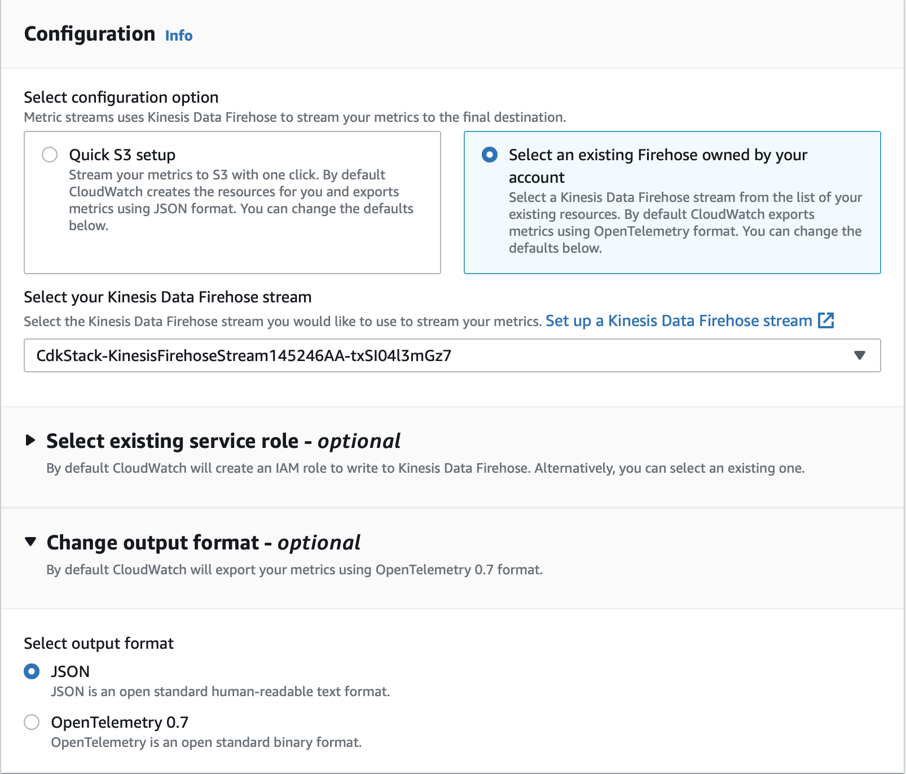

# Firehose와 AWS Lambda를 통해 CloudWatch Metric Streams를 Amazon Managed Service for Prometheus로 내보내기

이 레시피에서는 [CloudWatch Metric Stream](https://console.aws.amazon.com/cloudwatch/home#metric-streams:streamsList)을 계측하고 [Kinesis Data Firehose](https://aws.amazon.com/kinesis/data-firehose/)와 [AWS Lambda](https://aws.amazon.com/lambda)를 사용하여 [Amazon Managed Service for Prometheus (AMP)](https://aws.amazon.com/prometheus/)로 메트릭을 수집하는 방법을 보여줍니다.

완전한 시나리오를 시연하기 위해 [AWS Cloud Development Kit (CDK)](https://aws.amazon.com/cdk/)를 사용하여 Firehose Delivery Stream, Lambda, S3 Bucket을 생성하는 스택을 설정합니다.

:::note
    이 가이드를 완료하는 데 약 30분이 소요됩니다.
:::
## 인프라
다음 섹션에서는 이 레시피를 위한 인프라를 설정합니다.

CloudWatch Metric Streams를 사용하면 스트리밍 메트릭 데이터를
HTTP 엔드포인트 또는 [S3 버킷](https://aws.amazon.com/s3)으로 전달할 수 있습니다.

### 사전 요구 사항

* AWS CLI가 환경에 [설치](https://docs.aws.amazon.com/cli/latest/userguide/cli-chap-install.html) 및 [구성](https://docs.aws.amazon.com/cli/latest/userguide/cli-chap-configure.html)되어 있어야 합니다.
* [AWS CDK Typescript](https://docs.aws.amazon.com/cdk/latest/guide/work-with-cdk-typescript.html)가 환경에 설치되어 있어야 합니다.
* Node.js 및 Go가 설치되어 있어야 합니다.
* [저장소](https://github.com/aws-observability/observability-best-practices/)가 로컬 머신에 클론되어 있어야 합니다. 이 프로젝트의 코드는 `/sandbox/CWMetricStreamExporter` 아래에 있습니다.

### AMP 워크스페이스 생성

이 레시피의 데모 애플리케이션은 AMP 위에서 실행됩니다.
다음 명령으로 AMP 워크스페이스를 생성합니다:

```
aws amp create-workspace --alias prometheus-demo-recipe
```

다음 명령으로 워크스페이스가 생성되었는지 확인합니다:
```
aws amp list-workspaces
```

:::info
    자세한 내용은 [AMP 시작하기](https://docs.aws.amazon.com/prometheus/latest/userguide/AMP-getting-started.html) 가이드를 확인하세요.
:::
### 종속성 설치

aws-o11y-recipes 저장소의 루트에서 다음 명령으로 CWMetricStreamExporter 디렉토리로 이동합니다:

```
cd sandbox/CWMetricStreamExporter
```

이후로 이 디렉토리가 저장소의 루트로 간주됩니다.

다음 명령으로 `/cdk` 디렉토리로 이동합니다:

```
cd cdk
```

다음 명령으로 CDK 종속성을 설치합니다:

```
npm install
```

저장소 루트로 다시 이동한 후, 다음 명령으로
`/lambda` 디렉토리로 이동합니다:

```
cd lambda
```

`/lambda` 폴더에서 다음을 사용하여 Go 종속성을 설치합니다:

```
go get
```

모든 종속성이 설치되었습니다.

### 설정 파일 수정

저장소 루트에서 `config.yaml`을 열고 `{workspace}`를 새로 생성한 워크스페이스 ID로,
리전을 AMP 워크스페이스가 있는 리전으로 교체하여 AMP 워크스페이스 URL을 수정합니다.

예를 들어, 다음과 같이 수정합니다:

```
AMP:
    remote_write_url: "https://aps-workspaces.us-east-2.amazonaws.com/workspaces/{workspaceId}/api/v1/remote_write"
    region: us-east-2
```

Firehose Delivery Stream과 S3 Bucket의 이름을 원하는 대로 변경합니다.

### 스택 배포

`config.yaml`에 AMP 워크스페이스 ID를 수정한 후,
CloudFormation에 스택을 배포할 차례입니다. CDK와 Lambda 코드를 빌드하려면
저장소 루트에서 다음 명령을 실행합니다:

```
npm run build
```

이 빌드 단계에서 Go Lambda 바이너리가 빌드되고 CDK가 CloudFormation에 배포됩니다.

스택을 배포하기 위해 다음 IAM 변경 사항을 수락합니다:


다음 명령으로 스택이 생성되었는지 확인합니다:

```
aws cloudformation list-stacks
```

`CDK Stack`이라는 이름의 스택이 생성되어 있어야 합니다.

## CloudWatch 스트림 생성

CloudWatch 콘솔로 이동합니다. 예를 들어
`https://console.aws.amazon.com/cloudwatch/home?region=us-east-1#metric-streams:streamsList`로 이동하고
"Create metric stream"을 클릭합니다.

필요한 메트릭을 선택합니다. 모든 메트릭 또는 선택한 네임스페이스의 메트릭만 선택할 수 있습니다.

CDK에서 생성한 기존 Firehose를 사용하여 Metric Stream을 구성합니다.
출력 형식을 OpenTelemetry 0.7 대신 JSON으로 변경합니다.
Metric Stream 이름을 원하는 대로 수정하고 "Create metric stream"을 클릭합니다:



Lambda 함수 호출을 확인하려면 [Lambda 콘솔](https://console.aws.amazon.com/lambda/home)로 이동하고
`KinesisMessageHandler` 함수를 클릭합니다. `Monitor` 탭과 `Logs` 하위 탭을 클릭하면, `Recent Invocations`에서 Lambda 함수가 트리거된 항목을 확인할 수 있습니다.

:::note
    Monitor 탭에 호출이 표시되기까지 최대 5분이 소요될 수 있습니다.
:::
이것으로 완료입니다! 축하합니다. 이제 메트릭이 CloudWatch에서 Amazon Managed Service for Prometheus로 스트리밍되고 있습니다.

## 정리

먼저, CloudFormation 스택을 삭제합니다:

```
cd cdk
cdk destroy
```

AMP 워크스페이스를 제거합니다:

```
aws amp delete-workspace --workspace-id \
    `aws amp list-workspaces --alias prometheus-sample-app --query 'workspaces[0].workspaceId' --output text`
```

마지막으로 콘솔에서 CloudWatch Metric Stream을 제거합니다.
