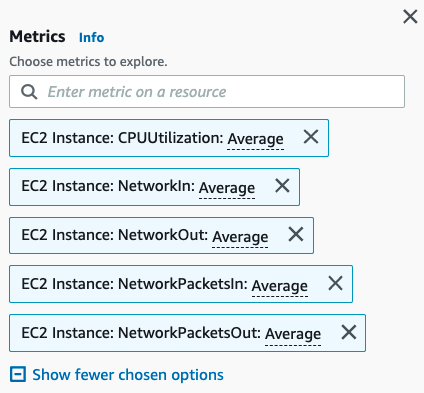

# Amazon CloudWatch Metrics Explorer를 사용하여 리소스 태그로 필터링된 메트릭 집계 및 시각화

이 레시피에서는 Metrics Explorer를 사용하여 리소스 태그 및 리소스 속성별로 메트릭을 필터링하고, 집계하고, 시각화하는 방법을 보여줍니다. 태그 기반 필터링을 통해 특정 팀이나 환경에 속한 리소스의 메트릭만 선택적으로 확인할 수 있습니다 - [Metrics Explorer를 사용하여 태그 및 속성별 리소스 모니터링][metrics-explorer].

Metrics Explorer로 시각화를 생성하는 방법은 여러 가지가 있습니다. 이 안내에서는 단순히 AWS Console을 활용합니다.

:::note
    이 가이드를 완료하는 데 약 5분이 소요됩니다.
:::
## 사전 요구 사항

* AWS 계정에 대한 액세스 권한이 있어야 합니다
* AWS Console을 통한 Amazon CloudWatch Metrics Explorer 액세스
* 관련 리소스에 대한 리소스 태그 설정

## Metrics Explorer 태그 기반 쿼리 및 시각화

*  CloudWatch 콘솔을 엽니다. 왼쪽 탐색 창에서 메트릭 관련 메뉴를 확인할 수 있습니다.

*  <b>Metrics</b> 아래에서 <b>Explorer</b> 메뉴를 클릭합니다

<!--  -->

*  <b>Generic templates</b> 또는 <b>Service based templates</b> 목록에서 선택할 수 있습니다. 이 예제에서는 <b>EC2 Instances by type</b> 템플릿을 사용합니다

<!--  -->

*  탐색하려는 메트릭을 선택합니다. 불필요한 것은 제거하고 보고 싶은 다른 메트릭을 추가합니다

<!--  -->

*  <b>From</b> 아래에서 찾고 있는 리소스 태그 또는 리소스 속성을 선택합니다. 아래 예제에서는 <b>Name: TeamX</b> 태그가 있는 여러 EC2 인스턴스에 대한 CPU 및 Network 관련 메트릭 수를 보여줍니다

<!--

// width="386" height="176" -->

*  참고로, <b>Aggregated by</b>에서 집계 함수를 사용하여 시계열을 결합할 수 있습니다. 아래 예제에서는 <b>TeamX</b> 메트릭이 <b>Availability Zone</b>별로 집계됩니다

<!--  -->

또는, <b>TeamX</b>와 <b>TeamY</b>를 <b>Team</b> 태그별로 집계하거나 필요에 맞는 다른 구성을 선택할 수 있습니다

<!--  -->

## 동적 시각화
<b>From</b>, <b>Aggregated by</b>, <b>Split by</b> 옵션을 사용하여 결과 시각화를 쉽게 커스터마이징할 수 있습니다. Metrics Explorer 시각화는 동적이므로, 새로 태그된 리소스가 자동으로 Explorer 위젯에 나타납니다.

## 참고 자료

Metrics Explorer에 대한 자세한 내용은 다음 문서를 참조하세요:
https://docs.aws.amazon.com/AmazonCloudWatch/latest/monitoring/CloudWatch-Metrics-Explorer.html

[metrics-explorer]: https://docs.aws.amazon.com/AmazonCloudWatch/latest/monitoring/CloudWatch-Metrics-Explorer.html
