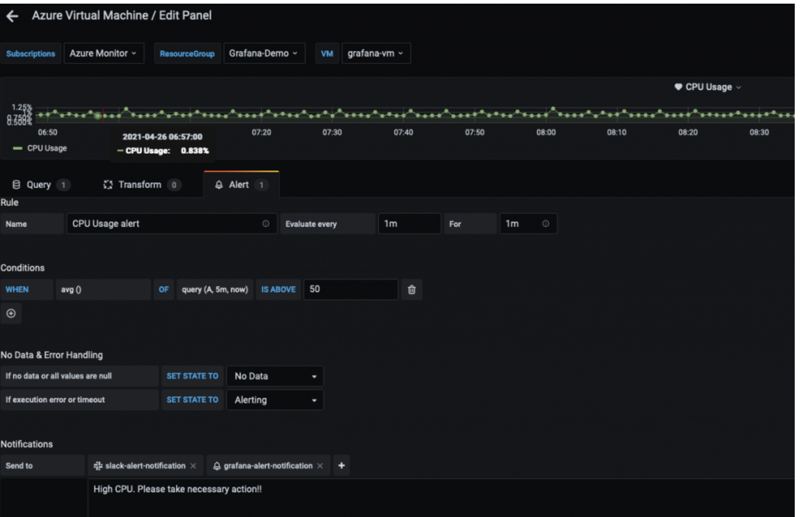

# Amazon Managed Service for Grafana를 사용한 하이브리드 환경 모니터링

이 레시피에서는 Azure Cloud 환경의 메트릭을 [Amazon Managed Service for Grafana](https://aws.amazon.com/grafana/) (AMG)로 시각화하고, AMG에서 [Amazon Simple Notification Service](https://docs.aws.amazon.com/sns/latest/dg/welcome.html) 및 Slack으로 알림 통지를 구성하는 방법을 보여줍니다.


구현의 일환으로 AMG 워크스페이스를 생성하고, Azure Monitor 플러그인을 AMG의 데이터 소스로 구성하며, Grafana 대시보드를 구성합니다. Amazon SNS용 하나와 Slack용 하나, 총 두 개의 알림 채널을 생성합니다. 또한 AMG 대시보드에서 알림 채널로 전송되는 알림을 구성합니다.

:::note
    이 가이드를 완료하는 데 약 30분이 소요됩니다.
:::
## 인프라
다음 섹션에서는 이 레시피를 위한 인프라를 설정합니다.

### 사전 요구 사항

* AWS CLI가 환경에 [설치](https://docs.aws.amazon.com/cli/latest/userguide/cli-chap-install.html) 및 [구성](https://docs.aws.amazon.com/cli/latest/userguide/cli-chap-configure.html)되어 있어야 합니다.
* [AWS-SSO](https://docs.aws.amazon.com/singlesignon/latest/userguide/step1.html)를 활성화해야 합니다.

### 아키텍처


먼저, Azure Monitor에서 메트릭을 시각화하기 위한 AMG 워크스페이스를 생성합니다. [Amazon Managed Service for Grafana 시작하기](https://aws.amazon.com/blogs/mt/amazon-managed-grafana-getting-started/) 블로그 게시물의 단계를 따릅니다. 워크스페이스를 생성한 후 개별 사용자 또는 사용자 그룹에 Grafana 워크스페이스에 대한 액세스를 할당할 수 있습니다. 기본적으로 사용자 유형은 viewer입니다. 사용자 역할에 따라 사용자 유형을 변경합니다.

:::note 
    워크스페이스에서 최소 한 명의 사용자에게 Admin 역할을 할당해야 합니다.
:::
그림 1에서 사용자 이름은 grafana-admin이고 사용자 유형은 Admin입니다. Data sources 탭에서 필요한 데이터 소스를 선택합니다. 구성을 검토한 후 Create workspace를 선택합니다.


### 데이터 소스 및 사용자 지정 대시보드 구성

이제 Data sources에서 Azure Monitor 플러그인을 구성하여 Azure 환경에서 메트릭을 쿼리하고 시각화합니다. Data sources를 선택하여 데이터 소스를 추가합니다.


Add data source에서 Azure Monitor를 검색한 후 Azure 환경의 앱 등록 콘솔에서 파라미터를 구성합니다.


Azure Monitor 플러그인을 구성하려면 디렉토리(테넌트) ID와 애플리케이션(클라이언트) ID가 필요합니다. 자세한 내용은 Azure AD 애플리케이션 및 서비스 주체를 만드는 방법에 대한 [문서](https://docs.microsoft.com/en-us/azure/active-directory/develop/howto-create-service-principal-portal)를 참조하세요. 이 문서에서는 앱을 등록하고 Grafana에 데이터를 쿼리할 수 있는 액세스 권한을 부여하는 방법을 설명합니다.


데이터 소스가 구성되면 Azure 메트릭을 분석하기 위한 사용자 지정 대시보드를 가져옵니다. 왼쪽 창에서 + 아이콘을 선택한 후 Import를 선택합니다.

Import via grafana.com에 대시보드 ID 10532를 입력합니다.


이렇게 하면 Azure Monitor 메트릭을 분석할 수 있는 Azure Virtual Machine 대시보드가 가져와집니다. 저의 설정에서는 Azure 환경에서 가상 머신이 실행 중입니다.


### AMG에서 알림 채널 구성

이 섹션에서는 두 개의 알림 채널을 구성하고 알림을 전송합니다.

다음 명령을 사용하여 grafana-notification이라는 SNS 토픽을 생성하고 이메일 주소를 구독합니다.

```
aws sns create-topic --name grafana-notification
aws sns subscribe --topic-arn arn:aws:sns:<region>:<account-id>:grafana-notification --protocol email --notification-endpoint <email-id>

```
왼쪽 창에서 벨 아이콘을 선택하여 새 알림 채널을 추가합니다.
grafana-notification 알림 채널을 구성합니다. Edit notification channel에서 Type으로 AWS SNS를 선택합니다. Topic에는 방금 생성한 SNS 토픽의 ARN을 사용합니다. Auth Provider로는 workspace IAM role을 선택합니다.


### Slack 알림 채널
Slack 알림 채널을 구성하려면 Slack 워크스페이스를 생성하거나 기존 것을 사용합니다. [Incoming Webhooks를 사용한 메시지 전송](https://api.slack.com/messaging/webhooks)에 설명된 대로 Incoming Webhooks를 활성화합니다.

워크스페이스를 구성한 후 Grafana 대시보드에서 사용할 webhook URL을 얻을 수 있습니다.


### AMG에서 알림 구성

메트릭이 임계값을 초과할 때 Grafana 알림을 구성할 수 있습니다. AMG를 사용하면 대시보드에서 알림을 평가하는 빈도와 알림 전송을 구성할 수 있습니다. 이 예제에서는 Azure 가상 머신의 CPU 사용률에 대한 알림을 구성합니다. 사용률이 임계값을 초과하면 AMG가 두 채널로 알림을 보내도록 구성합니다.

대시보드에서 드롭다운에서 CPU utilization을 선택한 후 Edit를 선택합니다. 그래프 패널의 Alert 탭에서 알림 규칙을 평가하는 빈도와 알림 상태를 변경하고 알림을 시작하기 위해 충족되어야 하는 조건을 구성합니다.

다음 구성에서는 CPU 사용률이 50%를 초과하면 알림이 생성됩니다. 알림은 grafana-alert-notification 및 slack-alert-notification 채널로 전송됩니다.



이제 Azure 가상 머신에 로그인하고 stress와 같은 도구를 사용하여 스트레스 테스트를 시작할 수 있습니다. CPU 사용률이 임계값을 초과하면 두 채널 모두에서 알림을 받게 됩니다.

Slack 채널로 전송되는 알림을 시뮬레이션하기 위해 적절한 임계값으로 CPU 사용률에 대한 알림을 구성합니다.

## 결론

이 레시피에서는 AMG 워크스페이스를 배포하고, 알림 채널을 구성하고, Azure Cloud에서 메트릭을 수집하고, AMG 대시보드에서 알림을 구성하는 방법을 보여주었습니다. AMG는 완전 관리형 서버리스 솔루션이므로 Grafana 관리의 무거운 작업은 AWS에 맡기고 비즈니스를 변환하는 애플리케이션에 시간을 할애할 수 있습니다.
