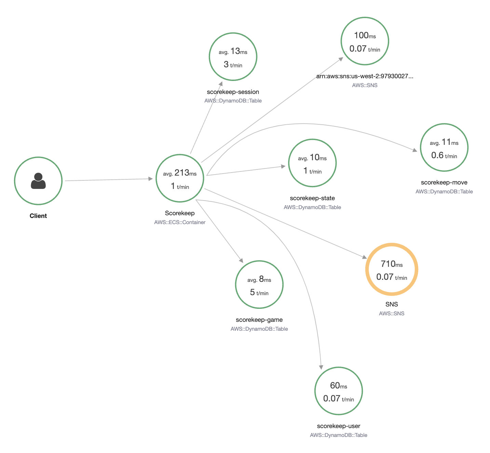

# Traces

Traces는 요청이 애플리케이션의 여러 구성 요소를 통과하면서 거치는 전체 여정을 나타냅니다.

로그나 메트릭과 달리, *traces*는 둘 이상의 애플리케이션 또는 서비스에서 발생한 이벤트로 구성되며, 응답 지연 시간, 서비스 장애, 요청 파라미터, 메타데이터 등 서비스 간 연결에 대한 컨텍스트를 포함합니다.

:::tip
    [로그](./logs.md)와 trace 사이에는 개념적 유사성이 있지만, trace는 서비스 간 컨텍스트에서 고려되도록 설계된 반면, 로그는 일반적으로 단일 서비스나 애플리케이션의 실행에 한정됩니다.
::::::tip
오늘날의 개발자들은 모듈화되고 분산된 애플리케이션을 구축하는 방향으로 나아가고 있습니다. 이를 [Service Oriented Architecture](https://en.wikipedia.org/wiki/Service-oriented_architecture)라고 부르는 사람도 있고, [microservices](https://aws.amazon.com/microservices/)라고 부르는 사람도 있습니다. 이름이 무엇이든, 이러한 느슨하게 결합된 애플리케이션에서 문제가 발생했을 때 로그나 이벤트만으로는 인시던트의 근본 원인을 추적하기에 충분하지 않을 수 있습니다. 요청 흐름에 대한 완전한 가시성을 확보하는 것이 필수적이며, 바로 이 지점에서 trace가 가치를 발휘합니다. 인과적으로 관련된 일련의 이벤트를 통해 엔드 투 엔드 요청 흐름을 보여주는 trace는 그러한 가시성을 확보하는 데 도움을 줍니다.

Traces는 요청이 시스템에 들어오고 나가는 흐름에 대한 기본 정보를 제공하기 때문에 Observability의 핵심 축입니다.

:::tip
    Traces의 일반적인 사용 사례로는 성능 프로파일링, 프로덕션 이슈 디버깅, 장애 근본 원인 분석 등이 있습니다.
:::
## 모든 연결 지점을 관측 가능하게 만드세요

워크로드의 모든 기능과 코드가 한 곳에 있을 때는 소스 코드를 보면서 요청이 여러 함수를 어떻게 거치는지 쉽게 파악할 수 있습니다. 시스템 수준에서는 앱이 어떤 머신에서 실행되고 있는지 알 수 있고, 문제가 발생하면 근본 원인을 빠르게 찾을 수 있습니다. 하지만 microservices 기반 아키텍처에서는 여러 컴포넌트가 느슨하게 결합되어 분산 환경에서 실행됩니다. 이런 환경에서 수많은 시스템에 로그인하여 상호 연결된 각 요청의 로그를 확인하는 것은 불가능하지는 않더라도 비현실적입니다.

바로 이 부분에서 Observability가 도움이 됩니다. 계측(Instrumentation)은 Observability를 높이기 위한 핵심 단계입니다. 넓은 의미에서 계측이란 코드를 사용하여 애플리케이션의 이벤트를 측정하는 것입니다.

일반적인 계측 방식은 시스템에 진입하는 각 요청에 고유한 trace 식별자를 할당하고, 요청이 여러 컴포넌트를 통과할 때 해당 trace ID를 전달하면서 추가 메타데이터를 덧붙이는 것입니다.

:::info
    한 서비스에서 다른 서비스로의 모든 연결은 중앙 수집기로 trace를 전송하도록 계측해야 합니다. 이 접근 방식은 워크로드의 불투명한 부분까지 들여다볼 수 있게 해줍니다.
:::
:::info
    auto-instrumentation 에이전트나 라이브러리를 사용하면 애플리케이션 계측을 대부분 자동화할 수 있습니다.
:::

## 트랜잭션 시간과 상태가 중요합니다. 반드시 측정하세요!

잘 계측된 애플리케이션은 엔드 투 엔드 trace를 생성할 수 있으며, 이를 다음과 같은 워터폴 그래프로 확인할 수 있습니다:

또는 서비스 맵으로 확인할 수 있습니다:

모든 상호작용의 트랜잭션 시간과 응답 코드를 측정하는 것이 중요합니다. 이를 통해 전체 처리 시간을 계산하고 SLA, SLO, 비즈니스 KPI 준수 여부를 추적할 수 있습니다.

:::info
    상호작용의 응답 시간과 상태 코드를 파악하고 기록해야만 전체 요청 패턴과 워크로드 상태에 영향을 미치는 요인을 확인할 수 있습니다.
:::

## 메타데이터, 주석, 레이블은 최고의 동반자입니다

Traces는 고유 ID와 함께 저장되며, 각 trace는 요청 경로 내의 각 단계를 기록하는 *span* 또는 *segment*(사용하는 도구에 따라 다름)로 분해됩니다. span은 trace가 상호작용하는 엔티티를 나타내며, 상위 trace와 마찬가지로 각 span에는 고유 ID와 타임스탬프가 할당되고, 추가 데이터 및 메타데이터도 포함될 수 있습니다. 이 정보는 문제가 발생한 정확한 시간과 위치를 알려주기 때문에 디버깅에 유용합니다.

실제 예시를 통해 설명하겠습니다. 전자상거래 애플리케이션은 인증, 권한 부여, 배송, 재고, 결제 처리, 주문 이행, 상품 검색, 추천 등 여러 도메인으로 나뉠 수 있습니다. 이렇게 상호 연결된 모든 도메인의 trace를 검색하는 대신, trace에 고객 ID 레이블을 지정하면 특정 한 사람에 해당하는 상호작용만 검색할 수 있습니다. 이를 통해 운영 이슈를 진단할 때 검색 범위를 즉시 좁힐 수 있습니다.

:::info
    벤더에 따라 명명 규칙이 다를 수 있지만, 각 trace에는 메타데이터, 레이블, 주석(Annotations)을 추가할 수 있으며, 이러한 정보는 전체 워크로드에 걸쳐 검색할 수 있습니다. 추가하려면 코드 작업이 필요하지만, 워크로드의 Observability를 크게 향상시킵니다.
:::
:::warning
    Traces는 로그가 아니므로, trace에 포함하는 메타데이터는 신중하게 선택하세요. 또한 trace 데이터는 높은 샘플링 레이트를 적용하더라도 포렌식이나 감사 목적으로 사용하기에는 적합하지 않습니다.
:::
