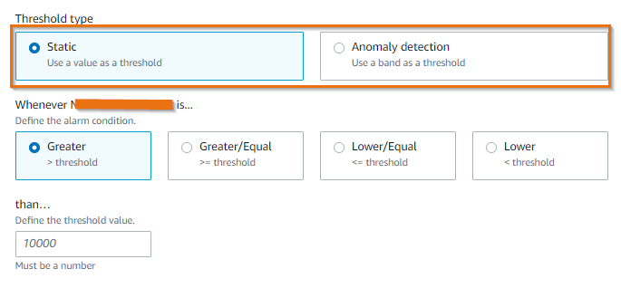

# Alarms

Amazon CloudWatch 알람를 사용하면 CloudWatch 메트릭 및 로그에 대한 임계값을 정의하고 CloudWatch에 구성된 규칙에 따라 알림을 받을 수 있습니다.

**CloudWatch 메트릭에 대한 알람:**

CloudWatch 알람를 사용하면 CloudWatch 메트릭에 대한 임계값을 정의하고 메트릭이 범위를 벗어날 때 알림을 받을 수 있습니다. 각 메트릭은 여러 알람를 트리거할 수 있으며, 각 알람에는 여러 작업이 연결될 수 있습니다. CloudWatch 메트릭을 기반으로 메트릭 알람를 설정하는 방법에는 두 가지가 있습니다.

1. **정적 임계값**: 정적 임계값은 메트릭이 위반해서는 안 되는 고정 한계를 나타냅니다. 정상 운영 중의 동작을 파악하기 위해 상한과 하한과 같은 정적 임계값의 범위를 정의해야 합니다. 메트릭 값이 정적 임계값 아래로 떨어지거나 위로 올라가면 CloudWatch가 알람를 생성하도록 구성할 수 있습니다.

2. **이상 탐지**: 이상 탐지는 일반적으로 데이터의 대부분에서 크게 벗어나고 정상 동작의 잘 정의된 개념에 부합하지 않는 드문 항목, 이벤트 또는 관측치를 식별하는 것입니다. CloudWatch 이상 탐지는 과거 메트릭 데이터를 분석하여 예상 값 모델을 생성합니다. 예상 값은 메트릭의 일반적인 시간별, 일별 및 주별 패턴을 고려합니다. 필요에 따라 각 메트릭에 이상 탐지를 적용할 수 있으며, CloudWatch는 머신 러닝 알고리즘을 적용하여 활성화된 각 메트릭의 상한과 하한을 정의하고 메트릭이 예상 값을 벗어날 때만 알람를 생성합니다.

:::tip
	정적 임계값은 워크로드에서 식별된 성능 한계점이나 인프라 구성 요소의 절대적 한계와 같이 확실히 이해하고 있는 메트릭에 가장 적합합니다.
:::
:::info
	특정 메트릭의 시간에 따른 성능에 대한 가시성이 없거나, 부하 테스트 또는 비정상적인 트래픽 상황에서 메트릭 값이 관측된 적이 없는 경우 알람에 이상 탐지 모델을 사용하세요.
:::

아래 지침에 따라 CloudWatch에서 정적 및 이상 탐지 기반 알람를 설정하는 방법을 확인할 수 있습니다.

[정적 임계값 알람](https://catalog.us-east-1.prod.workshops.aws/workshops/31676d37-bbe9-4992-9cd1-ceae13c5116c/en-US/alarms/mericalarm)

[CloudWatch 이상 탐지 기반 알람](https://catalog.us-east-1.prod.workshops.aws/workshops/31676d37-bbe9-4992-9cd1-ceae13c5116c/en-US/alarms/adalarm)

:::info
	알람 피로를 줄이거나 생성되는 알람의 수로 인한 노이즈를 줄이기 위해 두 가지 고급 방법으로 알람를 구성할 수 있습니다:

	1. **복합 알람**: 복합 알람에는 이미 생성된 다른 알람의 상태를 고려하는 규칙 표현식이 포함됩니다. 복합 알람는 규칙의 모든 조건이 충족될 때만 `ALARM` 상태로 전환됩니다. 복합 알람의 규칙 표현식에 지정된 알람에는 메트릭 알람와 다른 복합 알람가 포함될 수 있습니다. 복합 알람는 [집계를 통한 알람 피로 방지](../signals/alarms.md#fight-alarm-fatigue-with-aggregation)에 도움이 됩니다.

	2. **메트릭 수학 기반 알람**: 메트릭 수학 표현식을 사용하여 더 의미 있는 KPI를 구축하고 이에 대한 알람를 설정할 수 있습니다. 여러 메트릭을 결합하여 통합 사용률 메트릭을 만들고 이에 대한 알람를 설정할 수 있습니다.
:::

아래 지침은 복합 알람 및 메트릭 수학 기반 알람를 설정하는 방법을 안내합니다.

[복합 알람](https://catalog.us-east-1.prod.workshops.aws/workshops/31676d37-bbe9-4992-9cd1-ceae13c5116c/en-US/alarms/compositealarm)

[메트릭 수학 알람](https://aws.amazon.com/blogs/mt/create-a-metric-math-alarm-using-amazon-cloudwatch/)

**CloudWatch 로그에 대한 알람**

CloudWatch 메트릭 필터를 사용하여 CloudWatch 로그를 기반으로 알람를 생성할 수 있습니다. 메트릭 필터는 로그 데이터를 그래프로 표시하거나 알람를 설정할 수 있는 수치 CloudWatch 메트릭으로 변환합니다. 메트릭을 설정한 후에는 CloudWatch 로그에서 생성된 CloudWatch 메트릭에 대해 정적 또는 이상 탐지 기반 알람를 사용할 수 있습니다.

[CloudWatch 로그에 대한 메트릭 필터 설정](https://aws.amazon.com/blogs/mt/quantify-custom-application-metrics-with-amazon-cloudwatch-logs-and-metric-filters/) 예제를 확인할 수 있습니다.

