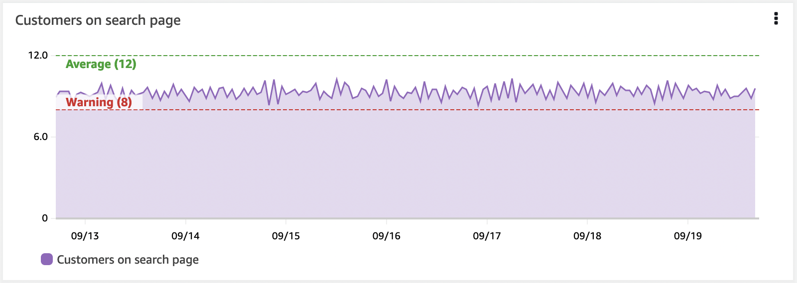

# 대시보드

대시보드는 Observability 솔루션의 중요한 부분입니다. 대시보드를 통해 데이터의 큐레이션된 시각화를 생성할 수 있습니다. 데이터의 이력을 확인하고 다른 관련 데이터와 함께 볼 수 있습니다. 또한 컨텍스트를 제공할 수 있습니다. 더 큰 그림을 이해하는 데 도움을 줍니다.

사람들은 종종 데이터를 수집하고 알람을 생성한 후 거기서 멈춥니다. 그러나 알람은 특정 시점만을 보여주며, 일반적으로 단일 메트릭이나 소수의 데이터에 대한 것입니다. 대시보드는 시간에 따른 동작을 볼 수 있게 해줍니다.


## 실용적인 예시: 높은 CPU 알람을 고려해 봅시다
머신이 원하는 것보다 높은 CPU로 실행되고 있다는 것을 알고 있습니다. 조치를 취해야 할까요? 그리고 얼마나 빨리? 무엇이 결정에 도움이 될까요?

* 이 인스턴스/애플리케이션의 정상적인 CPU 사용량은 어떤 모습일까요?
* 이것이 스파이크인지, CPU 증가 추세인지?
* 성능에 영향을 미치고 있나요? 그렇지 않다면, 언제부터 영향을 미칠까요?
* 이것이 정기적으로 발생하는 현상인가요? 보통 자체적으로 복구되나요?

### 데이터 이력 확인

이제 CPU의 히스토리 타임차트가 있는 대시보드를 생각해 보세요. 이 단일 메트릭만으로도 이것이 스파이크인지 상승 추세인지 확인할 수 있습니다. 또한 얼마나 빠르게 상승 추세인지 확인할 수 있어 조치의 우선순위에 대한 결정을 내릴 수 있습니다.

### 워크플로우에 대한 영향 확인

그런데 이 서버는 어떤 역할을 하고 있을까요? 전체 시스템에서 얼마나 중요한 위치에 있을까요? 여기에 워크플로우의 응답 시간, 처리량, 오류 등 성능 지표를 함께 시각화한다고 상상해보세요. 그러면 높은 CPU가 이 인스턴스가 지원하는 워크플로우나 사용자에게 실제로 영향을 주고 있는지 바로 확인할 수 있습니다.

### 알람 이력 확인

지난 한 달 동안 알람이 얼마나 자주 트리거되었는지 보여주는 시각화를 추가하고, 더 과거를 살펴보아 이것이 정기적으로 발생하는 현상인지 확인하세요. 예를 들어, 백업 작업이 스파이크를 트리거하고 있나요? 재발 패턴을 알면 근본적인 문제를 이해하고 알람이 재발하지 않도록 장기적인 결정을 내리는 데 도움이 됩니다.

### 컨텍스트 추가

마지막으로, 대시보드에 컨텍스트를 추가하세요. 이 대시보드가 존재하는 이유, 관련된 워크플로우, 문제가 있을 때 무엇을 해야 하는지, 문서 링크, 연락처에 대한 간략한 설명을 포함하세요.

:::info
    이제 대시보드 사용자가 무슨 일이 일어나고 있는지 보고, 영향을 이해하고, 어떤 조치를 취할지와 긴급성에 대해 적절한 데이터 기반 결정을 내릴 수 있는 *스토리*가 완성됩니다.
:::
### 모든 것을 한 번에 시각화하려고 하지 마세요

우리는 종종 알람 피로에 대해 이야기합니다. 식별 가능한 조치와 우선순위가 없이 발생하는 너무 많은 알람은 팀에 과부하를 주고 비효율성을 초래할 수 있습니다. 알람은 중요하고 조치 가능한 것에 대해 설정해야 합니다.

반면 대시보드는 훨씬 유연합니다. 알람처럼 즉각적인 주의를 요구하지 않기 때문에, 아직 중요한지 확신이 없는 지표나 탐색용 데이터도 자유롭게 시각화할 수 있습니다. 그렇더라도 과하지 않게 주의하세요! 좋은 것도 너무 많으면 독이 됩니다.

대시보드는 여러분에게 중요한 것을 한눈에 보여주는 도구여야 합니다. 어떤 데이터를 수집할지 결정하는 것처럼, 대시보드에 무엇을 담을지도 같은 기준으로 고민해야 합니다.
대시보드의 경우 다음을 고려하세요:

* 누가 이것을 볼 것인가?
    * 그들의 배경과 지식은 무엇인가?
	* 얼마나 많은 컨텍스트가 필요한가?
* 어떤 질문에 답하려고 하는가?
* 이 데이터를 본 결과로 어떤 조치를 취할 것인가?

:::tip
    대시보드 스토리가 무엇이어야 하는지, 얼마나 포함해야 하는지 알기 어려울 수 있습니다. 그러면 대시보드를 어디서부터 설계할 수 있을까요? 두 가지 방법을 살펴보겠습니다: *KPI 기반* 또는 *인시던트 기반*.
:::

#### 대시보드 설계: KPI 기반

이를 이해하는 한 가지 방법은 KPI에서 역방향으로 작업하는 것입니다. 이것은 일반적으로 매우 사용자 중심적인 접근 방식입니다.
[레이아웃](#레이아웃)의 경우, 일반적으로 위에서 아래로 작업하며, 대시보드 아래로 내려갈수록 더 자세한 내용을 보거나 하위 레벨 대시보드로 이동합니다.

먼저, **KPI를 이해하세요**. KPI가 의미하는 바를 이해하세요. 이것은 어떻게 시각화할지 결정하는 데 도움이 됩니다.
많은 KPI가 단일 숫자로 표시됩니다. 예를 들어, 특정 워크플로우를 성공적으로 완료하는 고객의 비율과 소요 시간은 얼마인지? 하지만 어떤 기간에 대한 것인지? 주간 평균으로는 KPI를 충족할 수 있지만, 그 안에 기준을 위반하는 더 짧은 기간이 있을 수 있습니다. 이러한 위반이 중요한가요? 고객 경험에 영향을 미치나요? 그렇다면 다양한 기간과 타임차트를 고려하여 KPI를 확인할 수 있습니다. 그리고 모든 사람이 세부 사항을 볼 필요는 없으므로, KPI의 세부 분석을 다른 대상을 위한 별도의 대시보드로 이동할 수 있습니다.

다음으로, **해당 KPI에 기여하는 것은 무엇인가?** 이러한 작업이 수행되려면 어떤 워크플로우가 실행되어야 하나요? 이를 측정할 수 있나요?

주요 구성 요소를 식별하고 성능 시각화를 추가하세요. KPI가 위반되면 워크플로우에서 주요 영향이 어디인지 빠르게 확인할 수 있어야 합니다.

계속 깊이 들어갈 수 있습니다 - 해당 워크플로우의 성능에 영향을 미치는 것은 무엇인지? 깊이를 결정할 때 대상을 기억하세요.

주문 수에 대한 KPI가 있는 전자상거래 시스템의 예를 고려해 보세요.
주문이 이루어지려면 사용자는 다음 작업을 수행할 수 있어야 합니다: 제품 검색, 장바구니에 추가, 배송 정보 추가, 주문 결제.
이러한 각 워크플로우에 대해, 주요 구성 요소가 작동하는지 확인할 수 있습니다. 예를 들어 RUM이나 Synthetics를 사용하여 작업 성공에 대한 데이터를 얻고 사용자가 문제의 영향을 받는지 확인할 수 있습니다. 각 작업의 성능이 예상대로인지 확인하기 위해 처리량, 지연 시간, 실패한 작업 비율의 측정을 고려할 수 있습니다. 성능에 영향을 미치는 요소를 확인하기 위해 기본 인프라의 측정을 고려할 수 있습니다.

그렇다고 모든 정보를 한 대시보드에 몰아넣으면 안 됩니다. 대시보드를 보는 사람이 누구인지 다시 한번 생각하세요.

:::info
    드릴다운을 허용하고 적절한 사용자에게 적절한 컨텍스트를 제공하는 대시보드 레이어를 생성하세요.
:::
#### 대시보드 설계: 인시던트 기반

많은 사람들에게 인시던트 해결은 Observability의 핵심 동력입니다. 사용자 또는 Observability 알람에 의해 문제를 알게 되었고, 빠르게 수정 방법과 잠재적으로 근본 원인을 찾아야 합니다.

:::info
    최근 인시던트를 살펴보는 것부터 시작하세요. 공통 패턴이 있나요? 회사에 가장 큰 영향을 미친 것은 무엇인가요? 어떤 것이 반복되나요?
:::
이 경우, 심각도를 이해하고 근본 원인을 식별하며 인시던트를 수정하려는 사람들을 위한 대시보드를 설계하고 있습니다.

특정 인시던트를 되돌아보세요.

* 보고된 인시던트를 어떻게 검증했나요?
    * 무엇을 확인했나요? 엔드포인트? 오류?
* 문제의 영향을 어떻게 이해하고 따라서 우선순위를 정했나요?
* 문제의 원인을 위해 무엇을 살펴보았나요?

Application Performance Monitoring(APM)이 여기서 도움이 될 수 있으며, 엔드포인트와 워크플로우의 정기적인 기준선 및 테스트를 위한 [Synthetics](./synthetics.md)와 실제 고객 경험을 위한 [RUM](./rum.md)을 활용할 수 있습니다. 이 데이터를 사용하여 어떤 워크플로우가 영향을 받는지, 얼마나 영향을 받는지 빠르게 시각화할 수 있습니다.

시간에 따른 오류 수와 상위 N개 오류를 보여주는 시각화는 올바른 영역에 집중하고 오류의 구체적인 세부 사항을 보여주는 데 도움이 됩니다. 여기서는 종종 로그 데이터와 오류 코드 및 원인의 동적 시각화를 사용합니다.

가능한 한 빨리 세부 사항에 도달하기 위해 필터링이나 드릴다운이 매우 유용할 수 있습니다. 과도한 오버헤드 없이 이를 구현하는 방법을 생각해 보세요. 예를 들어, 세부 사항에 더 가까이 가기 위해 필터링할 수 있는 단일 대시보드를 갖는 것입니다.
 
### 레이아웃

대시보드의 레이아웃도 중요합니다.

:::info
    일반적으로 사용자에게 가장 중요한 시각화는 왼쪽 상단에 배치하거나, 자연스러운 페이지 탐색의 *시작점*에 맞추어야 합니다.
:::

레이아웃을 사용하여 스토리를 전달할 수 있습니다. 예를 들어, 아래로 스크롤할수록 더 자세한 내용을 보는 위에서 아래로의 레이아웃을 사용할 수 있습니다. 또는 왼쪽에 상위 레벨 서비스를, 오른쪽으로 이동하면서 종속성을 보여주는 왼쪽에서 오른쪽으로의 표시도 유용할 수 있습니다.

### 동적 콘텐츠 생성

많은 워크로드가 수요에 따라 확장 또는 축소되도록 설계되어 있으며, 대시보드는 이를 고려해야 합니다. 예를 들어 인스턴스가 Auto Scaling 그룹에 있어 특정 부하에 도달하면 추가 인스턴스가 추가될 수 있습니다.

:::info
    특정 ID로 지정된 인스턴스의 데이터를 보여주는 대시보드는 새 인스턴스의 데이터를 볼 수 없습니다. 리소스와 데이터에 메타데이터를 추가하여 특정 메타데이터 값을 가진 모든 인스턴스를 캡처하는 시각화를 만들 수 있습니다. 이렇게 하면 실제 상태를 반영합니다.
:::
동적 시각화의 또 다른 예로는 현재 발생하는 상위 10개 오류와 최근 이력에서의 동작을 찾을 수 있는 것입니다. 어떤 오류가 발생할 수 있는지에 대한 사전 지식 없이 테이블이나 차트를 볼 수 있기를 원합니다.

### 원인보다 증상을 먼저 생각하세요

증상을 관찰할 때는 이것이 사용자와 시스템에 미치는 영향을 고려하는 것입니다. 많은 근본 원인이 동일한 증상을 나타낼 수 있습니다. 이를 통해 알려지지 않은 문제를 포함하여 더 많은 문제를 포착할 수 있습니다. 원인을 이해하게 되면, 하위 레벨 대시보드에서 문제를 빠르게 진단하고 수정하는 데 더 구체적일 수 있습니다.

:::tip 
    지난주에 사용자에게 영향을 미친 특정 JavaScript 오류를 캡처하지 마세요. 그것이 방해한 워크플로우에 대한 *영향*을 캡처하고, 최근 이력에서 JavaScript 오류의 상위 카운트를 보여주거나 최근 이력에서 급격히 증가한 것을 보여주세요.
:::
### 상위/하위 N 사용

대부분의 경우 *모든* 운영 메트릭을 동시에 시각화할 필요가 없습니다. 대규모 EC2 인스턴스 Fleet이 좋은 예입니다: 수백 대의 서버로 구성된 전체 팜의 디스크 IOPS나 CPU 사용률을 동시에 표시할 필요나 가치가 없습니다. 이것은 메트릭을 파헤치는 데 최고(또는 최악) 성능 리소스를 보는 것보다 더 많은 시간을 소비하는 안티패턴을 만듭니다.

:::info
    대시보드를 사용하여 주어진 메트릭의 상위 10개 또는 20개를 표시한 다음, 이것이 드러내는 [증상](#원인보다-증상을-먼저-생각하세요)에 집중하세요.
:::
[CloudWatch metrics](./metrics.md)를 사용하면 모든 시계열에 대해 상위 N을 검색할 수 있습니다. 예를 들어, 이 쿼리는 CPU 사용률 기준으로 가장 바쁜 20개의 EC2 인스턴스를 반환합니다:

```
SORT(SEARCH('{AWS/EC2,InstanceId} MetricName="CPUUtilization"', 'Average', 300), SUM, DESC, 10)
```

이 접근 방식 또는 [CloudWatch Metric Insights](https://docs.aws.amazon.com/AmazonCloudWatch/latest/monitoring/query_with_cloudwatch-metrics-insights.html)와 유사한 방법을 사용하여 대시보드에서 상위 또는 하위 성능 메트릭을 식별하세요.

### 임계값이 있는 KPI를 시각적으로 표시

KPI에는 경고 또는 오류 임계값이 있어야 하며, 대시보드는 수평 주석을 사용하여 이를 표시할 수 있습니다. 이것은 위젯에서 최고 수위선으로 나타납니다. 이를 시각적으로 표시하면 비즈니스 결과나 인프라가 위험에 처해 있을 때 운영자에게 사전 경고를 줄 수 있습니다.



:::info
    수평 주석은 잘 개발된 대시보드의 핵심 부분입니다.
:::
### 컨텍스트의 중요성

사람들은 데이터를 쉽게 잘못 해석할 수 있습니다. 그들의 배경과 현재 컨텍스트가 데이터를 보는 방식에 영향을 줍니다.

따라서 대시보드 내에 *텍스트*를 포함시키세요. 이 데이터는 무엇을 위한 것이고, 누구를 위한 것인지? 무엇을 의미하는지? 애플리케이션에 대한 문서, 누가 지원하는지, 문제 해결 문서에 대한 링크를 포함하세요. 또한 텍스트 표시를 사용하여 대시보드 디스플레이를 나눌 수 있습니다. 왼쪽에 사용하여 왼쪽-오른쪽 컨텍스트를 설정하세요. 전체 수평 표시로 사용하여 대시보드를 수직으로 나누세요.

:::info
    IT 지원, 운영 당직자 또는 비즈니스 소유자에 대한 링크가 있으면 문제 발생 시 도움을 줄 수 있는 사람에게 빠르게 연락할 수 있는 경로를 제공합니다.
:::
:::tip
    티켓팅 시스템에 대한 하이퍼링크도 대시보드에 매우 유용한 추가 사항입니다.
:::
