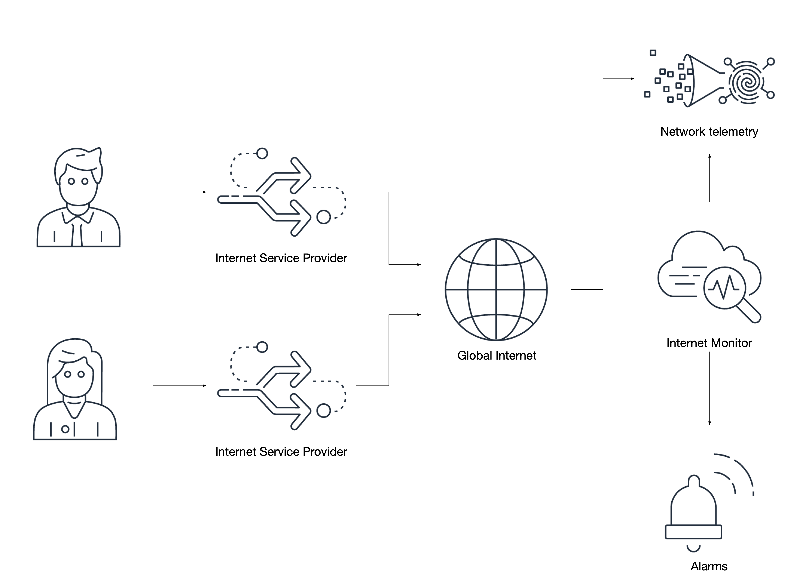

# Internet Monitor

:::warning
	이 문서 작성 시점에서 [Internet Monitor](https://aws.amazon.com/blogs/aws/cloudwatch-internet-monitor-end-to-end-visibility-into-internet-performance-for-your-applications/)는 CloudWatch 콘솔에서 **미리보기**로 제공됩니다. 정식 출시 시 기능 범위는 현재 경험하는 것과 달라질 수 있습니다.
:::
[워크로드의 모든 계층에서 텔레메트리 수집](../guides/index.md#collect-telemetry-from-all-tiers-of-your-workload)은 모범 사례이며, 때로는 도전이 될 수 있습니다. 그런데 워크로드의 계층이란 무엇일까요? 일부에게는 웹, 애플리케이션, 데이터베이스 서버일 수 있습니다. 다른 사람들은 프론트엔드와 백엔드로 볼 수 있습니다. 웹 애플리케이션을 운영하는 경우 [Real User Monitoring](./rum.md)(RUM)을 사용하여 최종 사용자가 경험하는 앱의 상태를 관찰할 수 있습니다.

하지만 클라이언트와 데이터센터 또는 클라우드 서비스 공급자 간의 트래픽은 어떨까요? 웹 페이지로 제공되지 않아 RUM을 사용할 수 없는 애플리케이션은 어떨까요?



Internet Monitor는 네트워킹 레벨에서 작동하며 관찰된 트래픽의 상태를 평가하고, 이를 알려진 인터넷 문제에 대한 [AWS의 기존 지식](https://docs.aws.amazon.com/AmazonCloudWatch/latest/monitoring/CloudWatch-IM-inside-internet-monitor.html)과 상호 참조합니다. 간단히 말해, 인터넷 서비스 공급자(ISP)에 성능 또는 가용성 문제가 있**고** 애플리케이션의 트래픽이 클라이언트/서버 통신에 해당 ISP를 사용하는 경우, Internet Monitor가 워크로드에 대한 이 영향을 사전에 알려줄 수 있습니다. 추가로, 선택한 호스팅 리전과 [CloudFront](https://aws.amazon.com/cloudfront/)를 Content Delivery Network로 사용하는 것에 기반한 권장 사항을 제공할 수 있습니다[^1].

:::tip
	Internet Monitor는 워크로드가 통과하는 네트워크의 트래픽만 평가합니다. 예를 들어, 다른 국가의 ISP에 영향이 있지만 사용자가 해당 통신사를 사용하지 않는 경우, 해당 문제에 대한 가시성은 없습니다.
:::

## 인터넷을 통과하는 애플리케이션을 위한 모니터 생성

Internet Monitor가 작동하는 방식은 영향을 받는 ISP로부터 CloudFront 배포 또는 VPC로 들어오는 트래픽을 감시하는 것입니다. 이를 통해 여러분의 통제 밖에 있는 네트워크 문제로 인해 발생하는 비즈니스 문제를 상쇄하는 데 도움이 되는 애플리케이션 동작, 라우팅 또는 사용자 알림에 대한 결정을 내릴 수 있습니다.


:::info
	인터넷을 통과하는 트래픽을 감시하는 모니터만 생성하세요. 프라이빗 네트워크([RFC1918](https://www.arin.net/reference/research/statistics/address_filters/)) 내의 두 호스트 간과 같은 프라이빗 트래픽은 Internet Monitor를 사용하여 모니터링할 수 없습니다.
:::
:::info
	해당되는 경우 모바일 애플리케이션의 트래픽을 우선시하세요. 공급자 간을 로밍하거나 원격 지리적 위치에 있는 고객은 여러분이 인지해야 할 다른 또는 예상치 못한 경험을 할 수 있습니다.
:::
## EventBridge와 CloudWatch를 통한 조치 활성화

관찰된 문제는 `aws.internetmonitor`로 식별된 소스를 포함하는 [스키마](https://docs.aws.amazon.com/AmazonCloudWatch/latest/monitoring/CloudWatch-IM-EventBridge-integration.html)를 사용하여 [EventBridge](https://aws.amazon.com/eventbridge/)를 통해 게시됩니다. EventBridge를 사용하여 티켓 관리 시스템에 자동으로 이슈를 생성하거나, 지원 팀에 페이지를 보내거나, 일부 시나리오를 완화하기 위해 워크로드를 변경하는 자동화를 트리거할 수 있습니다.

```json
{
  "source": ["aws.internetmonitor"]
}
```

마찬가지로, 관찰된 도시, 국가, 대도시 지역 및 지역 구분에 대한 트래픽의 상세 정보가 [CloudWatch Logs](./logs/index.md)에서 제공됩니다. 이를 통해 지역적으로 영향을 받는 고객에게 사전에 문제를 알릴 수 있는 매우 타깃이 명확한 조치를 생성할 수 있습니다. 다음은 단일 공급자에 대한 국가 수준 관측의 예입니다:

```json
{
    "version": 1,
    "timestamp": 1669659900,
    "clientLocation": {
        "latitude": 0,
        "longitude": 0,
        "country": "United States",
        "subdivision": "",
        "metro": "",
        "city": "",
        "countryCode": "US",
        "subdivisionCode": "",
        "asn": 00000,
        "networkName": "MY-AWESOME-ASN"
    },
    "serviceLocation": "us-east-1",
    "percentageOfTotalTraffic": 0.36,
    "bytesIn": 23,
    "bytesOut": 0,
    "clientConnectionCount": 0,
    "internetHealth": {
        "availability": {
            "experienceScore": 100,
            "percentageOfTotalTrafficImpacted": 0,
            "percentageOfClientLocationImpacted": 0
        },
        "performance": {
            "experienceScore": 100,
            "percentageOfTotalTrafficImpacted": 0,
            "percentageOfClientLocationImpacted": 0,
            "roundTripTime": {
                "p50": 71,
                "p90": 72,
                "p95": 73
            }
        }
    },
    "trafficInsights": {
        "timeToFirstByte": {
            "currentExperience": {
                "serviceName": "VPC",
                "serviceLocation": "us-east-1",
                "value": 48
            },
            "ec2": {
                "serviceName": "EC2",
                "serviceLocation": "us-east-1",
                "value": 48
            }
        }
    }
}
```

:::info
	`percentageOfTotalTraffic`와 같은 값은 고객이 어디에서 워크로드에 액세스하는지에 대한 강력한 인사이트를 제공하며, 고급 분석에 활용할 수 있습니다.
:::

:::warning
	Internet Monitor에서 생성한 로그 그룹은 기본 보존 기간이 *만료되지 않음*으로 설정됩니다. AWS는 동의 없이 데이터를 삭제하지 않으므로, 필요에 맞는 보존 기간을 설정하세요.
:::
:::info
	각 모니터는 최소 10개의 개별 CloudWatch 메트릭을 생성합니다. 이러한 메트릭은 다른 운영 메트릭과 마찬가지로 [알람](./alarms.md) 생성에 사용해야 합니다.
:::
## 트래픽 최적화 제안 활용

Internet Monitor는 최상의 고객 경험을 위해 워크로드를 어디에 배치하는 것이 가장 좋은지 조언하는 트래픽 최적화 권장 사항 기능을 제공합니다. 글로벌 워크로드 또는 글로벌 고객이 있는 워크로드의 경우, 이 기능은 특히 유용합니다.


:::info
	트래픽 최적화 제안 뷰에서 현재, 예측 및 최저 time-to-first-byte(TTFB) 값에 주의를 기울이세요. 이러한 값은 다른 방식으로는 관찰하기 어려운 잠재적으로 좋지 않은 최종 사용자 경험을 나타낼 수 있습니다.
:::
[^1]: 이 새로운 기능에 대한 출시 블로그는 [https://aws.amazon.com/blogs/aws/cloudwatch-internet-monitor-end-to-end-visibility-into-internet-performance-for-your-applications/](https://aws.amazon.com/blogs/aws/cloudwatch-internet-monitor-end-to-end-visibility-into-internet-performance-for-your-applications/)를 참조하세요.
