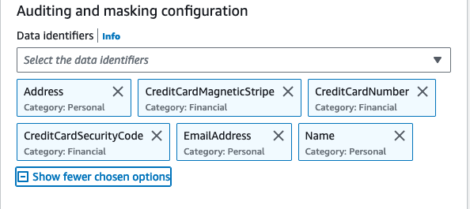

# SLG/EDU를 위한 CloudWatch Logs 데이터 보호 정책

로깅 데이터는 일반적으로 유용하지만, Health Insurance Portability and Accountability Act(HIPAA), General Data Privacy Regulation(GDPR), Payment Card Industry Data Security Standard(PCI-DSS), Federal Risk and Authorization Management Program(FedRAMP) 등의 엄격한 규정을 가진 조직에게는 데이터를 마스킹하는 것이 유용합니다.

CloudWatch Logs의 [데이터 보호 정책](https://docs.aws.amazon.com/AmazonCloudWatch/latest/logs/cloudwatch-logs-data-protection-policies.html)을 사용하면 고객이 전송 중인 로그 데이터에서 민감한 데이터를 스캔하고 감지된 민감한 데이터를 마스킹하는 데이터 보호 정책을 정의하고 적용할 수 있습니다.

이러한 정책은 패턴 매칭과 머신 러닝 모델을 활용하여 민감한 데이터를 감지하고, 계정의 CloudWatch 로그 그룹에 수집된 이벤트에 나타나는 해당 데이터를 감사하고 마스킹하는 데 도움을 줍니다.

민감한 데이터를 선택하는 데 사용되는 기술과 기준을 [매칭 데이터 식별자](https://docs.aws.amazon.com/AmazonCloudWatch/latest/logs/cloudwatch-logs-data-protection-policies.html)라고 합니다. 이러한 관리형 데이터 식별자를 사용하여 CloudWatch Logs는 다음을 감지할 수 있습니다:

- 프라이빗 키 또는 AWS 시크릿 액세스 키와 같은 자격 증명
- IP 주소 또는 MAC 주소와 같은 디바이스 식별자
- 은행 계좌 번호, 신용카드 번호 또는 신용카드 확인 코드와 같은 금융 정보
- Health Insurance Card Number(EHIC) 또는 Personal Health Number와 같은 보호 대상 건강 정보(PHI)
- 운전면허증, 사회보장번호 또는 납세자 식별 번호와 같은 개인 식별 정보(PII)

:::note
    민감한 데이터는 로그 그룹에 수집될 때 감지되고 마스킹됩니다. 데이터 보호 정책을 설정하면, 그 시점 이전에 수집된 로그 이벤트는 마스킹되지 않습니다.
:::
위에서 언급한 일부 데이터 유형을 확장하고 몇 가지 예시를 살펴보겠습니다:


## 데이터 유형

### 자격 증명

자격 증명은 여러분이 누구인지, 요청하는 리소스에 액세스할 수 있는 권한이 있는지 확인하는 데 사용되는 민감한 데이터 유형입니다. AWS는 프라이빗 키 및 시크릿 액세스 키와 같은 자격 증명을 사용하여 요청을 인증하고 권한을 부여합니다.

CloudWatch Logs 데이터 보호 정책을 사용하면, 선택한 데이터 식별자와 일치하는 민감한 데이터가 마스킹됩니다. (섹션 마지막에서 마스킹된 예시를 확인할 수 있습니다.)


:::tip
    데이터 분류 모범 사례는 조직, 법적 및 규정 준수 표준을 충족하는 명확하게 정의된 데이터 분류 계층 및 요구 사항으로 시작합니다.

    모범 사례로, 데이터 분류 프레임워크를 기반으로 AWS 리소스에 태그를 사용하여 조직의 데이터 거버넌스 정책에 따라 규정 준수를 구현하세요.
:::

:::tip
    로그 이벤트에 민감한 데이터가 포함되지 않도록 하려면, 모범 사례는 코드에서 먼저 이를 제외하고 필요한 정보만 로깅하는 것입니다.
:::


### 금융 정보

Payment Card Industry Data Security Standard(PCI DSS)에서 정의한 바와 같이, 은행 계좌, 라우팅 번호, 직불 및 신용카드 번호, 신용카드 마그네틱 스트립 데이터는 민감한 금융 정보로 간주됩니다.

민감한 데이터를 감지하기 위해, CloudWatch Logs는 데이터 보호 정책을 설정하면 로그 그룹이 위치한 지리적 위치에 관계없이 지정된 데이터 식별자를 스캔합니다.


:::info
    [금융 데이터 유형 및 데이터 식별자](https://docs.aws.amazon.com/AmazonCloudWatch/latest/logs/protect-sensitive-log-data-types-financial.html)의 전체 목록을 확인하세요.
:::


### 보호 대상 건강 정보(PHI)

PHI에는 보험 및 청구 정보, 진단 데이터, 의료 기록 및 데이터 세트와 같은 임상 치료 데이터, 이미지 및 검사 결과와 같은 실험실 결과를 포함하여 매우 광범위한 개인 식별 건강 및 건강 관련 데이터가 포함됩니다.

CloudWatch Logs는 선택한 로그 그룹에서 건강 정보를 스캔하고 감지하며 해당 데이터를 마스킹합니다.


:::info
    [PHI 데이터 유형 및 데이터 식별자](https://docs.aws.amazon.com/AmazonCloudWatch/latest/logs/protect-sensitive-log-data-types-health.html)의 전체 목록을 확인하세요.
:::

### 개인 식별 정보(PII)

PII는 개인을 식별하는 데 사용될 수 있는 개인 데이터에 대한 텍스트 참조입니다. PII의 예로는 주소, 은행 계좌 번호, 전화번호 등이 있습니다.



:::info
    [PII 데이터 유형 및 데이터 식별자](https://docs.aws.amazon.com/AmazonCloudWatch/latest/logs/protect-sensitive-log-data-types-pii.html)의 전체 목록을 확인하세요.
:::

## 마스킹된 로그

이제 데이터 보호 정책을 설정한 로그 그룹으로 이동하면, 데이터 보호가 `On`으로 표시되고 콘솔에 민감한 데이터의 수도 표시됩니다.


이제 `View in Log Insights`를 클릭하면 Log Insights 콘솔로 이동합니다. 아래 쿼리를 실행하여 로그 스트림의 로그 이벤트를 확인하면 모든 로그 목록을 얻을 수 있습니다.

```
fields @timestamp, @message
| sort @timestamp desc
| limit 20
```

쿼리를 확장하면 아래와 같이 마스킹된 결과를 확인할 수 있습니다:


:::important
    데이터 보호 정책을 생성하면, 기본적으로 선택한 데이터 식별자와 일치하는 민감한 데이터가 마스킹됩니다. `logs:Unmask` IAM 권한이 있는 사용자만 마스킹되지 않은 데이터를 볼 수 있습니다.
:::

:::tip
    CloudWatch에서 민감한 데이터에 대한 액세스를 관리하고 제한하려면 [AWS IAM and Access Management(IAM)](https://docs.aws.amazon.com/AmazonCloudWatch/latest/monitoring/auth-and-access-control-cw.html)를 사용하세요.
:::

:::tip
    클라우드 환경의 정기적인 모니터링과 감사도 민감한 데이터를 보호하는 데 있어 동등하게 중요합니다. 애플리케이션이 대량의 데이터를 생성하는 경우 이는 중요한 측면이 되며, 따라서 과도한 양의 데이터를 로깅하지 않는 것이 권장됩니다. 이 AWS Prescriptive Guidance의 [로깅 모범 사례](https://docs.aws.amazon.com/prescriptive-guidance/latest/logging-monitoring-for-application-owners/logging-best-practices.html)를 읽어보세요.
:::

:::tip
    로그 그룹 데이터는 CloudWatch Logs에서 항상 암호화됩니다. 또한 [AWS Key Management Service](https://docs.aws.amazon.com/AmazonCloudWatch/latest/logs/encrypt-log-data-kms.html)를 사용하여 로그 데이터를 암호화할 수도 있습니다.
:::

:::tip
    복원력과 확장성을 위해, CloudWatch 알람을 설정하고 AWS Amazon EventBridge 및 AWS Systems Manager를 사용하여 자동화된 조치를 구현하세요.
:::


[^1]: 시작하려면 AWS 블로그 [Protect Sensitive Data with Amazon CloudWatch Logs](https://aws.amazon.com/blogs/aws/protect-sensitive-data-with-amazon-cloudwatch-logs/)를 확인하세요.
