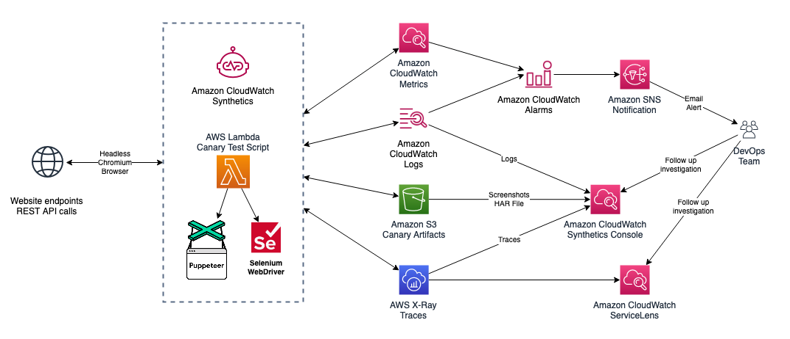

# Synthetic Testing

Amazon CloudWatch Synthetics를 사용하면 실제 사용자가 없는 상황에서도 고객의 관점에서 애플리케이션을 모니터링할 수 있습니다. API와 웹사이트 경험을 지속적으로 테스트함으로써 사용자 트래픽이 없을 때에도 발생하는 간헐적인 문제에 대한 가시성을 확보할 수 있습니다.

Canary는 구성 가능한 스크립트로, 스케줄에 따라 실행하여 API와 웹사이트 경험을 24시간 연중무휴로 지속적으로 테스트할 수 있습니다. 실제 사용자와 동일한 코드 경로 및 네트워크 경로를 따르며, 지연 시간, 페이지 로드 오류, 끊어지거나 죽은 링크, 중단된 사용자 워크플로 등 예상치 못한 동작을 알려줍니다.

:::note
    소유권이나 권한이 있는 엔드포인트와 API만 Synthetics canary로 모니터링하세요. canary 빈도 설정에 따라 해당 엔드포인트에 트래픽이 증가할 수 있습니다.
:::
## 시작하기

### 전체 커버리지

:::tip
    테스트 전략을 수립할 때, 퍼블릭 엔드포인트뿐만 아니라 Amazon VPC 내의 [프라이빗 내부 엔드포인트](https://aws.amazon.com/blogs/mt/monitor-your-private-endpoints-using-cloudwatch-synthetics/)도 고려하세요.
:::
### 새 Canary 기록

[CloudWatch Synthetics Recorder](https://chrome.google.com/webstore/detail/cloudwatch-synthetics-rec/bhdnlmmgiplmbcdmkkdfplenecpegfno) Chrome 브라우저 플러그인을 사용하면 복잡한 워크플로를 가진 새로운 canary 테스트 스크립트를 처음부터 빠르게 작성할 수 있습니다. 기록 중 수행된 타이핑 및 클릭 동작은 canary 생성에 사용할 수 있는 Node.js 스크립트로 변환됩니다. CloudWatch Synthetics Recorder의 알려진 제한사항은 [이 페이지](https://docs.aws.amazon.com/AmazonCloudWatch/latest/monitoring/CloudWatch_Synthetics_Canaries_Recorder.html#CloudWatch_Synthetics_Canaries_Recorder-limitations)에서 확인할 수 있습니다.

### 집계 메트릭 보기

canary 스크립트 플릿에서 수집된 집계 메트릭에 대한 기본 제공 보고서를 활용하세요. CloudWatch Automatic Dashboard

## Canary 작성

### 블루프린트

[canary 블루프린트](https://docs.aws.amazon.com/AmazonCloudWatch/latest/monitoring/CloudWatch_Synthetics_Canaries_Blueprints.html)를 사용하여 여러 canary 유형의 설정 프로세스를 간소화하세요.

:::info
    블루프린트는 canary 작성을 시작하는 편리한 방법이며, 간단한 사용 사례는 코드 없이 처리할 수 있습니다.
:::
### 유지보수성

자체 canary를 작성할 때 *런타임 버전*에 연결됩니다. 이는 Selenium이 포함된 Python 또는 Puppeteer가 포함된 JavaScript의 특정 버전이 됩니다. 현재 지원되는 런타임 버전과 더 이상 사용되지 않는 버전의 목록은 [이 페이지]를 참조하세요.

:::info
    [환경 변수를 사용](https://aws.amazon.com/blogs/mt/using-environment-variables-with-amazon-cloudwatch-synthetics/)하여 canary 실행 중 액세스할 수 있는 데이터를 공유함으로써 스크립트의 유지보수성을 향상시키세요.
:::

:::info
    새로운 런타임 버전이 제공되면 canary를 최신 런타임 버전으로 업그레이드하세요.
:::
### 문자열 시크릿

canary 또는 환경 변수 외부의 보안 시스템에서 시크릿(예: 로그인 자격 증명)을 가져오도록 canary를 코딩할 수 있습니다. AWS Lambda에서 접근 가능한 모든 시스템은 잠재적으로 런타임에 canary에 시크릿을 제공할 수 있습니다.

:::info
    AWS Secrets Manager를 사용하여 데이터베이스 연결 세부 정보, API 키, 애플리케이션 자격 증명과 같은 시크릿을 저장하여 테스트를 실행하고 [민감한 데이터를 보호](https://aws.amazon.com/blogs/mt/secure-monitoring-of-user-workflow-experience-using-amazon-cloudwatch-synthetics-and-aws-secrets-manager/)하세요.
:::
## 대규모 Canary 관리

### 끊어진 링크 확인
:::info
    웹사이트에 대량의 동적 콘텐츠와 링크가 포함된 경우, CloudWatch Synthetics를 사용하여 웹사이트를 크롤링하고, [끊어진 링크를 탐지](https://aws.amazon.com/blogs/mt/cloudwatch-synthetics-to-find-broken-links-on-your-website/)하며, 실패 원인을 찾을 수 있습니다. 그런 다음 실패 임계값을 사용하여 임계값이 위반될 때 선택적으로 CloudWatch 알람을 생성할 수 있습니다.
:::
### 다중 하트비트 URL

:::info
    단일 하트비트 모니터링 canary 테스트에서 [여러 URL을 배치](https://aws.amazon.com/blogs/mt/simplify-your-canary-by-batching-multiple-urls-in-amazon-cloudwatch-synthetics/)하여 테스트를 단순화하고 비용을 최적화하세요. 그런 다음 canary 실행 보고서의 단계 요약에서 각 URL의 상태, 기간, 관련 스크린샷, 실패 사유를 확인할 수 있습니다.
:::
### 그룹으로 구성

:::info
    canary를 [그룹](https://docs.aws.amazon.com/AmazonCloudWatch/latest/monitoring/CloudWatch_Synthetics_Groups.html)으로 구성하고 추적하여 집계 메트릭을 확인하고, 실패를 더 쉽게 격리하고 드릴다운할 수 있습니다.
:::

:::warning
    크로스 리전 그룹을 생성하는 경우, 그룹에는 canary의 *정확한* 이름이 필요합니다.
:::
## 런타임 옵션

### 버전 및 지원

CloudWatch Synthetics는 현재 스크립트에 Node.js를 사용하고 프레임워크로 [Puppeteer](https://github.com/puppeteer/puppeteer)를 사용하는 런타임과, 스크립팅에 Python을 사용하고 프레임워크로 [Selenium WebDriver](https://www.selenium.dev/documentation/webdriver/)를 사용하는 런타임을 지원합니다.

:::info
    최신 기능과 Synthetics 라이브러리의 업데이트를 활용하려면 항상 canary에 가장 최근의 런타임 버전을 사용하세요.
:::
CloudWatch Synthetics는 향후 60일 이내에 [지원 중단 예정인 런타임](https://docs.aws.amazon.com/AmazonCloudWatch/latest/monitoring/CloudWatch_Synthetics_Canaries_Library.html#CloudWatch_Synthetics_Canaries_runtime_support)을 사용하는 canary가 있는 경우 이메일로 알려줍니다.

### 코드 샘플

[Node.js 및 Puppeteer](https://docs.aws.amazon.com/AmazonCloudWatch/latest/monitoring/CloudWatch_Synthetics_Canaries_Samples.html#CloudWatch_Synthetics_Canaries_Samples_nodejspup)와 [Python 및 Selenium](https://docs.aws.amazon.com/AmazonCloudWatch/latest/monitoring/CloudWatch_Synthetics_Canaries_Samples.html#CloudWatch_Synthetics_Canaries_Samples_pythonsel) 코드 샘플로 시작하세요.

### Selenium 가져오기

[Python 및 Selenium](https://aws.amazon.com/blogs/mt/create-canaries-in-python-and-selenium-using-amazon-cloudwatch-synthetics/)으로 canary를 처음부터 생성하거나, 최소한의 변경으로 기존 스크립트를 가져올 수 있습니다.
