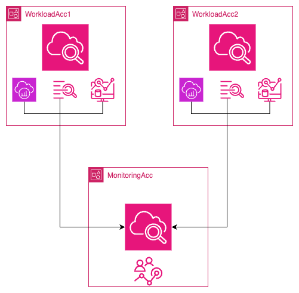
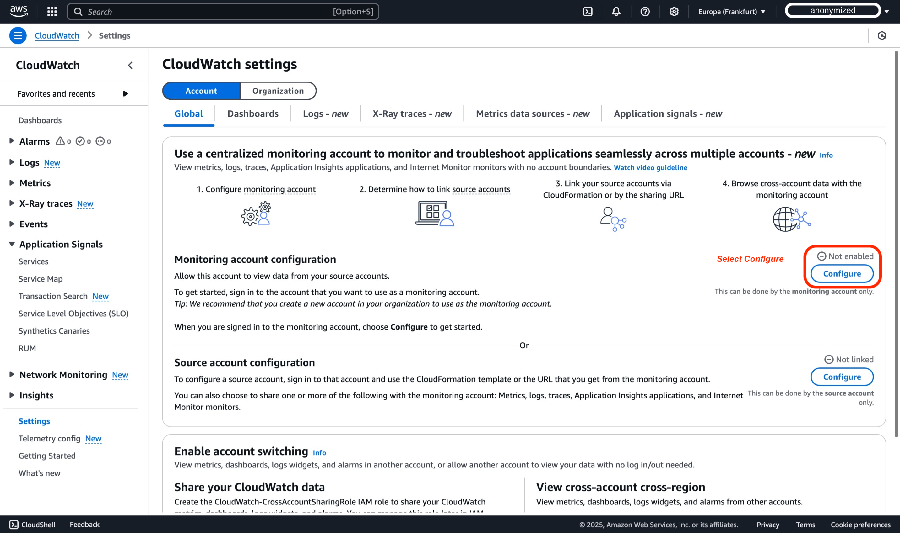
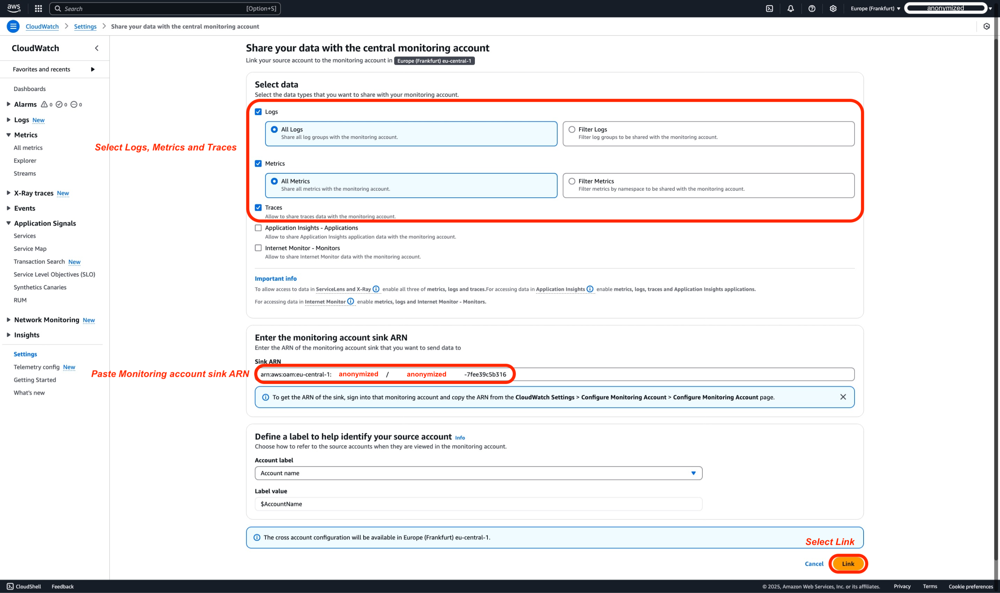
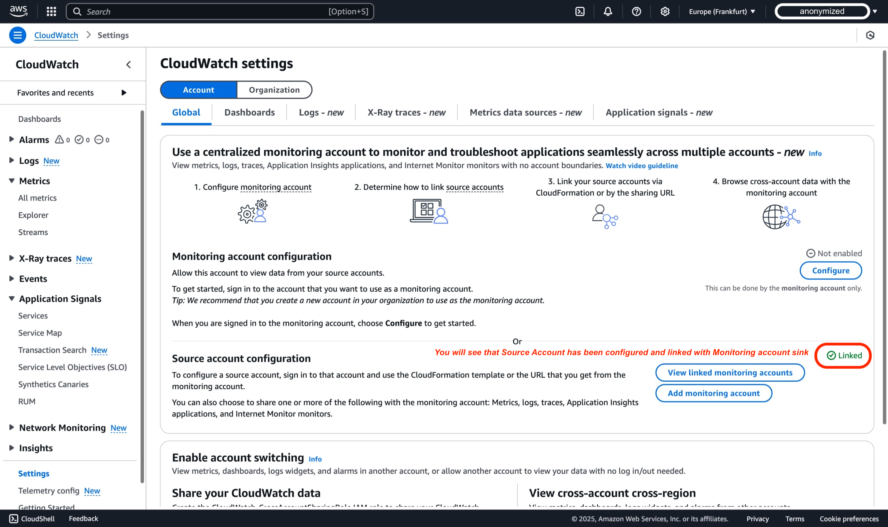
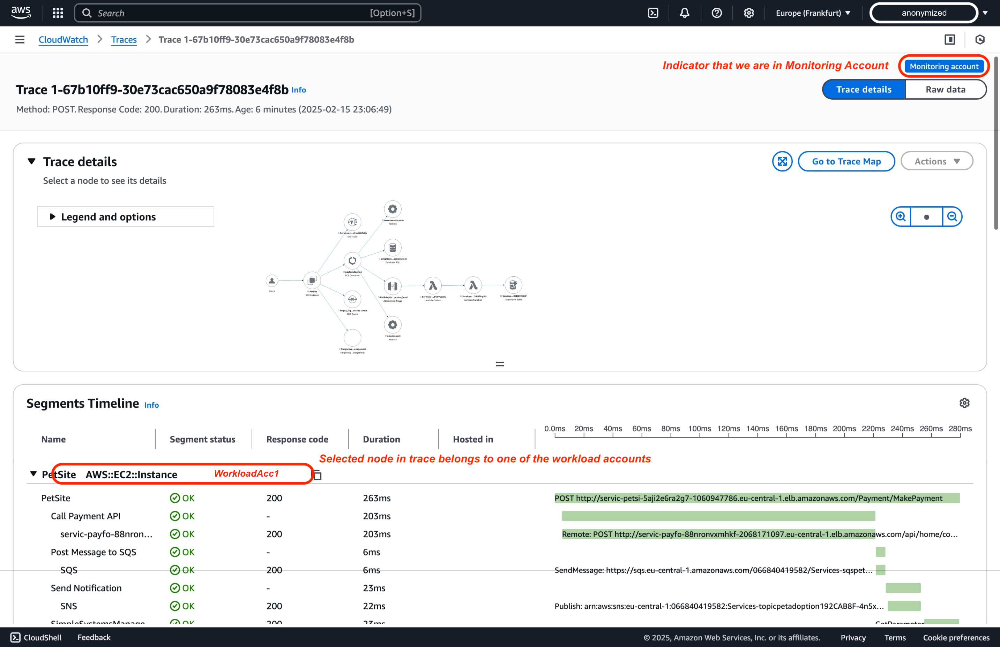

# CloudWatch Cross-Account Observability

ஒரு AWS Region-க்குள் பல AWS கணக்குகளில் பரவியுள்ள பயன்பாடுகளை கண்காணிப்பது சவாலாக இருக்கலாம். [Amazon CloudWatch-இன் cross-account observability](https://aws.amazon.com/blogs/aws/new-amazon-cloudwatch-cross-account-observability/)[^1] ஒரு [**AWS Region**](https://docs.aws.amazon.com/AmazonCloudWatch/latest/monitoring/CloudWatch-Unified-Cross-Account.html)[^2]-க்குள் பல கணக்குகளில் பரவியுள்ள பயன்பாடுகளின் தடையற்ற கண்காணிப்பு மற்றும் சிக்கல் தீர்ப்பை செயல்படுத்துவதன் மூலம் இந்த செயல்முறையை எளிமையாக்குகிறது. இந்த வழிகாட்டி இரண்டு AWS கணக்குகளுக்கு இடையே cross-account observability-ஐ கட்டமைப்பதற்கான படிப்படியான வழிகாட்டியை, ஸ்கிரீன்ஷாட்களுடன் வழங்குகிறது. கூடுதலாக, பரந்த அளவிடுதலுக்காக AWS Organizations மூலமும் டிப்ளாய்மென்ட் சாத்தியம் என்பதையும் குறிப்பிடுவது மதிப்புக்குரியது.

## சொற்கள்

Amazon CloudWatch உடன் பயனுள்ள cross-account observability-க்கு, பின்வரும் முக்கிய சொற்களை புரிந்துகொள்ள வேண்டும்:

| **சொல்** | **விளக்கம்** |
|------|-------------|
| **Monitoring Account** | பல source கணக்குகளிலிருந்து உருவாக்கப்பட்ட observability தரவுகளைப் பார்க்கவும் ஊடாடவும் முடிகிற ஒரு மையமான AWS கணக்கு |
| **Source Account** | அதில் உள்ள வளங்களுக்கான observability தரவை உருவாக்கும் ஒரு தனிப்பட்ட AWS கணக்கு |
| **Sink** | Source கணக்குகள் தங்கள் observability தரவை இணைக்கவும் பகிரவும் இணைப்புப் புள்ளியாக செயல்படும் monitoring கணக்கிலுள்ள ஒரு வளம். ஒவ்வொரு கணக்கும் ஒவ்வொரு [AWS Region](https://docs.aws.amazon.com/AmazonCloudWatch/latest/monitoring/CloudWatch-Unified-Cross-Account.html)[^2]-க்கு ஒரு **Sink** வைத்திருக்கலாம் |
| **Observability Link** | Observability தரவின் பகிர்வை எளிதாக்கும் source கணக்கு மற்றும் monitoring கணக்கு இடையே நிறுவப்பட்ட இணைப்பை பிரதிநிதித்துவப்படுத்தும் ஒரு வளம். இணைப்புகள் source கணக்கால் நிர்வகிக்கப்படுகின்றன. |

Amazon CloudWatch-இல் cross-account observability-ஐ வெற்றிகரமாக கட்டமைக்கவும் நிர்வகிக்கவும் இந்த வரையறைகளைப் புரிந்துகொள்ளுங்கள்.

## கவனிக்க வேண்டிய விஷயங்கள்
1. கணக்கு வரம்புகள்: மிகப்பெரிய நிறுவன அமைப்புகளுக்கும் ஏற்றவாறு, ஒரு monitoring கணக்குடன் 100,000 source கணக்குகள் வரை இணைக்கலாம்.
2. Cross Region: Cross-Region செயல்பாடு இந்த அம்சத்தில் தானாகவே உள்ளமைக்கப்பட்டுள்ளது. வெவ்வேறு Region-களிலிருந்தான மெட்ரிக்குகளை ஒரே கணக்கில் ஒரே வரைபடத்தில் அல்லது ஒரே டாஷ்போர்டில் காண்பிக்க கூடுதல் நடவடிக்கைகள் எதுவும் எடுக்க வேண்டியதில்லை.
3. தரவு தக்கவைப்பு: அனைத்து தரவு தக்கவைப்பும் source கணக்கு மட்டத்தில் கையாளப்படுகிறது. Monitoring கணக்கு தரவை சேமிக்கவோ நகலெடுக்கவோ செய்யாது. Monitoring கணக்குக்கு source கணக்குகளின் தரவுக்கு படிக்க-மட்டும் அணுகல் உள்ளது. உண்மையான தரவு பரிமாற்றம் அல்லது ஒத்திசைவு எதுவும் இல்லை.
4. செலவு தாக்கங்கள்: ஆச்சரியமாக, Cross-Account Observability-உடன் கூடுதல் செலவுகள் எதுவும் இல்லை. தரவு source கணக்குகளில் இருக்கிறது மற்றும் monitoring கணக்கால் படிக்கப்படுவதால், கூடுதல் தரவு பரிமாற்ற அல்லது சேமிப்பு கட்டணங்கள் இல்லை.
5. Cross-account observability-ஐ பயன்படுத்தி source கணக்கிலிருந்து (X) monitoring கணக்குடன் (Y) ட்ரேஸ்களை பகிரும்போது, ட்ரேஸ்கள் monitoring கணக்கில் (Y) நகலெடுக்கப்பட்டு சேமிக்கப்படுகின்றன. இந்த செயல்முறை source கணக்குக்கு (X) கூடுதல் செலவுகளை ஏற்படுத்தாது, இதனால் அசல் பில்லிங்கை பாதிக்காமல் கணக்குகள் முழுவதும் கண்காணிப்பு திறன்களை விரிவுபடுத்தலாம்.
6. CloudWatch Service Quotas-இன் படி, ஒவ்வொரு டாஷ்போர்டிலும் 500 விட்ஜெட்டுகள் வரை இருக்கலாம். ஒரு தனிப்பட்ட விட்ஜெட்டில் 500 மெட்ரிக்குகள் வரை இருக்கலாம், மற்றும் ஒரு தனிப்பட்ட டாஷ்போர்டில் அனைத்து விட்ஜெட்டுகளிலும் 2500 மெட்ரிக்குகள் வரை இருக்கலாம். இந்த quotas metric math functions-இல் பயன்படுத்த மீட்டெடுக்கப்பட்ட அனைத்து மெட்ரிக்குகளையும் உள்ளடக்கியவை, அந்த மெட்ரிக்குகள் வரைபடத்தில் காண்பிக்கப்படாவிட்டாலும். இந்த quotas hard quotas ஆகும், அவற்றை மாற்ற முடியாது.
7. Amazon CloudWatch Logs Insights-இல், தனிப்பட்டாக குறிப்பிட்டால் ஒரு வினவலுக்கு அதிகபட்சமாக 50 லாக் குழுக்களை வினவலாம். இந்த வரம்பு நிலையானது, அதிகரிக்க முடியாது. இருப்பினும், லாக் குழு அளவுகோல்களைப் பயன்படுத்தினால்—பெயர் முன்னொட்டுகளின் அடிப்படையில் லாக் குழுக்களைத் தேர்ந்தெடுப்பது அல்லது "அனைத்து லாக் குழுக்களையும்" வினவ தேர்வு செய்வது போன்றவை—ஒரே வினவலில் 10,000 லாக் குழுக்கள் வரை சேர்க்கலாம், பல குழுக்களில் பரந்த லாக் பகுப்பாய்வை அனுமதிக்கிறது.
8. CloudWatch Cross-Account Observability-இல் Logs மற்றும் Metrics-உடன் பணிபுரியும்போது, monitoring கணக்குடன் அனைத்து namespaces-இலிருந்தும் மெட்ரிக்குகளை பகிரவோ அல்லது namespaces-இன் ஒரு துணைக்குழுவிற்கு வடிகட்டவோ தேர்வு செய்யலாம்.
9. Cross-account சூழ்நிலையில் Alarms-உடன் பணிபுரியும்போது சில கருத்தில் கொள்ள வேண்டியவை:
   1. CloudWatch Metrics Insights என்பது cross-account observability சூழ்நிலைகளில் நூற்றுக்கணக்கான மெட்ரிக்குகளை பல கணக்குகளிலிருந்து வினவ முடிகிற சக்திவாய்ந்த உயர்-செயல்திறன் SQL வினவல் எஞ்சினாகும்.
    2. ஒரு Alarm அமைக்கும்போது, அது ஒற்றை நேர வரிசையை திருப்பி அனுப்பும் வினவலிலிருந்து இருக்க வேண்டும், இதை SELECT expression மூலம் நிறைவேற்றலாம், இருப்பினும், SUM, MIN, MAX, COUNT மற்றும் AVG புள்ளிவிவரங்களை மட்டுமே பயன்படுத்த முடியும்.
    3. மேலும், குறிப்பிட்ட dimension மதிப்பின் படி நிகழ்நேரத்தில் தனி நேர வரிசைகளாக மெட்ரிக்குகளை குழுவாக்க "group by" clause பயன்படுத்தலாம். "Top N" வகை வினவல்களை செய்ய "order by" திறனையும் பயன்படுத்தலாம்.
    4. வினவல்களை உருவாக்க இயற்கை மொழியைப் பயன்படுத்தலாம். இதற்கு, நீங்கள் தேடும் தரவைப் பற்றி கேள்விகள் கேட்கவோ அல்லது விவரிக்கவோ செய்யுங்கள். இந்த AI-உதவி திறன் உங்கள் prompt-ஐ அடிப்படையாகக் கொண்டு ஒரு வினவலை உருவாக்கி, வினவல் எவ்வாறு செயல்படுகிறது என்பதற்கான வரி-வரி விளக்கத்தை வழங்குகிறது.
    5. SEARCH expression-ஐ அடிப்படையாகக் கொண்டு ஒரு alarm-ஐ உருவாக்க முடியாது. ஏனெனில் search expressions பல நேர வரிசைகளை திருப்பி அனுப்புகின்றன, மற்றும் ஒரு math expression-ஐ அடிப்படையாகக் கொண்ட alarm ஒரே நேர வரிசையை மட்டுமே கண்காணிக்க முடியும். மேலும், SEARCH function-ஐ கொண்ட math expression-இல் (உதாரணமாக "MAX") alarm செய்ய முடியாது. இந்த சூழ்நிலையை CloudWatch Custom Data Sources மூலம் நிறைவேற்றலாம்.
    6. Alarms-க்கு Cross-Region செயல்பாடு ஆதரிக்கப்படவில்லை, எனவே ஒரு Region-இல் ஒரு alarm-ஐ உருவாக்கி வேறொரு Region-இல் உள்ள மெட்ரிக்கை கண்காணிக்க முடியாது.

10. Data Protection Policy: Source கணக்கில் data protection policy இயக்கப்பட்டிருந்தால், வெளிப்படையான அனுமதிகள் வழங்கப்படாவிட்டால் monitoring கணக்கு தரவை அணுக முடியாது.


## AWS Console வழியாக படிப்படியான வழிகாட்டி

### முன்நிபந்தனைகள்

1. இந்த வழிகாட்டியை நிறைவு செய்ய, உங்களுக்கு மூன்று AWS கணக்குகள் தேவை: ஒரு Monitoring Account மற்றும் இரண்டு Source Accounts.

2. Cross-account இணைப்புகளை monitoring கணக்கு மற்றும் source கணக்குகளுக்கு இடையே உருவாக்க, ஒரு பயனர் அல்லது பங்குக்கு குறைந்தபட்சம் [AWS CloudWatch cross-account setup guide](https://docs.aws.amazon.com/AmazonCloudWatch/latest/monitoring/CloudWatch-Unified-Cross-Account-Setup.html#CloudWatch-Unified-Cross-Account-Setup-permissions)[^3]-இல் ஆவணப்படுத்தப்பட்ட அனுமதிகள் இருக்க வேண்டும்.

<div style={{ textAlign: 'center' }}>

</div>

### படி 1: Monitoring Account-ஐ அமைத்தல்

#### Monitoring Account

Monitoring account-ஐ அமைக்க, இந்த படிகளைப் பின்பற்றுங்கள்:

1. CloudWatch console-ஐ [https://console.aws.amazon.com/cloudwatch](https://console.aws.amazon.com/cloudwatch)-இல் திறந்து, cross-account monitoring account-ஐ கட்டமைக்கும் AWS region-ஐ தேர்ந்தெடுக்கவும், இந்த டெமோவின் எல்லைக்குள் Europe (Frankfurt) region (eu-central-1)-ஐ பயன்படுத்துவோம்.


2. வழிசெலுத்தல் பலகத்தில், **Settings**-ஐ தேர்ந்தெடுக்கவும்.


3. இந்த டெமோவின் எல்லைக்குள், இயல்புநிலை Account Global settings-ஐ பயன்படுத்துவோம், பின்னர் **Monitoring account configuration** பிரிவில் **Configure**-ஐ தேர்ந்தெடுக்கவும்.


4. Monitoring கணக்குடன் பகிர வேண்டிய தரவு வகைகளைத் தேர்ந்தெடுத்த பிறகு, Source Account IDs-ஐ "List source accounts" பெட்டியில் ஒட்டவும். இந்த டெமோவிற்கு, WorkloadAcc1 மற்றும் WorkloadAcc2-இன் IDs பயன்படுத்தப்படுகின்றன. Metrics, Logs மற்றும் Traces தேர்ந்தெடுக்கப்பட்டுள்ளன. Metrics மற்றும் Logs மட்டுமே வடிகட்டலை அனுமதிக்கின்றன; மற்ற அனைத்தும் எப்போதும் முழுமையாக பகிரப்படும். ServiceLens மற்றும் X-Ray-க்கு, metrics, logs மற்றும் traces-ஐ இயக்க வேண்டும். Application Insights-க்கு, Application Insights applications-ஐயும் இயக்க வேண்டும். Internet Monitor-க்கு, metrics, logs மற்றும் Internet Monitor - Monitors-ஐ இயக்க வேண்டும்.


:::info
CloudWatch Cross-Account Observability-இல் telemetry வகைகளை கட்டமைக்கும்போது, அவற்றின் சார்புகளைப் புரிந்துகொள்வது முக்கியம். Metrics, Logs மற்றும் Traces-ஐ தனித்தனியாக கட்டமைக்க முடியும், ஆனால் பிற CloudWatch செயல்பாடுகளுக்கு குறிப்பிட்ட தேவைகள் உள்ளன. ServiceLens மற்றும் X-Ray செயல்பாட்டிற்கு மூன்றும் தேவை: Metrics, Logs மற்றும் Traces. மேம்பட்ட கண்காணிப்புக்கு, Application Insights-க்கு Metrics, Logs, Traces மற்றும் Application Insights applications இயக்கப்பட வேண்டும். அதேபோல், Internet Monitor-க்கு Metrics, Logs மற்றும் Internet Monitor - Monitors இயக்கப்பட வேண்டும். பின்வரும் அட்டவணை இந்த சார்புகளை விவரிக்கிறது:
:::
    | Telemetry வகை | விளக்கம் | CloudWatch Cross-Account Observability-க்கான சார்புகள் |
    |----------------|-------------|-----------------------------------------------------|
    | Amazon CloudWatch-இல் Metrics | அனைத்து metric namespaces-ஐயும் பகிரவும் அல்லது ஒரு துணைக்குழுவிற்கு வடிகட்டவும் | இல்லை |
    | Amazon CloudWatch Logs-இல் Log Groups | அனைத்து log groups-ஐயும் பகிரவும் அல்லது ஒரு துணைக்குழுவிற்கு வடிகட்டவும் | இல்லை |
    | ServiceLens மற்றும் X-Ray | அனைத்து traces-ஐயும் பகிரவும் (வடிகட்டல் இல்லை) | ServiceLens மற்றும் X-Ray-க்கு Metrics, Logs மற்றும் Traces இயக்க வேண்டும் |
    | Amazon CloudWatch Application Insights-இல் Applications | அனைத்து applications-ஐயும் பகிரவும் (வடிகட்டல் இல்லை) | Metrics, Logs, Traces மற்றும் Application Insights applications இயக்க வேண்டும் |
    | CloudWatch Internet Monitor-இல் Monitors | அனைத்து monitors-ஐயும் பகிரவும் (வடிகட்டல் இல்லை) | Metrics, Logs மற்றும் Internet Monitor - Monitors இயக்க வேண்டும் |

5. உங்கள் Monitoring Account-இன் AWS Console-இல், Monitoring Account வெற்றிகரமாக கட்டமைக்கப்பட்டதை உறுதிப்படுத்தும் பின்வரும் விளக்கப்படத்தை பார்க்க வேண்டும்.


:::tip
	உங்கள் monitoring account-ஐ வெற்றிகரமாக கட்டமைத்த பிறகு, உங்கள் source கணக்குகளை இணைக்க வேண்டும். Source கணக்குகளை இணைக்க இரண்டு முக்கிய முறைகள் உள்ளன: AWS Organizations பயன்படுத்துதல் மற்றும் தனிப்பட்ட கணக்குகளை இணைத்தல். படி 2-இல், ஒரு தனிப்பட்ட கணக்கை கட்டமைக்கும் செயல்முறையை பார்ப்போம். இருப்பினும், Source Account-இல் உள்நுழைந்து மாற்றங்கள் செய்வதற்கு முன், இப்போது கட்டமைக்கப்பட்ட Monitoring Account-இலிருந்து Monitoring account sink ARN போன்ற தகவல்களை சேகரிக்க வேண்டும்.
:::

6. Monitoring Account-இல் நீங்கள் முன்பு நிறுத்திய AWS Console-இல், **Resources to link accounts**-ஐ தேர்ந்தெடுக்கவும்


7. AWS Console-இல், 'Configuration details' பிரிவை விரிவாக்கவும், இங்குதான் படி 2-இல் source account-ஐ இணைக்கும்போது தேவைப்படும் Monitoring account sink ARN-ஐ நகலெடுத்து எங்காவது சேமிக்க வேண்டும்.


#### சுருக்கம்

முந்தைய படிகளில், Source Accounts-உடன் இணைக்கப்பட வேண்டிய Monitoring account sink-ஐ கட்டமைத்தோம், அவை standalone ஆக இருந்தாலும் அல்லது organization-இன் ஒரு பகுதியாக இருந்தாலும். அடிப்படையில், மேலே உள்ள படிகள் source கணக்குகளை ஒருங்கிணைக்க அனுமதிக்கும் Monitoring account sink-இல் ஒரு Configuration policy-ஐ உருவாக்கின. AWS Console configuration மூலம் உருவாக்கப்பட்ட ஒரு மாதிரி policy கீழே காணலாம்:

```
{
    "Version": "2012-10-17",
    "Statement": [
        {
            "Effect": "Allow",
            "Principal": {
                "AWS": [
                    "${WorkloadAcc1}", // Workload Account
                    "${WorkloadAcc2}"  // Workload Account
                ]
            },
            "Action": [
                "oam:CreateLink",
                "oam:UpdateLink"
            ],
            "Resource": "*",
            "Condition": {
                "ForAllValues:StringEquals": {
                    "oam:ResourceTypes": [
                        "AWS::Logs::LogGroup",
                        "AWS::CloudWatch::Metric",
                        "AWS::XRay::Trace"
                    ]
                }
            }
        }
    ]
}
```

AWS Organizations பயன்படுத்தி கட்டமைக்கும் பட்சத்தில், PrincipalOrgID நிபந்தனையின் அடிப்படையில் உங்கள் AWS organization-க்குள் உள்ள அனைத்து AWS கணக்குகளையும் இணைப்புகளை உருவாக்க அல்லது புதுப்பிக்க நம்பும் வகையில் கூடுதல் மாற்றங்கள் தேவையில்லாத Configuration Policy-ஐ Monitoring account sink-க்கு பொருத்தப்பட்டிருக்கும். அத்தகைய மாதிரி policy கீழே காணலாம்:

```
{
    "Version": "2012-10-17",
    "Statement": [
        {
            "Effect": "Allow",
            "Principal": "*",
            "Action": ["oam:CreateLink", "oam:UpdateLink"],
            "Resource": "*",
            "Condition": {
                "ForAllValues:StringEquals": {
                    "oam:ResourceTypes": [
                        "AWS::Logs::LogGroup",
                        "AWS::CloudWatch::Metric",
                        "AWS::XRay::Trace",
                        "AWS::ApplicationInsights::Application",
                        "AWS::InternetMonitor::Monitor"
                    ]
                },
                "ForAnyValue:StringEquals": {
                    "aws:PrincipalOrgID": "${OrganizationId}" // AWS Organization as Condition
                }
            }
        }
    ]
}
```


### படி 2: Source கணக்குகளை இணைத்தல்

#### தனிப்பட்ட கணக்குகளை இணைத்தல்

படி 1-இல் monitoring account-ஐ கட்டமைத்த பிறகு, இப்போது ஒரு தனிப்பட்ட AWS source account-ஐ கட்டமைப்போம். இந்த அணுகுமுறை உங்கள் organization-க்கு வெளியே உள்ள கணக்குகளுடன் பணிபுரியும்போது அல்லது குறிப்பிட்ட standalone கணக்குகளுக்கு கண்காணிப்பை நிறுவ வேண்டும்போது மிகவும் பயனுள்ளது. AWS Organizations பல கணக்குகளை நிர்வகிக்க அளவிடக்கூடிய தீர்வை வழங்கும் அதே நேரத்தில், தனிப்பட்ட கணக்கு அமைப்பு அதிக நுணுக்கமான கட்டுப்பாட்டையும் நெகிழ்வுத்தன்மையையும் வழங்குகிறது.

Source account configuration-ஐ தொடர்வதற்கு முன், படி 1-இல் நாம் பெற்ற Monitoring account sink ARN-ஐ நகலெடுத்திருப்பதை உறுதிப்படுத்தவும், இது இணைப்பை நிறுவ தேவைப்படும்.

தனிப்பட்ட source கணக்குகளை இணைக்க, இந்த படிகளைப் பின்பற்றுங்கள்:

1. CloudWatch console-ஐ [https://console.aws.amazon.com/cloudwatch](https://console.aws.amazon.com/cloudwatch)-இல் திறந்து, cross-account monitoring account-ஐ கட்டமைக்கும் AWS region-ஐ தேர்ந்தெடுக்கவும், இந்த டெமோவின் எல்லைக்குள் Europe (Frankfurt) region (eu-central-1)-ஐ பயன்படுத்துவோம்.


2. வழிசெலுத்தல் பலகத்தில், **Settings**-ஐ தேர்ந்தெடுக்கவும்.


3. இந்த டெமோவின் எல்லைக்குள், Account Global settings-இன் இயல்புநிலை கட்டமைப்புக்குள் இருப்போம், பின்னர் **Source account configuration** பிரிவில் **Configure**-ஐ தேர்ந்தெடுக்கவும்.


4. AWS Console-இல், Data Types-ஆக Logs, Metrics மற்றும் Traces-ஐ தேர்ந்தெடுப்போம். இயல்புநிலையாக, அனைத்தும் பகிரப்படும்; இருப்பினும், Monitoring கணக்குடன் பகிர விரும்பும் Logs மற்றும் Metrics-ஐ வடிகட்டுவதன் மூலம் அதிக நுணுக்கமாக இருக்க தேர்வு செய்யலாம். இணைப்பதற்கு முன் செய்ய வேண்டிய அடுத்த படி, monitoring account-ஐ கட்டமைக்கும்போது முன்பு நகலெடுத்த Monitoring account sink ARN-ஐ உள்ளிடுவதாகும்.


5. Source account configuration-ஐ இறுதி செய்வதற்கு முன்னதான இறுதி படி, Source Account-இலிருந்து Monitoring Account-உடன் தரவு பகிரப்படும் என்பதை உறுதிப்படுத்துவதாகும். Pop-up box-இல் 'Confirm' என்று தட்டச்சு செய்து இந்த நடவடிக்கையை உறுதிப்படுத்துவீர்கள்.


6. AWS console-இல், 'Source account configuration' பிரிவின் கீழ், கணக்கு 'linked' என்பதைக் குறிக்கும் பச்சை நிலையைக் காண வேண்டும்.


:::tip
    WorkloadAcc2-க்கும் படி 2-ஐ மீண்டும் செய்யவும், இதனால் இரண்டு Workload கணக்குகளிலிருந்தும் Observability telemetry Monitoring கணக்குடன் பகிரப்படும்
:::

### படி 3: கட்டமைப்பை சரிபார்த்தல்

:::tip
    நீங்கள் Monitoring Account-இல் உள்நுழைந்திருப்பதை உறுதிப்படுத்தவும்
:::

1. CloudWatch console-ஐ [https://console.aws.amazon.com/cloudwatch](https://console.aws.amazon.com/cloudwatch)-இல் திறந்து, படி 1-இல் cross-account monitoring-ஐ கட்டமைத்த AWS region-ஐ தேர்ந்தெடுக்கவும், இந்த டெமோவிற்கு Europe (Frankfurt) region (eu-central-1) பயன்படுத்துகிறோம்


2. வழிசெலுத்தல் பலகத்தில், **Settings**-ஐ தேர்ந்தெடுக்கவும்.


3. **Monitoring account configuration** பிரிவில் **Manage monitoring account**-ஐ தேர்ந்தெடுக்கவும்.


4. Monitoring account configurations பக்கத்தில், Linked source accounts பலகத்தில், **Source accounts**-ஆக இணைக்கப்பட்ட இரண்டு workload கணக்குகளைக் காண்பீர்கள்.


#### மாற்று: AWS Organizations ஒருங்கிணைப்பு

AWS CloudWatch cross-account observability ஒரு region-க்குள் பல AWS கணக்குகளில் பரவியுள்ள பயன்பாடுகளின் மையப்படுத்தப்பட்ட கண்காணிப்பு மற்றும் சிக்கல் தீர்ப்பை செயல்படுத்துகிறது. AWS Organizations-ஐ ஒருங்கிணைப்பதன் மூலம், அமைப்பை ஒழுங்குபடுத்தி அனைத்து கணக்குகளிலும் கட்டமைப்புகளை தானியங்குபடுத்தலாம். இந்த அணுகுமுறை உங்கள் organization-க்குள் பல கணக்குகளில் கண்காணிப்பை திறம்பட கையாளுகிறது.

##### முன்நிபந்தனைகள்:

- AWS Organizations இயக்கப்பட்டிருக்க வேண்டும், உறுப்பினர் கணக்குகள் சரியாக சேர்க்கப்பட்டிருக்க வேண்டும்[^4].
- Child கணக்குகளில் AWS CloudFormation StackSets[^5]-ஐ deploy செய்ய அனுமதிகள், இணைப்புகளை உருவாக்க போதுமான CloudFormation actions-ஐ அனுமதிக்கும் IAM roles உட்பட[^3].
- உங்கள் organization-க்குள் (அல்லது குறிப்பிட்ட OUs) source கணக்குகளை observability இணைப்புகளை உருவாக்கவும் புதுப்பிக்கவும் அனுமதிக்கும் monitoring account sink கட்டமைக்கப்பட்டிருக்க வேண்டும்[^6].

AWS CloudFormation StackSets அனைத்து உறுப்பினர் கணக்குகளிலும் தேவையான service-linked roles மற்றும் observability கட்டமைப்புகளின் deployment-ஐ தானியங்குபடுத்துகிறது. Auto-deployment இயக்கப்பட்ட நிலையில், புதிதாக உருவாக்கப்பட்ட AWS கணக்குகள் தேவையான observability settings-ஐ தானாகவே பெறுகின்றன, நிர்வாக சுமையைக் குறைக்கும் அதே நேரத்தில் உங்கள் AWS சூழலில் சீரான கண்காணிப்பு நடைமுறைகளை பராமரிக்கிறது.

IAM அனுமதிகள், மாதிரி StackSet templates மற்றும் monitoring policies உள்ளிட்ட படிப்படியான செயலாக்க வழிகாட்டிக்கு, அதிகாரப்பூர்வ AWS ஆவணத்தைப் பார்க்கவும்[^7].

## வீடியோ வழிகாட்டி

Cross-account observability அமைப்பின் விரிவான நடைமுறை விளக்கத்திற்கு, "Enable Cross-Account Observability in Amazon CloudWatch | Amazon Web Services" என்ற அதிகாரப்பூர்வ AWS YouTube வழிகாட்டியையும் பார்க்கலாம். இந்த வழிகாட்டி மையப்படுத்தப்பட்ட monitoring account-ஐ கட்டமைப்பது, பல source கணக்குகளை இணைப்பது மற்றும் CloudWatch console-க்குள் பகிரப்பட்ட observability தரவை ஆராய்வது ஆகியவற்றை பார்வைக்கு விளக்குகிறது.

<!-- blank line -->
<figure class="video_container">
  <iframe width="560" height="315" src="https://www.youtube.com/embed/lUaDO9dqISc?si=mPewnqzWBqBZKmyg" title="YouTube video player" frameborder="0" allow="accelerometer; autoplay; clipboard-write; encrypted-media; gyroscope; picture-in-picture; web-share" referrerpolicy="strict-origin-when-cross-origin" allowfullscreen></iframe>
</figure>
<!-- blank line -->

## Cross-Account Telemetry தரவை வினவுதல்

:::tip
    நீங்கள் Monitoring Account-இல் உள்நுழைந்திருப்பதை உறுதிப்படுத்தவும்
:::

:::info
    இந்த டெமோவிற்கு, cross-account observability-ஐ விளக்க [Observability One Workshop](https://catalog.workshops.aws/observability/en-US/architecture)[^8]-இலிருந்து Pet Adoption application-ஐ மீண்டும் பயன்படுத்துகிறோம். இது இரண்டு workload கணக்குகளிலும் deploy செய்யப்பட்டுள்ளது.
:::

### Metrics

பல கணக்குகளிலிருந்தான மெட்ரிக்குகளை மையப்படுத்தப்பட்ட இடத்தில் கண்காணிக்க:

1. உங்கள் monitoring account-இன் CloudWatch console-இல், இடது வழிசெலுத்தல் பலகத்தில் "All Metrics"-க்கு செல்லவும், இப்போது இணைக்கப்பட்ட அனைத்து source கணக்குகளிலிருந்தும் மெட்ரிக்குகளைப் பார்க்கலாம்.


2. குறிப்பிட்ட கணக்கு மெட்ரிக்குகளை வடிகட்ட Account Id filter `:aws.AccountId=`-ஐ பயன்படுத்தலாம், அல்லது Namespaces மற்றும் dimensions-ஐ தேர்ந்தெடுத்து ஆழமாக செல்லலாம். இந்த டெமோவின் எல்லைக்குள், [Observability One Workshop-இல் View Metrics](https://catalog.workshops.aws/observability/en-US/aws-native/metrics/viewmetrics)[^8] வழிகாட்டியைப் பின்பற்றுவோம். இப்போது ContainerInsights namespace-ஐ தேர்ந்தெடுத்து ClusterName, Namespace மற்றும் PodName dimensions-ஐ தேர்ந்தெடுப்போம். பின்னர், metric name pod_cpu_utilization-ஆல் வடிகட்டுவோம். நீங்கள் பார்ப்பது போல், இரண்டு workload கணக்குகளிலிருந்தும் வரைபடமாக்கக்கூடிய மெட்ரிக்குகள் உள்ளன.


#### Alarms

[Amazon CloudWatch cross-account alarms](https://aws.amazon.com/about-aws/whats-new/2021/08/announcing-amazon-cloudwatch-cross-account-alarms/)[^9] மைய Monitoring Account-இலிருந்து பல AWS கணக்குகளில் உள்ள மெட்ரிக்குகளை கண்காணிக்க உதவுகிறது. ஒற்றை மெட்ரிக்கை அல்லது math expression-இன் வெளியீட்டை கண்காணிக்கும் metric alarms-ஐயும், பல alarms-இன் நிலைகளை (composite alarms உட்பட) மதிப்பீடு செய்யும் composite alarms-ஐயும் உருவாக்கலாம். உதாரணமாக, அனைத்து production கணக்குகளிலும் CPU utilization 80%-ஐ தாண்டும்போது ஒரு alarm-ஐ இயக்கலாம். இயக்கப்பட்டதும், alarm Amazon SNS notifications அனுப்புதல் அல்லது AWS Lambda functions-ஐ invoke செய்தல் போன்ற நடவடிக்கைகளை எடுக்கலாம், நேரடியான எச்சரிக்கைகளைப் பெறுவதையும் முன்கூட்டியே பதிலளிப்பதையும் உறுதி செய்கிறது. Monitoring Account-இல் alarm உருவாக்கத்தை மையப்படுத்துவதன் மூலம், எச்சரிக்கையை ஒழுங்குபடுத்தி உங்கள் பணிச்சுமைகளின் ஒருங்கிணைந்த செயல்பாட்டுக் காட்சியைப் பெறலாம்.

[Metrics](#metrics) பிரிவில் உள்ள முந்தைய படியிலிருந்து தொடர்ந்து, "Graphed metrics"-ஐ தேர்ந்தெடுத்து பின்னர் "Create Alarm"-ஐ தேர்வு செய்வதன் மூலம் ஒரு குறிப்பிட்ட மெட்ரிக்குக்கான alarm-ஐ உருவாக்கலாம்.


### Logs

Logs Insights பயன்படுத்தி ஒரே இடைமுகத்தில் பல கணக்குகளிலிருந்தான லாக்குகளை வினவி பகுப்பாய்வு செய்யலாம், அல்லது live tail logs செய்யலாம். Logs Insights பயன்படுத்தி கணக்குகள் முழுவதும் லாக்குகளை எவ்வாறு வினவுவது என்பது இங்கே:

1. CloudWatch console-இல், "Logs Insights"-க்கு சென்று log group selector பயன்படுத்தி வெவ்வேறு கணக்குகளிலிருந்து log groups-ஐ தேர்ந்தெடுக்கவும்


2. அடுத்த படி உங்கள் CloudWatch Logs Insights வினவலை எழுதுவது, இந்த டெமோவின் எல்லைக்குள் [One Observability Workshop](https://catalog.workshops.aws/observability/en-US/aws-native/logs/logsinsights/fields#step-4:-aggregate-on-our-chosen-fields)[^8]-இலிருந்து, AWS native Observability துணைப்பிரிவு Logs insight பிரிவிலிருந்து வினவலை எடுத்து சிறிது மாற்றுவோம், கடந்த மணிநேரங்களில் எத்தனை வெவ்வேறு செல்லப்பிராணிகள் தத்தெடுக்கப்பட்டன மற்றும் Workload கணக்கு ஒன்றுக்கு எவ்வளவு என்பதைப் பார்க்க விரும்புகிறோம்.

    ```
    filter @message like /POST/ and @message like /completeadoption/
    | parse @message "* * * *:* *" as method, request, protocol, ip, port, status
    | parse request "*?petId=*&petType=*" as requestURL, id, type
    | parse @log "*:*" as accountId, logGroupName // Modified to parse accountId from @log information
    | stats count() by type,accountId // Modified to group by previously parsed accountId
    ```

    

கணக்குகள் முழுவதும் Live Tail logs செய்வது எப்படி என்பது இங்கே:

1. CloudWatch console-இல், **Live Tail**-க்கு சென்று Filter pane-இல், log group selector பயன்படுத்தி வெவ்வேறு கணக்குகளிலிருந்து **Select log groups** செய்து, பின்னர் Start-ஐ தேர்ந்தெடுக்கவும்.


### Traces

1. உங்கள் monitoring account-இன் CloudWatch console-இல், வழிசெலுத்தல் பலகத்தில் X-Ray traces-இன் கீழ் Trace map-ஐ தேர்ந்தெடுக்கவும். Trace map இணைக்கப்பட்ட அனைத்து source கணக்குகளிலிருந்தும் தரவைக் காண்பிக்கிறது. தேவைப்பட்டால் Accounts filter-ஐ பயன்படுத்தவும்.


2. Trace map-இல், ஒவ்வொரு node-ம் எந்த AWS கணக்குக்கு சொந்தமானது என்பதைக் குறிக்கிறது. ஒரு குறிப்பிட்ட span-இன் ஆழமான பகுப்பாய்விற்கு View traces-ஐ தேர்ந்தெடுக்கவும்.


3. தனிப்பட்ட segments-இன் மேலும் விரிவான நுண்ணறிவுகளுக்கு ஒரு குறிப்பிட்ட trace-ஐ தேர்ந்தெடுக்கவும்.


4. ஒவ்வொரு traced path-இலும் உள்ள கூறுகளைப் பற்றி அறிய end-to-end trace spans-இல் ஆழமாக செல்லவும்.



## முடிவுரை

Amazon CloudWatch-இல் cross-account observability-ஐ கட்டமைப்பது பல AWS கணக்குகளில் உங்கள் பயன்பாட்டு செயல்திறன் மற்றும் ஆரோக்கியத்தின் மையப்படுத்தப்பட்ட காட்சியை வழங்குகிறது. இது உங்கள் பயன்பாடுகளின் கண்காணிப்பு, சிக்கல் தீர்ப்பு மற்றும் பகுப்பாய்வை எளிமையாக்குகிறது, அவை எந்த கணக்குகளில் இருந்தாலும். இந்த வழிகாட்டியில் விவரிக்கப்பட்ட படிகளைப் பின்பற்றுவதன் மூலம், ஒரு monitoring account-ஐ திறம்பட அமைத்து, AWS Organizations அல்லது தனிப்பட்ட கணக்கு இணைப்பு மூலம் உங்கள் source கணக்குகளை இணைத்து, உங்கள் கட்டமைப்பை சரிபார்க்கலாம். இப்போது பல கணக்குகளில் பரவியுள்ள பயன்பாடுகளை கண்காணிக்கவும் சிக்கல் தீர்க்கவும் CloudWatch console-ஐ பயன்படுத்தலாம்.

உங்கள் cross-account கண்காணிப்பு திறன்களை மேலும் மேம்படுத்த, dashboards, alarms மற்றும் logs போன்ற வெவ்வேறு CloudWatch அம்சங்களை ஆராயுங்கள். இந்த அம்சங்கள் உங்கள் பயன்பாட்டு செயல்திறன் மற்றும் ஆரோக்கியத்தில் ஆழமான நுண்ணறிவுகளை வழங்குகின்றன, சாத்தியமான சிக்கல்களை முன்கூட்டியே அடையாளம் கண்டு நிவர்த்தி செய்ய உதவுகின்றன.

## வளங்கள்

[^1]: [AWS Blog - Amazon CloudWatch Cross-Account Observability](https://aws.amazon.com/blogs/aws/new-amazon-cloudwatch-cross-account-observability/)

[^2]: [CloudWatch cross-account observability](https://docs.aws.amazon.com/AmazonCloudWatch/latest/monitoring/CloudWatch-Unified-Cross-Account.html)

[^3]: [Permissions needed to create links](https://docs.aws.amazon.com/AmazonCloudWatch/latest/monitoring/CloudWatch-Unified-Cross-Account-Setup.html#CloudWatch-Unified-Cross-Account-Setup-permissions)

[^4]: [What is AWS Organizations?](https://docs.aws.amazon.com/organizations/latest/userguide/orgs_introduction.html)

[^5]: [AWS Cloudformation StackSets and AWS Organizations](https://docs.aws.amazon.com/organizations/latest/userguide/services-that-can-integrate-cloudformation.html)

[^6]: [Set up a monitoring account](https://docs.aws.amazon.com/AmazonCloudWatch/latest/monitoring/CloudWatch-Unified-Cross-Account-Setup.html#Unified-Cross-Account-Setup-ConfigureMonitoringAccount)

[^7]: [Use an AWS CloudFormation template to set up all accounts in an organization or an organizational unit as source accounts](https://docs.aws.amazon.com/AmazonCloudWatch/latest/monitoring/CloudWatch-Unified-Cross-Account-Setup.html#Unified-Cross-Account-SetupSource-OrgTemplate)

[^8]: [One Observability Workshop](https://catalog.workshops.aws/observability/en-US/intro)

[^9]: [Amazon CloudWatch cross account alarms](https://aws.amazon.com/about-aws/whats-new/2021/08/announcing-amazon-cloudwatch-cross-account-alarms/)
