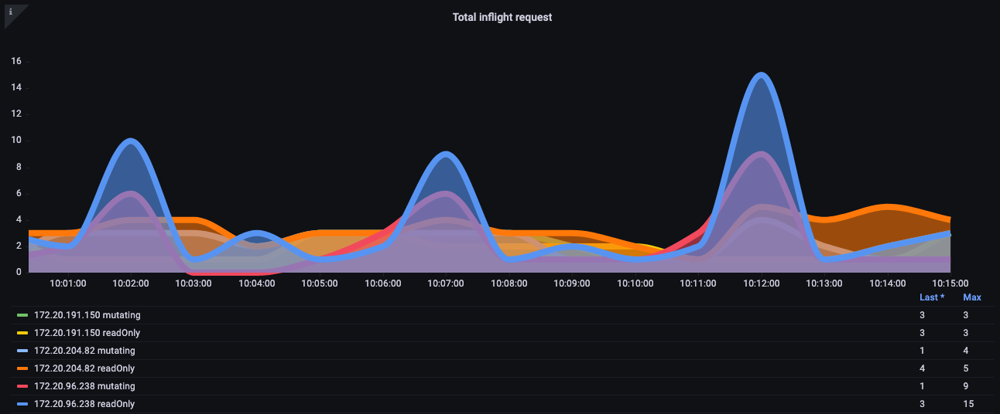
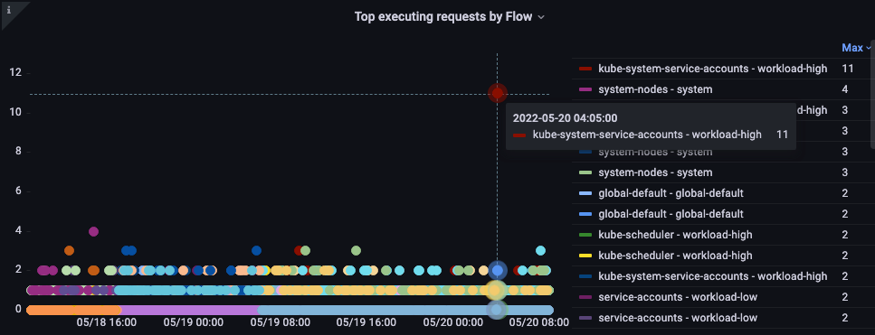
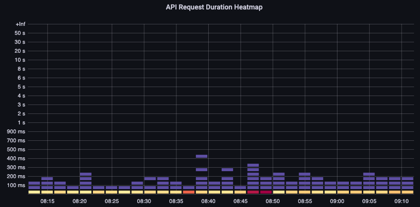
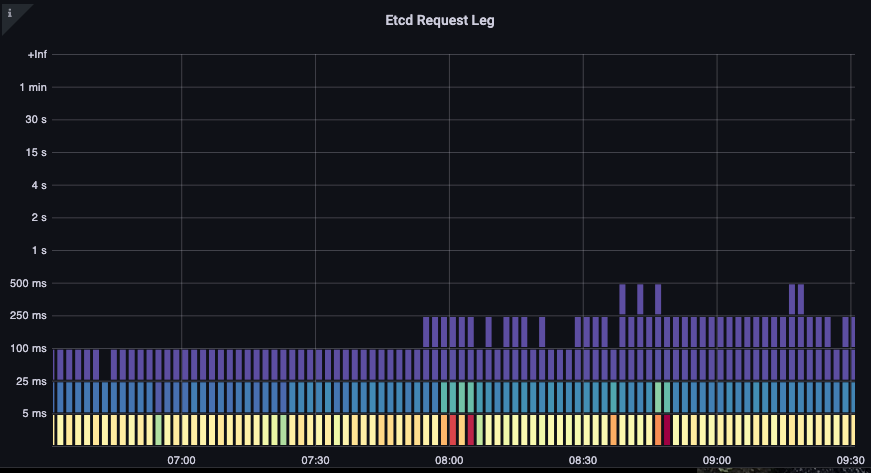

# Amazon EKS API Server கண்காணிப்பு

Observability சிறந்த நடைமுறைகள் வழிகாட்டியின் இந்தப் பிரிவில், API Server கண்காணிப்பு தொடர்பான பின்வரும் தலைப்புகளை ஆழமாக ஆராய்வோம்:

* Amazon EKS API Server கண்காணிப்பு அறிமுகம்
* API Server Troubleshooter Dashboard அமைத்தல்
* API Server சிக்கல்களைப் புரிந்துகொள்ள API Troubleshooter Dashboard பயன்படுத்துதல்
* API Server க்கு Unbounded list calls புரிந்துகொள்ளுதல்
* API Server க்கு தவறான நடத்தையை நிறுத்துதல்
* API Priority and Fairness
* மெதுவான API calls மற்றும் API Server Latency சிக்கல்களை அடையாளம் காணுதல்

### அறிமுகம்

உங்கள் Amazon EKS managed control plane ஐ கண்காணிப்பது உங்கள் EKS cluster இன் நலனில் உள்ள சிக்கல்களை முன்கூட்டியே அடையாளம் காண மிக முக்கியமான Day 2 செயல்பாட்டு நடவடிக்கையாகும். Amazon EKS Control plane கண்காணிப்பு சேகரிக்கப்பட்ட metrics அடிப்படையில் முன்னெச்சரிக்கை நடவடிக்கைகளை எடுக்க உதவுகிறது. இந்த metrics API servers ஐ பிழைகாணவும், உள்ளே இருக்கும் சிக்கலை துல்லியமாக கண்டறியவும் உதவும்.

இந்தப் பிரிவில் Amazon EKS API server கண்காணிப்புக்காக Amazon Managed Service for Prometheus (AMP) ஐயும், metrics காட்சிப்படுத்தலுக்காக Amazon Managed Grafana (AMG) ஐயும் நிரூபணத்திற்கு பயன்படுத்துவோம். Prometheus என்பது சக்திவாய்ந்த query திறன்களை வழங்கும் மற்றும் பல்வேறு workloads க்கு பரந்த ஆதரவை கொண்ட பிரபலமான open source கண்காணிப்பு கருவியாகும். Amazon Managed Service for Prometheus என்பது Amazon EKS, [Amazon Elastic Container Service (Amazon ECS)](http://aws.amazon.com/ecs), மற்றும் [Amazon Elastic Compute Cloud (Amazon EC2)](http://aws.amazon.com/ec2) போன்ற சூழல்களை பாதுகாப்பாகவும் நம்பகமாகவும் கண்காணிப்பதை எளிதாக்கும் முழுமையாக நிர்வகிக்கப்படும் Prometheus-இணக்கமான சேவையாகும். [Amazon Managed Grafana](https://aws.amazon.com/grafana/) என்பது open source Grafana க்கான முழுமையாக நிர்வகிக்கப்படும் மற்றும் பாதுகாப்பான தரவு காட்சிப்படுத்தல் சேவையாகும், இது வாடிக்கையாளர்களுக்கு பல தரவு மூலங்களிலிருந்து அவர்களது பயன்பாடுகளுக்கான operational metrics, logs, மற்றும் traces ஐ உடனடியாக query செய்ய, தொடர்புபடுத்த மற்றும் காட்சிப்படுத்த உதவுகிறது.

முதலில் Amazon Managed Service for Prometheus மற்றும் Amazon Managed Grafana ஐ பயன்படுத்தி [Amazon Elastic Kubernetes Service (Amazon EKS)](https://aws.amazon.com/eks) API Servers ஐ Prometheus மூலம் பிழைகாண உதவும் ஒரு starter dashboard அமைப்போம். EKS API Servers ஐ பிழைகாணும்போது சிக்கல்களைப் புரிந்துகொள்வது, API priority and fairness, தவறான நடத்தைகளை நிறுத்துதல் ஆகியவற்றைப் பற்றி வரவிருக்கும் பிரிவுகளில் ஆழமாக ஆராய்வோம். இறுதியாக, மிகவும் மெதுவான API calls மற்றும் API server latency சிக்கல்களை அடையாளம் காணுதலில் ஆழமாக ஆராய்வோம், இது நமது Amazon EKS cluster ஐ ஆரோக்கியமான நிலையில் வைத்திருக்க நடவடிக்கைகள் எடுக்க உதவும்.

### API Server Troubleshooter Dashboard அமைத்தல்

AMP மூலம் [Amazon Elastic Kubernetes Service (Amazon EKS)](https://aws.amazon.com/eks) API Servers ஐ பிழைகாண உதவும் ஒரு starter dashboard அமைப்போம். உங்கள் production EKS clusters ஐ பிழைகாணும்போது metrics ஐ புரிந்துகொள்ள இதைப் பயன்படுத்துவோம். உங்கள் Amazon EKS clusters ஐ பிழைகாணும்போது சேகரிக்கப்பட்ட metrics இன் முக்கியத்துவத்தை புரிந்துகொள்ள மேலும் ஆழமாக கவனம் செலுத்துவோம்.

முதலில், [உங்கள் Amazon EKS cluster இலிருந்து Amazon Managed Service for Prometheus க்கு metrics சேகரிக்க ADOT collector அமைக்கவும்](https://aws.amazon.com/blogs/containers/metrics-and-traces-collection-using-amazon-eks-add-ons-for-aws-distro-for-opentelemetry/). இந்த அமைப்பில் EKS ADOT Addon ஐ பயன்படுத்துவீர்கள், இது EKS cluster இயங்கிய பிறகு எந்த நேரத்திலும் ADOT ஐ add-on ஆக இயக்க அனுமதிக்கிறது. ADOT add-on சமீபத்திய பாதுகாப்பு patches மற்றும் bug fixes ஐ உள்ளடக்கியது மற்றும் Amazon EKS உடன் வேலை செய்ய AWS ஆல் சரிபார்க்கப்பட்டது. இந்த அமைப்பு EKS cluster இல் ADOT add-on ஐ எவ்வாறு நிறுவுவது மற்றும் அதை உங்கள் cluster இலிருந்து metrics சேகரிக்க எவ்வாறு பயன்படுத்துவது என்பதைக் காண்பிக்கும்.

அடுத்து, முதல் படியில் அமைத்த AMP ஐ data source ஆகப் பயன்படுத்தி [metrics காட்சிப்படுத்த உங்கள் Amazon Managed Grafana workspace ஐ அமைக்கவும்](https://aws.amazon.com/blogs/mt/amazon-managed-grafana-getting-started/). இறுதியாக [API troubleshooter dashboard](https://github.com/RiskyAdventure/Troubleshooting-Dashboards/blob/main/api-troubleshooter.json) ஐ பதிவிறக்கம் செய்து, மேலும் பிழைகாணலுக்கு metrics ஐ காட்சிப்படுத்த API troubleshooter dashboard json ஐ பதிவேற்ற Amazon Managed Grafana க்கு செல்லவும்.

### சிக்கல்களைப் புரிந்துகொள்ள API Troubleshooter Dashboard பயன்படுத்துதல்

நீங்கள் உங்கள் cluster இல் நிறுவ விரும்பிய ஒரு சுவாரஸ்யமான open-source project ஐ கண்டுபிடித்தீர்கள் என்று வைத்துக்கொள்வோம். அந்த operator உங்கள் cluster க்கு ஒரு DaemonSet ஐ deploy செய்கிறது, அது தவறான requests, தேவையில்லாமல் அதிக அளவிலான LIST calls, அல்லது உங்கள் 1,000 nodes முழுவதிலும் உள்ள ஒவ்வொரு DaemonSets ஒவ்வொரு நிமிடமும் உங்கள் cluster இல் உள்ள அனைத்து 50,000 pods இன் நிலையை கோரலாம்!
இது அடிக்கடி நடக்கிறதா? ஆம், நடக்கிறது! இது எவ்வாறு நிகழ்கிறது என்பதை விரைவாகப் பார்ப்போம்.

#### LIST vs. WATCH புரிந்துகொள்ளுதல்

சில பயன்பாடுகள் உங்கள் cluster இல் உள்ள objects இன் நிலையை புரிந்துகொள்ள வேண்டும். எடுத்துக்காட்டாக, உங்கள் machine learning (ML) பயன்பாடு எத்தனை pods *Completed* நிலையில் இல்லை என்பதை புரிந்துகொண்டு job நிலையை அறிய விரும்புகிறது. Kubernetes இல், WATCH என்ற நல்ல முறையில் இதைச் செய்யலாம், மற்றும் cluster இல் உள்ள ஒவ்வொரு object ஐயும் list செய்து அந்த pods இன் சமீபத்திய நிலையை கண்டறியும் அவ்வளவு நல்லதல்லாத முறைகளும் உள்ளன.

#### நல்ல முறையில் செயல்படும் WATCH

WATCH அல்லது push model மூலம் updates பெற ஒரு நீண்ட-நிலை இணைப்பைப் பயன்படுத்துவது Kubernetes இல் updates செய்வதற்கான மிகவும் scalable வழியாகும். எளிமைப்படுத்திச் சொல்ல, நாம் system இன் முழு நிலையை கேட்டு, அந்த object க்கு மாற்றங்கள் பெறப்படும்போது மட்டுமே cache இல் உள்ள object ஐ update செய்கிறோம், எந்த updates யும் தவறவிடப்படவில்லை என்பதை உறுதிப்படுத்த அவ்வப்போது re-sync இயக்குகிறோம்.

கீழே உள்ள படத்தில் இரண்டு API servers முழுவதிலும் இந்த நீண்ட-நிலை இணைப்புகளின் எண்ணிக்கையைப் பற்றிய கருத்தை பெற `apiserver_longrunning_gauge` ஐ பயன்படுத்துகிறோம்.

*படம்: `apiserver_longrunning_gauge` metric*

இந்த திறமையான முறையிலும் கூட, நல்ல விஷயம் அதிகமாகலாம். எடுத்துக்காட்டாக, பல மிகச்சிறிய nodes பயன்படுத்தினால், ஒவ்வொன்றும் API server உடன் தொடர்பு கொள்ள இரண்டு அல்லது அதற்கு மேற்பட்ட DaemonSets ஐ பயன்படுத்தினால், system இல் WATCH calls எண்ணிக்கையை தேவையில்லாமல் வியத்தகு அளவில் அதிகரிப்பது மிகவும் எளிது. எடுத்துக்காட்டாக, எட்டு xlarge nodes மற்றும் ஒரே ஒரு 8xlarge இடையேயான வேறுபாட்டைப் பார்ப்போம். இங்கே system இல் WATCH calls 8 மடங்கு அதிகரிப்பைக் காண்கிறோம்.

*படம்: 8 xlarge nodes இடையே WATCH calls.*

இவை திறமையான calls, ஆனால் முன்பு குறிப்பிட்ட தவறான calls ஆக இருந்தால் என்ன? மேலே உள்ள DaemonSets இல் ஒன்று 1,000 nodes ஒவ்வொன்றிலும் cluster இல் உள்ள மொத்தம் 50,000 pods ஒவ்வொன்றிலும் updates கோருகிறது என்று கற்பனை செய்யுங்கள். அடுத்த பிரிவில் unbounded list call என்ற இந்தக் கருத்தை ஆராய்வோம்.

தொடர்வதற்கு முன் ஒரு எச்சரிக்கை, மேலே உள்ள எடுத்துக்காட்டில் உள்ள வகையான consolidation மிகுந்த கவனத்துடன் செய்யப்பட வேண்டும், மேலும் கருத்தில் கொள்ள வேண்டிய பல காரணிகள் உள்ளன. System இல் குறைந்த எண்ணிக்கையிலான CPUs க்காக போட்டியிடும் threads எண்ணிக்கையின் தாமதம், Pod churn rate, ஒரு node பாதுகாப்பாக கையாளக்கூடிய அதிகபட்ச volume attachments எண்ணிக்கை ஆகியவை அடங்கும். இருப்பினும், சிக்கல்கள் ஏற்படுவதைத் தடுக்கக்கூடிய நடவடிக்கை எடுக்கக்கூடிய படிகளுக்கு நம்மை வழிநடத்தும் metrics மீது நமது கவனம் இருக்கும்—மற்றும் நமது designs பற்றிய புதிய நுண்ணறிவை அளிக்கலாம்.

WATCH metric எளிமையானது, ஆனால் அது உங்களுக்கு சிக்கலாக இருந்தால் watches எண்ணிக்கையை கண்காணிக்கவும் குறைக்கவும் பயன்படுத்தலாம். இந்த எண்ணிக்கையை குறைக்க நீங்கள் பரிசீலிக்கக்கூடிய சில விருப்பங்கள்:

* History கண்காணிக்க Helm உருவாக்கும் ConfigMaps எண்ணிக்கையை கட்டுப்படுத்தவும்
* WATCH பயன்படுத்தாத Immutable ConfigMaps மற்றும் Secrets பயன்படுத்தவும்
* நியாயமான node sizing மற்றும் consolidation

### API Server க்கு Unbounded list calls புரிந்துகொள்ளுதல்

இப்போது நாம் பேசிக்கொண்டிருந்த LIST call பற்றி. ஒரு list call என்பது ஒரு object இன் நிலையை புரிந்துகொள்ள வேண்டிய ஒவ்வொரு முறையும் நமது Kubernetes objects இன் முழு history ஐ இழுப்பதாகும், இந்த முறை எதுவும் cache இல் சேமிக்கப்படவில்லை.

இவை அனைத்தும் எவ்வளவு தாக்கத்தை ஏற்படுத்தும்? எத்தனை agents தரவு கோருகின்றன, எவ்வளவு அடிக்கடி அவ்வாறு செய்கின்றன, எவ்வளவு தரவு கோருகின்றன என்பதைப் பொறுத்து மாறுபடும். அவர்கள் cluster இல் உள்ள அனைத்தையும் கேட்கிறார்களா, அல்லது ஒரே ஒரு namespace ஐ மட்டும் கேட்கிறார்களா? அது ஒவ்வொரு நிமிடமும், ஒவ்வொரு node இலும் நடக்கிறதா? ஒரு node இலிருந்து அனுப்பப்படும் ஒவ்வொரு log இலும் Kubernetes metadata ஐ இணைக்கும் logging agent இன் எடுத்துக்காட்டைப் பயன்படுத்துவோம். பெரிய clusters இல் இது மிகப்பெரிய அளவிலான தரவாக இருக்கலாம். Agent அந்தத் தரவை list call மூலம் பெறுவதற்கு பல வழிகள் உள்ளன, எனவே சிலவற்றைப் பார்ப்போம்.

கீழே உள்ள request ஒரு குறிப்பிட்ட namespace இலிருந்து pods ஐ கோருகிறது.

`/api/v1/namespaces/my-namespace/pods`

அடுத்து, cluster இல் உள்ள அனைத்து 50,000 pods ஐயும் கோருகிறோம், ஆனால் ஒரு நேரத்தில் 500 pods ஆக chunks இல்.

`/api/v1/pods?limit=500`

அடுத்த call மிகவும் இடையூறு விளைவிக்கக்கூடியது. ஒரே நேரத்தில் முழு cluster இல் உள்ள அனைத்து 50,000 pods ஐயும் பெறுதல்.

`/api/v1/pods`

இது நடைமுறையில் மிகவும் பொதுவாக நிகழ்கிறது மற்றும் logs இல் காணலாம்.

### API Server க்கு தவறான நடத்தையை நிறுத்துதல்

இத்தகைய தவறான நடத்தையிலிருந்து நமது cluster ஐ எவ்வாறு பாதுகாப்பது? Kubernetes 1.20 க்கு முன், API server ஒரு வினாடிக்கு செயலாக்கப்படும் *inflight* requests எண்ணிக்கையை கட்டுப்படுத்துவதன் மூலம் தன்னைத்தானே பாதுகாத்துக் கொள்ளும். etcd ஒரு நேரத்தில் செயல்திறனான வழியில் இவ்வளவு requests ஐ மட்டுமே கையாள முடியும் என்பதால், etcd reads மற்றும் writes ஐ நியாயமான latency வரம்பில் வைத்திருக்கும் ஒரு வினாடிக்கான மதிப்புக்கு requests எண்ணிக்கையை கட்டுப்படுத்துவதை உறுதிப்படுத்த வேண்டும். துரதிர்ஷ்டவசமாக, இதை எழுதும் நேரத்தில், இதைச் செய்ய dynamic வழி எதுவும் இல்லை.

கீழே உள்ள chart இல் read requests இன் பிரிவைக் காண்கிறோம், இது ஒரு API server க்கு இயல்புநிலை அதிகபட்சம் 400 inflight requests மற்றும் இயல்புநிலை அதிகபட்சம் 200 concurrent write requests கொண்டுள்ளது. இயல்புநிலை EKS cluster இல் மொத்தம் 800 reads மற்றும் 400 writes க்கு இரண்டு API servers காணலாம். இருப்பினும், upgrade க்குப் பிறகு போன்ற வெவ்வேறு நேரங்களில் இந்த servers asymmetric loads கொண்டிருக்கலாம் என்பதால் எச்சரிக்கை தேவை.

*படம்: Read requests பிரிவுடன் Grafana chart.*

மேலே உள்ளது சரியான திட்டம் அல்ல என்று தெரிகிறது. எடுத்துக்காட்டாக, நாம் இப்போது நிறுவிய இந்த தவறாக நடந்துகொள்ளும் புதிய operator API server இல் உள்ள அனைத்து inflight write requests ஐயும் எடுத்துக்கொண்டு, node keepalive messages போன்ற முக்கியமான requests ஐ தாமதப்படுத்துவதை எவ்வாறு தடுக்க முடியும்?

### API Priority and Fairness

ஒரு வினாடிக்கு எத்தனை read/write requests திறந்திருக்கின்றன என்று கவலைப்படுவதற்குப் பதிலாக, திறனை ஒரு மொத்த எண்ணாகக் கருதி, cluster இல் உள்ள ஒவ்வொரு பயன்பாடும் அந்த மொத்த அதிகபட்ச எண்ணின் நியாயமான சதவீதம் அல்லது பங்கைப் பெற்றால் என்ன?

இதை திறம்பட செய்ய, API server க்கு யார் request அனுப்பினார்கள் என்பதை அடையாளம் காண வேண்டும், பின்னர் அந்த request க்கு ஒரு வகையான name tag கொடுக்க வேண்டும். இந்தப் புதிய name tag மூலம், இந்த requests அனைத்தும் நாம் "Chatty" என்று அழைக்கும் புதிய agent இடமிருந்து வருகின்றன என்பதை பார்க்கலாம். இப்போது Chatty இன் அனைத்து requests ஐயும் *flow* என்ற ஒன்றில் குழுவாக்கலாம், இது அந்த requests அதே DaemonSet இலிருந்து வருகின்றன என்பதை அடையாளம் காட்டும். இந்தக் கருத்து இப்போது இந்த தவறான agent ஐ கட்டுப்படுத்தி முழு cluster ஐயும் எடுத்துக்கொள்ளாமல் உறுதிப்படுத்தும் திறனை நமக்கு அளிக்கிறது.

இருப்பினும், அனைத்து requests சமமானவை அல்ல. Cluster ஐ செயல்படுத்த தேவையான control plane traffic நமது புதிய operator ஐ விட அதிக முன்னுரிமை கொண்டதாக இருக்க வேண்டும். இங்கேதான் priority levels என்ற கருத்து செயல்படுகிறது. இயல்புநிலையாக, critical, high, மற்றும் low priority traffic க்கு பல "buckets" அல்லது queues இருந்தால் என்ன? Chatty agent flow critical traffic queue இல் நியாயமான பங்கு traffic பெறுவதை நாம் விரும்பவில்லை. இருப்பினும், அந்த traffic ஐ low priority queue இல் வைக்கலாம், அதனால் அந்த flow மற்ற chatty agents உடன் போட்டியிடும். பின்னர் ஒவ்வொரு priority level க்கும் API server கையாளக்கூடிய மொத்த அதிகபட்சத்தின் சரியான எண்ணிக்கையிலான shares அல்லது சதவீதம் இருப்பதை உறுதிப்படுத்த வேண்டும், requests அதிகமாக தாமதமாகாமல் இருக்க.

#### Priority and fairness செயல்பாட்டில்

இது ஒப்பீட்டளவில் புதிய feature என்பதால், பல தற்போதுள்ள dashboards அதிகபட்ச inflight reads மற்றும் அதிகபட்ச inflight writes இன் பழைய model ஐ பயன்படுத்தும். இது ஏன் சிக்கலாக இருக்கலாம்?

kube-system namespace இல் உள்ள அனைத்திற்கும் high priority name tags கொடுத்தால், ஆனால் அந்த முக்கியமான namespace இல் அந்த தவறான agent ஐ நிறுவினால், அல்லது அந்த namespace இல் அதிகமான பயன்பாடுகளை deploy செய்தால் என்ன? நாம் தவிர்க்க முயற்சித்த அதே சிக்கலை மீண்டும் சந்திக்கலாம்! எனவே இத்தகைய சூழ்நிலைகளை கவனமாக கண்காணிப்பது நல்லது.

இந்த வகையான சிக்கல்களை கண்காணிக்க மிகவும் சுவாரஸ்யமாக நான் கருதும் சில metrics ஐ உங்களுக்காக பிரித்துள்ளேன்.

* ஒரு priority group இன் shares எத்தனை சதவீதம் பயன்படுத்தப்படுகிறது?
* ஒரு request queue இல் எவ்வளவு நேரம் காத்திருந்தது?
* எந்த flow அதிக shares ஐ பயன்படுத்துகிறது?
* System இல் எதிர்பாராத தாமதங்கள் உள்ளனவா?

#### பயன்பாட்டில் உள்ள சதவீதம்

இங்கே cluster இல் உள்ள வெவ்வேறு இயல்புநிலை priority groups மற்றும் அதிகபட்சத்தின் எத்தனை சதவீதம் பயன்படுத்தப்படுகிறது என்பதைக் காண்கிறோம்.

*படம்: Cluster இல் உள்ள Priority groups.*

#### Request queue இல் இருந்த நேரம்

Request செயலாக்கப்படுவதற்கு முன் priority queue இல் எத்தனை வினாடிகள் இருந்தது.

*படம்: Request priority queue இல் இருந்த நேரம்.*

#### Flow மூலம் அதிகம் செயல்படுத்தப்பட்ட requests

எந்த flow அதிக shares ஐ எடுத்துக்கொள்கிறது?

*படம்: Flow மூலம் அதிகம் செயல்படுத்தப்படும் requests.*

#### Request செயல்படுத்தும் நேரம்

செயலாக்கத்தில் எதிர்பாராத தாமதங்கள் உள்ளனவா?

*படம்: Flow control request செயல்படுத்தும் நேரம்.*

### மெதுவான API calls மற்றும் API Server Latency சிக்கல்களை அடையாளம் காணுதல்

API latency ஏற்படுத்தும் விஷயங்களின் தன்மையை இப்போது புரிந்துகொண்டோம், நாம் ஒரு படி பின்வாங்கி பெரிய படத்தைப் பார்க்கலாம். நமது dashboard designs நாம் ஆராய வேண்டிய சிக்கல் இருக்கிறதா என்று விரைவான snapshot பெற முயற்சிக்கின்றன என்பதை நினைவில் கொள்வது முக்கியம். விரிவான பகுப்பாய்வுக்கு, PromQL மூலம் ad-hoc queries பயன்படுத்துவோம்—அல்லது இன்னும் சிறப்பாக, logging queries.

நாம் பார்க்க விரும்பும் உயர்-நிலை metrics பற்றிய சில யோசனைகள் என்ன?

* எந்த API call முடிக்க அதிக நேரம் எடுக்கிறது?
    * Call என்ன செய்கிறது? (Objects ஐ list செய்தல், நீக்குதல் போன்றவை.)
    * எந்த objects மீது அந்த operation செய்ய முயற்சிக்கிறது? (Pods, Secrets, ConfigMaps போன்றவை.)
* API server இல் latency சிக்கல் உள்ளதா?
    * எனது priority queues இல் ஏதேனும் தாமதம் requests இல் backup ஏற்படுத்துகிறதா?
* etcd server latency அனுபவிப்பதால் API server மெதுவாக இருப்பது போல் தெரிகிறதா?

#### மிகவும் மெதுவான API call

கீழே உள்ள chart இல் அந்த காலகட்டத்தில் முடிக்க அதிக நேரம் எடுத்த API calls ஐ தேடுகிறோம். இந்த நிகழ்வில் 05:40 நேர வரம்பில் மிகவும் latent call ஆக LIST function ஐ அழைக்கும் custom resource definition (CRD) ஐ காண்கிறோம். இந்தத் தரவுடன் CloudWatch Insights ஐ பயன்படுத்தி அந்த நேர வரம்பில் audit log இலிருந்து LIST requests ஐ இழுத்து இது எந்த application ஆக இருக்கலாம் என்பதைப் பார்க்கலாம்.

*படம்: மிகவும் மெதுவான 5 API calls.*

#### API Request Duration

இந்த API latency chart ஒரு நிமிடத்தின் timeout மதிப்பை அணுகும் requests இருக்கிறதா என்பதை புரிந்துகொள்ள உதவுகிறது. கீழே உள்ள histogram over time format ஐ நான் விரும்புகிறேன், ஏனெனில் ஒரு line graph மறைக்கும் தரவில் உள்ள outliers ஐ நான் பார்க்க முடியும்.

*படம்: API Request duration heatmap.*

ஒரு bucket மீது hover செய்வதன் மூலம் சுமார் 25 milliseconds எடுத்த calls இன் சரியான எண்ணிக்கையை நமக்குக் காட்டுகிறது.
[Image: Image.jpg]*படம்: 25 milliseconds க்கு மேல் உள்ள calls.*

Requests ஐ cache செய்யும் மற்ற systems உடன் வேலை செய்யும்போது இந்தக் கருத்து முக்கியமானது. Cache requests வேகமாக இருக்கும்; அந்த request latencies ஐ மெதுவான requests உடன் இணைக்க விரும்பவில்லை. இங்கே latency இன் இரண்டு வெவ்வேறு bands ஐ காணலாம், cache செய்யப்பட்ட requests மற்றும் செய்யப்படாதவை.

*படம்: Latency, cache செய்யப்பட்ட requests.*

#### ETCD Request Duration

Kubernetes செயல்திறனில் ETCD latency மிக முக்கியமான காரணிகளில் ஒன்றாகும். Amazon EKS `request_duration_seconds_bucket` metric ஐ பார்ப்பதன் மூலம் API server இன் கண்ணோட்டத்தில் இந்த செயல்திறனை பார்க்க அனுமதிக்கிறது.

*படம்: `request_duration_seconds_bucket` metric.*

நாம் கற்றுக்கொண்ட விஷயங்களை ஒன்றாக இணைத்து சில நிகழ்வுகள் தொடர்புடையவையா என்பதை பார்க்கலாம். கீழே உள்ள chart இல் API server latency காண்கிறோம், ஆனால் இந்த latency இன் பெரும்பகுதி etcd server இலிருந்து வருகிறது என்பதையும் காண்கிறோம். ஒரே பார்வையில் சரியான சிக்கல் பகுதிக்கு விரைவாக நகர முடிவதுதான் ஒரு dashboard ஐ சக்திவாய்ந்ததாக ஆக்குகிறது.

*படம்: Etcd Requests*

## முடிவுரை

Observability சிறந்த நடைமுறைகள் வழிகாட்டியின் இந்தப் பிரிவில், [Amazon Elastic Kubernetes Service (Amazon EKS)](https://aws.amazon.com/eks) API Servers ஐ பிழைகாண Amazon Managed Service for Prometheus மற்றும் Amazon Managed Grafana ஐ பயன்படுத்தி ஒரு [starter dashboard](https://github.com/RiskyAdventure/Troubleshooting-Dashboards/blob/main/api-troubleshooter.json) ஐ பயன்படுத்தினோம். மேலும், EKS API Servers ஐ பிழைகாணும்போது சிக்கல்களைப் புரிந்துகொள்வது, API priority and fairness, தவறான நடத்தைகளை நிறுத்துதல் ஆகியவற்றை ஆழமாக ஆராய்ந்தோம். இறுதியாக, மிகவும் மெதுவான API calls மற்றும் API server latency சிக்கல்களை அடையாளம் காணுதலை ஆழமாக ஆராய்ந்தோம், இது நமது Amazon EKS cluster ஐ ஆரோக்கியமான நிலையில் வைத்திருக்க நடவடிக்கைகள் எடுக்க உதவும். மேலும் ஆழமான ஆய்வுக்கு, AWS [One Observability Workshop](https://catalog.workshops.aws/observability/en-US) இன் AWS native Observability பிரிவின் கீழ் Application Monitoring module ஐ பயிற்சி செய்யுமாறு மிகவும் பரிந்துரைக்கிறோம்.
