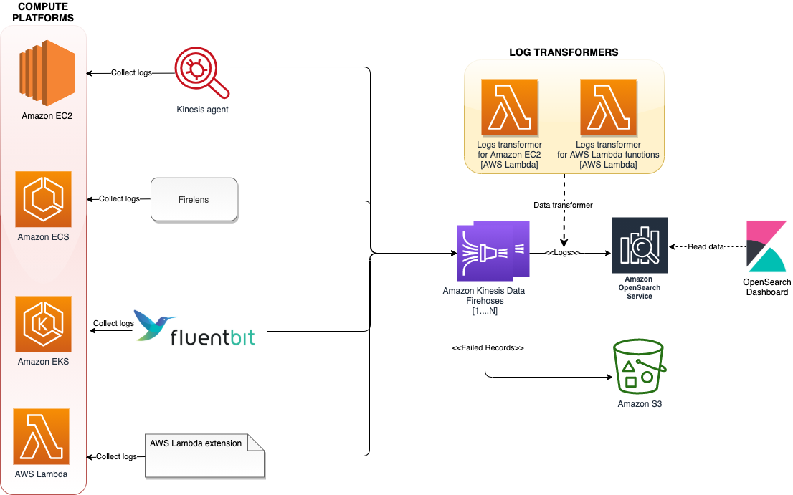

# Log Aggregation

Observability சிறந்த நடைமுறைகள் வழிகாட்டியின் இந்த பிரிவில், AWS Native services-ஐப் பயன்படுத்தி Amazon EKS Logging தொடர்பான பின்வரும் தலைப்புகளை ஆழமாக ஆராய்வோம்:

* AWS EKS logging அறிமுகம்
* Amazon EKS control plane logging
* Amazon EKS data plane logging
* Amazon EKS application logging
* AWS Native services-ஐப் பயன்படுத்தி Amazon EKS மற்றும் பிற compute platforms-களிலிருந்து ஒருங்கிணைந்த log aggregation
* முடிவுரை

### அறிமுகம்

Amazon EKS logging-ஐ control plane logging, node logging, மற்றும் application logging என மூன்று வகைகளாகப் பிரிக்கலாம். [Kubernetes control plane](https://kubernetes.io/docs/concepts/overview/components/#control-plane-components) என்பது Kubernetes clusters-ஐ நிர்வகிக்கும் மற்றும் auditing மற்றும் diagnostic நோக்கங்களுக்காகப் பயன்படுத்தப்படும் logs-ஐ உருவாக்கும் components-ன் தொகுப்பாகும். Amazon EKS-உடன், நீங்கள் [வெவ்வேறு control plane components-களுக்கான logs-ஐ இயக்கலாம்](https://docs.aws.amazon.com/eks/latest/userguide/control-plane-logs.html) மற்றும் அவற்றை CloudWatch-க்கு அனுப்பலாம்.

Kubernetes உங்கள் pods-ஐ இயக்கும் ஒவ்வொரு Kubernetes node-லும் `kubelet` மற்றும் `kube-proxy` போன்ற system components-ஐ இயக்குகிறது. இந்த components ஒவ்வொரு node-க்குள்ளும் logs-ஐ எழுதுகின்றன, மேலும் ஒவ்வொரு Amazon EKS node-க்கும் இந்த logs-ஐ capture செய்ய CloudWatch மற்றும் Container Insights-ஐ configure செய்யலாம்.

Containers ஒரு Kubernetes cluster-க்குள் [pods](https://kubernetes.io/docs/concepts/workloads/pods/)-ஆக குழுவாக்கப்பட்டு உங்கள் Kubernetes nodes-ல் இயக்க திட்டமிடப்படுகின்றன. பெரும்பாலான containerized applications standard output மற்றும் standard error-க்கு எழுதுகின்றன, மேலும் container engine output-ஐ ஒரு logging driver-க்கு redirect செய்கிறது. Kubernetes-ல், container logs ஒரு node-ல் `/var/log/pods` directory-ல் காணப்படும். உங்கள் ஒவ்வொரு Amazon EKS pods-க்கும் இந்த logs-ஐ capture செய்ய CloudWatch மற்றும் Container Insights-ஐ configure செய்யலாம்.

Kubernetes-ல் ஒரு மையப்படுத்தப்பட்ட log aggregation system-க்கு container logs-ஐ ship செய்ய மூன்று பொதுவான அணுகுமுறைகள் உள்ளன:

* Node level agent, [Fluentd daemonset](https://docs.aws.amazon.com/AmazonCloudWatch/latest/monitoring/Container-Insights-setup-logs.html) போன்றது. இது பரிந்துரைக்கப்படும் pattern ஆகும்.
* Sidecar container, Fluentd sidecar container போன்றது.
* நேரடியாக log collection system-க்கு எழுதுதல். இந்த அணுகுமுறையில், logs-ஐ ship செய்வதற்கு application பொறுப்பாகும். Fluentd போன்ற community build solutions-ஐ மீண்டும் பயன்படுத்துவதற்குப் பதிலாக உங்கள் application code-ல் log aggregation system-ன் SDK-ஐ சேர்க்க வேண்டியிருப்பதால் இது குறைவாக பரிந்துரைக்கப்படும் option ஆகும். இந்த pattern *separation of concerns கொள்கையையும்* மீறுகிறது, அதன்படி logging implementation application-லிருந்து சுயாதீனமாக இருக்க வேண்டும். இவ்வாறு செய்வது உங்கள் application-ஐ மாற்றாமல் logging infrastructure-ஐ மாற்ற அனுமதிக்கிறது.

இப்போது Amazon EKS logging-ன் ஒவ்வொரு logging category-யையும் ஆழமாக ஆராய்வோம், அதோடு Amazon EKS மற்றும் பிற compute platforms-களிலிருந்து ஒருங்கிணைந்த log aggregation பற்றியும் பேசுவோம்.

### Amazon EKS control plane logging

ஒரு Amazon EKS cluster உங்கள் Kubernetes cluster-க்கான high availability, single-tenant control plane மற்றும் உங்கள் containers-ஐ இயக்கும் Amazon EKS nodes-ஐ கொண்டுள்ளது. Control plane nodes AWS நிர்வகிக்கும் ஒரு account-ல் இயங்குகின்றன. Amazon EKS cluster control plane nodes CloudWatch-உடன் ஒருங்கிணைக்கப்பட்டுள்ளன, மேலும் குறிப்பிட்ட control plane components-களுக்கு logging-ஐ இயக்கலாம். ஒவ்வொரு Kubernetes control plane component instance-க்கும் logs வழங்கப்படுகின்றன. AWS உங்கள் control plane nodes-ன் health-ஐ நிர்வகிக்கிறது மற்றும் [Kubernetes endpoint-க்கான service-level agreement (SLA)](http://aws.amazon.com/eks/sla/) வழங்குகிறது.

[Amazon EKS control plane logging](https://docs.aws.amazon.com/eks/latest/userguide/control-plane-logs.html) பின்வரும் cluster control plane log types-ஐ கொண்டுள்ளது. ஒவ்வொரு log type-ம் Kubernetes control plane-ன் ஒரு component-க்கு ஒத்திருக்கிறது. இந்த components பற்றி மேலும் அறிய, Kubernetes documentation-ல் [Kubernetes Components](https://kubernetes.io/docs/concepts/overview/components/) பார்க்கவும்.

* **API server (`api`)** – உங்கள் cluster-ன் API server, Kubernetes API-ஐ வெளிப்படுத்தும் control plane component ஆகும். நீங்கள் cluster-ஐ துவக்கும்போது அல்லது அதற்குப் பிறகு சிறிது நேரத்தில் API server logs-ஐ இயக்கினால், API server-ஐ தொடங்கப் பயன்படுத்தப்பட்ட API server flags logs-ல் சேர்க்கப்படும். மேலும் தகவலுக்கு, Kubernetes documentation-ல் [`kube-apiserver`](https://kubernetes.io/docs/reference/command-line-tools-reference/kube-apiserver/) மற்றும் [audit policy](https://github.com/kubernetes/kubernetes/blob/master/cluster/gce/gci/configure-helper.sh#L1129-L1255) பார்க்கவும்.
* **Audit (`audit`)** – Kubernetes audit logs உங்கள் cluster-ஐ பாதித்த தனிநபர் users, administrators, அல்லது system components-ன் பதிவை வழங்குகின்றன. மேலும் தகவலுக்கு, Kubernetes documentation-ல் [Auditing](https://kubernetes.io/docs/tasks/debug-application-cluster/audit/) பார்க்கவும்.
* **Authenticator (`authenticator`)** – Authenticator logs Amazon EKS-க்கு தனித்துவமானவை. இந்த logs, IAM credentials-ஐப் பயன்படுத்தி Kubernetes [Role Based Access Control](https://kubernetes.io/docs/reference/access-authn-authz/rbac/) (RBAC) authentication-க்கு Amazon EKS பயன்படுத்தும் control plane component-ஐ குறிக்கின்றன. மேலும் தகவலுக்கு, [Cluster management](https://docs.aws.amazon.com/eks/latest/userguide/eks-managing.html) பார்க்கவும்.
* **Controller manager (`controllerManager`)** – Controller manager Kubernetes-உடன் ship செய்யப்படும் core control loops-ஐ நிர்வகிக்கிறது. மேலும் தகவலுக்கு, Kubernetes documentation-ல் [kube-controller-manager](https://kubernetes.io/docs/reference/command-line-tools-reference/kube-controller-manager/) பார்க்கவும்.
* **Scheduler (`scheduler`)** – Scheduler component உங்கள் cluster-ல் pods-ஐ எப்போது எங்கு இயக்க வேண்டும் என்பதை நிர்வகிக்கிறது. மேலும் தகவலுக்கு, Kubernetes documentation-ல் [kube-scheduler](https://kubernetes.io/docs/reference/command-line-tools-reference/kube-scheduler/) பார்க்கவும்.

AWS console அல்லது AWS CLI வழியாக control plane logs-ஐ இயக்க [enabling and disabling control plane logs](https://docs.aws.amazon.com/eks/latest/userguide/control-plane-logs.html#:~:text=the%20Kubernetes%20documentation.-,Enabling%20and%20disabling%20control%20plane%20logs,-By%20default%2C%20cluster) பிரிவைப் பின்பற்றவும்.

#### CloudWatch console-லிருந்து control plane logs-ஐ query செய்தல்

உங்கள் Amazon EKS cluster-ல் control plane logging-ஐ இயக்கிய பிறகு, `/aws/eks/cluster-name/cluster` log group-ல் EKS control plane logs-ஐ காணலாம். மேலும் தகவலுக்கு, [Viewing cluster control plane logs](https://docs.aws.amazon.com/eks/latest/userguide/control-plane-logs.html#viewing-control-plane-logs) பார்க்கவும். `cluster-name`-ஐ உங்கள் cluster-ன் பெயருடன் மாற்ற மறக்காதீர்கள்.

EKS control plane log data-ஐ தேட CloudWatch Logs Insights-ஐ பயன்படுத்தலாம். மேலும் தகவலுக்கு, [Analyzing log data with CloudWatch Insights](https://docs.aws.amazon.com/AmazonCloudWatch/latest/logs/AnalyzingLogData.html) பார்க்கவும். ஒரு cluster-ல் control plane logging-ஐ இயக்கிய பிறகு மட்டுமே CloudWatch Logs-ல் log events-ஐ பார்க்க முடியும் என்பதை கவனிக்க வேண்டும். CloudWatch Logs Insights-ல் queries இயக்க ஒரு நேர வரம்பை தேர்ந்தெடுக்கும் முன், control plane logging-ஐ இயக்கியுள்ளீர்கள் என்பதை உறுதிப்படுத்தவும். EKS control plane log query-ன் ஒரு எடுத்துக்காட்டை query output-உடன் கீழே உள்ள screenshot-ல் பார்க்கவும்.


*படம்: CloudWatch Logs Insights.*

#### CloudWatch Logs Insights-ல் பொதுவான EKS use cases-க்கான மாதிரி queries

Cluster creator-ஐ கண்டுபிடிக்க, **kubernetes-admin** user-க்கு map செய்யப்பட்ட IAM entity-ஐ தேடவும்.

```
fields @logStream, @timestamp, @message| sort @timestamp desc
| filter @logStream like /authenticator/
| filter @message like "username=kubernetes-admin"
| limit 50
```

எடுத்துக்காட்டு output:

```

@logStream, @timestamp @messageauthenticator-71976 ca11bea5d3083393f7d32dab75b,2021-08-11-10:09:49.020,"time=""2021-08-11T10:09:43Z"" level=info msg=""access granted"" arn=""arn:aws:iam::12345678910:user/awscli"" client=""127.0.0.1:51326"" groups=""[system:masters]"" method=POST path=/authenticate sts=sts.eu-west-1.amazonaws.com uid=""heptio-authenticator-aws:12345678910:ABCDEFGHIJKLMNOP"" username=kubernetes-admin"
```

இந்த output-ல், IAM user **arn:aws:iam::[12345678910](tel:12345678910):user/awscli** user **kubernetes-admin**-க்கு map செய்யப்பட்டுள்ளார்.

ஒரு குறிப்பிட்ட user செய்த requests-ஐ கண்டுபிடிக்க, **kubernetes-admin** user செய்த operations-ஐ தேடவும்.

```

fields @logStream, @timestamp, @message| filter @logStream like /^kube-apiserver-audit/
| filter strcontains(user.username,"kubernetes-admin")
| sort @timestamp desc
| limit 50
```

எடுத்துக்காட்டு output:

```

@logStream,@timestamp,@messagekube-apiserver-audit-71976ca11bea5d3083393f7d32dab75b,2021-08-11 09:29:13.095,"{...""requestURI"":""/api/v1/namespaces/kube-system/endpoints?limit=500";","string""verb"":""list"",""user"":{""username"":""kubernetes-admin"",""uid"":""heptio-authenticator-aws:12345678910:ABCDEFGHIJKLMNOP"",""groups"":[""system:masters"",""system:authenticated""],""extra"":{""accessKeyId"":[""ABCDEFGHIJKLMNOP""],""arn"":[""arn:aws:iam::12345678910:user/awscli""],""canonicalArn"":[""arn:aws:iam::12345678910:user/awscli""],""sessionName"":[""""]}},""sourceIPs"":[""12.34.56.78""],""userAgent"":""kubectl/v1.22.0 (darwin/amd64) kubernetes/c2b5237"",""objectRef"":{""resource"":""endpoints"",""namespace"":""kube-system"",""apiVersion"":""v1""}...}"
```

ஒரு குறிப்பிட்ட userAgent செய்த API calls-ஐ கண்டுபிடிக்க, இந்த எடுத்துக்காட்டு query-ஐ பயன்படுத்தலாம்:

```

fields @logStream, @timestamp, userAgent, verb, requestURI, @message| filter @logStream like /kube-apiserver-audit/
| filter userAgent like /kubectl\/v1.22.0/
| sort @timestamp desc
| filter verb like /(get)/
```

சுருக்கமான எடுத்துக்காட்டு output:

```

@logStream,@timestamp,userAgent,verb,requestURI,@messagekube-apiserver-audit-71976ca11bea5d3083393f7d32dab75b,2021-08-11 14:06:47.068,kubectl/v1.22.0 (darwin/amd64) kubernetes/c2b5237,get,/apis/metrics.k8s.io/v1beta1?timeout=32s,"{""kind"":""Event"",""apiVersion"":""audit.k8s.io/v1"",""level"":""Metadata"",""auditID"":""863d9353-61a2-4255-a243-afaeb9183524"",""stage"":""ResponseComplete"",""requestURI"":""/apis/metrics.k8s.io/v1beta1?timeout=32s"",""verb"":""get"",""user"":{""username"":""kubernetes-admin"",""uid"":""heptio-authenticator-aws:12345678910:AIDAUQGC5HFOHXON7M22F"",""groups"":[""system:masters"",""system:authenticated""],""extra"":{""accessKeyId"":[""ABCDEFGHIJKLMNOP""],""arn"":[""arn:aws:iam::12345678910:user/awscli""],""canonicalArn"":[""arn:aws:iam::12345678910:user/awscli""],""sourceIPs"":[""12.34.56.78""],""userAgent"":""kubectl/v1.22.0 (darwin/amd64) kubernetes/c2b5237""...}"
```

**aws-auth** ConfigMap-க்கு செய்யப்பட்ட mutating changes-ஐ கண்டுபிடிக்க, இந்த எடுத்துக்காட்டு query-ஐ பயன்படுத்தலாம்:

```

fields @logStream, @timestamp, @message| filter @logStream like /^kube-apiserver-audit/
| filter requestURI like /\/api\/v1\/namespaces\/kube-system\/configmaps/
| filter objectRef.name = "aws-auth"
| filter verb like /(create|delete|patch)/
| sort @timestamp desc
| limit 50
```

சுருக்கமான எடுத்துக்காட்டு output:

```

@logStream,@timestamp,@messagekube-apiserver-audit-f01c77ed8078a670a2eb63af6f127163,2021-10-27 05:43:01.850,{""kind"":""Event"",""apiVersion"":""audit.k8s.io/v1"",""level"":""RequestResponse"",""auditID"":""8f9a5a16-f115-4bb8-912f-ee2b1d737ff1"",""stage"":""ResponseComplete"",""requestURI"":""/api/v1/namespaces/kube-system/configmaps/aws-auth?timeout=19s"",""verb"":""patch"",""responseStatus"": {""metadata"": {},""code"": 200 },""requestObject"": {""data"": { contents of aws-auth ConfigMap } },""requestReceivedTimestamp"":""2021-10-27T05:43:01.033516Z"",""stageTimestamp"":""2021-10-27T05:43:01.042364Z"" }
```

நிராகரிக்கப்பட்ட requests-ஐ கண்டுபிடிக்க, இந்த எடுத்துக்காட்டு query-ஐ பயன்படுத்தலாம்:

```

fields @logStream, @timestamp, @message| filter @logStream like /^authenticator/
| filter @message like "denied"
| sort @timestamp desc
| limit 50
```

எடுத்துக்காட்டு output:

```

@logStream,@timestamp,@messageauthenticator-8c0c570ea5676c62c44d98da6189a02b,2021-08-08 20:04:46.282,"time=""2021-08-08T20:04:44Z"" level=warning msg=""access denied"" client=""127.0.0.1:52856"" error=""sts getCallerIdentity failed: error from AWS (expected 200, got 403)"" method=POST path=/authenticate"
```

ஒரு pod schedule செய்யப்பட்ட node-ஐ கண்டுபிடிக்க, **kube-scheduler** logs-ஐ query செய்யவும்.

```

fields @logStream, @timestamp, @message| sort @timestamp desc
| filter @logStream like /kube-scheduler/
| filter @message like "aws-6799fc88d8-jqc2r"
| limit 50
```

எடுத்துக்காட்டு output:

```

@logStream,@timestamp,@messagekube-scheduler-bb3ea89d63fd2b9735ba06b144377db6,2021-08-15 12:19:43.000,"I0915 12:19:43.933124       1 scheduler.go:604] ""Successfully bound pod to node"" pod=""kube-system/aws-6799fc88d8-jqc2r"" node=""ip-192-168-66-187.eu-west-1.compute.internal"" evaluatedNodes=3 feasibleNodes=2"
```

இந்த எடுத்துக்காட்டு output-ல், pod **aws-6799fc88d8-jqc2r** node **ip-192-168-66-187.eu-west-1.compute.internal**-ல் schedule செய்யப்பட்டது.

Kubernetes API server requests-க்கான HTTP 5xx server errors-ஐ கண்டுபிடிக்க, இந்த எடுத்துக்காட்டு query-ஐ பயன்படுத்தலாம்:

```

fields @logStream, @timestamp, responseStatus.code, @message| filter @logStream like /^kube-apiserver-audit/
| filter responseStatus.code >= 500
| limit 50
```

சுருக்கமான எடுத்துக்காட்டு output:

```

@logStream,@timestamp,responseStatus.code,@messagekube-apiserver-audit-4d5145b53c40d10c276ad08fa36d1f11,2021-08-04 07:22:06.518,503,"...""requestURI"":""/apis/metrics.k8s.io/v1beta1?timeout=32s"",""verb"":""get"",""user"":{""username"":""system:serviceaccount:kube-system:resourcequota-controller"",""uid"":""36d9c3dd-f1fd-4cae-9266-900d64d6a754"",""groups"":[""system:serviceaccounts"",""system:serviceaccounts:kube-system"",""system:authenticated""]},""sourceIPs"":[""12.34.56.78""],""userAgent"":""kube-controller-manager/v1.21.2 (linux/amd64) kubernetes/d2965f0/system:serviceaccount:kube-system:resourcequota-controller"",""responseStatus"":{""metadata"":{},""code"":503},..."}}"
```

ஒரு CronJob activation-ஐ troubleshoot செய்ய, **cronjob-controller** செய்த API calls-ஐ தேடவும்.

```

fields @logStream, @timestamp, @message| filter @logStream like /kube-apiserver-audit/
| filter user.username like "system:serviceaccount:kube-system:cronjob-controller"
| display @logStream, @timestamp, @message, objectRef.namespace, objectRef.name
| sort @timestamp desc
| limit 50
```

சுருக்கமான எடுத்துக்காட்டு output:

```

{ "kind": "Event", "apiVersion": "audit.k8s.io/v1", "objectRef": { "resource": "cronjobs", "namespace": "default", "name": "hello", "apiGroup": "batch", "apiVersion": "v1" }, "responseObject": { "kind": "CronJob", "apiVersion": "batch/v1", "spec": { "schedule": "*/1 * * * *" }, "status": { "lastScheduleTime": "2021-08-09T07:19:00Z" } } }
```

இந்த எடுத்துக்காட்டு output-ல், **default** namespace-ல் உள்ள **hello** job ஒவ்வொரு நிமிடமும் இயங்குகிறது மற்றும் கடைசியாக **2021-08-09T07:19:00Z**-ல் schedule செய்யப்பட்டது.

**replicaset-controller** செய்த API calls-ஐ கண்டுபிடிக்க, இந்த எடுத்துக்காட்டு query-ஐ பயன்படுத்தலாம்:

```

fields @logStream, @timestamp, @message| filter @logStream like /kube-apiserver-audit/
| filter user.username like "system:serviceaccount:kube-system:replicaset-controller"
| display @logStream, @timestamp, requestURI, verb, user.username
| sort @timestamp desc
| limit 50
```

எடுத்துக்காட்டு output:

```

@logStream,@timestamp,requestURI,verb,user.usernamekube-apiserver-audit-8c0c570ea5676c62c44d98da6189a02b,2021-08-10 17:13:53.281,/api/v1/namespaces/kube-system/pods,create,system:serviceaccount:kube-system:replicaset-controller
kube-apiserver-audit-4d5145b53c40d10c276ad08fa36d1f11,2021-08-04 0718:44.561,/apis/apps/v1/namespaces/kube-system/replicasets/coredns-6496b6c8b9/status,update,system:serviceaccount:kube-system:replicaset-controller
```

ஒரு Kubernetes resource-க்கு எதிராக செய்யப்பட்ட operations-ஐ கண்டுபிடிக்க, இந்த எடுத்துக்காட்டு query-ஐ பயன்படுத்தலாம்:

```

fields @logStream, @timestamp, @message| filter @logStream like /^kube-apiserver-audit/
| filter verb == "delete" and requestURI like "/api/v1/namespaces/default/pods/my-app"
| sort @timestamp desc
| limit 10
```

மேலே உள்ள எடுத்துக்காட்டு query **default** namespace-ல் pod **my-app**-க்கான **delete** API calls-ஐ filter செய்கிறது.
சுருக்கமான எடுத்துக்காட்டு output:

```

@logStream,@timestamp,@messagekube-apiserver-audit-e7b3cb08c0296daf439493a6fc9aff8c,2021-08-11 14:09:47.813,"...""requestURI"":""/api/v1/namespaces/default/pods/my-app"",""verb"":""delete"",""user"":{""username""""kubernetes-admin"",""uid"":""heptio-authenticator-aws:12345678910:ABCDEFGHIJKLMNOP"",""groups"":[""system:masters"",""system:authenticated""],""extra"":{""accessKeyId"":[""ABCDEFGHIJKLMNOP""],""arn"":[""arn:aws:iam::12345678910:user/awscli""],""canonicalArn"":[""arn:aws:iam::12345678910:user/awscli""],""sessionName"":[""""]}},""sourceIPs"":[""12.34.56.78""],""userAgent"":""kubectl/v1.22.0 (darwin/amd64) kubernetes/c2b5237"",""objectRef"":{""resource"":""pods"",""namespace"":""default"",""name"":""my-app"",""apiVersion"":""v1""},""responseStatus"":{""metadata"":{},""code"":200},""requestObject"":{""kind"":""DeleteOptions"",""apiVersion"":""v1"",""propagationPolicy"":""Background""},
..."
```

Kubernetes API server-க்கு செய்யப்பட்ட calls-களுக்கான HTTP response codes-ன் எண்ணிக்கையை பெற, இந்த எடுத்துக்காட்டு query-ஐ பயன்படுத்தலாம்:

```

fields @logStream, @timestamp, @message| filter @logStream like /^kube-apiserver-audit/
| stats count(*) as count by responseStatus.code
| sort count desc
```

எடுத்துக்காட்டு output:

```

responseStatus.code,count200,35066
201,525
403,125
404,116
101,2
```

**kube-system** namespace-ல் DaemonSets/Addons-க்கு செய்யப்பட்ட மாற்றங்களை கண்டுபிடிக்க, இந்த எடுத்துக்காட்டு query-ஐ பயன்படுத்தலாம்:

```

filter @logStream like /^kube-apiserver-audit/| fields @logStream, @timestamp, @message
| filter verb like /(create|update|delete)/ and strcontains(requestURI,"/apis/apps/v1/namespaces/kube-system/daemonsets")
| sort @timestamp desc
| limit 50
```

எடுத்துக்காட்டு output:

```

{ "kind": "Event", "apiVersion": "audit.k8s.io/v1", "level": "RequestResponse", "auditID": "93e24148-0aa6-4166-8086-a689b0031612", "stage": "ResponseComplete", "requestURI": "/apis/apps/v1/namespaces/kube-system/daemonsets/aws-node?fieldManager=kubectl-set", "verb": "patch", "user": { "username": "kubernetes-admin", "groups": [ "system:masters", "system:authenticated" ] }, "userAgent": "kubectl/v1.22.2 (darwin/amd64) kubernetes/8b5a191", "objectRef": { "resource": "daemonsets", "namespace": "kube-system", "name": "aws-node", "apiGroup": "apps", "apiVersion": "v1" }, "requestObject": { "REDACTED": "REDACTED" }, "requestReceivedTimestamp": "2021-08-09T08:07:21.868376Z", "stageTimestamp": "2021-08-09T08:07:21.883489Z", "annotations": { "authorization.k8s.io/decision": "allow", "authorization.k8s.io/reason": "" } }
```

இந்த எடுத்துக்காட்டு output-ல், **kubernetes-admin** user **kubectl** v1.22.2-ஐ பயன்படுத்தி **aws-node** DaemonSet-ஐ patch செய்தார்.

ஒரு node-ஐ delete செய்த user-ஐ கண்டுபிடிக்க, இந்த எடுத்துக்காட்டு query-ஐ பயன்படுத்தலாம்:

```

fields @logStream, @timestamp, @message| filter @logStream like /^kube-apiserver-audit/
| filter verb == "delete" and requestURI like "/api/v1/nodes"
| sort @timestamp desc
| limit 10
```

சுருக்கமான எடுத்துக்காட்டு output:

```

@logStream,@timestamp,@messagekube-apiserver-audit-e503271cd443efdbd2050ae8ca0794eb,2022-03-25 07:26:55.661,"{"kind":"Event","
```

இறுதியாக, control plane logging feature-ஐ பயன்படுத்தத் தொடங்கியிருந்தால், [Understanding and Cost Optimizing Amazon EKS Control Plane Logs](https://aws.amazon.com/blogs/containers/understanding-and-cost-optimizing-amazon-eks-control-plane-logs/) பற்றி மேலும் அறிய பரிந்துரைக்கிறோம்.

### Amazon EKS data plane logging

Amazon EKS-க்கான logs மற்றும் metrics-ஐ capture செய்ய [CloudWatch Container Insights](https://docs.aws.amazon.com/AmazonCloudWatch/latest/monitoring/Container-Insights-setup-logs.html)-ஐ பயன்படுத்த பரிந்துரைக்கிறோம். [Container Insights](https://docs.aws.amazon.com/AmazonCloudWatch/latest/monitoring/ContainerInsights.html) CloudWatch agent-உடன் cluster, node, மற்றும் pod-level metrics-ஐ implement செய்கிறது, மேலும் CloudWatch-க்கு log capture செய்ய [Fluent Bit](https://fluentbit.io/) அல்லது [Fluentd](https://www.fluentd.org/)-ஐ பயன்படுத்துகிறது. Container Insights உங்கள் capture செய்யப்பட்ட CloudWatch metrics-ன் layered views-உடன் automatic dashboards-ஐயும் வழங்குகிறது. Container Insights ஒவ்வொரு Amazon EKS node-லும் இயங்கும் CloudWatch DaemonSet மற்றும் Fluent Bit DaemonSet-ஆக deploy செய்யப்படுகிறது. Fargate nodes AWS நிர்வகிப்பதால் மற்றும் DaemonSets-ஐ support செய்யாததால் Container Insights-ஆல் support செய்யப்படுவதில்லை. Amazon EKS-க்கான Fargate logging இந்த வழிகாட்டியில் தனியாக விவரிக்கப்படுகிறது.

பின்வரும் அட்டவணை Amazon EKS-க்கான [default Fluentd அல்லது Fluent Bit log capture configuration](https://docs.aws.amazon.com/AmazonCloudWatch/latest/monitoring/Container-Insights-setup-logs-FluentBit.html)-ஆல் capture செய்யப்படும் CloudWatch log groups மற்றும் logs-ஐ காட்டுகிறது.

|`/aws/containerinsights/Cluster_Name/host`	|`/var/log/dmesg`, `/var/log/secure`, மற்றும் `/var/log/messages`-லிருந்து Logs.	|
|---	|---	|
|`/aws/containerinsights/Cluster_Name/dataplane`	|`kubelet.service`, `kubeproxy.service`, மற்றும் `docker.service`-க்கான `/var/log/journal`-ல் உள்ள logs.	|

Logging-க்கு Fluent Bit அல்லது Fluentd-உடன் Container Insights-ஐ பயன்படுத்த விரும்பவில்லை என்றால், Amazon EKS nodes-ல் install செய்யப்பட்ட CloudWatch agent-உடன் node மற்றும் container logs-ஐ capture செய்யலாம். Amazon EKS nodes EC2 instances ஆகும், அதாவது Amazon EC2-க்கான உங்கள் standard system-level logging approach-ல் அவற்றை சேர்க்க வேண்டும். Distributor மற்றும் State Manager-ஐ பயன்படுத்தி CloudWatch agent-ஐ install செய்தால், Amazon EKS nodes-ம் CloudWatch agent installation, configuration, மற்றும் update-ல் சேர்க்கப்படும். Logging-க்கு Fluent Bit அல்லது Fluentd-உடன் Container Insights-ஐ பயன்படுத்தவில்லை என்றால் நீங்கள் capture செய்ய வேண்டிய Kubernetes-க்கு குறிப்பிட்ட logs-ஐ பின்வரும் அட்டவணை காட்டுகிறது.


|`var/log/aws-routed-eni/ipamd.log``/var/log/aws-routed-eni/plugin.log`	|L-IPAM daemon-க்கான logs இங்கே காணப்படும்	|
|---	|---	|

Data plane logging பற்றி மேலும் அறிய [Amazon EKS node logging prescriptive guidance](https://docs.aws.amazon.com/prescriptive-guidance/latest/implementing-logging-monitoring-cloudwatch/kubernetes-eks-logging.html) பார்க்கவும்.

### Amazon EKS application logging

Kubernetes சூழலில் பெரிய அளவில் applications-ஐ இயக்கும்போது Amazon EKS application logging தவிர்க்க முடியாததாகிறது. Application logs-ஐ collect செய்ய, உங்கள் Amazon EKS cluster-ல் [Fluent Bit](https://fluentbit.io/), [Fluentd](https://www.fluentd.org/), அல்லது [CloudWatch Container Insights](https://docs.aws.amazon.com/AmazonCloudWatch/latest/monitoring/ContainerInsights.html) போன்ற log aggregator-ஐ install செய்ய வேண்டும்.

[Fluent Bit](https://fluentbit.io/) என்பது C++-ல் எழுதப்பட்ட open-source log processor மற்றும் forwarder ஆகும், அதாவது நீங்கள் வெவ்வேறு sources-களிலிருந்து data-ஐ collect செய்யலாம், filters-உடன் enrich செய்யலாம், மற்றும் multiple destinations-க்கு அனுப்பலாம். இந்த வழிகாட்டியின் solution-ஐ பயன்படுத்தி logging-க்கு `aws-for-fluent-bit` அல்லது `fargate-fluentbit`-ஐ enable செய்யலாம். [Fluentd](https://www.fluentd.org/) என்பது unified logging layer-க்கான open-source data collector ஆகும், Ruby-ல் எழுதப்பட்டது. Fluentd ஒரு unified logging layer-ஆக செயல்பட்டு multiple sources-களிலிருந்து data-ஐ aggregate செய்யலாம், வெவ்வேறு formats-ல் உள்ள data-ஐ JSON-formatted objects-ஆக unify செய்யலாம், மற்றும் வெவ்வேறு output destinations-க்கு route செய்யலாம். ஆயிரக்கணக்கான servers-ஐ monitor செய்யும்போது CPU மற்றும் memory utilization-க்கு ஒரு log collector-ஐ தேர்ந்தெடுப்பது முக்கியம். நீங்கள் multiple Amazon EKS clusters-ஐ வைத்திருந்தால், cluster-ல் உள்ள வெவ்வேறு nodes-களிலிருந்து data-ஐ collect செய்ய Fluent Bit-ஐ ஒரு lightweight shipper-ஆகவும், aggregation, processing மற்றும் supported output destination-க்கு routing செய்ய Fluentd-க்கு forward செய்யவும் பயன்படுத்தலாம்.

Application மற்றும் cluster logs-ஐ CloudWatch-க்கு அனுப்ப log collector மற்றும் forwarder-ஆக Fluent Bit-ஐ பயன்படுத்த பரிந்துரைக்கிறோம். பிறகு CloudWatch-ல் ஒரு subscription filter-ஐ பயன்படுத்தி logs-ஐ Amazon OpenSearch Service-க்கு stream செய்யலாம். இந்த option இந்த section-ன் architecture diagram-ல் காட்டப்பட்டுள்ளது.


*படம்: Amazon EKS application logging architecture.*

Amazon EKS clusters-லிருந்து application logs Amazon OpenSearch Service-க்கு stream செய்யப்படும்போது இந்த diagram பின்வரும் workflow-ஐ காட்டுகிறது. Amazon EKS cluster-ல் உள்ள Fluent Bit service logs-ஐ CloudWatch-க்கு push செய்கிறது. AWS Lambda function ஒரு subscription filter-ஐ பயன்படுத்தி logs-ஐ Amazon OpenSearch Service-க்கு stream செய்கிறது. பிறகு configure செய்யப்பட்ட indexes-ல் logs-ஐ visualize செய்ய Kibana-ஐ பயன்படுத்தலாம். Amazon Kinesis Data Firehose-ஐ பயன்படுத்தி logs-ஐ stream செய்து [Amazon Athena](https://docs.aws.amazon.com/athena/latest/ug/what-is.html)-உடன் analysis மற்றும் querying-க்காக S3 bucket-ல் store செய்யலாம்.

பெரும்பாலான clusters-ல், log aggregation-க்கு Fluentd அல்லது Fluent Bit-ஐ பயன்படுத்துவதற்கு சிறிய optimization தேவைப்படுகிறது. ஆயிரக்கணக்கான pods மற்றும் nodes-உடன் பெரிய clusters-ஐ கையாளும்போது இது மாறுகிறது. [ஆயிரக்கணக்கான pods-உடன் clusters-ல் Fluentd மற்றும் Fluent Bit-ன் தாக்கத்தை](https://aws.amazon.com/blogs/containers/fluentd-considerations-and-actions-required-at-scale-in-amazon-eks/) ஆய்வு செய்ததிலிருந்து எங்கள் கண்டுபிடிப்புகளை வெளியிட்டுள்ளோம். மேலும் கற்றலுக்கு, *Use_Kubelet* option-ஐ பயன்படுத்தி Kubernetes API servers-க்கு செய்யும் [API calls-ன் அளவைக் குறைக்க வடிவமைக்கப்பட்ட Fluent Bit enhancement](https://aws.amazon.com/blogs/containers/capturing-logs-at-scale-with-fluent-bit-and-amazon-eks/)-ஐ பார்க்க பரிந்துரைக்கிறோம். இந்த Fluent Bit-ன் `Use_Kubelet` feature host-ல் உள்ள kubelet-லிருந்து pod metadata-ஐ retrieve செய்ய அனுமதிக்கிறது. Amazon EKS customers இந்த feature-ஐ enable செய்து Kubernetes API server-ஐ overload செய்யாமல் பல்லாயிரக்கணக்கான pods இயங்கும் clusters-ல் logs-ஐ capture செய்ய Fluent Bit-ஐ பயன்படுத்தலாம். நீங்கள் ஒரு பெரிய Kubernetes cluster-ஐ இயக்கவில்லை என்றாலும் இந்த feature-ஐ enable செய்ய பரிந்துரைக்கிறோம்.

#### Amazon EKS on Fargate-க்கான Logging

Amazon EKS on Fargate-உடன், உங்கள் Kubernetes nodes-ஐ allocate செய்யாமல் அல்லது நிர்வகிக்காமல் pods-ஐ deploy செய்யலாம். இது உங்கள் Kubernetes nodes-க்கான system-level logs-ஐ capture செய்ய வேண்டிய தேவையை நீக்குகிறது. உங்கள் Fargate pods-லிருந்து logs-ஐ capture செய்ய, logs-ஐ நேரடியாக CloudWatch-க்கு forward செய்ய Fluent Bit-ஐ பயன்படுத்தலாம். இது உங்கள் Amazon EKS pods on Fargate-க்கு மேலதிக configuration அல்லது sidecar container இல்லாமல் logs-ஐ தானாகவே CloudWatch-க்கு route செய்ய அனுமதிக்கிறது. இது பற்றி மேலும் தகவலுக்கு, Amazon EKS documentation-ல் [Fargate logging](https://docs.aws.amazon.com/eks/latest/userguide/fargate-logging.html) மற்றும் AWS Blog-ல் [Fluent Bit for Amazon EKS](http://aws.amazon.com/blogs/containers/fluent-bit-for-amazon-eks-on-aws-fargate-is-here/) பார்க்கவும். இந்த solution உங்கள் container-ன் `STDOUT` மற்றும் `STDERR` input/output (I/O) streams-ஐ capture செய்து, Amazon EKS cluster on Fargate-க்கு நிறுவப்பட்ட Fluent Bit configuration-ன் அடிப்படையில் Fluent Bit வழியாக CloudWatch-க்கு அனுப்புகிறது.

Amazon EKS-க்கான Fluent Bit support-உடன், Fargate-ல் இயங்கும் Amazon EKS pods-லிருந்து container logs-ஐ route செய்ய இனி sidecar இயக்க வேண்டியதில்லை. புதிய built-in logging support-உடன், records-ஐ அனுப்ப உங்கள் விருப்பத்திற்கேற்ற destination-ஐ தேர்வு செய்யலாம். Amazon EKS on Fargate, AWS நிர்வகிக்கும் Fluent Bit-ன் upstream conformant distribution-ஆன AWS-க்கான Fluent Bit version-ஐ பயன்படுத்துகிறது.


*படம்: Amazon EKS on Fargate-க்கான Logging.*

Amazon EKS-க்கான Fluent Bit support பற்றி மேலும் அறிய Amazon EKS documentation-ல் [Fargate logging](https://docs.aws.amazon.com/eks/latest/userguide/fargate-logging.html) பார்க்கவும்.

சில காரணங்களுக்காக, AWS Fargate-ல் இயங்கும் pods-க்கு sidecar pattern-ஐ பயன்படுத்த வேண்டியிருக்கலாம். உங்கள் applications உருவாக்கும் logs-ஐ capture செய்ய Fluentd (அல்லது [Fluent Bit](http://fluentbit.io/)) sidecar container-ஐ இயக்கலாம். இந்த option application `stdout` அல்லது `stderr`-க்கு பதிலாக filesystem-க்கு logs-ஐ எழுத வேண்டும். இந்த அணுகுமுறையின் விளைவாக, container logs-ஐ பார்க்க `kubectl` logs-ஐ பயன்படுத்த முடியாது. `kubectl logs`-ல் logs தெரிய, application logs-ஐ `stdout` மற்றும் filesystem-க்கு ஒரே நேரத்தில் எழுதலாம்.

[Fargate-ல் Pods 20GB ephemeral storage பெறுகின்றன](https://docs.aws.amazon.com/eks/latest/userguide/fargate-pod-configuration.html), இது ஒரு pod-க்கு சொந்தமான அனைத்து containers-க்கும் கிடைக்கும். உங்கள் application-ஐ local filesystem-க்கு logs-ஐ எழுத configure செய்து, log directory (அல்லது file)-ஐ watch செய்ய Fluentd-க்கு instruct செய்யலாம். Fluentd log files-ன் tail-லிருந்து events-ஐ read செய்து CloudWatch போன்ற destination-க்கு storage-க்காக events-ஐ அனுப்பும். Logs முழு volume-ஐயும் ஆக்கிரமிக்காமல் இருக்க தொடர்ந்து rotate செய்வதை உறுதிப்படுத்தவும்.

AWS Fargate-ல் Amazon EKS-ஐ பயன்படுத்தும்போது [application logs-ஐ எவ்வாறு capture செய்வது](https://aws.amazon.com/blogs/containers/how-to-capture-application-logs-when-using-amazon-eks-on-aws-fargate/) என்பதை மேலும் அறிந்து உங்கள் Kubernetes applications-ஐ AWS Fargate-ல் பெரிய அளவில் operate மற்றும் observe செய்யலாம். இந்த அணுகுமுறையில் `kubectl logs`-ல் logs-ஐ பார்க்க `tee`-ஐ பயன்படுத்தி file மற்றும் `stdout`-க்கு எழுதுவோம்.

### AWS Native services-ஐப் பயன்படுத்தி Amazon EKS மற்றும் பிற compute platforms-களிலிருந்து ஒருங்கிணைந்த log aggregation

இன்றைய customers [Amazon Elastic Kubernetes Service](https://aws.amazon.com/eks/) (Amazon EKS), [Amazon Elastic Compute Cloud](https://aws.amazon.com/ec2/) (Amazon EC2), [Amazon Elastic Container Service](https://aws.amazon.com/ecs/) (Amazon ECS), [Amazon Kinesis Data Firehose](https://aws.amazon.com/kinesis/data-firehose/), மற்றும் [AWS Lambda](https://aws.amazon.com/lambda/) போன்ற வெவ்வேறு computing platforms-களில் agents, log routers, மற்றும் extensions-ஐ பயன்படுத்தி logs-ஐ ஒருங்கிணைத்து மையப்படுத்த விரும்புகின்றனர். பிறகு வெவ்வேறு computing platforms-களில் collect செய்யப்பட்ட logs-ஐ visualize மற்றும் analyze செய்து application insights பெற OpenSearch Dashboards-உடன் [Amazon OpenSearch Service](https://aws.amazon.com/opensearch-service/)-ஐ பயன்படுத்தலாம்.

ஒருங்கிணைந்த aggregated log system பின்வரும் நன்மைகளை வழங்குகிறது:

* வெவ்வேறு computing platforms-களில் உள்ள அனைத்து logs-க்கும் ஒரே access point
* Logs downstream systems-களான [Amazon Simple Storage Service](http://aws.amazon.com/s3) (Amazon S3), Amazon OpenSearch Service, [Amazon Redshift](https://aws.amazon.com/redshift), மற்றும் பிற services-க்கு deliver செய்யப்படுமுன் transformations-ஐ define மற்றும் standardize செய்ய உதவுகிறது
* Amazon OpenSearch Service-ஐ பயன்படுத்தி விரைவாக index செய்யவும், OpenSearch Dashboards-ஐ பயன்படுத்தி routers, applications, மற்றும் பிற devices-லிருந்து logs-ஐ search மற்றும் visualize செய்யவும் முடியும்

பின்வரும் diagram [Amazon Elastic Kubernetes Service](https://aws.amazon.com/eks/) (Amazon EKS), [Amazon Elastic Compute Cloud](https://aws.amazon.com/ec2/) (Amazon EC2), [Amazon Elastic Container Service](https://aws.amazon.com/ecs/) (Amazon ECS), மற்றும் [AWS Lambda](https://aws.amazon.com/lambda/) போன்ற வெவ்வேறு compute platforms-களில் log aggregation செய்யும் architecture-ஐ காட்டுகிறது.



*படம்: வெவ்வேறு compute platforms-களில் Log aggregation.*

இந்த architecture multiple compute platforms-களிலிருந்து logs-ஐ collect செய்து Kinesis Data Firehose-க்கு deliver செய்ய log agents, log routers, மற்றும் Lambda extensions போன்ற பல்வேறு log aggregation tools-ஐ பயன்படுத்துகிறது. Kinesis Data Firehose logs-ஐ Amazon OpenSearch Service-க்கு stream செய்கிறது. Amazon OpenSearch Service-ல் persist செய்ய தோல்வியடையும் Log records AWS S3-க்கு எழுதப்படும். இந்த architecture-ஐ scale செய்ய, இந்த compute platforms ஒவ்வொன்றும் logs-ஐ ஒரு வெவ்வேறு Firehose delivery stream-க்கு stream செய்கிறது, தனி index-ஆக சேர்க்கப்பட்டு, ஒவ்வொரு 24 மணி நேரத்திற்கும் rotate செய்யப்படுகிறது.

[Amazon Elastic Kubernetes Service](https://aws.amazon.com/eks/) (Amazon EKS), [Amazon Elastic Compute Cloud](https://aws.amazon.com/ec2/) (Amazon EC2), [Amazon Elastic Container Service](https://aws.amazon.com/ecs/) (Amazon ECS), மற்றும் [AWS Lambda](https://aws.amazon.com/lambda/) போன்ற வெவ்வேறு compute platforms-களில் Kinesis Data Firehose மற்றும் Amazon OpenSearch Service-ஐ பயன்படுத்தி [logs-ஐ எவ்வாறு ஒருங்கிணைத்து மையப்படுத்துவது](https://aws.amazon.com/blogs/big-data/unify-log-aggregation-and-analytics-across-compute-platforms/) என்பதை மேலும் அறியலாம். இந்த அணுகுமுறை வெவ்வேறு services-க்கு வெவ்வேறு platforms-ஐ பயன்படுத்துவதற்கு பதிலாக ஒரே platform-ஐ பயன்படுத்தி logs-ஐ விரைவாக analyze செய்யவும் தோல்விகளின் root cause-ஐ கண்டறியவும் அனுமதிக்கிறது.

## முடிவுரை

Observability சிறந்த நடைமுறைகள் வழிகாட்டியின் இந்த பிரிவில், control plane logging, node logging, மற்றும் application logging ஆகிய மூன்று வகையான Kubernetes logging-ஐ ஆழமாக ஆராய்ந்தோம். மேலும் Kinesis Data Firehose மற்றும் Amazon OpenSearch Service போன்ற AWS Native services-ஐ பயன்படுத்தி Amazon EKS மற்றும் பிற compute platforms-களிலிருந்து ஒருங்கிணைந்த log aggregation பற்றி கற்றுக்கொண்டோம். மேலும் ஆழமாக கற்க, AWS [One Observability Workshop](https://catalog.workshops.aws/observability/en-US)-ன் AWS native Observability category-யின் கீழ் உள்ள Logs and Insights modules-ஐ practice செய்ய பரிந்துரைக்கிறோம்.
