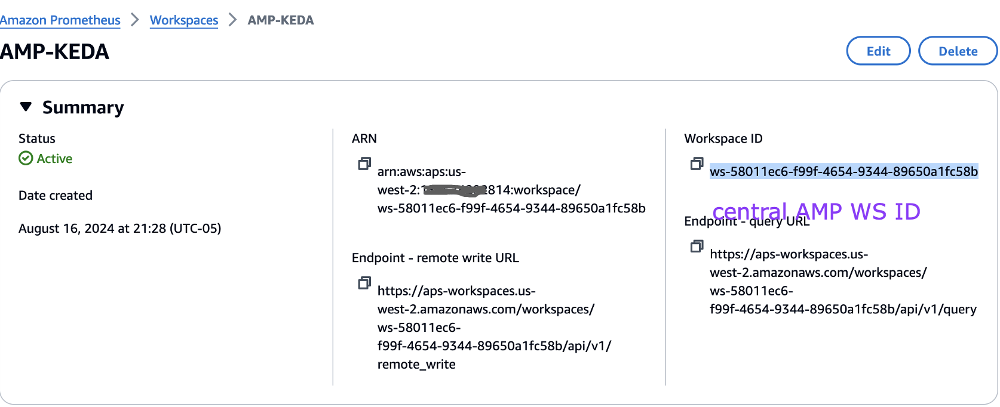
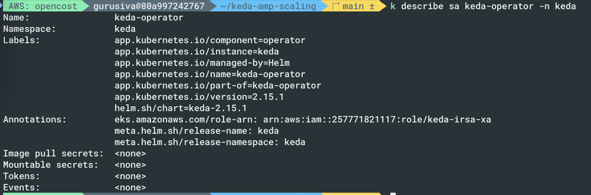
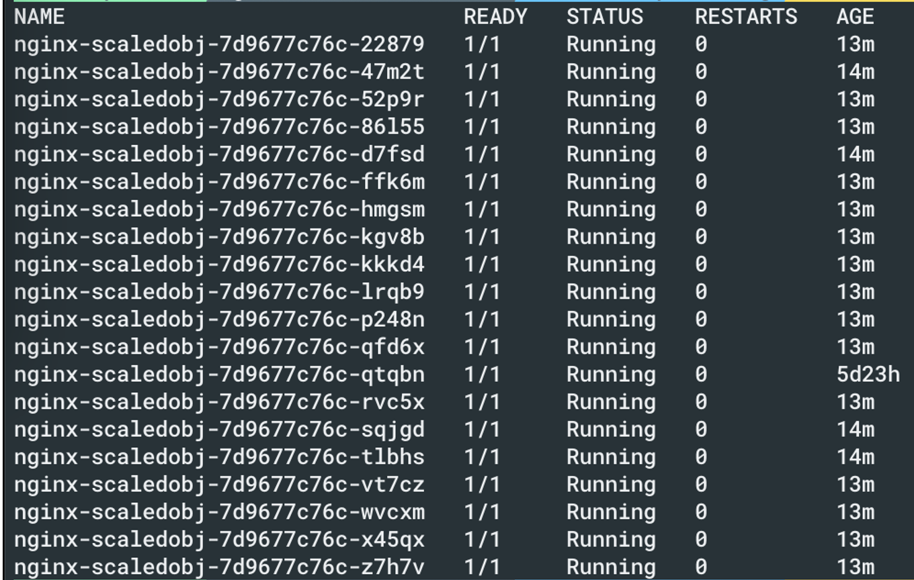

# AMP மற்றும் EKS-இல் KEDA பயன்படுத்தி அப்ளிகேஷன்களை Autoscaling செய்தல்

# தற்போதைய நிலை

Amazon EKS அப்ளிகேஷன்களில் அதிகரிக்கும் traffic-ஐ கையாள்வது சவாலானது, manual scaling திறனற்றது மற்றும் பிழைக்கு வாய்ப்புள்ளது. Autoscaling resource allocation-க்கு சிறந்த தீர்வை வழங்குகிறது. KEDA பல்வேறு மெட்ரிக்குகள் மற்றும் events அடிப்படையில் Kubernetes autoscaling-ஐ செயல்படுத்துகிறது, Amazon Managed Service for Prometheus EKS கிளஸ்டர்களுக்கு பாதுகாப்பான metric monitoring-ஐ வழங்குகிறது. இந்த தீர்வு KEDA-ஐ Amazon Managed Service for Prometheus-உடன் இணைத்து, Requests Per Second (RPS) மெட்ரிக்குகள் அடிப்படையில் autoscaling-ஐ நிரூபிக்கிறது. இந்த அணுகுமுறை workload தேவைகளுக்கு ஏற்ப தானியங்கி scaling-ஐ வழங்குகிறது, இதை பயனர்கள் தங்கள் சொந்த EKS workloads-க்கு பயன்படுத்தலாம். Amazon Managed Grafana scaling patterns-ஐ monitoring செய்யவும் visualize செய்யவும் பயன்படுத்தப்படுகிறது, இது autoscaling நடத்தைகளை புரிந்துகொள்ளவும் business events-உடன் தொடர்புபடுத்தவும் பயனர்களுக்கு உதவுகிறது.

# AMP மெட்ரிக்குகளுடன் KEDA பயன்படுத்தி அப்ளிகேஷன் Autoscaling

இந்த தீர்வு தானியங்கி scaling pipeline உருவாக்க open-source software-உடன் AWS integration-ஐ நிரூபிக்கிறது. இது managed Kubernetes-க்கு Amazon EKS, மெட்ரிக் சேகரிப்புக்கு AWS Distro for Open Telemetry (ADOT), event-driven autoscaling-க்கு KEDA, மெட்ரிக் சேமிப்பகத்துக்கு Amazon Managed Service for Prometheus, மற்றும் visualization-க்கு Amazon Managed Grafana ஆகியவற்றை இணைக்கிறது. Architecture-இல் EKS-இல் KEDA-ஐ deploy செய்தல், மெட்ரிக்குகளை scrape செய்ய ADOT-ஐ configure செய்தல், KEDA ScaledObject-உடன் autoscaling rules-ஐ define செய்தல், மற்றும் scaling-ஐ monitor செய்ய Grafana dashboards பயன்படுத்துதல் ஆகியவை அடங்கும். Autoscaling செயல்முறை பயனர் requests-உடன் microservice-க்கு தொடங்குகிறது, ADOT மெட்ரிக்குகளை சேகரித்து Prometheus-க்கு அனுப்புகிறது. KEDA இந்த மெட்ரிக்குகளை வழக்கமான intervals-இல் query செய்து, scaling தேவைகளை நிர்ணயித்து, pod replicas-ஐ சரிசெய்ய Horizontal Pod Autoscaler (HPA)-உடன் interact செய்கிறது. இந்த setup Kubernetes microservices-க்கு metrics-driven autoscaling-ஐ செயல்படுத்துகிறது, பல்வேறு utilization indicators அடிப்படையில் scale செய்யக்கூடிய நெகிழ்வான, cloud-native architecture-ஐ வழங்குகிறது.

# AMP மெட்ரிக்குகளில் KEDA-உடன் Cross account EKS அப்ளிகேஷன் scaling
இந்த வழக்கில், KEDA EKS ID 117-இல் முடிவடையும் AWS Account-இல் இயங்குவதாகவும், central AMP Account ID 814-இல் முடிவடைவதாகவும் கருதுவோம். KEDA EKS account-இல், கீழே காட்டப்பட்டுள்ளபடி cross account IAM role-ஐ அமைக்கவும்:

Trust relationship-ஐ கீழே காட்டப்பட்டுள்ளபடி புதுப்பிக்கவும்:

EKS கிளஸ்டரில், இங்கே IRSA பயன்படுத்தப்படுவதால் Pod identity பயன்படுத்தப்படவில்லை என்பதை காணலாம்

Central AMP account-இல் கீழே காட்டப்பட்டுள்ளபடி AMP access அமைக்கப்பட்டுள்ளது

Trust relationship-இல் access உள்ளது

கீழே காட்டப்பட்டுள்ளபடி workspace ID-ஐ குறித்துக்கொள்ளவும்

## KEDA கட்டமைப்பு
Setup முடிந்தபின், கீழே காட்டப்பட்டுள்ளபடி KEDA இயங்குவதை உறுதிசெய்யவும். Setup வழிமுறைகளுக்கு கீழே பகிரப்பட்ட blog link-ஐ பார்க்கவும்

கட்டமைப்பில் மேலே வரையறுக்கப்பட்ட central AMP role-ஐ பயன்படுத்துவதை உறுதிசெய்யவும்

KEDA scaler கட்டமைப்பில், கீழே காட்டப்பட்டுள்ளபடி central AMP account-ஐ point செய்யவும்

இப்போது pods சரியாக scale செய்யப்பட்டுள்ளதை காணலாம்

## Blogs

[https://aws.amazon.com/blogs/mt/autoscaling-kubernetes-workloads-with-keda-using-amazon-managed-service-for-prometheus-metrics/](https://aws.amazon.com/blogs/mt/autoscaling-kubernetes-workloads-with-keda-using-amazon-managed-service-for-prometheus-metrics/)
