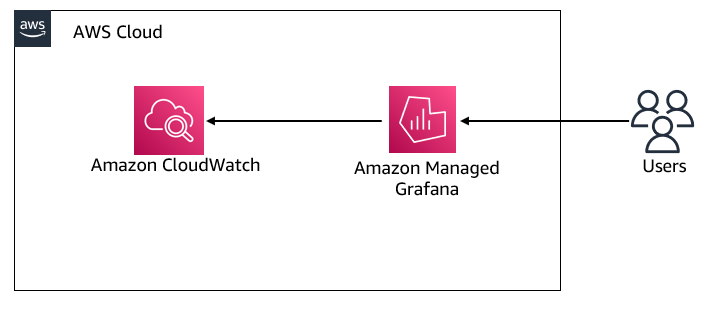

# நிகழ்நேர செலவு கண்காணிப்பு

Amazon Managed Service for Prometheus என்பது கண்டெய்னர் மெட்ரிக்குகளுக்கான சர்வர்லெஸ், Prometheus-இணக்கமான கண்காணிப்பு சேவையாகும், இது கண்டெய்னர் சூழல்களை அளவில் பாதுகாப்பாக கண்காணிக்க எளிதாக்குகிறது. Amazon Managed Service for Prometheus விலை நிர்ணய மாதிரி Metric samples ingested, Query samples processed மற்றும் Metrics stored ஆகியவற்றின் அடிப்படையில் உள்ளது. சமீபத்திய விலை விவரங்களை [இங்கே][pricing] காணலாம். 

நிர்வகிக்கப்படும் சேவையாக, Amazon Managed Service for Prometheus பணிச்சுமைகள் அதிகரிக்கும்போதும் குறையும்போதும் செயல்பாட்டு மெட்ரிக்குகளின் உள்ளீடு, சேமிப்பு மற்றும் வினவலை தானாகவே அளவிடுகிறது. எங்கள் சில வாடிக்கையாளர்கள் `metric samples ingestion rate` மற்றும் அதன் நிகழ்நேர செலவை எவ்வாறு கண்காணிப்பது என்பது குறித்து வழிகாட்டல் கேட்டனர். அதை எவ்வாறு அடையலாம் என்பதை ஆராய்வோம்.

### தீர்வு
Amazon Managed Service for Prometheus Amazon CloudWatch-க்கு [பயன்பாட்டு மெட்ரிக்குகளை வழங்குகிறது][vendedmetrics]. இந்த மெட்ரிக்குகள் உங்கள் Amazon Managed Service for Prometheus workspace-ல் சிறந்த தெரிவுநிலையைப் பெற உதவும். வழங்கப்படும் மெட்ரிக்குகள் CloudWatch-ல் `AWS/Usage` மற்றும் `AWS/Prometheus` namespaces-ல் கிடைக்கும், மேலும் இந்த [மெட்ரிக்குகள்][AMPMetrics] கூடுதல் கட்டணம் இல்லாமல் CloudWatch-ல் கிடைக்கும். இந்த மெட்ரிக்குகளை மேலும் ஆராய மற்றும் காட்சிப்படுத்த நீங்கள் எப்போதும் CloudWatch டாஷ்போர்டை உருவாக்கலாம்.

இன்று, நீங்கள் Amazon CloudWatch-ஐ Amazon Managed Grafana-க்கான தரவு-மூலமாகப் பயன்படுத்தி, அந்த மெட்ரிக்குகளை காட்சிப்படுத்த Grafana-ல் டாஷ்போர்டுகளை உருவாக்குவீர்கள். கட்டமைப்பு வரைபடம் பின்வருவனவற்றை விளக்குகிறது.  

- Amazon Managed Service for Prometheus Amazon CloudWatch-க்கு வழங்கப்படும் மெட்ரிக்குகளை வெளியிடுகிறது  

- Amazon CloudWatch Amazon Managed Grafana-க்கான தரவு-மூலமாக உள்ளது  

- பயனர்கள் Amazon Managed Grafana-ல் உருவாக்கப்பட்ட டாஷ்போர்டுகளை அணுகுகிறார்கள்

### Amazon Managed Grafana டாஷ்போர்டுகள்

Amazon Managed Grafana-ல் உருவாக்கப்பட்ட டாஷ்போர்டு பின்வருவனவற்றை காட்சிப்படுத்த உதவும்;  

1. workspace-க்கான Prometheus Ingestion Rate  
  

2. workspace-க்கான Prometheus Ingestion Rate மற்றும் நிகழ்நேர செலவு  
   நிகழ்நேர செலவு கண்காணிப்புக்கு, அதிகாரப்பூர்வ [AWS விலை ஆவணத்தில்][pricing] குறிப்பிடப்பட்ட `First 2 billion samples`-க்கான `Metrics Ingested Tier` விலையின் அடிப்படையில் `math expression`-ஐ பயன்படுத்துவீர்கள். Math operations எண்களையும் நேர வரிசைகளையும் உள்ளீடாக எடுத்து வெவ்வேறு எண்களாகவும் நேர வரிசைகளாகவும் மாற்றுகின்றன, மேலும் உங்கள் வணிகத் தேவைகளுக்கு ஏற்ப மேலும் தனிப்பயனாக்க இந்த [ஆவணத்தை][mathexpression] பார்க்கவும்.  
  

3. workspace-க்கான Prometheus Active Series  

Grafana-ல் ஒரு டாஷ்போர்டு JSON ஆப்ஜெக்ட்டால் குறிக்கப்படுகிறது, இது அதன் டாஷ்போர்டின் metadata-ஐ சேமிக்கிறது. டாஷ்போர்டு metadata-ல் டாஷ்போர்டு பண்புகள், பேனல்களின் metadata, template variables, panel queries போன்றவை அடங்கும்.  

மேலே உள்ள டாஷ்போர்டின் **JSON template**-ஐ <mark>[இங்கே](AmazonPrometheusMetrics.json)</mark> அணுகலாம்.

மேற்கூறிய டாஷ்போர்டின் மூலம், நீங்கள் இப்போது workspace-க்கான ingestion rate-ஐ அடையாளம் காணலாம் மற்றும் Amazon Managed Service for Prometheus-க்கான metrics ingestion rate-ன் அடிப்படையில் workspace-க்கான நிகழ்நேர செலவை கண்காணிக்கலாம். உங்கள் தேவைகளுக்கு ஏற்ப காட்சிகளை உருவாக்க மற்ற Grafana [dashboard panels][panels]-ஐ பயன்படுத்தலாம்.

[pricing]: https://aws.amazon.com/prometheus/pricing/
[AMPMetrics]: https://docs.aws.amazon.com/prometheus/latest/userguide/AMP-CW-usage-metrics.html
[vendedmetrics]: https://aws.amazon.com/blogs/mt/introducing-vended-metrics-for-amazon-managed-service-for-prometheus/
[mathexpression]: https://grafana.com/docs/grafana/latest/panels-visualizations/query-transform-data/expression-queries/#math
[panels]: https://docs.aws.amazon.com/grafana/latest/userguide/Grafana-panels.html
