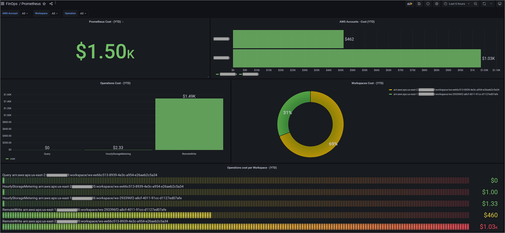

# Amazon Managed Service for Prometheus

Amazon Managed Service for Prometheus செலவு மற்றும் பயன்பாட்டு காட்சிகள் தனிப்பட்ட AWS Accounts, AWS Regions, குறிப்பிட்ட Prometheus Workspace instances உடன் RemoteWrite, Query மற்றும் HourlyStorageMetering போன்ற Operations பற்றிய நுண்ணறிவுகளைப் பெற உங்களை அனுமதிக்கும்!

செலவு மற்றும் பயன்பாட்டு தரவை காட்சிப்படுத்தவும் பகுப்பாய்வு செய்யவும், தனிப்பயன் Athena view ஐ உருவாக்க வேண்டும்.

1.	தொடர்வதற்கு முன், [செயல்படுத்தல் கண்ணோட்டத்தில்][cid-implement] குறிப்பிடப்பட்ட CUR (படி #1) ஐ உருவாக்கி AWS CloudFormation Template (படி #2) ஐ deploy செய்துள்ளீர்கள் என்பதை உறுதிப்படுத்தவும்.

2.	இப்போது, பின்வரும் query ஐப் பயன்படுத்தி புதிய Amazon Athena [view][view] ஐ உருவாக்குங்கள். இந்த query உங்கள் Organization இல் உள்ள அனைத்து AWS Accounts களிலும் Amazon Managed Service for Prometheus இன் செலவு மற்றும் பயன்பாட்டைப் பெறுகிறது.

        CREATE OR REPLACE VIEW "prometheus_cost" AS 
        SELECT
        line_item_usage_type
        , line_item_resource_id
        , line_item_operation
        , line_item_usage_account_id
        , month
        , year
        , "sum"(line_item_usage_amount) "Usage"
        , "sum"(line_item_unblended_cost) cost
        FROM
        database.tablename #replace database.tablename with your database and table name
        WHERE ("line_item_product_code" = 'AmazonPrometheus')
        GROUP BY 1, 2, 3, 4, 5, 6

## Amazon Managed Grafana டாஷ்போர்டு உருவாக்குதல்

Amazon Managed Grafana உடன், Grafana workspace console இல் AWS data source configuration விருப்பத்தைப் பயன்படுத்தி Athena ஐ data source ஆக சேர்க்கலாம். இந்த அம்சம் உங்கள் ஏற்கனவே உள்ள Athena accounts களை கண்டறிந்து Athena ஐ அணுக தேவையான authentication credentials இன் configuration ஐ நிர்வகிப்பதன் மூலம் Athena ஐ data source ஆக சேர்ப்பதை எளிமைப்படுத்துகிறது. Athena data source ஐப் பயன்படுத்துவதற்கான முன்நிபந்தனைகளுக்கு, [முன்நிபந்தனைகள்][Prerequisites] ஐப் பார்க்கவும்.

பின்வரும் **Grafana டாஷ்போர்டு** உங்கள் AWS Organizations இல் உள்ள அனைத்து AWS Accounts களிலும் Amazon Managed Service for Prometheus செலவு மற்றும் பயன்பாட்டை தனிப்பட்ட Prometheus Workspace instances இன் செலவு மற்றும் RemoteWrite, Query மற்றும் HourlyStorageMetering போன்ற Operations உடன் காட்டுகிறது!

Grafana இல் ஒரு டாஷ்போர்டு JSON object ஆல் குறிப்பிடப்படுகிறது, இது அதன் டாஷ்போர்டின் metadata ஐ சேமிக்கிறது. Dashboard metadata dashboard properties, panels இலிருந்து metadata, template variables, panel queries போன்றவற்றை உள்ளடக்கியது. மேலே உள்ள டாஷ்போர்டின் JSON template ஐ [இங்கே](AmazonPrometheus.json) அணுகவும்.

மேலே உள்ள டாஷ்போர்டு மூலம், உங்கள் Organization முழுவதும் AWS accounts களில் Amazon Managed Service for Prometheus இன் செலவு மற்றும் பயன்பாட்டை இப்போது அடையாளம் காணலாம். உங்கள் தேவைகளுக்கு ஏற்ற காட்சிகளை உருவாக்க பிற Grafana [dashboard panels][panels] ஐப் பயன்படுத்தலாம்.

[Prerequisites]: https://docs.aws.amazon.com/grafana/latest/userguide/Athena-prereq.html
[view]: https://athena-in-action.workshop.aws/30-basics/303-create-view.html
[panels]: https://docs.aws.amazon.com/grafana/latest/userguide/Grafana-panels.html
[cid-implement]: ../../../guides/cost/cost-visualization/cost.md#implementation
