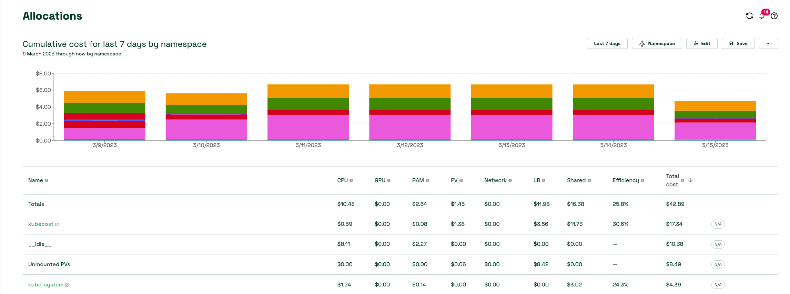
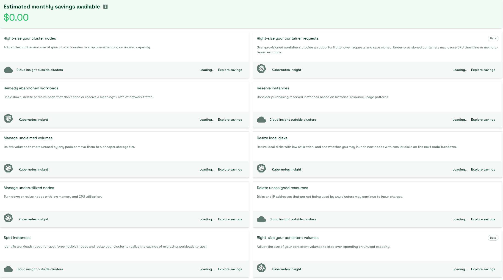

# Kubecost பயன்படுத்துதல்
Kubecost வாடிக்கையாளர்களுக்கு Kubernetes சூழல்களில் செலவு மற்றும் வள செயல்திறன் குறித்த தெளிவை வழங்குகிறது. உயர் மட்டத்தில், Amazon EKS செலவு கண்காணிப்பு Kubecost உடன் பயன்படுத்தப்படுகிறது, இதில் ஒரு திறந்த மூல கண்காணிப்பு அமைப்பு மற்றும் நேர வரிசை தரவுத்தளமான Prometheus அடங்கும். Kubecost Prometheus இலிருந்து மெட்ரிக்குகளைப் படிக்கிறது, பின்னர் செலவு ஒதுக்கீடு கணக்கீடுகளைச் செய்து மெட்ரிக்குகளை மீண்டும் Prometheus க்கு எழுதுகிறது. இறுதியாக, Kubecost முன்புற பகுதி Prometheus இலிருந்து மெட்ரிக்குகளைப் படிக்கிறது மற்றும் Kubecost பயனர் இடைமுகத்தில் (UI) காண்பிக்கிறது. கட்டிடக்கலை பின்வரும் வரைபடத்தால் விளக்கப்படுகிறது:


## Kubecost பயன்படுத்துவதற்கான காரணங்கள்
வாடிக்கையாளர்கள் தங்கள் பயன்பாடுகளை நவீனமாக்கி Amazon EKS ஐப் பயன்படுத்தி பணிச்சுமைகளை நிலைநிறுத்தும்போது, அவர்களின் பயன்பாடுகளை இயக்குவதற்குத் தேவையான கணக்கீட்டு வளங்களை ஒருங்கிணைப்பதன் மூலம் செயல்திறனை அடைகிறார்கள். இருப்பினும், இந்த பயன்பாட்டு செயல்திறன் பயன்பாட்டு செலவுகளை அளவிடுவதில் அதிகரித்த சிரமத்துடன் வர்த்தக பரிமாற்றத்தை கொண்டுவருகிறது. இன்று, குத்தகைதாரர் அடிப்படையில் செலவுகளை விநியோகிக்க இந்த முறைகளில் ஒன்றைப் பயன்படுத்தலாம்:

* கடுமையான பல-குத்தகை — பிரத்யேக AWS கணக்குகளில் தனித்தனி EKS கிளஸ்டர்களை இயக்கவும்.
* மென்மையான பல-குத்தகை — பகிரப்பட்ட EKS கிளஸ்டரில் பல நோடு குழுக்களை இயக்கவும்.
* நுகர்வு அடிப்படையிலான பில்லிங் — பகிரப்பட்ட EKS கிளஸ்டரில் ஏற்படும் செலவை கணக்கிட வள நுகர்வைப் பயன்படுத்தவும்.

கடுமையான பல-குத்தகையுடன், பணிச்சுமைகள் தனித்தனி EKS கிளஸ்டர்களில் நிலைநிறுத்தப்படுகின்றன, மேலும் ஒவ்வொரு குத்தகைதாரரின் செலவையும் தீர்மானிக்க அறிக்கைகளை இயக்காமல் கிளஸ்டர் மற்றும் அதன் சார்புகளுக்கான செலவை நீங்கள் அடையாளம் காணலாம்.
மென்மையான பல-குத்தகையுடன், குத்தகைதாரரின் பணிச்சுமையை பிரத்யேக நோடு குழுக்களில் இயக்க Kubernetes Scheduler க்கு அறிவுறுத்த [Node Selectors](https://kubernetes.io/docs/concepts/scheduling-eviction/assign-pod-node/#nodeselector) மற்றும் [Node Affinity](https://kubernetes.io/docs/concepts/scheduling-eviction/assign-pod-node/#affinity-and-anti-affinity) போன்ற Kubernetes அம்சங்களைப் பயன்படுத்தலாம். நோடு குழுவில் உள்ள EC2 நிகழ்வுகளை ஒரு அடையாளங்காட்டியுடன் (தயாரிப்பு பெயர் அல்லது குழு பெயர் போன்றவை) குறியிடலாம் மற்றும் செலவுகளை விநியோகிக்க [tags](https://docs.aws.amazon.com/awsaccountbilling/latest/aboutv2/cost-alloc-tags.html) ஐப் பயன்படுத்தலாம்.
மேற்கூறிய இரண்டு அணுகுமுறைகளின் குறைபாடு என்னவென்றால், நீங்கள் பயன்படுத்தப்படாத திறனுடன் இருக்கக்கூடும் மற்றும் அடர்த்தியான கிளஸ்டரை இயக்கும்போது வரும் செலவு சேமிப்பை முழுமையாகப் பயன்படுத்த முடியாமல் போகலாம். Elastic Load Balancing, நெட்வொர்க் பரிமாற்ற கட்டணங்கள் போன்ற பகிரப்பட்ட வளங்களின் செலவை ஒதுக்க இன்னும் வழிகள் தேவை.

பல-குத்தகை Kubernetes கிளஸ்டர்களில் செலவுகளை கண்காணிக்க மிகவும் திறமையான வழி, பணிச்சுமைகளால் நுகரப்படும் வளங்களின் அளவின் அடிப்படையில் ஏற்பட்ட செலவுகளை விநியோகிப்பதாகும். இந்த முறை உங்கள் EC2 நிகழ்வுகளின் பயன்பாட்டை அதிகரிக்க அனுமதிக்கிறது, ஏனெனில் வெவ்வேறு பணிச்சுமைகள் நோடுகளைப் பகிரலாம், இது உங்கள் நோடுகளில் பாட்-அடர்த்தியை அதிகரிக்க அனுமதிக்கிறது. இருப்பினும், பணிச்சுமை அல்லது நேம்ஸ்பேஸ்கள் மூலம் செலவுகளை கணக்கிடுவது ஒரு சவாலான பணியாகும். ஒரு பணிச்சுமையின் செலவு-பொறுப்பை புரிந்துகொள்ள, ஒரு காலக்கட்டத்தில் நுகரப்பட்ட அல்லது ஒதுக்கப்பட்ட அனைத்து வளங்களையும் ஒருங்கிணைத்து, வளத்தின் செலவு மற்றும் பயன்பாட்டின் கால அளவின் அடிப்படையில் கட்டணங்களை மதிப்பீடு செய்ய வேண்டும். இதுதான் Kubecost தீர்க்க அர்ப்பணிக்கப்பட்ட சவாலாகும்.

:::tip
    எங்கள் [One Observability Workshop](https://catalog.workshops.aws/observability/en-US/aws-managed-oss/amp/ingest-kubecost-metrics) ஐ பாருங்கள், Kubecost பற்றிய நடைமுறை அனுபவத்தைப் பெறலாம்.
:::

## பரிந்துரைகள்
### செலவு ஒதுக்கீடு
Kubecost செலவு ஒதுக்கீடு டாஷ்போர்டு, namespace, k8s label, மற்றும் service போன்ற அனைத்து நேட்டிவ் Kubernetes கருத்துக்கள் முழுவதும் ஒதுக்கப்பட்ட செலவு மற்றும் மேம்படுத்தல் வாய்ப்பை விரைவாகப் பார்க்க அனுமதிக்கிறது. குழு, தயாரிப்பு/திட்டம், துறை, அல்லது சூழல் போன்ற நிறுவன கருத்துக்களுக்கு செலவை ஒதுக்கவும் அனுமதிக்கிறது. குறிப்பிட்ட பணிச்சுமை பற்றிய நுண்ணறிவுகளைப் பெற தேதி வரம்பு, வடிகட்டிகளை மாற்றலாம் மற்றும் அறிக்கையைச் சேமிக்கலாம். Kubernetes செலவை மேம்படுத்த, செயல்திறன் மற்றும் கிளஸ்டர் செயலற்ற செலவுகளில் கவனம் செலுத்த வேண்டும்.



### செயல்திறன்

பாட் வள செயல்திறன் என்பது கொடுக்கப்பட்ட நேர சாளரத்தில் வள கோரிக்கைக்கு எதிரான வள பயன்பாடு என வரையறுக்கப்படுகிறது. இது செலவு-எடையிடப்பட்டது மற்றும் பின்வருமாறு வெளிப்படுத்தப்படலாம்:
```
(((CPU Usage / CPU Requested) * CPU Cost) + ((RAM Usage / RAM Requested) * RAM Cost)) / (RAM Cost + CPU Cost)
```
இங்கு CPU Usage = rate(container_cpu_usage_seconds_total) நேர சாளரத்தில் RAM Usage = avg(container_memory_working_set_bytes) நேர சாளரத்தில்

AWS வெளிப்படையான RAM, CPU அல்லது GPU விலைகளை வழங்காததால், Kubecost மாதிரி வழங்கப்பட்ட அடிப்படை CPU, GPU மற்றும் RAM விலை உள்ளீடுகளின் விகிதத்திற்கு திரும்புகிறது. இந்த அளவுருக்களின் இயல்புநிலை மதிப்புகள் கிளவுட் வழங்குநரின் விளிம்பு வள விகிதங்களின் அடிப்படையில் அமைந்துள்ளன, ஆனால் அவை Kubecost இல் தனிப்பயனாக்கப்படலாம். இந்த அடிப்படை வள (RAM/CPU/GPU) விலைகள், உங்கள் வழங்குநரிடமிருந்து பில்லிங் விகிதங்களின் அடிப்படையில் வழங்கப்பட்ட நோடின் மொத்த விலைக்கு ஒவ்வொரு கூறின் தொகையும் சமமாக இருப்பதை உறுதிசெய்ய இயல்பாக்கப்படுகின்றன.

அதிகபட்ச செயல்திறனை நோக்கி நகர்வதும், இலக்கை அடைய பணிச்சுமைகளை நுணுக்கமாக சரிசெய்வதும் ஒவ்வொரு சேவை குழுவின் பொறுப்பாகும்.

### செயலற்ற செலவு
கிளஸ்டர் செயலற்ற செலவு என்பது ஒதுக்கப்பட்ட வளங்களின் செலவுக்கும் அவை இயங்கும் வன்பொருளின் செலவுக்கும் இடையிலான வேறுபாடு என வரையறுக்கப்படுகிறது. ஒதுக்கீடு என்பது பயன்பாடு மற்றும் கோரிக்கைகளின் அதிகபட்சமாக வரையறுக்கப்படுகிறது. இது பின்வருமாறும் வெளிப்படுத்தப்படலாம்:
```
idle_cost = sum(node_cost) - (cpu_allocation_cost + ram_allocation_cost + gpu_allocation_cost)
```
இங்கு allocation = max(request, usage)

எனவே, செயலற்ற செலவுகளை Kubernetes scheduler எந்தவொரு தற்போதைய பணிச்சுமைகளையும் தடைசெய்யாமல் பாட்களை திட்டமிடக்கூடிய இடத்தின் செலவாகவும் கருதலாம், ஆனால் தற்போது அவ்வாறு செய்யவில்லை. நீங்கள் எவ்வாறு கட்டமைக்க விரும்புகிறீர்கள் என்பதைப் பொறுத்து பணிச்சுமைகள் அல்லது கிளஸ்டர் அல்லது நோடுகளுக்கு விநியோகிக்கலாம்.


### நெட்வொர்க் செலவு

Kubecost நெட்வொர்க் பரிமாற்ற செலவுகளை அந்த செலவுகளை உருவாக்கும் பணிச்சுமைகளுக்கு ஒதுக்க சிறந்த முயற்சியைப் பயன்படுத்துகிறது. நெட்வொர்க் செலவை நிர்ணயிக்க மிகவும் துல்லியமான வழி [AWS Cloud Integration](https://www.ibm.com/docs/en/kubecost/self-hosted/3.x?topic=integration-aws-cloud-using-irsaeks-pod-identities) மற்றும் [Network costs daemonset](https://docs.kubecost.com/install-and-configure/advanced-configuration/network-costs-configuration) ஆகியவற்றின் கலவையைப் பயன்படுத்துவதாகும்.

கிளஸ்டரை அதன் முழு திறனுக்கும் பயன்படுத்துவதை உறுதிசெய்ய பணிச்சுமைகளை நுணுக்கமாக சரிசெய்ய உங்கள் செயல்திறன் மதிப்பெண் மற்றும் செயலற்ற செலவை கணக்கில் எடுத்துக்கொள்ள வேண்டும். இது கிளஸ்டர் சரியான அளவு என்ற அடுத்த தலைப்புக்கு நம்மை அழைத்துச் செல்கிறது.

### பணிச்சுமைகளை சரியான அளவில் மாற்றுதல்

Kubecost Kubernetes-நேட்டிவ் மெட்ரிக்குகளின் அடிப்படையில் உங்கள் பணிச்சுமைகளுக்கான சரியான அளவு பரிந்துரைகளை வழங்குகிறது. kubecost UI இல் உள்ள சேமிப்பு பேனல் தொடங்குவதற்கு ஒரு சிறந்த இடமாகும்.




Kubecost பின்வருவனவற்றில் பரிந்துரைகளை வழங்க முடியும்:

* அதிகமாக வழங்கப்பட்ட மற்றும் குறைவாக வழங்கப்பட்ட கண்டெய்னர் கோரிக்கைகளைப் பார்ப்பதன் மூலம் கண்டெய்னர் கோரிக்கையை சரியான அளவில் மாற்றுதல்
* பயன்படுத்தப்படாத திறனில் அதிகமாக செலவிடுவதை நிறுத்த கிளஸ்டர் நோடுகளின் எண்ணிக்கை மற்றும் அளவை சரிசெய்தல்
* அர்த்தமுள்ள போக்குவரத்தை அனுப்பாத அல்லது பெறாத பாட்களை குறைத்தல், நீக்குதல் / மறுஅளவிடுதல்
* ஸ்பாட் நோடுகளுக்கு தயாராக இருக்கும் பணிச்சுமைகளை அடையாளம் காணுதல்
* எந்த பாட்களாலும் பயன்படுத்தப்படாத வால்யூம்களை அடையாளம் காணுதல்


Kubecost ஒரு முன்-வெளியீட்டு அம்சத்தையும் கொண்டுள்ளது, இது Cluster Controller கூறு இயக்கப்பட்டிருந்தால் கண்டெய்னர் வள கோரிக்கைகளுக்கான அதன் பரிந்துரைகளை தானாகவே செயல்படுத்த முடியும். தானியங்கு கோரிக்கை சரியான அளவிடலைப் பயன்படுத்துவது, அதிகப்படியான YAML அல்லது சிக்கலான kubectl கட்டளைகளை சோதிக்காமல் உங்கள் முழு கிளஸ்டரிலும் வள ஒதுக்கீட்டை உடனடியாக மேம்படுத்த அனுமதிக்கிறது. உங்கள் கிளஸ்டரில் வள அதிக-ஒதுக்கீட்டை எளிதாக நீக்கலாம், இது கிளஸ்டர் சரியான அளவிடல் மற்றும் பிற மேம்படுத்தல்கள் மூலம் பெரிய சேமிப்புகளுக்கு வழி வகுக்கிறது.

### Amazon Managed Service for Prometheus உடன் Kubecost ஐ ஒருங்கிணைத்தல்

Kubecost திறந்த மூல Prometheus திட்டத்தை நேர வரிசை தரவுத்தளமாகப் பயன்படுத்துகிறது மற்றும் செலவு ஒதுக்கீடு கணக்கீடுகளைச் செய்ய Prometheus இல் உள்ள தரவை பின்-செயலாக்கம் செய்கிறது. கிளஸ்டர் அளவு மற்றும் பணிச்சுமையின் அளவைப் பொறுத்து, மெட்ரிக்குகளை ஸ்கிரேப் செய்து சேமிக்க ஒரு Prometheus சர்வருக்கு அதிகமாக இருக்கலாம். அத்தகைய சந்தர்ப்பத்தில், மெட்ரிக்குகளை நம்பகத்தன்மையுடன் சேமிக்கவும் Kubernetes செலவை அளவில் எளிதாக கண்காணிக்கவும் ஒரு நிர்வகிக்கப்பட்ட Prometheus-இணக்கமான கண்காணிப்பு சேவையான Amazon Managed Service for Prometheus ஐப் பயன்படுத்தலாம்.

நீங்கள் [Kubecost சேவை கணக்குகளுக்கான IAM பாத்திரங்களை](https://docs.aws.amazon.com/eks/latest/userguide/iam-roles-for-service-accounts.html) அமைக்க வேண்டும். கிளஸ்டருக்கான OIDC வழங்குநரைப் பயன்படுத்தி, உங்கள் கிளஸ்டரின் சேவை கணக்குகளுக்கு IAM அனுமதிகளை வழங்குகிறீர்கள். kubecost-cost-analyzer மற்றும் kubecost-prometheus-server சேவை கணக்குகளுக்கு பொருத்தமான அனுமதிகளை வழங்க வேண்டும். இவை பணியிடத்திலிருந்து மெட்ரிக்குகளை அனுப்பவும் பெறவும் பயன்படுத்தப்படும். கட்டளை வரியில் பின்வரும் கட்டளைகளை இயக்கவும்:

```
eksctl create iamserviceaccount \ 
--name kubecost-cost-analyzer \ 
--namespace kubecost \ 
--cluster <CLUSTER_NAME> \
--region <REGION> \ 
--attach-policy-arn arn:aws:iam::aws:policy/AmazonPrometheusQueryAccess \ 
--attach-policy-arn arn:aws:iam::aws:policy/AmazonPrometheusRemoteWriteAccess \ 
--override-existing-serviceaccounts \ 
--approve 

eksctl create iamserviceaccount \ 
--name kubecost-prometheus-server \ 
--namespace kubecost \ 
--cluster <CLUSTER_NAME> --region <REGION> \ 
--attach-policy-arn arn:aws:iam::aws:policy/AmazonPrometheusQueryAccess \ 
--attach-policy-arn arn:aws:iam::aws:policy/AmazonPrometheusRemoteWriteAccess \ 
--override-existing-serviceaccounts \ 
--approve

```
`CLUSTER_NAME` என்பது நீங்கள் Kubecost ஐ நிறுவ விரும்பும் Amazon EKS கிளஸ்டரின் பெயர் மற்றும் "REGION" என்பது Amazon EKS கிளஸ்டரின் பகுதியாகும்.

முடிந்ததும், கீழே உள்ளவாறு Kubecost helm chart ஐ மேம்படுத்த வேண்டும்:
```
helm upgrade -i kubecost \
oci://public.ecr.aws/kubecost/cost-analyzer --version <$VERSION> \
--namespace kubecost --create-namespace \
-f https://tinyurl.com/kubecost-amazon-eks \
-f https://tinyurl.com/kubecost-amp \
--set global.amp.prometheusServerEndpoint=${QUERYURL} \
--set global.amp.remoteWriteService=${REMOTEWRITEURL}
```
### Kubecost UI அணுகுதல்

Kubecost kubectl port-forward, ingress, அல்லது load balancer மூலம் அணுகக்கூடிய ஒரு வலை டாஷ்போர்டை வழங்குகிறது. Kubecost இன் enterprise பதிப்பு [SSO/SAML](https://www.ibm.com/docs/en/kubecost/self-hosted/3.x?topic=configuration-user-management-oidc) ஐப் பயன்படுத்தி டாஷ்போர்டுக்கான அணுகலைக் கட்டுப்படுத்துவதையும் வெவ்வேறு நிலை அணுகலை வழங்குவதையும் ஆதரிக்கிறது. எடுத்துக்காட்டாக, குழுவின் பார்வையை அவர்கள் பொறுப்பான தயாரிப்புகளுக்கு மட்டும் கட்டுப்படுத்துதல்.

AWS சூழலில், Kubecost ஐ வெளிப்படுத்த [AWS Load Balancer Controller](https://docs.aws.amazon.com/eks/latest/userguide/aws-load-balancer-controller.html) ஐப் பயன்படுத்துவதையும், அங்கீகாரம், அதிகாரம் மற்றும் பயனர் மேலாண்மைக்கு [Amazon Cognito](https://aws.amazon.com/cognito/) ஐப் பயன்படுத்துவதையும் பரிசீலிக்கவும். இதைப் பற்றி மேலும் அறிய [How to use Application Load Balancer and Amazon Cognito to authenticate users for your Kubernetes web apps](https://aws.amazon.com/blogs/containers/how-to-use-application-load-balancer-and-amazon-cognito-to-authenticate-users-for-your-kubernetes-web-apps/)


### பல-கிளஸ்டர் பார்வை

உங்கள் FinOps குழு வணிக உரிமையாளர்களுடன் பரிந்துரைகளை பகிர EKS கிளஸ்டரை மதிப்பாய்வு செய்ய விரும்பும். பெரிய அளவில் இயங்கும்போது, பரிந்துரைகளைப் பார்க்க ஒவ்வொரு கிளஸ்டரிலும் உள்நுழைவது குழுக்களுக்கு சவாலாகிறது. பல கிளஸ்டர் உலகளாவிய ஒருங்கிணைக்கப்பட்ட அனைத்து கிளஸ்டர் செலவுகளையும் ஒரு ஒற்றை-பார்வை-கண்ணாடியாகக் கொண்டிருக்க அனுமதிக்கிறது. பல கிளஸ்டர்கள் கொண்ட சூழல்களுக்கு Kubecost ஆதரிக்கும் மூன்று விருப்பங்கள் உள்ளன: Kubecost Free, Kubecost Business, மற்றும் Kubecost enterprise. இலவச மற்றும் வணிக முறையில், கிளவுட்-பில்லிங் நிகழ்நேரப்படுத்தல் ஒவ்வொரு கிளஸ்டர் மட்டத்திலும் செய்யப்படும். enterprise முறையில், kubecost UI ஐ வழங்கும் மற்றும் மெட்ரிக்குகள் சேமிக்கப்படும் பகிரப்பட்ட bucket ஐப் பயன்படுத்தும் ஒரு முதன்மை கிளஸ்டரில் கிளவுட் பில்லிங் நிகழ்நேரப்படுத்தல் செய்யப்படும்.
enterprise முறையைப் பயன்படுத்தும்போது மட்டுமே மெட்ரிக்குகள் தக்கவைப்பு வரம்பற்றது என்பதை கவனிக்க வேண்டியது முக்கியம்.

### குறிப்புகள்
* [One Observability Workshop இல் Kubecost நடைமுறை அனுபவம்](https://catalog.workshops.aws/observability/en-US/aws-managed-oss/amp/ingest-kubecost-metrics)
* [வலைப்பதிவு - Amazon Managed Service for Prometheus உடன் Kubecost ஐ ஒருங்கிணைத்தல்](https://aws.amazon.com/blogs/mt/integrating-kubecost-with-amazon-managed-service-for-prometheus/)
