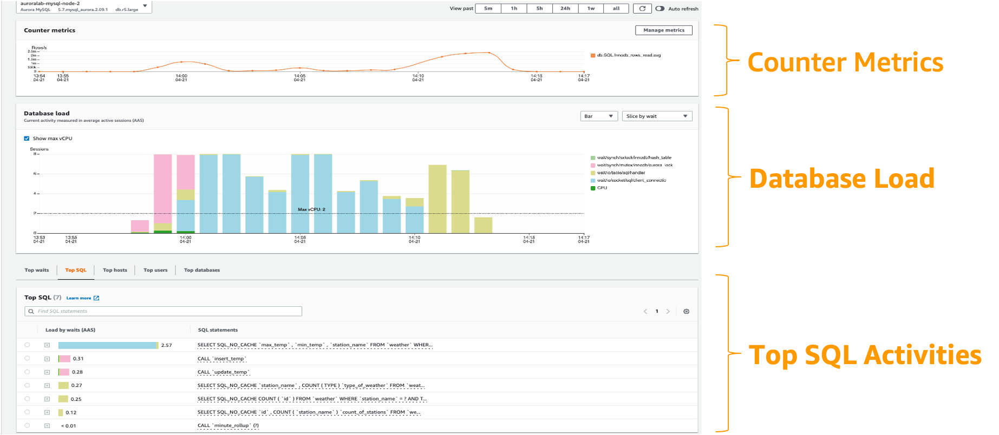

# Amazon RDS மற்றும் Aurora databases-ஐ கண்காணித்தல்

Amazon RDS மற்றும் Aurora database clusters-இன் நம்பகத்தன்மை, கிடைக்கும்தன்மை மற்றும் செயல்திறனை பராமரிப்பதில் monitoring முக்கிய பங்கு வகிக்கிறது. உங்கள் Amazon RDS மற்றும் Aurora databases resources-இன் ஆரோக்கியத்தை கண்காணிக்க, சிக்கல்களை அவை critical ஆவதற்கு முன் கண்டறிய மற்றும் நிலையான பயனர் அனுபவத்திற்கு செயல்திறனை optimize செய்ய AWS பல கருவிகளை வழங்குகிறது. உங்கள் databases சீராக இயங்குவதை உறுதி செய்ய இந்த வழிகாட்டி observability சிறந்த நடைமுறைகளை வழங்குகிறது.

## செயல்திறன் வழிகாட்டுதல்கள்

சிறந்த நடைமுறையாக, உங்கள் workloads-க்கான baseline செயல்திறனை நிறுவுவதில் தொடங்கவும். DB instance-ஐ அமைத்து வழக்கமான workload-உடன் இயக்கும்போது, அனைத்து performance metrics-இன் சராசரி, அதிகபட்ச மற்றும் குறைந்தபட்ச மதிப்புகளை capture செய்யவும்.

## கண்காணிப்பு விருப்பங்கள்

### Amazon CloudWatch metrics

[Amazon CloudWatch](https://docs.aws.amazon.com/AmazonRDS/latest/UserGuide/monitoring-cloudwatch.html) உங்கள் [RDS](https://aws.amazon.com/rds/) மற்றும் [Aurora](https://aws.amazon.com/rds/aurora/) databases-ஐ கண்காணித்து நிர்வகிப்பதற்கான முக்கிய கருவி ஆகும். Amazon RDS மற்றும் Aurora database இரண்டும் ஒவ்வொரு active database instance-க்கும் 1 நிமிட granularity-ல் CloudWatch-க்கு மெட்ரிக்குகளை அனுப்புகின்றன. **AWS/RDS** namespace-ல் instance-level மெட்ரிக்குகள் publish செய்யப்படுகின்றன.

கண்காணிக்க வேண்டிய முக்கிய மெட்ரிக்குகள்:

* **CPU Utilization** - பயன்படுத்தப்பட்ட computer processing capacity சதவீதம்.
* **DB Connections** - DB instance-க்கு இணைக்கப்பட்ட client sessions எண்ணிக்கை.
* **Freeable Memory** - DB instance-ல் கிடைக்கும் RAM, megabytes-ல்.
* **Network throughput** - bytes per second-ல் DB instance-க்கான network traffic rate.
* **Read/Write Latency** - read அல்லது write operation-க்கான சராசரி நேரம் milliseconds-ல்.
* **Read/Write IOPS** - வினாடிக்கான சராசரி disk read அல்லது write operations எண்ணிக்கை.
* **Free Storage Space** - DB instance பயன்படுத்தாத disk space, megabytes-ல்.


Performance related issues troubleshoot செய்ய, முதல் படியாக அதிகம் பயன்படுத்தப்படும் மற்றும் expensive queries-ஐ tune செய்யவும்.

பின்னர், இந்த மெட்ரிக்குகள் critical thresholds-ஐ அடையும்போது alert செய்ய alarms அமைக்கலாம்.

#### CloudWatch Logs Insights

[CloudWatch Logs Insights](https://docs.aws.amazon.com/AmazonCloudWatch/latest/logs/AnalyzingLogData.html) Amazon CloudWatch Logs-ல் உங்கள் log data-ஐ interactively search மற்றும் analyze செய்ய உதவுகிறது.

#### CloudWatch Alarms

செயல்திறன் குறையும்போது அடையாளம் காண, முக்கிய performance metrics-ஐ தவறாமல் monitor மற்றும் alert செய்ய வேண்டும். [Amazon CloudWatch alarms](https://docs.aws.amazon.com/AmazonCloudWatch/latest/monitoring/AlarmThatSendsEmail.html) பயன்படுத்தி, நீங்கள் குறிப்பிடும் கால அளவில் ஒரு metric-ஐ watch செய்யலாம்.


#### Database Audit Logs

Database Audit Logs உங்கள் RDS மற்றும் Aurora databases-ல் எடுக்கப்பட்ட அனைத்து actions-இன் detailed record-ஐ வழங்குகின்றன.

#### Database Slow Query மற்றும் Error Logs

Slow query logs database-ல் slow-performing queries-ஐ கண்டறிய உதவுகின்றன. Error logs query errors-ஐ கண்டறிய உதவுகின்றன.

## Performance Insights மற்றும் operating-system metrics

#### Enhanced Monitoring

[Enhanced Monitoring](https://docs.aws.amazon.com/AmazonRDS/latest/UserGuide/USER_Monitoring.OS.html) உங்கள் DB instance இயங்கும் operating system (OS)-க்கான fine-grain metrics-ஐ real time-ல் பெற உதவுகிறது.


#### Performance Insights

[Amazon RDS Performance Insights](https://aws.amazon.com/rds/performance-insights/) உங்கள் database-இன் load-ஐ விரைவாக மதிப்பிட்டு, எப்போது எங்கு நடவடிக்கை எடுக்க வேண்டும் என்பதை தீர்மானிக்க உதவும் database performance tuning மற்றும் monitoring feature ஆகும்.

:::note
	தற்போது, RDS Performance Insights Aurora (PostgreSQL மற்றும் MySQL-compatible editions), Amazon RDS for PostgreSQL, MySQL, MariaDB, SQL Server மற்றும் Oracle-க்கு கிடைக்கிறது.
:::

**DBLoad** என்பது database active sessions-இன் சராசரி எண்ணிக்கையை குறிக்கும் முக்கிய metric ஆகும்.



## Open-source Observability கருவிகள்

#### Amazon Managed Grafana
[Amazon Managed Grafana](https://aws.amazon.com/grafana/) RDS மற்றும் Aurora databases-இலிருந்து தரவை visualize மற்றும் analyze செய்வதை எளிதாக்கும் fully managed service ஆகும்.


RDS Performance Insights மெட்ரிக்குகளை Amazon Managed Grafana-வில் visualize செய்ய, custom lambda function பயன்படுத்தலாம்:

```
$ git clone https://github.com/aws-observability/observability-best-practices.git
$ cd sandbox/monitor-aurora-with-grafana

$ chmod +x install.sh
$ ./install.sh
```


<!-- blank line -->
<figure class="video_container">
  <iframe width="560" height="315" src="https://www.youtube.com/embed/Uj9UJ1mXwEA" title="YouTube video player" frameborder="0" allow="accelerometer; autoplay; clipboard-write; encrypted-media; gyroscope; picture-in-picture; web-share" allowfullscreen></iframe>
</figure>
<!-- blank line -->

## AIOps - Machine learning அடிப்படையிலான performance bottlenecks கண்டறிதல்

#### Amazon DevOps Guru for RDS

[Amazon DevOps Guru for RDS](https://aws.amazon.com/devops-guru/features/devops-guru-for-rds/) மூலம், performance bottlenecks மற்றும் operational issues-க்கு உங்கள் databases-ஐ கண்காணிக்கலாம்.

:::note
	புதிய database instances-க்கு, Amazon DevOps Guru for RDS ஆரம்ப baseline நிறுவ 2 நாட்கள் வரை ஆகும்.
:::


<!-- blank line -->
<figure class="video_container">
  <iframe width="560" height="315" src="https://www.youtube.com/embed/N3NNYgzYUDA" title="YouTube video player" frameborder="0" allow="accelerometer; autoplay; clipboard-write; encrypted-media; gyroscope; picture-in-picture; web-share" allowfullscreen></iframe>
</figure>
<!-- blank line -->

## Auditing மற்றும் Governance

#### AWS CloudTrail Logs

[AWS CloudTrail](https://docs.aws.amazon.com/awscloudtrail/latest/userguide/cloudtrail-user-guide.html) RDS-ல் user, role அல்லது AWS service-ஆல் எடுக்கப்பட்ட actions-இன் record-ஐ வழங்குகிறது.

## கூடுதல் தகவலுக்கான குறிப்புகள்

[Blog - Amazon Managed Grafana மூலம் RDS மற்றும் Aurora databases கண்காணித்தல்](https://aws.amazon.com/blogs/mt/monitoring-amazon-rds-and-amazon-aurora-using-amazon-managed-grafana/)

[Video - Amazon Managed Grafana மூலம் RDS மற்றும் Aurora databases கண்காணித்தல்](https://www.youtube.com/watch?v=Uj9UJ1mXwEA)

[Blog - Amazon CloudWatch மூலம் RDS மற்றும் Aurora databases கண்காணித்தல்](https://aws.amazon.com/blogs/database/creating-an-amazon-cloudwatch-dashboard-to-monitor-amazon-rds-and-amazon-aurora-mysql/)

[Blog - Amazon RDS-க்கு proactive database monitoring build செய்தல்](https://aws.amazon.com/blogs/database/build-proactive-database-monitoring-for-amazon-rds-with-amazon-cloudwatch-logs-aws-lambda-and-amazon-sns/)

[Official Doc - Amazon Aurora Monitoring Guide](https://docs.aws.amazon.com/AmazonRDS/latest/AuroraUserGuide/MonitoringOverview.html)

[Hands-on Workshop - Amazon Aurora-வில் SQL Performance Issues-ஐ Observe மற்றும் Identify செய்தல்](https://catalog.workshops.aws/awsauroramysql/en-US/provisioned/perfobserve)


