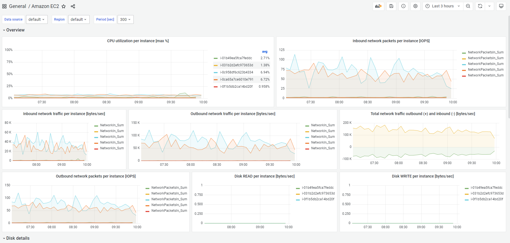

# EC2 கண்காணிப்பு மற்றும் Observability

## அறிமுகம்

தொடர்ச்சியான கண்காணிப்பு & Observability சுறுசுறுப்பை அதிகரிக்கிறது, வாடிக்கையாளர் அனுபவத்தை மேம்படுத்துகிறது மற்றும் கிளவுட் சூழலின் ஆபத்தை குறைக்கிறது. Wikipedia-இன் படி, [Observability](https://en.wikipedia.org/wiki/Observability) என்பது ஒரு கணினியின் வெளிப்புற வெளியீடுகளின் அறிவிலிருந்து உள் நிலைகளை எவ்வளவு நன்றாக ஊகிக்க முடியும் என்பதின் அளவீடு ஆகும். Observability என்ற சொல் control theory துறையிலிருந்து உருவானது, அங்கு அது அடிப்படையில் ஒரு கணினி உருவாக்கும் வெளிப்புற சிக்னல்கள்/வெளியீடுகளைப் பற்றி கற்றுக்கொள்வதன் மூலம் கூறுகளின் உள் நிலையை ஊகிக்க முடியும் என்பதைக் குறிக்கிறது.

கண்காணிப்பு மற்றும் Observability இடையிலான வேறுபாடு என்னவென்றால், கண்காணிப்பு ஒரு கணினி வேலை செய்கிறதா இல்லையா என்று சொல்கிறது, அதேநேரம் Observability கணினி ஏன் வேலை செய்யவில்லை என்று சொல்கிறது. கண்காணிப்பு பொதுவாக எதிர்வினை நடவடிக்கையாகும், அதேசமயம் Observability-இன் இலக்கு உங்கள் முக்கிய செயல்திறன் குறிகாட்டிகளை முன்கூட்டிய முறையில் மேம்படுத்த முடிவதாகும். ஒரு கணினி கண்காணிக்கப்படாவிட்டால் கட்டுப்படுத்தவோ மேம்படுத்தவோ முடியாது. மெட்ரிக்குகள், லாக்குகள் அல்லது ட்ரேஸ்களை சேகரிப்பதன் மூலம் பணிச்சுமைகளை இன்ஸ்ட்ரூமெண்ட் செய்வதும், சரியான கண்காணிப்பு மற்றும் observability கருவிகளைப் பயன்படுத்தி அர்த்தமுள்ள நுண்ணறிவுகள் & விரிவான சூழலைப் பெறுவதும் வாடிக்கையாளர்களுக்கு சூழலைக் கட்டுப்படுத்தவும் மேம்படுத்தவும் உதவுகிறது.

AWS வாடிக்கையாளர்களுக்கு கண்காணிப்பிலிருந்து observability-க்கு மாற உதவுகிறது, இதனால் அவர்கள் முழுமையான end-to-end சேவை தெரிவுநிலையைப் பெற முடியும். இந்த கட்டுரையில் Amazon Elastic Compute Cloud (Amazon EC2) மற்றும் AWS Cloud சூழலில் AWS native மற்றும் open-source கருவிகள் மூலம் சேவையின் கண்காணிப்பு மற்றும் observability-ஐ மேம்படுத்துவதற்கான சிறந்த நடைமுறைகளில் கவனம் செலுத்துகிறோம்.

## Amazon EC2

[Amazon Elastic Compute Cloud](https://aws.amazon.com/ec2/) (Amazon EC2) Amazon Web Services (AWS) Cloud-இல் மிகவும் அளவிடக்கூடிய compute தளமாகும். Amazon EC2 முன்கூட்டிய hardware முதலீட்டின் தேவையை நீக்குகிறது, இதனால் வாடிக்கையாளர்கள் பயன்படுத்தும் அளவிற்கு மட்டும் கட்டணம் செலுத்தும் அதே நேரத்தில் பயன்பாடுகளை விரைவாக உருவாக்கி deploy செய்ய முடியும். EC2 வழங்கும் சில முக்கிய அம்சங்கள் Instances என்று அழைக்கப்படும் மெய்நிகர் computing சூழல்கள், Amazon Machine Images என்று அழைக்கப்படும் Instances-இன் முன்-கட்டமைக்கப்பட்ட templates, Instance Types-ஆக கிடைக்கும் CPU, Memory, Storage மற்றும் Networking capacity போன்ற வளங்களின் பல்வேறு configurations ஆகும்.

## AWS Native கருவிகளைப் பயன்படுத்தி கண்காணிப்பு மற்றும் Observability

### Amazon CloudWatch

[Amazon CloudWatch](https://aws.amazon.com/cloudwatch/) AWS, hybrid மற்றும் on-premises பயன்பாடுகள் மற்றும் உள்கட்டமைப்பு வளங்களுக்கான தரவு மற்றும் செயல்படக்கூடிய நுண்ணறிவுகளை வழங்கும் கண்காணிப்பு மற்றும் மேலாண்மை சேவையாகும். CloudWatch logs, metrics மற்றும் events வடிவத்தில் கண்காணிப்பு மற்றும் செயல்பாட்டுத் தரவை சேகரிக்கிறது. இது AWS மற்றும் on-premises servers-இல் இயங்கும் AWS வளங்கள், பயன்பாடுகள் மற்றும் சேவைகளின் ஒருங்கிணைந்த காட்சியையும் வழங்குகிறது. CloudWatch வள பயன்பாடு, பயன்பாட்டு செயல்திறன் மற்றும் செயல்பாட்டு ஆரோக்கியம் ஆகியவற்றில் கணினி-அளவிலான தெரிவுநிலையைப் பெற உதவுகிறது.

### ஒருங்கிணைந்த CloudWatch ஏஜெண்ட்

ஒருங்கிணைந்த CloudWatch ஏஜெண்ட் MIT உரிமத்தின் கீழ் ஒரு ஓப்பன் சோர்ஸ் மென்பொருளாகும், இது x86-64 மற்றும் ARM64 கட்டமைப்புகளைப் பயன்படுத்தும் பெரும்பாலான இயக்க முறைமைகளை ஆதரிக்கிறது. CloudWatch ஏஜெண்ட் Amazon EC2 Instances & hybrid சூழலில் on-premise servers-இலிருந்து இயக்க முறைமைகள் முழுவதும் கணினி-நிலை மெட்ரிக்குகளை சேகரிக்கவும், பயன்பாடுகள் அல்லது சேவைகளிலிருந்து கஸ்டம் மெட்ரிக்குகளை மீட்டெடுக்கவும், Amazon EC2 instances மற்றும் on-premises servers-இலிருந்து லாக்குகளை சேகரிக்கவும் உதவுகிறது.

### Amazon EC2 Instances-இல் CloudWatch ஏஜெண்ட்டை நிறுவுதல்

#### Command Line Install

CloudWatch ஏஜெண்ட்டை [command line](https://docs.aws.amazon.com/AmazonCloudWatch/latest/monitoring/installing-cloudwatch-agent-commandline.html) மூலம் நிறுவலாம். பல்வேறு architectures மற்றும் இயக்க முறைமைகளுக்கான தேவையான package [பதிவிறக்கத்திற்கு](https://docs.aws.amazon.com/AmazonCloudWatch/latest/monitoring/download-cloudwatch-agent-commandline.html) கிடைக்கின்றன. Amazon EC2 instance-இலிருந்து தகவல்களை படிக்கவும் CloudWatch-க்கு எழுதவும் CloudWatch ஏஜெண்ட்டிற்கு அனுமதிகளை வழங்கும் தேவையான [IAM role](https://docs.aws.amazon.com/AmazonCloudWatch/latest/monitoring/create-iam-roles-for-cloudwatch-agent-commandline.html)-ஐ உருவாக்கவும். தேவையான IAM role உருவாக்கப்பட்டதும், தேவையான Amazon EC2 Instance-இல் CloudWatch ஏஜெண்ட்டை [நிறுவி இயக்கலாம்](https://docs.aws.amazon.com/AmazonCloudWatch/latest/monitoring/install-CloudWatch-Agent-commandline-fleet.html).

:::info
    ஆவணம்: [Installing the CloudWatch agent using the command line](https://docs.aws.amazon.com/AmazonCloudWatch/latest/monitoring/installing-cloudwatch-agent-commandline.html)

    AWS Observability பயிலரங்கம்: [Setup and install CloudWatch agent](https://catalog.workshops.aws/observability/en-US/aws-native/ec2-monitoring/install-ec2)
:::

#### AWS Systems Manager மூலம் நிறுவல்

CloudWatch ஏஜெண்ட்டை [AWS Systems Manager](https://docs.aws.amazon.com/AmazonCloudWatch/latest/monitoring/installing-cloudwatch-agent-ssm.html) மூலமும் நிறுவலாம். Amazon EC2 instance-இலிருந்து தகவல்களை படிக்கவும் CloudWatch-க்கு எழுதவும் & AWS Systems Manager-உடன் தொடர்பு கொள்ளவும் CloudWatch ஏஜெண்ட்டிற்கு அனுமதிகளை வழங்கும் தேவையான IAM role-ஐ உருவாக்கவும். EC2 instances-இல் CloudWatch ஏஜெண்ட்டை நிறுவுவதற்கு முன், தேவையான EC2 instances-இல் SSM agent-ஐ [நிறுவி அல்லது புதுப்பிக்கவும்](https://docs.aws.amazon.com/AmazonCloudWatch/latest/monitoring/download-CloudWatch-Agent-on-EC2-Instance-SSM-first.html#update-SSM-Agent-EC2instance-first). CloudWatch ஏஜெண்ட்டை AWS Systems Manager மூலம் பதிவிறக்கலாம். என்ன மெட்ரிக்குகள் (custom metrics உட்பட), லாக்குகள் சேகரிக்கப்பட வேண்டும் என்பதை குறிப்பிட JSON Configuration file-ஐ உருவாக்கலாம்.

:::info
    ஆவணம்: [Installing the CloudWatch agent using AWS Systems Manager](https://docs.aws.amazon.com/AmazonCloudWatch/latest/monitoring/installing-cloudwatch-agent-ssm.html)

    AWS Observability பயிலரங்கம்: [Install CloudWatch agent using AWS Systems Manager Quick Setup](https://catalog.workshops.aws/observability/en-US/aws-native/ec2-monitoring/install-ec2/ssm-quicksetup)

    தொடர்புடைய Blog கட்டுரை: [Amazon CloudWatch Agent with AWS Systems Manager Integration – Unified Metrics & Log Collection for Linux & Windows](https://aws.amazon.com/blogs/aws/new-amazon-cloudwatch-agent-with-aws-systems-manager-integration-unified-metrics-log-collection-for-linux-windows/)

    YouTube வீடியோ: [Collect Metrics and Logs from Amazon EC2 instances with the CloudWatch Agent](https://www.youtube.com/watch?v=vAnIhIwE5hY)
:::

#### Hybrid சூழலில் on-premise servers-இல் CloudWatch ஏஜெண்ட்டை நிறுவுதல்

சர்வர்கள் on-premises-இலும் cloud-இலும் உள்ள hybrid வாடிக்கையாளர் சூழல்களில், Amazon CloudWatch-இல் ஒருங்கிணைந்த observability-ஐ நிறைவேற்ற இதே போன்ற அணுகுமுறையை எடுக்கலாம். CloudWatch ஏஜெண்ட்டை நேரடியாக Amazon S3-இலிருந்து அல்லது AWS Systems Manager மூலம் பதிவிறக்கலாம். On-premise server Amazon CloudWatch-க்கு தரவை அனுப்ப ஒரு IAM User-ஐ உருவாக்கவும். On-premise servers-இல் ஏஜெண்ட்டை நிறுவி தொடங்கவும்.

:::note
    ஆவணம்: [Installing the CloudWatch agent on on-premises servers](https://docs.aws.amazon.com/AmazonCloudWatch/latest/monitoring/install-CloudWatch-Agent-on-premise.html)
:::

### Amazon CloudWatch பயன்படுத்தி Amazon EC2 Instances-ஐ கண்காணித்தல்

உங்கள் Amazon EC2 Instances மற்றும் பயன்பாடுகளின் நம்பகத்தன்மை, கிடைக்கும் தன்மை மற்றும் செயல்திறனைப் பராமரிப்பதற்கான ஒரு முக்கிய அம்சம் [தொடர்ச்சியான கண்காணிப்பு](https://catalog.workshops.aws/observability/en-US/aws-native/ec2-monitoring) மூலம் ஆகும். தேவையான Amazon EC2 instances-இல் CloudWatch ஏஜெண்ட் நிறுவப்பட்ட நிலையில், நிலையான சூழலை பராமரிக்க instances-இன் ஆரோக்கியத்தையும் அவற்றின் செயல்திறனையும் கண்காணிப்பது அவசியம். அடிப்படையாக, CPU utilization, Network utilization, Disk performance, Disk Reads/Writes, Memory utilization, disk swap utilization, disk space utilization, page file utilization மற்றும் EC2 Instances-இன் log collection போன்ற பொருட்கள் பரிந்துரைக்கப்படுகின்றன.

#### Basic & Detailed Monitoring

Amazon CloudWatch Amazon EC2-இலிருந்து raw தரவை சேகரித்து படிக்கக்கூடிய near real-time மெட்ரிக்குகளாக செயலாக்குகிறது. இயல்புநிலையாக, Amazon EC2 5 நிமிட காலகட்டங்களில் CloudWatch-க்கு மெட்ரிக் தரவை அனுப்புகிறது, இது ஒரு instance-க்கான Basic Monitoring ஆகும். உங்கள் instance-க்கான மெட்ரிக் தரவை 1 நிமிட காலகட்டங்களில் CloudWatch-க்கு அனுப்ப, instance-இல் [detailed monitoring](https://docs.aws.amazon.com/AWSEC2/latest/UserGuide/using-cloudwatch-new.html)-ஐ இயக்கலாம்.

#### தானியங்கு & கைமுறை கண்காணிப்பு கருவிகள்

AWS இரண்டு வகையான கருவிகளை வழங்குகிறது, தானியங்கு மற்றும் கைமுறை, வாடிக்கையாளர்களுக்கு தங்கள் Amazon EC2-ஐ கண்காணிக்கவும் ஏதேனும் தவறு ஏற்படும்போது அறிவிக்கவும் உதவுகின்றன. [தானியங்கு கண்காணிப்பு கருவிகளில்](https://docs.aws.amazon.com/AWSEC2/latest/UserGuide/monitoring_automated_manual.html#monitoring_automated_tools) AWS System status checks, Instance status checks, Amazon CloudWatch alarms, Amazon EventBridge, Amazon CloudWatch Logs, CloudWatch agent, AWS Management Pack for Microsoft System Center Operations Manager ஆகியவை அடங்கும். [கைமுறை கண்காணிப்பு](https://docs.aws.amazon.com/AWSEC2/latest/UserGuide/monitoring_automated_manual.html#monitoring_manual_tools) கருவிகளில் இந்த கட்டுரையில் கீழே தனிப்பிரிவில் விரிவாகப் பார்க்கும் Dashboards அடங்கும்.

:::note
    ஆவணம்: [Automated and manual monitoring](https://docs.aws.amazon.com/AWSEC2/latest/UserGuide/monitoring_automated_manual.html)
:::

### CloudWatch ஏஜெண்ட் பயன்படுத்தி Amazon EC2 Instances-இலிருந்து Metrics

Metrics CloudWatch-இல் அடிப்படை கருத்தாகும். ஒரு metric CloudWatch-க்கு வெளியிடப்படும் நேர-ஒழுங்கு தரவுப் புள்ளிகளின் தொகுப்பை பிரதிநிதித்துவப்படுத்துகிறது. ஒரு metric-ஐ கண்காணிக்க வேண்டிய ஒரு மாறியாகவும், தரவுப் புள்ளிகள் காலப்போக்கில் அந்த மாறியின் மதிப்புகளை பிரதிநிதித்துவப்படுத்துவதாகவும் நினைக்கவும்.

#### CloudWatch ஏஜெண்ட் பயன்படுத்தி Default Metrics

Amazon CloudWatch Amazon EC2 instance-இலிருந்து மெட்ரிக்குகளை சேகரிக்கிறது, இவை AWS Management Console, AWS CLI அல்லது API மூலம் பார்க்கலாம். கிடைக்கும் மெட்ரிக்குகள் Basic Monitoring மூலம் 5 நிமிட இடைவெளி அல்லது detailed monitoring (இயக்கப்பட்டிருந்தால்) 1 நிமிட இடைவெளிக்கான தரவுப் புள்ளிகள் ஆகும்.

#### CloudWatch ஏஜெண்ட் பயன்படுத்தி Custom Metrics

வாடிக்கையாளர்கள் தங்கள் சொந்த custom மெட்ரிக்குகளையும் API அல்லது CLI மூலம் 1 நிமிட நுணுக்கத்தின் standard resolution அல்லது 1 வினாடி இடைவெளி வரை high resolution நுணுக்கத்தில் CloudWatch-க்கு வெளியிடலாம். ஒருங்கிணைந்த CloudWatch ஏஜெண்ட் [StatsD](https://docs.aws.amazon.com/AmazonCloudWatch/latest/monitoring/CloudWatch-Agent-custom-metrics-statsd.html) மற்றும் [collectd](https://docs.aws.amazon.com/AmazonCloudWatch/latest/monitoring/CloudWatch-Agent-custom-metrics-collectd.html) மூலம் custom மெட்ரிக்குகளை மீட்டெடுப்பதை ஆதரிக்கிறது.

#### கூடுதல் Custom Metrics

CloudWatch ஏஜெண்ட் உங்கள் EC2 instances-இலிருந்து custom மெட்ரிக்குகளை சேகரிப்பதை ஆதரிக்கிறது. சில பிரபலமான எடுத்துக்காட்டுகள்:

- Elastic Network Adapter (ENA) பயன்படுத்தும் Linux-இல் இயங்கும் EC2 instances-க்கான Network performance metrics.
- Linux servers-இலிருந்து Nvidia GPU metrics.
- Linux & Windows servers-இல் தனிப்பட்ட processes-இலிருந்து procstat plugin பயன்படுத்தி Process metrics.

### CloudWatch ஏஜெண்ட் பயன்படுத்தி Amazon EC2 Instances-இலிருந்து Logs

Amazon CloudWatch Logs வாடிக்கையாளர்களுக்கு ஏற்கனவே உள்ள system, application மற்றும் custom log files பயன்படுத்தி near real time-இல் கணினிகள் மற்றும் பயன்பாடுகளை கண்காணிக்கவும் சிக்கல்தீர்க்கவும் உதவுகிறது. Amazon EC2 Instances மற்றும் on-premise servers-இலிருந்து CloudWatch-க்கு logs-ஐ சேகரிக்க, ஒருங்கிணைந்த CloudWatch ஏஜெண்ட் நிறுவப்பட வேண்டும்.

:::note
    AWS Observability பயிலரங்கம்: [Logs](https://catalog.workshops.aws/observability/en-US/aws-native/logs)
:::

### Amazon EC2 Instance Events

ஒரு event உங்கள் AWS சூழலில் ஒரு மாற்றத்தைக் குறிக்கிறது. CloudWatch Events உங்கள் AWS வளங்கள் மற்றும் பயன்பாடுகளில் ஏற்படும் மாற்றங்களை விவரிக்கும் system events-இன் near real-time stream-ஐ வழங்குகிறது. வாடிக்கையாளர்கள் Amazon EventBridge-ஐ பயன்படுத்தி வள மாற்றங்கள் அல்லது சிக்கல்கள் போன்ற நடவடிக்கைகளுக்கு தானாக பதிலளிக்க கணினி events-ஐ தானியங்குபடுத்தலாம்.

:::note
    AWS Observability பயிலரங்கம்: [Incident Response - EventBridge Rule](https://catalog.workshops.aws/observability/en-US/aws-native/ec2-monitoring/incident-response/create-eventbridge-rule)
:::

#### Amazon EC2 Instances-க்கான Amazon CloudWatch Alarms

Amazon [CloudWatch alarms](https://docs.aws.amazon.com/AmazonCloudWatch/latest/monitoring/AlarmThatSendsEmail.html) நீங்கள் குறிப்பிடும் காலகட்டத்தில் ஒரு மெட்ரிக்கை கண்காணிக்கலாம், மற்றும் பல நேர காலகட்டங்களில் கொடுக்கப்பட்ட threshold-க்கு தொடர்பான மெட்ரிக்கின் மதிப்பின் அடிப்படையில் ஒன்று அல்லது அதற்கு மேற்பட்ட நடவடிக்கைகளை செய்யலாம்.

### CloudWatch-இல் Dashboarding

[Amazon CloudWatch dashboards](https://docs.aws.amazon.com/AmazonCloudWatch/latest/monitoring/CloudWatch_Dashboards.html) CloudWatch console-இல் தனிப்பயனாக்கக்கூடிய முகப்பு பக்கங்களாகும், வெவ்வேறு Regions-இல் பரவியிருக்கும் வளங்களையும் உட்பட ஒரே காட்சியில் உங்கள் வளங்களை கண்காணிக்கப் பயன்படுத்தலாம்.

#### CloudWatch-இல் தானியங்கி Dashboards

தானியங்கி Dashboards அனைத்து AWS பொது regions-இலும் கிடைக்கின்றன, Amazon EC2 instances உட்பட அனைத்து AWS வளங்களின் ஆரோக்கியம் மற்றும் செயல்திறனின் ஒருங்கிணைந்த காட்சியை வழங்குகின்றன.

#### CloudWatch-இல் Custom Dashboards

[Custom Dashboards](https://docs.aws.amazon.com/AmazonCloudWatch/latest/monitoring/create_dashboard.html) மூலம் வாடிக்கையாளர்கள் விரும்பும் எண்ணிக்கையில் கூடுதல் dashboards-ஐ வெவ்வேறு widgets-உடன் உருவாக்கி தனிப்பயனாக்கலாம்.

#### CloudWatch-இல் Resource Health Dashboards

CloudWatch ServiceLens-இல் Resource Health என்பது வாடிக்கையாளர்கள் தங்கள் பயன்பாடுகள் முழுவதும் [Amazon EC2 hosts-இன் ஆரோக்கியம் மற்றும் செயல்திறனை](https://aws.amazon.com/blogs/mt/introducing-cloudwatch-resource-health-monitor-ec2-hosts/) தானாக கண்டறிந்து, நிர்வகித்து, காட்சிப்படுத்த பயன்படுத்தக்கூடிய முழுமையாக நிர்வகிக்கப்படும் தீர்வாகும்.

## Open Source கருவிகளைப் பயன்படுத்தி கண்காணிப்பு மற்றும் Observability

### AWS Distro for OpenTelemetry பயன்படுத்தி Amazon EC2 Instances-ஐ கண்காணித்தல்

[AWS Distro for OpenTelemetry (ADOT)](https://aws.amazon.com/otel) OpenTelemetry project-இன் பாதுகாப்பான, production-ready, AWS-ஆதரிக்கப்பட்ட விநியோகம் ஆகும். ADOT பயன்பாட்டு கண்காணிப்புக்காக distributed traces மற்றும் metrics-ஐ சேகரிக்க open source APIs, libraries மற்றும் agents-ஐ வழங்குகிறது.

#### ADOT Collector & Amazon CloudWatch மூலம் Metrics & Traces

AWS Distro for OpenTelemetry (ADOT) Collector CloudWatch ஏஜெண்ட்டுடன் Amazon EC2 Instance-இல் side-by-side நிறுவலாம் மற்றும் OpenTelemetry SDKs-ஐ Amazon EC2 Instances-இல் இயங்கும் பணிச்சுமைகளிலிருந்து application traces & metrics-ஐ சேகரிக்கப் பயன்படுத்தலாம்.

### Prometheus பயன்படுத்தி Amazon EC2 Instances-ஐ கண்காணித்தல்

[Prometheus](https://prometheus.io/) கணினிகள் கண்காணிப்பு மற்றும் alerting-க்கான standalone open-source project ஆகும். Prometheus மெட்ரிக்குகளை time series data-ஆக சேகரித்து சேமிக்கிறது.

#### Prometheus Node Exporter

[Prometheus Node Exporter](https://github.com/prometheus/node_exporter) cloud சூழல்களுக்கான open-source time series கண்காணிப்பு மற்றும் alerting கணினியாகும். Amazon EC2 Instances-ஐ Node Exporter-உடன் instrument செய்து node-level metrics-ஐ time-series data-ஆக சேகரித்து சேமிக்கலாம்.

மெட்ரிக்குகள் உருவாக்கப்பட்டதும், அவற்றை [Amazon Managed Prometheus](https://aws.amazon.com/prometheus/)-க்கு அனுப்பலாம்.

### Fluent Bit Plugin பயன்படுத்தி Amazon EC2 Instances-இலிருந்து Logs Streaming

[Fluent Bit](https://fluentbit.io/) அளவில் data collection-ஐ கையாளுவதற்கான open source மற்றும் multi-platform log processor கருவியாகும்.

Fluent Bit Amazon CloudWatch உட்பட AWS சேவைகளுக்கு log retention மற்றும் analytics-க்காக Amazon EC2-இலிருந்து logs streaming செய்வதற்கான எளிய extension point-ஐ உருவாக்க உதவுகிறது.

### Amazon Managed Grafana உடன் Dashboarding

[Amazon Managed Grafana](https://aws.amazon.com/grafana/) open source Grafana project-ஐ அடிப்படையாகக் கொண்ட முழுமையாக நிர்வகிக்கப்படும் சேவையாகும், பல data sources-இலிருந்து metrics, logs மற்றும் traces-ஐ உடனடியாக query செய்யவும், correlate செய்யவும், analyze செய்யவும், monitor செய்யவும், alarm செய்யவும் rich, interactive & secure data visualizations-ஐ வழங்குகிறது.

## முடிவுரை

கண்காணிப்பு ஒரு கணினி சரியாக வேலை செய்கிறதா என்பதைப் பற்றி உங்களுக்கு தெரிவிக்கிறது. Observability கணினி ஏன் சரியாக வேலை செய்யவில்லை என்பதைப் புரிந்துகொள்ள உதவுகிறது. நல்ல observability நீங்கள் அறிந்திருக்க வேண்டும் என்று தெரியாத கேள்விகளுக்கு பதிலளிக்க உதவுகிறது. கண்காணிப்பு & Observability ஒரு கணினியின் வெளியீடுகளிலிருந்து ஊகிக்கக்கூடிய உள் நிலைகளை அளவிடுவதற்கான வழியை வகுக்கிறது.

நவீன பயன்பாடுகள், cloud-இல் microservices, serverless மற்றும் asynchronous architectures-இல் இயங்குபவை, metrics, logs, traces மற்றும் events வடிவத்தில் பெரிய அளவிலான தரவை உருவாக்குகின்றன. Amazon CloudWatch open source கருவிகளான Amazon Distro for OpenTelemetry, Amazon Managed Prometheus மற்றும் Amazon Managed Grafana ஆகியவற்றுடன் சேர்ந்து, வாடிக்கையாளர்களுக்கு இந்தத் தரவை ஒரு ஒருங்கிணைந்த தளத்தில் சேகரிக்கவும், அணுகவும், correlate செய்யவும் உதவுகிறது.
