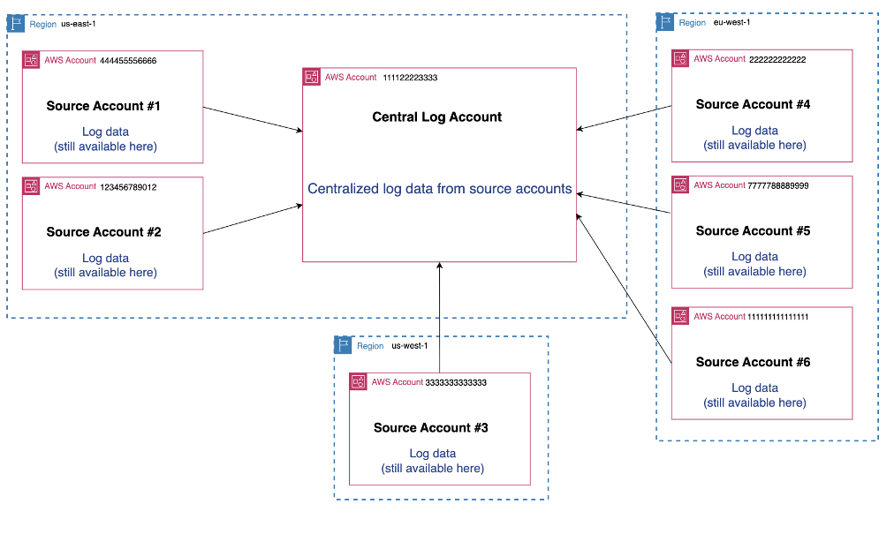

# ஒருங்கிணைக்கப்பட்ட தரவு சேமிப்பகத்தை அமைத்தல்

குறுக்கு-கணக்கு observability க்கு கூடுதலாக, லாக்குகளை ஒரு மைய பகுதி மற்றும் மைய கணக்கிற்கு மையப்படுத்தலாம் (நகலெடுக்கலாம்).

CloudWatch Unified Data Store உங்கள் நிறுவனத்திற்கான அளவிலான ஒருங்கிணைக்கப்பட்ட களஞ்சியத்தை உருவாக்க உதவுகிறது. இங்கிருந்து உங்கள் டெலிமெட்ரியை சேகரிக்கலாம், வடிவமைக்கலாம் மற்றும் பகுப்பாய்வு செய்யலாம்.

## கண்ணோட்டம்

CloudWatch Unified Data Store உங்கள் பயன்பாட்டு, செயல்பாட்டு, பாதுகாப்பு மற்றும் இணக்க தரவை ஒரே இடத்தில் மையப்படுத்த அனுமதிக்கிறது. இதன் பொருள், பல AWS கணக்குகள்/பகுதிகளிலிருந்தும், மூன்றாம் தரப்பு கருவிகளிலிருந்தும் உங்கள் லாக் தரவை மைய வினவல் மற்றும் பகுப்பாய்விற்காக ஒரு கணக்கு மற்றும் பகுதியில் மையப்படுத்தலாம்.

Unified Data Store ஐ குறுக்கு-கணக்கு observability உடன் இணைந்தோ அல்லது தனியாகவோ பயன்படுத்தலாம்.

## முக்கிய நன்மைகள்

- **அனைத்து observability தரவையும் மையப்படுத்துதல்** – AWS சேவைகள் மற்றும் மூன்றாம் தரப்பு மூலங்களிலிருந்து செயல்பாட்டு, பாதுகாப்பு மற்றும் இணக்க தரவை பல கணக்குகள் மற்றும் பகுதிகளில் ஒரு ஒருங்கிணைக்கப்பட்ட சேமிப்பகத்தில் ஒருங்கிணைக்கவும்

- **தரவு சிலோக்கள் மற்றும் நகலெடுப்பை நீக்குதல்** – தேவையற்ற ETL பைப்லைன்களை நீக்கவும், சேமிப்பு செலவுகளை குறைக்கவும், ஒரே இடத்தில் தரவை ஒரு முறை சேமிப்பதன் மூலம் மேலாண்மையை எளிமைப்படுத்தவும்

- **சரிசெய்தலை விரைவுபடுத்தி MTTR ஐ குறைத்தல்** – உள்ளுணர்வு அம்ச வினவல்கள், இயற்கை மொழி தேடல் மற்றும் CloudWatch Logs Insights மற்றும் Amazon OpenSearch Service மூலம் மேம்பட்ட காட்சிப்படுத்தல்களுடன் விரைவான நுண்ணறிவுகளைப் பெறவும்

- **நெகிழ்வான பகுப்பாய்வுடன் வணிக நுண்ணறிவைத் திறக்கவும்** – தரவு நகலெடுப்பு இல்லாமல் Amazon Athena, QuickSight, SageMaker, Apache Spark மற்றும் மூன்றாம் தரப்பு Iceberg-இணக்கமான தளங்கள் உட்பட உங்கள் தேர்வான கருவிகளைப் பயன்படுத்தி ஒருங்கிணைக்கப்பட்ட தரவை பகுப்பாய்வு செய்யவும்

## கட்டமைப்பு படிகள்

இது நிறுவன மட்டத்தில் கட்டமைக்கப்படுகிறது:

### படி 1: ரூட் கணக்கை கட்டமைத்தல்

உங்கள் ரூட் கணக்கில்:
1. நம்பகமான அணுகலை இயக்கவும்
2. மையப்படுத்தப்பட்ட datastore க்கான delegate கணக்கை அடையாளம் காணவும்

### படி 2: மையப்படுத்தப்பட்ட கணக்கை கட்டமைத்தல்

உங்கள் மையப்படுத்தப்பட்ட கணக்கில், பின்வருவனவற்றை உள்ளடக்கிய மையப்படுத்தல் விதி(களை) உருவாக்கவும்:
- நிறுவன ID அல்லது மூல கணக்குகள்
- மூல பகுதிகள்

## மையப்படுத்தல் விதிகள்

நீங்கள் தீர்மானித்து கட்டமைக்கலாம்:

1. **மூல கணக்குகள்** – எந்த மூல கணக்குகளிலிருந்து தரவை நகலெடுக்க விரும்புகிறீர்கள் என்பதைத் தேர்வு செய்து, நிறுவனம், OU அல்லது கணக்கு ID மூலம் வடிகட்டவும்
2. **மூல பகுதிகள்** – எந்த மூல பகுதிகளிலிருந்து தரவை நகலெடுக்க வேண்டும் என்பதைத் தேர்வு செய்யவும்
3. **இலக்கு கணக்கு மற்றும் பகுதி** - உங்கள் மையப்படுத்தப்பட்ட டெலிமெட்ரி தரவை சேமிக்க விரும்பும் AWS கணக்கு மற்றும் பகுதியை குறிப்பிடவும்
4. **காப்பு பகுதி** – தரவின் இரண்டாவது நகலுக்கான காப்பு பகுதியை கட்டமைக்கவும் (விரும்பினால்)
5. **Log group வடிகட்டிகள்** – பெயர், முன்னொட்டு அல்லது திறவுச்சொல் மூலம் log groups ஐ வடிகட்டவும்
6. **பல விதிகள்** – உங்கள் தேவைகளின் அடிப்படையில் பல மையப்படுத்தல் விதிகளை கட்டமைக்கவும்
7. **KMS மறையாக்கப்பட்ட log group விருப்பங்கள்** - KMS-மறையாக்கப்பட்ட log groups க்கான மையப்படுத்தல் நடத்தையைத் தேர்வு செய்யவும்.

மையப்படுத்தப்பட்ட பதிவுக்கான உங்கள் கணக்கு கட்டமைப்பு இது போல் இருக்கலாம்:

## சுருக்கம்

சுருக்கமாக:
1. ரூட் கணக்கில் நம்பகமான அணுகலை இயக்கி delegate கணக்கை அடையாளம் காணவும்
2. மையப்படுத்தப்பட்ட கணக்கில் மையப்படுத்தல் விதிகளை உருவாக்கவும்
3. மூல கணக்குகள், பகுதிகள் மற்றும் log group வடிகட்டிகளை கட்டமைக்கவும்
4. தேவைப்பட்டால் காப்புப்பகுதிகளை கட்டமைக்கவும்

## அடுத்த படிகள்

[ஏஜென்ட்கள்/கலெக்டர்களை கட்டமைத்தல்](./configure-agents-collectors.md) க்கு தொடரவும்
