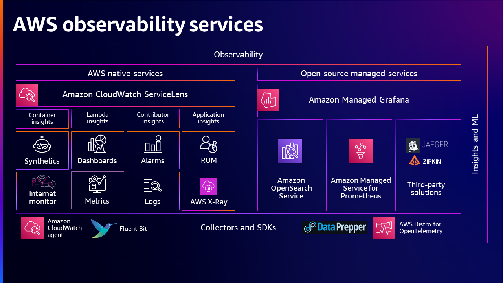

# AWS Observability முதிர்ச்சி மாதிரி

## அறிமுகம்

அதன் மையத்தில், observability என்பது ஒரு கணினியின் வெளிப்புற வெளியீடுகளை பகுப்பாய்வு செய்வதன் மூலம் அதன் உள் நிலையைப் புரிந்துகொள்ளவும் நுண்ணறிவுகளைப் பெறவும் உள்ள திறன் ஆகும். இந்த கருத்து முன்வரையறுக்கப்பட்ட மெட்ரிக்குகள் அல்லது நிகழ்வுகளில் கவனம் செலுத்தும் பாரம்பரிய கண்காணிப்பு அணுகுமுறைகளிலிருந்து, ஒரு சூழலில் பல்வேறு கூறுகள் உருவாக்கும் தரவின் சேகரிப்பு, பகுப்பாய்வு மற்றும் காட்சிப்படுத்தல் ஆகியவற்றை உள்ளடக்கிய முழுமையான அணுகுமுறையாக வளர்ந்துள்ளது. ஒரு கணினி கண்காணிக்கப்படாவிட்டால் கட்டுப்படுத்தவோ மேம்படுத்தவோ முடியாது. பயனுள்ள observability உத்தி குழுக்களுக்கு சிக்கல்களை விரைவாக அடையாளம் கண்டு தீர்க்கவும், வள பயன்பாட்டை மேம்படுத்தவும், கணினிகளின் ஒட்டுமொத்த ஆரோக்கியத்தில் நுண்ணறிவுகளைப் பெறவும் அனுமதிக்கிறது.

கண்காணிப்பு மற்றும் Observability இடையிலான வேறுபாடு என்னவென்றால், கண்காணிப்பு ஒரு கணினி வேலை செய்கிறதா இல்லையா என்று சொல்கிறது, அதேநேரம் Observability கணினி ஏன் வேலை செய்யவில்லை என்று சொல்கிறது. கண்காணிப்பு பொதுவாக எதிர்வினை நடவடிக்கையாகும், அதேசமயம் Observability-இன் இலக்கு உங்கள் முக்கிய செயல்திறன் குறிகாட்டிகளை (KPIs) முன்கூட்டிய முறையில் மேம்படுத்த முடிவதாகும். தொடர்ச்சியான கண்காணிப்பு & Observability சுறுசுறுப்பை அதிகரிக்கிறது, வாடிக்கையாளர் அனுபவத்தை மேம்படுத்துகிறது மற்றும் cloud சூழலில் ஆபத்தை குறைக்கிறது.

## Observability முதிர்ச்சி மாதிரி

Observability முதிர்ச்சி மாதிரி தங்கள் பணிச்சுமை observability மற்றும் மேலாண்மை செயல்முறைகளை மேம்படுத்த விரும்பும் அமைப்புகளுக்கான இன்றியமையாத கட்டமைப்பாக செயல்படுகிறது. இந்த மாதிரி வணிகங்களுக்கு தங்கள் தற்போதைய திறன்களை மதிப்பிடவும், மேம்பாட்டிற்கான பகுதிகளை அடையாளம் காணவும், உகந்த observability-ஐ அடைய சரியான கருவிகள் மற்றும் செயல்முறைகளில் மூலோபாய ரீதியாக முதலீடு செய்யவும் ஒரு விரிவான roadmap-ஐ வழங்குகிறது.

## Observability முதிர்ச்சி மாதிரியின் நிலைகள்

அமைப்புகள் தங்கள் பணிச்சுமைகளை விரிவுபடுத்தும்போது, observability முதிர்ச்சி மாதிரியும் முதிர்ச்சியடைய எதிர்பார்க்கப்படுகிறது.

1. Observability முதிர்ச்சி மாதிரியின் முதல் நிலை அமைப்பின் தற்போதைய நிலையைப் பற்றிய அடிப்படை புரிதலை நிறுவுவதை உள்ளடக்குகிறது. ஏற்கனவே உள்ள கண்காணிப்பு கருவிகள் மற்றும் செயல்முறைகளை மதிப்பிடுவதும், தெரிவுநிலை அல்லது செயல்பாட்டில் உள்ள gaps-ஐ அடையாளம் காண்பதும் இதில் அடங்கும்.

2. அடுத்த நிலையில், அமைப்புகள் மேம்பட்ட observability உத்திகள் மற்றும் சேவைகளை ஏற்றுக்கொள்வதன் மூலம் அதிக sophisticated அணுகுமுறையை நோக்கி நகர்கின்றன. இதில் முன்கூட்டிய alerting, distributed tracing செயல்படுத்துதல் ஆகியவை அடங்கலாம்.

3. மூன்றாவது நிலையில், வணிகங்கள் anomaly detection மற்றும் root cause analysis-ஐ தானியங்குபடுத்த செயற்கை நுண்ணறிவு மற்றும் இயந்திர கற்றல் தொழில்நுட்பங்கள் போன்ற கூடுதல் திறன்களை பயன்படுத்தலாம்.

4. Observability முதிர்ச்சி மாதிரியின் இறுதி நிலை தொடர்ச்சியான மேம்பாட்டை உந்த கண்காணிப்பு மற்றும் observability கருவிகளால் உருவாக்கப்படும் தரவின் செல்வத்தை பயன்படுத்துவதை உள்ளடக்குகிறது.

### நிலை 1: அடிப்படை கண்காணிப்பு - Telemetry தரவு சேகரித்தல்

குறைந்தபட்சமாக ஏற்றுக்கொள்ளப்பட்டு silos-இல் செயல்பட்ட அடிப்படை கண்காணிப்பு, ஒரு அமைப்பில் கணினிகள் அல்லது பணிச்சுமைகளின் மொத்தத்தை கண்காணிக்க என்ன தேவை என்பதற்கான வரையறுக்கப்படாத உத்தியைக் கொண்டுள்ளது. அடிப்படையை கட்டியெழுப்ப, மெட்ரிக்குகள், லாக்குகள், ட்ரேஸ்களை சேகரிப்பதன் மூலம் பணிச்சுமைகளை instrument செய்வதும், சரியான கண்காணிப்பு மற்றும் observability கருவிகளைப் பயன்படுத்தி அர்த்தமுள்ள நுண்ணறிவுகளைப் பெறுவதும் வாடிக்கையாளர்களுக்கு சூழலைக் கட்டுப்படுத்தவும் மேம்படுத்தவும் உதவுகிறது.

### நிலை 2: இடைநிலை கண்காணிப்பு - Telemetry பகுப்பாய்வு மற்றும் நுண்ணறிவுகள்

இந்த நிலையில், வாடிக்கையாளர்கள் on-premise மற்றும் cloud போன்ற பல்வேறு சூழல்களிலிருந்து signals-ஐ சேகரிப்பதில் தங்கள் அமைப்புகள் தெளிவாகி வருவதைக் காண்கின்றனர். அவர்கள் மெட்ரிக்குகள், லாக்குகள் மற்றும் ட்ரேஸ்களை சேகரிக்கும் வழிமுறைகளை உருவாக்கியுள்ளனர், visualizations, alerting strategies-ஐ உருவாக்கியுள்ளனர் மற்றும் நன்கு வரையறுக்கப்பட்ட criteria-இன் அடிப்படையில் சிக்கல்களை முன்னுரிமைப்படுத்தும் திறனையும் கொண்டுள்ளனர்.

### நிலை 3: மேம்பட்ட Observability - Correlation மற்றும் Anomaly Detection

இந்த நிலையில் அமைப்புகள் சிக்கல்தீர்ப்புக்கு அதிக நேரம் செலவிடாமல் சிக்கல்களின் மூல காரணத்தை தெளிவாகப் புரிந்துகொள்ள முடிகிறது. ஒரு சிக்கல் எழும்போது, alerts தொடர்புடைய குழுக்களுக்கு போதுமான சூழல் தகவல்களை வழங்குகின்றன. Metrics, logs மற்றும் traces போன்ற signals-ஐ correlate செய்வதன் மூலம் சிக்கலின் மூல காரணத்தை உடனடியாக தீர்மானிக்க முடிகிறது.

### நிலை 4: முன்கூட்டிய Observability - தானியங்கு மற்றும் முன்கூட்டிய மூல காரண அடையாளம்

இங்கே Observability தரவு ஒரு சிக்கல் "பிறகு" மட்டும் பயன்படுத்தப்படுவதில்லை, மாறாக ஒரு சிக்கல் "முன்" நிகழ்நேரத்தில் தரவைப் பயன்படுத்துகிறது. நன்கு trained models பயன்படுத்தி, சிக்கல் அடையாளம் காணுதல்கள் முன்கூட்டியே செய்யப்படுகின்றன மற்றும் தீர்வுகள் எளிதாகவும் எளிமையாகவும் நிறைவேற்றப்படுகின்றன.

## AWS Well-Architected மற்றும் Cloud Adoption Framework for Observability

அமைப்புகள் தங்கள் observability திறன்களை மேம்படுத்தவும் cloud சூழலை திறம்பட கண்காணிக்கவும் சிக்கல்தீர்க்கவும் [AWS Well-Architected](https://aws.amazon.com/architecture/well-architected/) மற்றும் [Cloud Adoption Framework](https://docs.aws.amazon.com/whitepapers/latest/aws-caf-operations-perspective/observability.html)-ஐ பயன்படுத்தலாம்.

## மதிப்பீடு

Observability முதிர்ச்சி மாதிரி மதிப்பீடு உங்கள் observability-இன் தற்போதைய நிலையை அளவிடவும் மேம்பாட்டிற்கான பகுதிகளை அடையாளம் காணவும் பயன்படுத்தலாம்.

**Logs**

1. லாக்குகளை எவ்வாறு சேகரிக்கிறீர்கள்?
2. லாக்குகளை எவ்வாறு பயன்படுத்துகிறீர்கள்?
3. லாக்குகளை எவ்வாறு அணுகுகிறீர்கள்?
4. பாதுகாப்பு மற்றும் ஒழுங்குமுறை இணக்கத்திற்கான உங்கள் log retention policy என்ன?
5. இன்று ஏதேனும் ML/AI திறனைப் பயன்படுத்துகிறீர்களா?

**Metrics**

6. என்ன வகையான மெட்ரிக்குகளை சேகரிக்கிறீர்கள்?
7. மெட்ரிக்குகளை எவ்வாறு பயன்படுத்துகிறீர்கள்?
8. மெட்ரிக்குகளை எவ்வாறு அணுகுகிறீர்கள்?

**Traces**

9. ட்ரேஸ்களை எவ்வாறு சேகரிக்கிறீர்கள்?
10. ட்ரேஸ்களை எவ்வாறு பயன்படுத்துகிறீர்கள்?

**Dashboards மற்றும் Alerting**

11. Alarms-ஐ எவ்வாறு பயன்படுத்துகிறீர்கள்?
12. Dashboards-ஐ எவ்வாறு பயன்படுத்துகிறீர்கள்?

**அமைப்பு**

13. ஒரு enterprise observability உத்தி உள்ளதா?
14. SLOs-ஐ எவ்வாறு பயன்படுத்துகிறீர்கள்?

## Observability உத்தியை கட்டியெழுப்புதல்

அமைப்பு தனது observability நிலையை அடையாளம் கண்டதும், தற்போதைய செயல்முறைகள் & கருவிகளை மேம்படுத்தவும் முதிர்ச்சியை நோக்கி வேலை செய்யவும் உத்தியை கட்டியெழுப்ப வேண்டும். Observability உத்திக்கான இலக்குடன், அமைப்புகள் முதலில் தங்கள் observability இலக்குகளை வரையறுக்க வேண்டும், அவை ஒட்டுமொத்த வணிக நோக்கங்களுடன் ஒத்துவர வேண்டும்.

சுருக்கமாக, observability உத்தியை கட்டியெழுப்ப மூன்று முக்கிய அம்சங்கள் கருத்தில் கொள்ளப்பட வேண்டும்: 1) என்ன சேகரிக்கப்பட வேண்டும் 2) கண்காணிக்க வேண்டிய அனைத்து கணினிகள் மற்றும் பணிச்சுமைகள் என்ன மற்றும் 3) சிக்கல்கள் இருக்கும்போது எவ்வாறு எதிர்வினையாற்றுவது மற்றும் அவற்றை தீர்க்க என்ன வழிமுறைகள் இருக்க வேண்டும்.

## முடிவுரை

Observability முதிர்ச்சி மாதிரி அமைப்புகளுக்கு தங்கள் தற்போதைய நிலையை மதிப்பிடவும், பணிச்சுமைகள் மற்றும் உள்கட்டமைப்பின் நடத்தையை புரிந்துகொள்ளவும், பகுப்பாய்வு செய்யவும், பதிலளிக்கவும் தங்கள் திறனை மேம்படுத்துவதற்கான வழிகளைத் தேடவும் ஒரு roadmap-ஆக செயல்படுகிறது.

## பயனுள்ள வளங்கள்

- [Building an effective observability strategy](https://youtu.be/7PQv9eYCJW8?si=gsn0qPyIMhrxU6sy) - AWS re:Invent 2023
- [AWS Observability Best Practices](https://aws-observability.github.io/observability-best-practices/)
- [What is observability and Why does it matter?](https://aws.amazon.com/blogs/mt/what-is-observability-and-why-does-it-matter-part-1/)
- [How to develop an Observability strategy?](https://aws.amazon.com/blogs/mt/how-to-develop-an-observability-strategy/)
- [Guidance for Deep Application Observability on AWS](https://aws.amazon.com/solutions/guidance/deep-application-observability-on-aws/)
- [How Discovery increased operational efficiency with AWS observability](https://www.youtube.com/watch?v=zm30JNYmxlY) - AWS re:Invent 2022
- [Developing an observability strategy](https://www.youtube.com/watch?v=Ub3ATriFapQ) - AWS re:Invent 2022
- [Explore Cloud Native Observability with AWS](https://www.youtube.com/watch?v=UW7aT25Mbng) - AWS Virtual Workshop
- [Increase availability with AWS observability solutions](https://www.youtube.com/watch?v=_d_9xCfVBTM) - AWS re:Invent 2020
- [Observability best practices at Amazon](https://www.youtube.com/watch?v=zZPzXEBW4P8) - AWS re:Invent 2022
- [Observability: Best practices for modern applications](https://www.youtube.com/watch?v=YiegAlC_yyc) - AWS re:Invent 2022
- [Observability the open-source way](https://www.youtube.com/watch?v=2IJPpdp9xU0) - AWS re:Invent 2022
- [Elevate your Observability Strategy with AIOps](https://www.youtube.com/watch?v=L4b_eDSAwfE)
- [Let's Architect! Monitoring production systems at scale](https://aws.amazon.com/blogs/architecture/lets-architect-monitoring-production-systems-at-scale/)
- [Full-stack observability and application monitoring with AWS](https://www.youtube.com/watch?v=or7uFFyHIX0) - AWS Summit SF 2022
