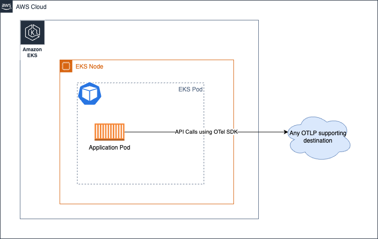
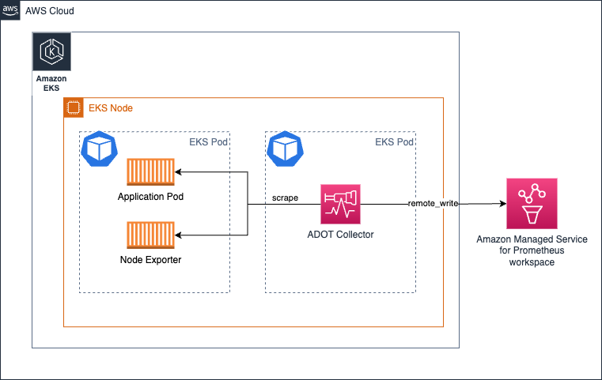

# AWS Distro for OpenTelemetry (ADOT) Collector-ஐ இயக்குதல்

[ADOT collector](https://aws-otel.github.io/) என்பது [CNCF](https://www.cncf.io/) அமைப்பின் open-source [OpenTelemetry Collector](https://opentelemetry.io/docs/collector/)-ன் downstream distribution ஆகும்.

வாடிக்கையாளர்கள் on-prem, AWS மற்றும் பிற cloud providers உட்பட வெவ்வேறு சூழல்களிலிருந்து மெட்ரிக்குகள் மற்றும் ட்ரேஸ்கள் போன்ற signals-ஐ சேகரிக்க ADOT Collector-ஐ பயன்படுத்தலாம்.

நிஜ உலக சூழலில் மற்றும் அளவில் ADOT Collector-ஐ இயக்க, operators collector health-ஐ கண்காணிக்கவும், தேவைக்கேற்ப scale செய்யவும் வேண்டும். இந்த வழிகாட்டியில், production சூழலில் ADOT Collector-ஐ இயக்க எடுக்கக்கூடிய நடவடிக்கைகளைப் பற்றி கற்றுக்கொள்வீர்கள்.

## Deployment Architecture

உங்கள் தேவைகளைப் பொறுத்து, நீங்கள் கருத்தில் கொள்ள விரும்பும் சில deployment options உள்ளன.

* No Collector
* Agent
* Gateway

:::tip
    கூடுதல் தகவலுக்கு [OpenTelemetry documentation](https://opentelemetry.io/docs/collector/deployment/)-ஐ பார்க்கவும்.
:::

### No Collector
இந்த option collector-ஐ சமன்பாட்டிலிருந்து முழுமையாக தவிர்க்கிறது. OTEL SDK-லிருந்து நேரடியாக destination services-க்கு API calls செய்து signals-ஐ அனுப்ப முடியும் என்பது உங்களுக்குத் தெரியுமா.



### Agent
இந்த அணுகுமுறையில், collector-ஐ distributed முறையில் இயக்கி destinations-க்கு signals-ஐ சேகரிப்பீர்கள். `No Collector` option-ஐ போலல்லாமல், இங்கே concerns-ஐ பிரிக்கிறோம், application-ஐ remote API calls செய்ய அதன் resources-ஐ பயன்படுத்த வேண்டிய அவசியமின்றி locally accessible agent-உடன் communicate செய்கிறது.

Amazon EKS சூழலில் **collector-ஐ Kubernetes sidecar-ஆக இயக்குவது** இப்படி இருக்கும்:


#### Amazon EKS-ல் Daemonset-ஆக collector-ஐ இயக்குதல்

EKS Nodes முழுவதும் collectors-ன் load-ஐ (scraping மற்றும் metrics-ஐ Amazon Managed Service for Prometheus workspace-க்கு அனுப்புதல்) சீராக விநியோகிக்க collector-ஐ [Daemonset](https://kubernetes.io/docs/concepts/workloads/controllers/daemonset/)-ஆக இயக்க தேர்வு செய்யலாம்.



#### Amazon EC2-ல் collector-ஐ இயக்குதல்
EC2-ல் sidecar அணுகுமுறை இல்லாததால், EC2 instance-ல் collector-ஐ agent-ஆக இயக்குவீர்கள்.

#### Amazon EKS-ல் Deployment-ஆக collector-ஐ இயக்குதல்

Collector-ஐ Deployment-ஆக இயக்குவது உங்கள் collectors-க்கு High Availability-ஐ வழங்க விரும்பும்போது மிகவும் பயனுள்ளது.


#### Amazon ECS-ல் metrics collection-க்கான central task-ஆக collector-ஐ இயக்குதல்

ECS cluster அல்லது clusters முழுவதும் வெவ்வேறு tasks-லிருந்து Prometheus metrics-ஐ சேகரிக்க [ECS Observer extension](https://github.com/open-telemetry/opentelemetry-collector-contrib/tree/main/extension/observer/ecsobserver)-ஐ பயன்படுத்தலாம்.


### Gateway


## Collector Health-ஐ நிர்வகித்தல்

OTEL Collector அதன் health மற்றும் செயல்திறனைக் கண்காணிக்க பல signals-ஐ வெளிப்படுத்துகிறது. Collector-ன் health-ஐ நெருக்கமாக கண்காணிப்பது அவசியம்:

* Collector-ஐ horizontally scale செய்தல்
* Collector விரும்பியபடி செயல்பட கூடுதல் resources-ஐ வழங்குதல்

### Collector-லிருந்து health metrics-ஐ சேகரித்தல்

`service` pipeline-க்கு `telemetry` section-ஐ சேர்ப்பதன் மூலம் Prometheus Exposition Format-ல் metrics-ஐ வெளிப்படுத்த OTEL Collector-ஐ கட்டமைக்கலாம்.

```yaml
service:
  telemetry:
    logs:
      level: debug
    metrics:
      level: detailed
      address: 0.0.0.0:8888
```

#### Collector health check

Collector live-ஆக உள்ளதா என்பதை சரிபார்க்க [`healthcheck`](https://github.com/open-telemetry/opentelemetry-collector-contrib/tree/main/extension/healthcheckextension) extension-ஐ பயன்படுத்தலாம்.

```yaml
extensions:
  health_check:
    endpoint: 0.0.0.0:13133
```

#### பேரழிவு தோல்விகளைத் தடுக்க limits அமைத்தல்

Resources (CPU, Memory) எந்த சூழலிலும் limited என்பதால், எதிர்பாராத சூழ்நிலைகளால் ஏற்படும் தோல்விகளைத் தவிர்க்க collector components-க்கு limits அமைக்க வேண்டும்.

##### Memory usage-ஐ கட்டுப்படுத்துதல்

Processor component பயன்படுத்தும் memory அளவை கட்டுப்படுத்த Collector pipeline-ஐ [`memorylimiterprocessor`](https://github.com/open-telemetry/opentelemetry-collector/tree/main/processor/memorylimiterprocessor) பயன்படுத்தி கட்டமைக்கலாம்.

#### Backpressure management

Gateway Collector-ஐ அதிகமான processing tasks-உடன் overwhelm செய்வது சாத்தியம். பரிந்துரைக்கப்படும் அணுகுமுறை process/memory intense tasks-ஐ individual collectors மற்றும் gateway இடையே விநியோகிப்பது.


### Horizontal Scaling

உங்கள் workload-ஐ பொறுத்து ADOT Collector-ஐ horizontally scale செய்வது அவசியமாகலாம். Platform-specific horizontal scaling நுட்பங்களை stateful, stateless மற்றும் scraper Collector components-ஐ கவனத்தில் கொண்டு Collector-க்கு பயன்படுத்தலாம்.

Collectors-ஐ scaling செய்வதன் process மற்றும் நுட்பங்கள் [upstream OpenTelemetry website-ல் விரிவாக ஆவணப்படுத்தப்பட்டுள்ளன](https://opentelemetry.io/docs/collector/scaling/).
